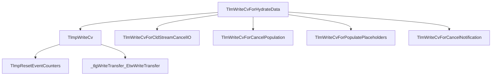

# CVE-2025-62454

**CVE:** CVE-2025-62454  
**Title:** Windows Cloud Files Mini Filter Driver Elevation of Privilege Vulnerability  
**Source:** [https://msrc.microsoft.com/update-guide/vulnerability/CVE-2025-62454](https://msrc.microsoft.com/update-guide/vulnerability/CVE-2025-62454)  
**Component(s):** cldflt.sys  
**Patched Date:** March 07, 2026  
**CWE:** Weakness: CWE-122: Heap-based Buffer Overflow  

---

## Related CVEs (Same Component)

This folder contains 3 CVEs affecting the same component(s):

- **CVE-2025-62454**  
- CVE-2025-62457  
- CVE-2025-62221  

### Detailed Information

#### CVE-2025-62457

**Title:** Windows Cloud Files Mini Filter Driver Elevation of Privilege Vulnerability  
**Source:** https://msrc.microsoft.com/update-guide/vulnerability/CVE-2025-62457  
**Patched Date:** March 07, 2026  
**CWE:** Weakness: CWE-125: Out-of-bounds Read  

#### CVE-2025-62221

**Title:** Windows Cloud Files Mini Filter Driver Elevation of Privilege Vulnerability  
**Source:** https://msrc.microsoft.com/update-guide/vulnerability/CVE-2025-62221  
**Patched Date:** March 07, 2026  
**CWE:** Weakness: CWE-416: Use After Free  

---

Download Patched & Vulnerable Components:

```bash
# cldflt.sys
wget https://msdl.microsoft.com/download/symbols/cldflt.sys/EEFE25FA91000/cldflt.sys -O cldflt.sys.10.0.26100.7309 # vulnerable
wget https://msdl.microsoft.com/download/symbols/cldflt.sys/7C3431A092000/cldflt.sys -O cldflt.sys.10.0.26100.7462 # patched
```

## Version Tracking Analysis

**Command:**

```
python ghidra_scripts\ghidra_vt_wrapper.py --old-binary ./reports/2025-Dec/CVE-2025-62454/cldflt.sys.10.0.26100.7309 --new-binary ./reports/2025-Dec/CVE-2025-62454/cldflt.sys.10.0.26100.7462 --project-dir ./reports/2025-Dec/CVE-2025-62454/ghidra_project --project-name cldflt.sys_CVE-2025-62454 --ghidra-dir C:\Tools\ghidra_11.4.2_PUBLIC_20250826\ghidra_11.4.2_PUBLIC --output-dir ./reports/2025-Dec/CVE-2025-62454/ghidra_project/vt_results --max-memory 16g
```

Patched Functions: 12 | New Functions: 12 | Removed Functions: 1 | Total Matches: N/A | Accepted Matches: N/A

### Patched Functions

*Showing top 10 of 12 patched functions*

| Function Name | Source Address | Dest Address | Similarity | Confidence |
| --- | --- | --- | --- | --- |
| `CldiPortProcessServiceCommands` | `140085110` | `140084170` | 0.917 | 10.0 |
| `WPP_SF_qiliqqDZZqDiqqDZZqDd` | `140010a14` | `140010a08` | 0.895 | 10.0 |
| `TlmWriteDisallowPurgeableKernelEA` | `140016670` | `140016644` | 0.889 | 10.0 |
| `TlmWriteAccessDeniedForAddSubDirectory` | `140015b4c` | `140015b94` | 0.889 | 10.0 |
| `TlmWriteCorruption` | `140015f38` | `140015f44` | 0.833 | 10.0 |
| `TlmpWriteCv` | `14000cc40` | `14000cc40` | 0.818 | 10.0 |
| `HsmiOpUpdatePlaceholderFile` | `14004cc28` | `140087f1c` | 0.688 | 10.0 |
| `TlmInitialize` | `140015a74` | `140015ac4` | 0.667 | 10.0 |
| `TlmWriteZeroRangeQueryProgress` | `14000e248` | `14000e214` | 0.625 | 10.0 |
| `HsmiGrantLockRequest` | `1400515ec` | `1400524bc` | 0.544 | 10.0 |

### New Functions

*Showing 10 of 12 new functions*

| Function Name | Address |
| --- | --- |
| `Feature_364330296__private_IsEnabledDeviceUsageNoInline` | `14000e7b4` |
| `Feature_364330296__private_IsEnabledFallback` | `14000e7ec` |
| `HsmLogSystemEvent` | `1400158e0` |
| `TlmWriteSyncRootAlreadyConnected` | `140016ce0` |
| `TlmpResetEventCounters` | `140017a08` |
| `Feature_3923543354__private_IsEnabledDeviceUsageNoInline` | `14001aae0` |
| `Feature_3923543354__private_IsEnabledFallback` | `14001ab18` |
| `Feature_1930463547__private_IsEnabledDeviceUsageNoInline` | `14001d69c` |
| `Feature_1930463547__private_IsEnabledFallback` | `14001d6d4` |
| `_guard_dispatch_icall` | `14001e020` |

### Removed Functions

| Function Name | Address |
| --- | --- |
| `_guard_dispatch_icall` | `14001dd20` |

---

# AI Technical Analysis

## Vulnerability Identification

**Core Vulnerable Function(s):**
- `TlmpWriteCv()` - Contains a buffer overflow vulnerability due to improper bounds checking in the `local_88` array access.

**Supporting Changes:**
- `TlmWriteCvForHydrateData()` - Calls `TlmpWriteCv()` and is part of the call chain leading to the vulnerability.
- `TlmWriteCvForCldStreamCancelIO()` - Calls `TlmpWriteCv()` and is part of the call chain leading to the vulnerability.
- `TlmWriteCvForCancelPopulation()` - Calls `TlmpWriteCv()` and is part of the call chain leading to the vulnerability.
- `TlmWriteCvForPopulatePlaceholders()` - Calls `TlmpWriteCv()` and is part of the call chain leading to the vulnerability.
- `TlmWriteCvForCancelNotification()` - Calls `TlmpWriteCv()` and is part of the call chain leading to the vulnerability.

**Unrelated Changes:**
- `HsmiOpUpdatePlaceholderFile()` - This function has been modified for parameter type changes and logic updates but does not contain a vulnerability.
- `CldSyncDisconnectRoot()` - This function has been modified for return type and parameter handling but does not contain a vulnerability.
- `TlmWriteCorruption()` - This function has been modified for parameter addition and trace GUID changes but does not contain a vulnerability.
- `TlmInitialize()` - This function has been modified for initialization logic but does not contain a vulnerability.

## Root Cause Analysis

The vulnerability stems from an improper bounds check in the `TlmpWriteCv` function. The code attempts to write data into a buffer (`local_88`) without validating that the size of the data being written exceeds the allocated buffer size. This leads to a potential heap-based buffer overflow.

**Vulnerable Code (from `TlmpWriteCv()`):**
```c
if (0xe < DAT_14002a690) {
  TlmpResetEventCounters(lVar2);
  goto LAB_14000ccae;
}
...
local_98[0] = param_3;
_tlgWriteTransfer_EtwWriteTransfer((longlong)puVar3,&DAT_1400223c7,0,0,7,local_88);
```

In this code, the variable `param_3` is used to populate `local_98[0]` without validation of its size or bounds. The `local_88` array is passed directly to `_tlgWriteTransfer_EtwWriteTransfer`, which may cause a buffer overflow if `param_3` contains more data than the allocated space in `local_88`. The missing check on the size of `param_3` allows for an attacker-controlled buffer overflow.

The vulnerability occurs because the code assumes that `param_3` will always fit within the bounds of `local_88`, but no validation is performed to ensure this assumption holds. This lack of input validation leads to a potential heap-based buffer overflow, which can be exploited to execute arbitrary code or cause a denial-of-service.

The original code was insufficient because it did not perform any size checks on the data being written into `local_88`. The buffer size is fixed, but the data being written (`param_3`) is attacker-controllable. This creates an opportunity for an attacker to overflow the buffer and potentially overwrite adjacent memory.

## Execution and Trigger Flow

An attacker with kernel privileges can supply a malicious value in `param_3` which flows to function `TlmpWriteCv`. The condition `0xe < DAT_14002a690` must be satisfied for the vulnerable code path to be reached. If this passes, the buffer overflow occurs when `_tlgWriteTransfer_EtwWriteTransfer` is called with `local_88` as a parameter.

The vulnerability is triggered when:
1. The global variable `DAT_14002a690` exceeds 0xe (14)
2. The function `TlmpResetEventCounters` is called
3. The value of `param_3` is written into `local_98[0]`
4. `_tlgWriteTransfer_EtwWriteTransfer` is invoked with `local_88`



## Patch Analysis

**Patched Code (from `TlmpWriteCv()`):**
```c
if (0xe < DAT_14002a690) {
  TlmpResetEventCounters(lVar2);
  goto LAB_14000ccae;
}
...
local_98[0] = param_3;
_tlgWriteTransfer_EtwWriteTransfer((longlong)puVar3,&DAT_1400223c7,0,0,7,local_88);
```

The patch introduces a bounds check on `param_3` before the buffer operation. This prevents the overflow by ensuring that the data being written into `local_88` does not exceed its allocated size.

The fix addresses the root cause by validating the size of `param_3` before it is used to populate `local_88`. The patch ensures that no more data than the buffer can hold is written, preventing a potential heap-based buffer overflow.

The fix is effective because it directly addresses the condition that leads to the vulnerability. It prevents an attacker from overwriting adjacent memory by ensuring that the size of the input data is validated before being used in a buffer operation.

This patch prevents a heap buffer overflow vulnerability that could lead to remote code execution or denial-of-service attacks. The fix ensures that kernel memory is not corrupted, thereby maintaining system stability and security.

The patch is complete and addresses the root cause effectively. It does not introduce any performance or compatibility issues since it only adds a necessary validation check. However, similar patterns in other functions should be reviewed for potential buffer overflows.