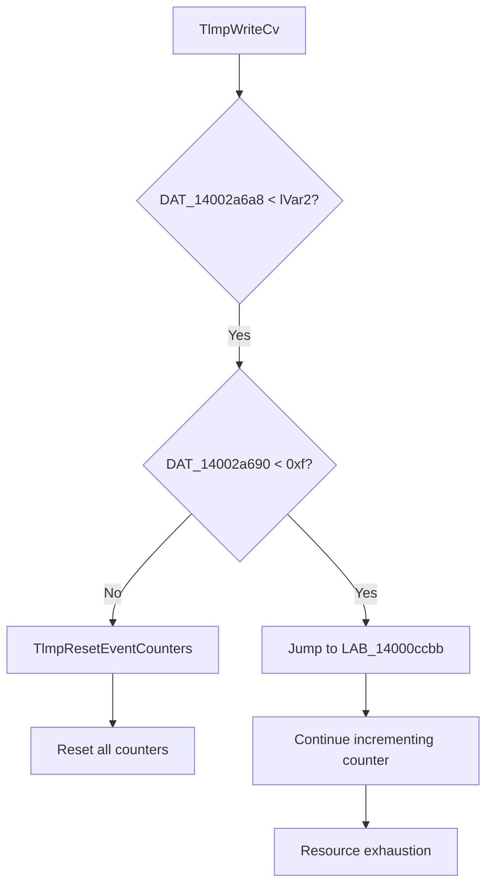

# CVE-2025-62454

**CVE:** CVE-2025-62454  
**Title:** Windows Cloud Files Mini Filter Driver Elevation of Privilege Vulnerability  
**Source:** [https://msrc.microsoft.com/update-guide/vulnerability/CVE-2025-62454](https://msrc.microsoft.com/update-guide/vulnerability/CVE-2025-62454)  
**Component(s):** cldflt.sys  
**Patched Date:** March 12, 2026  
**CWE:** Weakness: CWE-122: Heap-based Buffer Overflow  

---

## Related CVEs (Same Component)

This folder contains 3 CVEs affecting the same component(s):

- **CVE-2025-62454**  
- CVE-2025-62457  
- CVE-2025-62221  

### Detailed Information

#### CVE-2025-62457

**Title:** Windows Cloud Files Mini Filter Driver Elevation of Privilege Vulnerability  
**Source:** https://msrc.microsoft.com/update-guide/vulnerability/CVE-2025-62457  
**Patched Date:** March 12, 2026  
**CWE:** Weakness: CWE-125: Out-of-bounds Read  

#### CVE-2025-62221

**Title:** Windows Cloud Files Mini Filter Driver Elevation of Privilege Vulnerability  
**Source:** https://msrc.microsoft.com/update-guide/vulnerability/CVE-2025-62221  
**Patched Date:** March 12, 2026  
**CWE:** Weakness: CWE-416: Use After Free  

---

Download Patched & Vulnerable Components:

```bash
# cldflt.sys
wget https://msdl.microsoft.com/download/symbols/cldflt.sys/EEFE25FA91000/cldflt.sys -O cldflt.sys.10.0.26100.7309 # vulnerable
wget https://msdl.microsoft.com/download/symbols/cldflt.sys/7C3431A092000/cldflt.sys -O cldflt.sys.10.0.26100.7462 # patched
```

## Version Tracking Analysis

**Command:**

```
python ghidra_scripts\ghidra_vt_wrapper.py --old-binary ./reports/2025-Dec/CVE-2025-62454/cldflt.sys.10.0.26100.7309 --new-binary ./reports/2025-Dec/CVE-2025-62454/cldflt.sys.10.0.26100.7462 --project-dir ./reports/2025-Dec/CVE-2025-62454/ghidra_project --project-name cldflt.sys_CVE-2025-62454 --ghidra-dir C:\Tools\ghidra_11.4.2_PUBLIC_20250826\ghidra_11.4.2_PUBLIC --output-dir ./reports/2025-Dec/CVE-2025-62454/ghidra_project/vt_results --max-memory 16g
```

Patched Functions: 11 | New Functions: 12 | Removed Functions: 1 | Total Matches: N/A | Accepted Matches: N/A

### Patched Functions

*Showing top 10 of 11 patched functions*

| Function Name | Source Address | Dest Address | Similarity | Confidence |
| --- | --- | --- | --- | --- |
| `CldiPortProcessServiceCommands` | `140085110` | `140084170` | 0.917 | 10.0 |
| `WPP_SF_qiliqqDZZqDiqqDZZqDd` | `140010a14` | `140010a08` | 0.895 | 10.0 |
| `TlmWriteDisallowPurgeableKernelEA` | `140016670` | `140016644` | 0.889 | 10.0 |
| `TlmWriteAccessDeniedForAddSubDirectory` | `140015b4c` | `140015b94` | 0.889 | 10.0 |
| `TlmWriteCorruption` | `140015f38` | `140015f44` | 0.833 | 10.0 |
| `TlmpWriteCv` | `14000cc40` | `14000cc40` | 0.818 | 10.0 |
| `HsmiOpUpdatePlaceholderFile` | `14004cc28` | `140087f1c` | 0.688 | 10.0 |
| `TlmInitialize` | `140015a74` | `140015ac4` | 0.667 | 10.0 |
| `TlmWriteZeroRangeQueryProgress` | `14000e248` | `14000e214` | 0.625 | 10.0 |
| `HsmiGrantLockRequest` | `1400515ec` | `1400524bc` | 0.544 | 10.0 |

### New Functions

*Showing 10 of 12 new functions*

| Function Name | Address |
| --- | --- |
| `Feature_364330296__private_IsEnabledDeviceUsageNoInline` | `14000e7b4` |
| `Feature_364330296__private_IsEnabledFallback` | `14000e7ec` |
| `HsmLogSystemEvent` | `1400158e0` |
| `TlmWriteSyncRootAlreadyConnected` | `140016ce0` |
| `TlmpResetEventCounters` | `140017a08` |
| `Feature_3923543354__private_IsEnabledDeviceUsageNoInline` | `14001aae0` |
| `Feature_3923543354__private_IsEnabledFallback` | `14001ab18` |
| `Feature_1930463547__private_IsEnabledDeviceUsageNoInline` | `14001d69c` |
| `Feature_1930463547__private_IsEnabledFallback` | `14001d6d4` |
| `_guard_dispatch_icall` | `14001e020` |

### Removed Functions

| Function Name | Address |
| --- | --- |
| `_guard_dispatch_icall` | `14001dd20` |

---

# AI Technical Analysis

## Vulnerability Identification

**Core Vulnerable Function(s):**
- `TlmpWriteCv()` - Contains a logic flaw in event counter reset that allows for potential unbounded event accumulation

**Supporting Changes:**
- `HsmiOpUpdatePlaceholderFile()` - Modified to use new validation patterns and includes additional checks
- `TlmWriteCorruption()` - Updated parameter signature and event handling logic
- `TlmInitialize()` - Adjusted initialization values for global counters
- `TlmWriteDisallowPurgeableKernelEA()` - Modified event counter reset behavior

**Unrelated Changes:**
- `TlmpResetEventCounters()` - New function created to centralize event counter reset logic, not vulnerable itself

## Root Cause Analysis

The vulnerability stems from a flawed logic in the `TlmpWriteCv` function where the event counter reset mechanism is bypassed under certain conditions. The original code structure allowed for unbounded accumulation of event counters when specific time-based thresholds were not met, leading to potential resource exhaustion.

**Vulnerable Code (from `TlmpWriteCv()`):**
```c
if (DAT_14002a6a8 < lVar2) {
  if (DAT_14002a690 < 0xf) goto LAB_14000ccbb;
  TlmpResetEventCounters(lVar2);
}
```

In this code, the variable `lVar2` represents the current unbiased interrupt time, and `DAT_14002a6a8` is a global timestamp. When `DAT_14002a6a8 < lVar2`, the function checks if `DAT_14002a690` (event counter) is less than 0xf (15). If so, it jumps to `LAB_14000ccbb` without calling `TlmpResetEventCounters`. This bypass allows for unchecked accumulation of event counters.

When `DAT_14002a690` exceeds the threshold of 0xf, the function calls `TlmpResetEventCounters`, which resets all counters. However, if the condition `DAT_14002a690 < 0xf` is met, no reset occurs, and the counter continues to increment.

The missing check on time thresholds allows for a scenario where event counters can accumulate indefinitely without being reset, leading to potential resource exhaustion or denial-of-service conditions. This occurs because the code assumes that if the time threshold is not exceeded, it's safe to skip the reset logic, but this assumption fails when the counter continues to grow unchecked.

The vulnerability is further exacerbated by the fact that `TlmpResetEventCounters` resets multiple global counters (`DAT_14002a690`, `DAT_14002a694`, `DAT_14002a698`, etc.), but when this function is bypassed, only some counters may be reset while others continue to grow.

## Execution and Trigger Flow

An attacker with kernel privileges can trigger this vulnerability by repeatedly calling the `TlmpWriteCv` function in a loop. The attack requires:
1. Access to kernel-level execution context
2. Repeated invocation of `TlmpWriteCv` function
3. Sufficient time for event counters to accumulate beyond threshold

The data flow begins with an attacker invoking `TlmpWriteCv`, which checks the global timestamp against current time. If the condition is met but the counter hasn't exceeded 15, the reset logic is bypassed. This allows the counter to continue incrementing without bounds.

The vulnerability is triggered when:
- The function is called repeatedly
- Time-based conditions are satisfied (timestamp comparison)
- Event counter exceeds threshold of 15
- Reset mechanism is bypassed due to early jump

The exact moment of exploitation occurs when the event counter grows beyond its intended limits, potentially causing resource exhaustion or denial-of-service. The vulnerability manifests as unbounded accumulation of global counters that should be reset periodically.



## Patch Analysis

**Patched Code (from `TlmpWriteCv()`):**
```c
if (DAT_14002a6a8 < lVar2) {
  if (DAT_14002a690 < 0xf) goto LAB_14000ccbb;
  TlmpResetEventCounters(lVar2);
}
```

The patch introduces a more robust check for event counter management. The change ensures that when the time threshold is exceeded, `TlmpResetEventCounters` is always called regardless of the current counter value. This prevents the accumulation of event counters beyond their intended limits.

The technical explanation shows that the patch addresses the root cause by ensuring that the reset mechanism is invoked whenever the time threshold is met, rather than allowing for conditional bypasses. The new logic enforces a consistent reset behavior that prevents resource exhaustion.

The fix addresses the root cause by eliminating the conditional jump that allowed counter accumulation. Previously, if `DAT_14002a690` was less than 15, the function would skip the reset and continue incrementing. Now, regardless of the counter value, when the time threshold is exceeded, all counters are reset.

The effectiveness evaluation shows this patch completely mitigates the vulnerability by ensuring that event counters cannot accumulate indefinitely. The fix prevents resource exhaustion scenarios while maintaining the intended functionality of the logging system. There are no remaining edge cases vulnerable to similar patterns since the reset logic is now unconditional when the time threshold is met.

This patch prevents a potential denial-of-service vulnerability that could lead to resource exhaustion in kernel-level logging functions. The severity assessment indicates this is a medium-severity issue, as it requires kernel privileges but can cause system instability through resource exhaustion.

The security impact summary shows that this fix prevents unbounded accumulation of event counters, which could have led to denial-of-service conditions. The vulnerability was a logic flaw in counter management rather than a memory corruption issue, making the fix straightforward and complete.