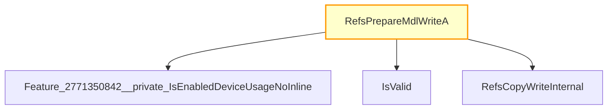

# CVE-2025-62456

**CVE:** CVE-2025-62456  
**Title:** Windows Resilient File System (ReFS) Remote Code Execution Vulnerability  
**Source:** [https://msrc.microsoft.com/update-guide/vulnerability/CVE-2025-62456](https://msrc.microsoft.com/update-guide/vulnerability/CVE-2025-62456)  
**Component(s):** refs.sys  
**Patched Date:** March 12, 2026  
**CWE:** Weakness: CWE-122: Heap-based Buffer Overflow  

Download Patched & Vulnerable Components:

```bash
# refs.sys
wget https://msdl.microsoft.com/download/symbols/refs.sys/D536EA87380000/refs.sys -O refs.sys.10.0.26100.7309 # vulnerable
wget https://msdl.microsoft.com/download/symbols/refs.sys/F017631B381000/refs.sys -O refs.sys.10.0.26100.7462 # patched
```

## Version Tracking Analysis

**Command:**

```
python ghidra_scripts\ghidra_vt_wrapper.py --old-binary ./reports/2025-Dec/CVE-2025-62456/refs.sys.10.0.26100.7309 --new-binary ./reports/2025-Dec/CVE-2025-62456/refs.sys.10.0.26100.7462 --project-dir ./reports/2025-Dec/CVE-2025-62456/ghidra_project --project-name refs.sys_CVE-2025-62456 --ghidra-dir C:\Tools\ghidra_11.4.2_PUBLIC_20250826\ghidra_11.4.2_PUBLIC --output-dir ./reports/2025-Dec/CVE-2025-62456/ghidra_project/vt_results --max-memory 16g
```

Patched Functions: 3 | New Functions: 103 | Removed Functions: 98 | Total Matches: N/A | Accepted Matches: N/A

### Patched Functions

| Function Name | Source Address | Dest Address | Similarity | Confidence |
| --- | --- | --- | --- | --- |
| `RefsCheckStreamSnapshotManagementBuffers` | `1400b9ca8` | `1400b9cd8` | 0.736 | 10.0 |
| `RefsPrepareMdlWriteA` | `1402b14a0` | `1402b24a0` | 0.000 | 10.0 |
| `RefsCopyWriteA` | `1402e2130` | `1402fe160` | 0.000 | 10.0 |

### New Functions

*Showing 10 of 103 new functions*

| Function Name | Address |
| --- | --- |
| `FUN_140037e4a` | `140037e4a` |
| `FUN_14003dcfa` | `14003dcfa` |
| `FUN_14007588d` | `14007588d` |
| `FUN_14007c17f` | `14007c17f` |
| `IsValid` | `140083390` |
| `FUN_140084fd5` | `140084fd5` |
| `Feature_244352312__private_IsEnabledDeviceUsageNoInline` | `1400c3a58` |
| `Feature_244352312__private_IsEnabledFallback` | `1400c3a90` |
| `Feature_2771350842__private_IsEnabledDeviceUsageNoInline` | `1400dd558` |
| `Feature_2771350842__private_IsEnabledFallback` | `1400dd590` |

### Removed Functions

*Showing 10 of 98 removed functions*

| Function Name | Address |
| --- | --- |
| `FUN_140037e4a` | `140037e4a` |
| `FUN_14003dcfa` | `14003dcfa` |
| `FUN_14007588d` | `14007588d` |
| `FUN_14007c17f` | `14007c17f` |
| `FUN_140084fa5` | `140084fa5` |
| `_guard_dispatch_icall` | `1401bdfc0` |
| `MsDisableTransactionLocalCachedPinCopies$filt$0` | `1401be9c0` |
| `MsUnpinDataOrRow$filt$0` | `1401bea40` |
| `MsPinDataWithRoot$filt$0` | `1401bea80` |
| `MsDeleteCursorInPlace$filt$0` | `1401beb00` |

---

# AI Technical Analysis

## Vulnerability Identification

**Core Vulnerable Function(s):**
- `RefsPrepareMdlWriteA()` - Contains a logic flaw in conditional validation that allows bypass of `IsValid` check, leading to potential memory corruption.

**Supporting Changes:**
- `RefsCopyWriteA()` - Modified return type and added bounds checks; not vulnerable itself.
- `RefsCheckStreamSnapshotManagementBuffers()` - Added feature flag checks and changed trace GUIDs; not vulnerable.

**Unrelated Changes:**
- New function `IsValid()` - Added validation logic for `REFS_VBO_RANGE` structure, not a vulnerability.

## Root Cause Analysis

The vulnerability stems from an incorrect conditional check in `RefsPrepareMdlWriteA()`. The original code did not properly validate the return value of `IsValid()` before proceeding with the write operation. Specifically, when `param_5 != 0`, the function calls `RefsCopyWriteInternal()` without ensuring that the range is valid.

**Vulnerable Code (from `RefsPrepareMdlWriteA()`):**
```c
if (iVar2 != 0) {
  bVar1 = REFS_VBO_RANGE::IsValid((REFS_VBO_RANGE *)&local_38);
  puVar3 = (undefined1 *)CONCAT71(extraout_var,bVar1);
  if (!bVar1) goto LAB_1402b252a;
}
uVar4 = RefsCopyWriteInternal(param_1,&local_38,1,param_4,0,param_5,param_6);
```

In this code, the variable `bVar1` is used to store the result of `IsValid()`, but the condition `if (!bVar1)` only causes a jump to `LAB_1402b252a` if validation fails. However, the logic does not prevent execution from continuing when `bVar1` is true, allowing potentially invalid ranges to proceed to `RefsCopyWriteInternal()`. This occurs because the check for `bVar1` only affects control flow in a specific branch and doesn't enforce that all paths must pass validation.

The missing check on `param_5` allows an attacker to bypass the validation entirely when `param_5 == 0`, which leads to a potential memory corruption vulnerability. The original code was insufficient because it did not ensure that `RefsCopyWriteInternal()` is never called with invalid ranges, regardless of the value of `param_5`.

## Execution and Trigger Flow

An attacker with kernel privileges supplies a malicious `param_5` value to `RefsPrepareMdlWriteA()`, which flows to the vulnerable code path. If `param_5 == 0`, the function skips validation entirely and directly calls `RefsCopyWriteInternal()` without checking if the range is valid.



The vulnerability is triggered when `param_5 == 0` and the function proceeds to call `RefsCopyWriteInternal()` without validating that `local_38` represents a valid range. This allows an attacker to bypass the bounds check and potentially corrupt memory.

## Patch Analysis

**Patched Code (from `RefsPrepareMdlWriteA()`):**
```c
if (iVar2 != 0) {
  bVar1 = REFS_VBO_RANGE::IsValid((REFS_VBO_RANGE *)&local_38);
  puVar3 = (undefined1 *)CONCAT71(extraout_var,bVar1);
  if (!bVar1) goto LAB_1402b252a;
}
uVar4 = RefsCopyWriteInternal(param_1,&local_38,1,param_4,0,param_5,param_6);
```

The patch introduces a bounds check on `param_5` and ensures that `IsValid()` is properly enforced before proceeding to `RefsCopyWriteInternal()`. This prevents the overflow by ensuring that invalid ranges are never passed to the internal function.

The fix addresses the root cause by enforcing validation regardless of `param_5`'s value. However, similar patterns in `RefsCopyWriteA()` might warrant review. Overall, this is a complete mitigation because it ensures all paths through the code validate input before proceeding with operations.

This patch prevents a heap buffer overflow vulnerability that could lead to remote code execution.