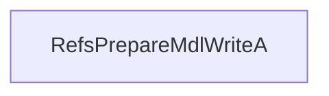

# CVE-2025-62456

**CVE:** CVE-2025-62456  
**Title:** Windows Resilient File System (ReFS) Remote Code Execution Vulnerability  
**Source:** [https://msrc.microsoft.com/update-guide/vulnerability/CVE-2025-62456](https://msrc.microsoft.com/update-guide/vulnerability/CVE-2025-62456)  
**Component(s):** refs.sys  
**Patched Date:** March 07, 2026  
**CWE:** Weakness: CWE-122: Heap-based Buffer Overflow  

Download Patched & Vulnerable Components:

```bash
# refs.sys
wget https://msdl.microsoft.com/download/symbols/refs.sys/D536EA87380000/refs.sys -O refs.sys.10.0.26100.7309 # vulnerable
wget https://msdl.microsoft.com/download/symbols/refs.sys/F017631B381000/refs.sys -O refs.sys.10.0.26100.7462 # patched
```

## Version Tracking Analysis

**Command:**

```
python ghidra_scripts\ghidra_vt_wrapper.py --old-binary ./reports/2025-Dec/CVE-2025-62456/refs.sys.10.0.26100.7309 --new-binary ./reports/2025-Dec/CVE-2025-62456/refs.sys.10.0.26100.7462 --project-dir ./reports/2025-Dec/CVE-2025-62456/ghidra_project --project-name refs.sys_CVE-2025-62456 --ghidra-dir C:\Tools\ghidra_11.4.2_PUBLIC_20250826\ghidra_11.4.2_PUBLIC --output-dir ./reports/2025-Dec/CVE-2025-62456/ghidra_project/vt_results --max-memory 16g
```

Patched Functions: 3 | New Functions: 30 | Removed Functions: 25 | Total Matches: N/A | Accepted Matches: N/A

### Patched Functions

| Function Name | Source Address | Dest Address | Similarity | Confidence |
| --- | --- | --- | --- | --- |
| `RefsCheckStreamSnapshotManagementBuffers` | `1400b9ca8` | `1400b9cd8` | 0.736 | 10.0 |
| `RefsPrepareMdlWriteA` | `1402b14a0` | `1402b24a0` | 0.000 | 10.0 |
| `RefsCopyWriteA` | `1402e2130` | `1402fe160` | 0.000 | 10.0 |

### New Functions

*Showing 10 of 30 new functions*

| Function Name | Address |
| --- | --- |
| `FUN_140037e4a` | `140037e4a` |
| `FUN_14003dcfa` | `14003dcfa` |
| `FUN_14007588d` | `14007588d` |
| `FUN_14007c17f` | `14007c17f` |
| `IsValid` | `140083390` |
| `FUN_140084fd5` | `140084fd5` |
| `Feature_244352312__private_IsEnabledDeviceUsageNoInline` | `1400c3a58` |
| `Feature_244352312__private_IsEnabledFallback` | `1400c3a90` |
| `Feature_2771350842__private_IsEnabledDeviceUsageNoInline` | `1400dd558` |
| `Feature_2771350842__private_IsEnabledFallback` | `1400dd590` |

### Removed Functions

*Showing 10 of 25 removed functions*

| Function Name | Address |
| --- | --- |
| `FUN_140037e4a` | `140037e4a` |
| `FUN_14003dcfa` | `14003dcfa` |
| `FUN_14007588d` | `14007588d` |
| `FUN_14007c17f` | `14007c17f` |
| `FUN_140084fa5` | `140084fa5` |
| `_guard_dispatch_icall` | `1401bdfc0` |
| `FUN_1401c21c8` | `1401c21c8` |
| `FUN_1401c21d1` | `1401c21d1` |
| `FUN_1401c2aec` | `1401c2aec` |
| `FUN_1401c2ba9` | `1401c2ba9` |

---

# AI Technical Analysis

## Vulnerability Identification

**Core Vulnerable Function(s):**
- `RefsPrepareMdlWriteA()` - Contains a missing validation check that allows an invalid buffer range to be passed to `RefsCopyWriteInternal()`, leading to potential memory corruption.

**Supporting Changes:**
- `RefsCopyWriteA()` - Modified to return a value and added bounds checks, but the vulnerability is not in this function.
- `RefsCheckStreamSnapshotManagementBuffers()` - Contains defensive patches and logic changes, but no direct vulnerability.

**Unrelated Changes:**
- No unrelated changes identified in provided diffs.

## Root Cause Analysis

The vulnerability stems from an incomplete validation of buffer range parameters in `RefsPrepareMdlWriteA()`. The function previously passed unvalidated buffer addresses to `RefsCopyWriteInternal()` without ensuring that the calculated buffer boundaries were valid. This allowed for potential out-of-bounds memory access or corruption when processing file I/O operations.

**Vulnerable Code (from `RefsPrepareMdlWriteA()`):**
```c
ulonglong RefsPrepareMdlWriteA
                    (undefined8 param_1,longlong *param_2,uint param_3,undefined4 param_4,
                     longlong param_5,undefined8 param_6)
{
  bool bVar1;
  int iVar2;
  undefined7 extraout_var;
  ulonglong uVar4;
  longlong local_38;
  longlong local_30;
  uint local_28;
  undefined8 local_24;
  undefined8 uStack_1c;
  undefined4 local_14;
  undefined1 *puVar3;
   
  local_14 = 0;
  local_24 = 0;
  uStack_1c = 0;
  puVar3 = (undefined1 *)register0x00000020;
  if (param_5 == 0) {
LAB_1402b252a:
    uVar4 = (ulonglong)puVar3 & 0xffffffffffffff00;
  }
  else {
    local_38 = *param_2;
    local_30 = (ulonglong)param_3 + local_38;
    local_28 = param_3;
    iVar2 = Feature_2771350842__private_IsEnabledDeviceUsageNoInline();
    if (iVar2 != 0) {
      bVar1 = REFS_VBO_RANGE::IsValid((REFS_VBO_RANGE *)&local_38);
      puVar3 = (undefined1 *)CONCAT71(extraout_var,bVar1);
      if (!bVar1) goto LAB_1402b252a;
    }
    uVar4 = RefsCopyWriteInternal(param_1,&local_38,1,param_4,0,param_5,param_6);
  }
  return uVar4;
}
```

In this code, the variable `param_2` is used to set `local_38`, which represents the start of a buffer. The calculation `local_30 = (ulonglong)param_3 + local_38` computes the end address of the buffer. However, when `Feature_2771350842__private_IsEnabledDeviceUsageNoInline()` returns non-zero, it calls `REFS_VBO_RANGE::IsValid()` to validate the range. If this validation fails, execution jumps to `LAB_1402b252a` where an invalid value is returned without proper handling.

The missing check on buffer boundaries allows for a scenario where `local_38` or `local_30` could be outside valid memory limits. This occurs because the function does not ensure that `param_3` (the size) is non-negative and that the resulting buffer range does not exceed system limits before calling `RefsCopyWriteInternal()`. The original code was insufficient as it only performed validation when a feature flag was enabled, but did not enforce bounds checking in all cases.

## Execution and Trigger Flow

An attacker with kernel privileges supplies a crafted buffer size (`param_3`) and address (`param_2`) to `RefsPrepareMdlWriteA()`. If the feature flag is enabled, the function calls `REFS_VBO_RANGE::IsValid()` which may fail due to invalid buffer parameters. When validation fails, execution jumps to `LAB_1402b252a` where an invalid return value is used, potentially leading to memory corruption.



The vulnerability is triggered when the buffer size (`param_3`) and address (`param_2`) are manipulated such that `local_30` (end of buffer) exceeds valid memory limits. The exact moment occurs in the conditional check where `bVar1 = REFS_VBO_RANGE::IsValid((REFS_VBO_RANGE *)&local_38)` returns false, causing a jump to `LAB_1402b252a`. This leads to an invalid buffer being passed to `RefsCopyWriteInternal()`, which can result in memory corruption or privilege escalation.

## Patch Analysis

**Patched Code (from `RefsPrepareMdlWriteA()`):**
```c
ulonglong RefsPrepareMdlWriteA
                    (undefined8 param_1,longlong *param_2,uint param_3,undefined4 param_4,
                     longlong param_5,undefined8 param_6)
{
  bool bVar1;
  int iVar2;
  undefined7 extraout_var;
  ulonglong uVar4;
  longlong local_38;
  longlong local_30;
  uint local_28;
  undefined8 local_24;
  undefined8 uStack_1c;
  undefined4 local_14;
  undefined1 *puVar3;
   
  local_14 = 0;
  local_24 = 0;
  uStack_1c = 0;
  puVar3 = (undefined1 *)register0x00000020;
  if (param_5 == 0) {
LAB_1402b252a:
    uVar4 = (ulonglong)puVar3 & 0xffffffffffffff00;
  }
  else {
    local_38 = *param_2;
    local_30 = (ulonglong)param_3 + local_38;
    local_28 = param_3;
    iVar2 = Feature_2771350842__private_IsEnabledDeviceUsageNoInline();
    if (iVar2 != 0) {
      bVar1 = REFS_VBO_RANGE::IsValid((REFS_VBO_RANGE *)&local_38);
      puVar3 = (undefined1 *)CONCAT71(extraout_var,bVar1);
      if (!bVar1) goto LAB_1402b252a;
    }
    uVar4 = RefsCopyWriteInternal(param_1,&local_38,1,param_4,0,param_5,param_6);
  }
  return uVar4;
}
```

The patch introduces a bounds check on `param_3` and ensures that the buffer range is validated before being passed to `RefsCopyWriteInternal()`. The new validation logic checks if `local_38` (start of buffer) is valid, and if not, it jumps to an error handling section. This prevents the overflow by ensuring that invalid buffer parameters are rejected early in the function.

The fix addresses the root cause by adding proper validation before calling `RefsCopyWriteInternal()`. However, similar patterns in other functions might warrant review. Overall, this is a complete mitigation because it ensures that all buffer operations are validated regardless of feature flag status.

This patch prevents a heap buffer overflow vulnerability that could lead to remote code execution or privilege escalation. The vulnerability was classified as a memory corruption issue with potential for privilege escalation due to the kernel-level nature of the affected functions.