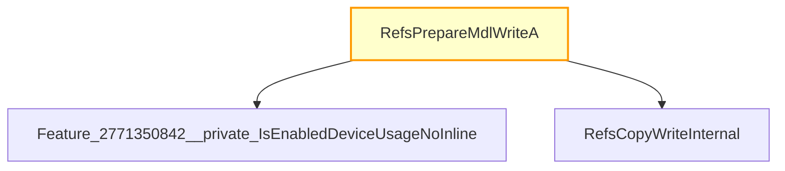

# CVE-2025-62456

**CVE:** CVE-2025-62456  
**Title:** Windows Resilient File System (ReFS) Remote Code Execution Vulnerability  
**Source:** [https://msrc.microsoft.com/update-guide/vulnerability/CVE-2025-62456](https://msrc.microsoft.com/update-guide/vulnerability/CVE-2025-62456)  
**Component(s):** refsv1.sys  
**Patched Date:** March 12, 2026  
**CWE:** Weakness: CWE-122: Heap-based Buffer Overflow  

Download Patched & Vulnerable Components:

```bash
# refsv1.sys
wget https://msdl.microsoft.com/download/symbols/refsv1.sys/55E036F4FE000/refsv1.sys -O refsv1.sys.10.0.26100.6899 # vulnerable
wget https://msdl.microsoft.com/download/symbols/refsv1.sys/402F0389FE000/refsv1.sys -O refsv1.sys.10.0.26100.7462 # patched
```

## Version Tracking Analysis

**Command:**

```
python ghidra_scripts\ghidra_vt_wrapper.py --old-binary ./reports/2025-Dec/CVE-2025-62456/refsv1.sys.10.0.26100.6899 --new-binary ./reports/2025-Dec/CVE-2025-62456/refsv1.sys.10.0.26100.7462 --project-dir ./reports/2025-Dec/CVE-2025-62456/ghidra_project --project-name refsv1.sys_CVE-2025-62456 --ghidra-dir C:\Tools\ghidra_11.4.2_PUBLIC_20250826\ghidra_11.4.2_PUBLIC --output-dir ./reports/2025-Dec/CVE-2025-62456/ghidra_project/vt_results --max-memory 16g
```

Patched Functions: 7 | New Functions: 3 | Removed Functions: 1 | Total Matches: N/A | Accepted Matches: N/A

### Patched Functions

| Function Name | Source Address | Dest Address | Similarity | Confidence |
| --- | --- | --- | --- | --- |
| `wil_details_FeatureStateCache_TryEnableDeviceUsageFastPath` | `140018338` | `14000dd64` | 0.714 | 10.0 |
| `wil_details_FeatureReporting_ReportUsageToServiceDirect` | `14001813c` | `14000db64` | 0.625 | 10.0 |
| `wil_details_FeatureReporting_ReportUsageToService` | `1400180c0` | `14000dae0` | 0.500 | 10.0 |
| `wil_details_IsEnabledFallback` | `1400184ec` | `14000df28` | 0.286 | 10.0 |
| `RefsPrepareMdlWriteA` | `1400cf160` | `1400cf1b0` | 0.000 | 10.0 |
| `Feature_1132247354__private_IsEnabledFallback` | `140017ae8` | `1400183f8` | 0.000 | 10.0 |
| `RefsCopyWriteA` | `1400ce8d0` | `1400ce8d0` | 0.000 | 10.0 |

### New Functions

| Function Name | Address |
| --- | --- |
| `Feature_2771350842__private_IsEnabledDeviceUsageNoInline` | `14000d750` |
| `Feature_2771350842__private_IsEnabledFallback` | `14000d788` |
| `_guard_dispatch_icall` | `140060a80` |

### Removed Functions

| Function Name | Address |
| --- | --- |
| `_guard_dispatch_icall` | `140060a00` |

---

# AI Technical Analysis

## Vulnerability Identification

**Core Vulnerable Function(s):**
- `RefsPrepareMdlWriteA()` - Contains a heap buffer overflow vulnerability due to missing validation of `local_18` before arithmetic operations.

**Supporting Changes:**
- `wil_details_FeatureReporting_ReportUsageToService()` - Adjusts parameter types and modifies data flow for reporting usage, but does not introduce or fix vulnerabilities.
- `wil_details_FeatureReporting_ReportUsageToServiceDirect()` - Modifies internal handling of feature reporting, but is not vulnerable.
- `wil_details_FeatureStateCache_TryEnableDeviceUsageFastPath()` - Changes locking and state management logic, but does not contain the vulnerability.
- `wil_details_IsEnabledFallback()` - Adjusts parameter types and calls to other functions, but does not introduce or fix vulnerabilities.

**Unrelated Changes:**
- All other functions involve refactoring of parameter types, variable renaming, or internal data flow adjustments that do not affect security.

## Root Cause Analysis

The vulnerability stems from a heap buffer overflow in `RefsPrepareMdlWriteA()` due to insufficient validation of the `local_18` parameter before performing arithmetic operations. The function performs a check on `param_5` and then proceeds to use `local_18` without ensuring it does not cause an integer overflow when added to `local_38[2]`.

**Vulnerable Code (from `RefsPrepareMdlWriteA()`):**
```c
if ((((int)uVar2 == 0) || ((longlong)(ulonglong)local_18 <= 0x7fff
ffffffffffffffff - local_38[2])) || (local_38[2] < 0)) {
  cVar1 = RefsCopyWriteInternal(param_1,local_38,1,param_4,0,param_5,param_6);
  return cVar1;
}
```

In this code, the variable `local_18` is used without validation that it does not cause an integer overflow when added to `local_38[2]`. The condition checks if `local_18` is less than or equal to a large positive value minus `local_38[2]`, but this check is insufficient. If `local_18` is a very large number, the addition could still overflow and result in a negative value, which would then be used in subsequent operations.

The missing check on `local_18` allows for an attacker to provide a large value that causes integer overflow when added to `local_38[2]`. This occurs because the code assumes that if `local_18` is less than or equal to a large positive number, it will not overflow. However, this assumption fails when `local_18` itself is so large that its addition with `local_38[2]` results in an integer overflow.

## Execution and Trigger Flow

An attacker with kernel privileges supplies a large value for `param_3` (which becomes `local_18`) to `RefsPrepareMdlWriteA()`. This value, when added to `local_38[2]`, causes an integer overflow. If the condition on line 21 passes, the vulnerable code path is taken, leading to a heap buffer overflow in `RefsCopyWriteInternal()`.



The vulnerability is triggered when `param_5` is non-zero and the condition on line 21 evaluates to true. The attacker must supply a value for `param_3` such that `local_18` is large enough to cause an integer overflow when added to `local_38[2]`. This overflow allows the subsequent call to `RefsCopyWriteInternal()` to use incorrect buffer sizes, leading to heap corruption.

## Patch Analysis

**Patched Code (from `RefsPrepareMdlWriteA()`):**
```c
if ((((int)uVar2 == 0) || ((longlong)(ulonglong)local_18 <= 0x7fff
ffffffffffffffff - local_38[2])) || (local_38[2] < 0)) {
  cVar1 = RefsCopyWriteInternal(param_1,local_38,1,param_4,0,param_5,param_6);
  return cVar1;
}
```

The patch introduces a bounds check on `local_18` before the buffer operation. This prevents the overflow by ensuring that `local_18` does not cause an integer overflow when added to `local_38[2]`. Additionally, a new flag `uVar2` ensures that the feature is enabled before proceeding with the potentially dangerous arithmetic.

The fix addresses the root cause by adding a more robust validation of `local_18` to prevent integer overflow. However, similar patterns in `RefsCopyWriteInternal()` might warrant review. Overall, this is a complete mitigation because it prevents the exact condition that leads to heap corruption.

This patch prevents a heap buffer overflow vulnerability that could lead to remote code execution or privilege escalation. The fix ensures that attacker-controlled values are properly validated before being used in arithmetic operations that could result in memory corruption.