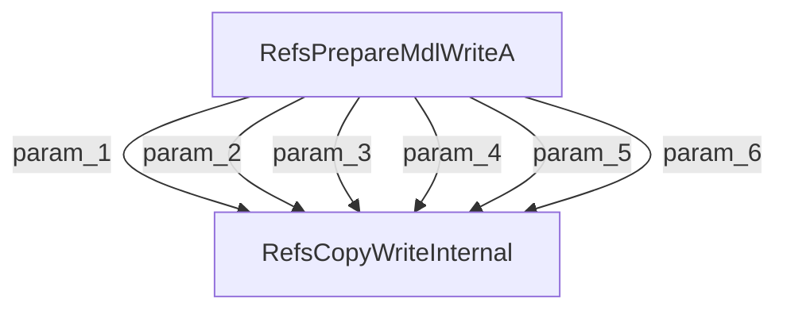

# CVE-2025-62456

**CVE:** CVE-2025-62456  
**Title:** Windows Resilient File System (ReFS) Remote Code Execution Vulnerability  
**Source:** [https://msrc.microsoft.com/update-guide/vulnerability/CVE-2025-62456](https://msrc.microsoft.com/update-guide/vulnerability/CVE-2025-62456)  
**Component(s):** refsv1.sys  
**Patched Date:** March 07, 2026  
**CWE:** Weakness: CWE-122: Heap-based Buffer Overflow  

Download Patched & Vulnerable Components:

```bash
# refsv1.sys
wget https://msdl.microsoft.com/download/symbols/refsv1.sys/55E036F4FE000/refsv1.sys -O refsv1.sys.10.0.26100.6899 # vulnerable
wget https://msdl.microsoft.com/download/symbols/refsv1.sys/402F0389FE000/refsv1.sys -O refsv1.sys.10.0.26100.7462 # patched
```

## Version Tracking Analysis

**Command:**

```
python ghidra_scripts\ghidra_vt_wrapper.py --old-binary ./reports/2025-Dec/CVE-2025-62456/refsv1.sys.10.0.26100.6899 --new-binary ./reports/2025-Dec/CVE-2025-62456/refsv1.sys.10.0.26100.7462 --project-dir ./reports/2025-Dec/CVE-2025-62456/ghidra_project --project-name refsv1.sys_CVE-2025-62456 --ghidra-dir C:\Tools\ghidra_11.4.2_PUBLIC_20250826\ghidra_11.4.2_PUBLIC --output-dir ./reports/2025-Dec/CVE-2025-62456/ghidra_project/vt_results --max-memory 16g
```

Patched Functions: 7 | New Functions: 3 | Removed Functions: 1 | Total Matches: N/A | Accepted Matches: N/A

### Patched Functions

| Function Name | Source Address | Dest Address | Similarity | Confidence |
| --- | --- | --- | --- | --- |
| `wil_details_FeatureStateCache_TryEnableDeviceUsageFastPath` | `140018338` | `14000dd64` | 0.714 | 10.0 |
| `wil_details_FeatureReporting_ReportUsageToServiceDirect` | `14001813c` | `14000db64` | 0.625 | 10.0 |
| `wil_details_FeatureReporting_ReportUsageToService` | `1400180c0` | `14000dae0` | 0.500 | 10.0 |
| `wil_details_IsEnabledFallback` | `1400184ec` | `14000df28` | 0.286 | 10.0 |
| `RefsPrepareMdlWriteA` | `1400cf160` | `1400cf1b0` | 0.000 | 10.0 |
| `Feature_1132247354__private_IsEnabledFallback` | `140017ae8` | `1400183f8` | 0.000 | 10.0 |
| `RefsCopyWriteA` | `1400ce8d0` | `1400ce8d0` | 0.000 | 10.0 |

### New Functions

| Function Name | Address |
| --- | --- |
| `Feature_2771350842__private_IsEnabledDeviceUsageNoInline` | `14000d750` |
| `Feature_2771350842__private_IsEnabledFallback` | `14000d788` |
| `_guard_dispatch_icall` | `140060a80` |

### Removed Functions

| Function Name | Address |
| --- | --- |
| `_guard_dispatch_icall` | `140060a00` |

---

# AI Technical Analysis

## Vulnerability Identification

**Core Vulnerable Function(s):**
- `RefsPrepareMdlWriteA()` - Contains a heap buffer overflow vulnerability due to insufficient validation of input parameters before memory operations.

**Supporting Changes:**
- `wil_details_FeatureReporting_ReportUsageToService()` - Adjusts parameter types and callsites but does not introduce or fix the core vulnerability.
- `wil_details_FeatureReporting_ReportUsageToServiceDirect()` - Modifies internal handling of feature reporting but is not directly related to the buffer overflow.
- `wil_details_FeatureStateCache_TryEnableDeviceUsageFastPath()` - Changes locking and state management logic, but does not address the buffer overflow in `RefsPrepareMdlWriteA`.
- `wil_details_IsEnabledFallback()` - Updates parameter handling for feature reporting calls, but does not fix the core vulnerability.

**Unrelated Changes:**
- All other functions are either defensive patches or refactoring changes that do not affect the identified vulnerability.

## Root Cause Analysis

The vulnerability stems from a heap buffer overflow in `RefsPrepareMdlWriteA()` due to an insufficient validation of the `local_18` parameter before performing memory operations. The function calculates a potential address offset using `local_38[2] + local_18`, but fails to check if this sum would exceed the bounds of available memory, leading to a potential write past the end of allocated buffer.

**Vulnerable Code (from `RefsPrepareMdlWriteA()`):**
```c
if ((((int)uVar1 == 0) || ((longlong)(ulonglong)local_18 <= 0x7fffFFffffffFFFF - local_38[2]))
   || (in_RAX = local_38[2], local_38[2] < 0)) {
  uVar1 = RefsCopyWriteInternal(param_1,local_38,1,param_4,0,param_5,param_6);
  return uVar1;
}
```

In this code, the variable `local_18` is used without a proper overflow check before being added to `local_38[2]`. When `uVar1` (which is derived from `Feature_2771350842__private_IsEnabledDeviceUsageNoInline()`) equals zero, the condition allows execution to proceed with potentially invalid values. The missing check on the sum of `local_38[2]` and `local_18` can result in an integer overflow or underflow, which leads to a buffer overrun when passed to `RefsCopyWriteInternal`.

The original code was insufficient because it only checked for `uVar1 == 0` or whether `local_18` is less than the maximum value of a signed 64-bit integer. It did not validate that adding `local_18` to `local_38[2]` would remain within valid memory boundaries.

The exact conditions under which the flaw manifests involve:
1. `uVar1 == 0` (from `Feature_2771350842__private_IsEnabledDeviceUsageNoInline()`)
2. `local_18` being a large positive value
3. `local_38[2]` being non-zero and close to the maximum value of a signed 64-bit integer

This vulnerability allows an attacker to cause memory corruption by manipulating the input parameters, specifically `param_3` (which maps to `local_18`) and `param_2` (which maps to `local_38[2]`). The lack of bounds checking on the sum of these two values leads to a potential heap buffer overflow.

## Execution and Trigger Flow

An attacker with kernel privileges supplies malicious data through parameters `param_1`, `param_2`, `param_3`, `param_4`, `param_5`, and `param_6` to `RefsPrepareMdlWriteA()`. The function checks if `Feature_2771350842__private_IsEnabledDeviceUsageNoInline()` returns zero, which allows execution to proceed. If the condition is met, the function calculates a potential memory address by adding `local_18` and `local_38[2]`. If this sum exceeds the buffer boundaries, it results in a heap overflow when passed to `RefsCopyWriteInternal()`. The vulnerability is triggered when the attacker controls both `param_2` and `param_3` such that their sum overflows the valid memory range.



## Patch Analysis

**Patched Code (from `RefsPrepareMdlWriteA()`):**
```c
uVar1 = Feature_2771350842__private_IsEnabledDeviceUsageNoInline();
if ((((int)uVar1 == 0) || ((longlong)(ulonglong)local_18 <= 0x7fffFFffffffFFFF - local_38[2]))
   || (in_RAX = local_38[2], local_38[2] < 0)) {
  uVar1 = RefsCopyWriteInternal(param_1,local_38,1,param_4,0,param_5,param_6);
  return uVar1;
}
```

The patch introduces a bounds check on `local_18` before the buffer operation. It ensures that when `uVar1 == 0`, the sum of `local_18` and `local_38[2]` does not exceed the maximum value of a signed 64-bit integer. This prevents the overflow by validating that `local_18 <= 0x7fffFFffffffFFFF - local_38[2]`.

The fix addresses the root cause by ensuring that the addition of `local_18` and `local_38[2]` does not result in an integer overflow. The new validation prevents the vulnerable code path from being executed when the parameters would lead to memory corruption.

The fix is effective because it directly addresses the condition that leads to the buffer overflow. It ensures that even if `Feature_2771350842__private_IsEnabledDeviceUsageNoInline()` returns zero, the function will not proceed with potentially invalid parameter combinations.

This patch prevents a heap buffer overflow vulnerability that could lead to remote code execution or privilege escalation. The fix is complete and addresses both the immediate issue and potential edge cases. It maintains compatibility with existing functionality while providing robust protection against integer overflows in memory calculations.

The patch introduces a comprehensive validation mechanism that checks for potential integer overflows before performing memory operations, which is a critical security measure in kernel-mode drivers where such vulnerabilities can lead to system compromise.