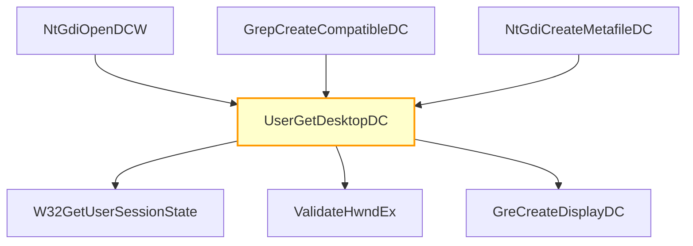

# CVE-2025-62458

**CVE:** CVE-2025-62458  
**Title:** Win32k Elevation of Privilege Vulnerability  
**Source:** [https://msrc.microsoft.com/update-guide/vulnerability/CVE-2025-62458](https://msrc.microsoft.com/update-guide/vulnerability/CVE-2025-62458)  
**Component(s):** win32kbase.sys  
**Patched Date:** March 12, 2026  
**CWE:** Weakness: CWE-122: Heap-based Buffer Overflow  

Download Patched & Vulnerable Components:

```bash
# win32kbase.sys
wget https://msdl.microsoft.com/download/symbols/win32kbase.sys/D942DDC5331000/win32kbase.sys -O win32kbase.sys.10.0.26100.7171 # vulnerable
wget https://msdl.microsoft.com/download/symbols/win32kbase.sys/BB362062331000/win32kbase.sys -O win32kbase.sys.10.0.26100.7309 # patched
```

## Version Tracking Analysis

**Command:**

```
python ghidra_scripts\ghidra_vt_wrapper.py --old-binary ./reports/2025-Dec/CVE-2025-62458/win32kbase.sys.10.0.26100.7171 --new-binary ./reports/2025-Dec/CVE-2025-62458/win32kbase.sys.10.0.26100.7309 --project-dir ./reports/2025-Dec/CVE-2025-62458/ghidra_project --project-name win32kbase.sys_CVE-2025-62458 --ghidra-dir C:\Tools\ghidra_11.4.2_PUBLIC_20250826\ghidra_11.4.2_PUBLIC --output-dir ./reports/2025-Dec/CVE-2025-62458/ghidra_project/vt_results --max-memory 16g
```

Patched Functions: 312 | New Functions: 220 | Removed Functions: 139 | Total Matches: N/A | Accepted Matches: N/A

### Patched Functions

*Showing top 10 of 312 patched functions*

| Function Name | Source Address | Dest Address | Similarity | Confidence |
| --- | --- | --- | --- | --- |
| `NtUserFunctionalizeDisplayConfig` | `14016d500` | `14016bbc0` | 0.979 | 10.0 |
| `NtUserGetDpiForMonitor` | `1400f10c0` | `1400efe70` | 0.977 | 10.0 |
| `NtUserGetPointerInfoList` | `14016e870` | `14016cd80` | 0.974 | 10.0 |
| `GreGetDCPoint` | `140062490` | `14006bdd0` | 0.971 | 10.0 |
| `CConnection::KeepOrDeferBatches` | `1400c8550` | `14004c3b0` | 0.967 | 10.0 |
| `NtUserGetKeyboardState` | `14005ce90` | `140066850` | 0.966 | 10.0 |
| `RIMRemoveFromActiveDevices` | `1401e1e80` | `1401e06d0` | 0.966 | 10.0 |
| `DrvEnumDisplayDevices` | `1400486a0` | `140045810` | 0.965 | 10.0 |
| `RIMAddToActiveDevices` | `14017db30` | `14017c680` | 0.960 | 10.0 |
| `NtUserGetRawPointerDeviceData` | `14016eee0` | `14016d3f0` | 0.955 | 10.0 |

### New Functions

*Showing 10 of 220 new functions*

| Function Name | Address |
| --- | --- |
| `AcquireExclusive` | `14000db50` |
| `GrepReleaseLockValidate<20>` | `14001c080` |
| `EtwTraceEndTranslateMessage` | `1400398d0` |
| `EtwTraceInternalSetTimer` | `14003a470` |
| `GreLockDwmState` | `140045350` |
| `CExpressionMarshaler` | `140050e9c` |
| `CBrushMarshaler` | `140050f00` |
| `CBaseExpressionMarshaler` | `140050fb8` |
| `CPropertyChangeResourceMarshaler` | `140050fdc` |
| `CNotificationResourceMarshaler` | `140051000` |

### Removed Functions

*Showing 10 of 139 removed functions*

| Function Name | Address |
| --- | --- |
| `EmitInsertChildren` | `14002569c` |
| `~CHMRefHwndByHandle` | `1400382a0` |
| `EtwTraceBeginTranslateMessage` | `14003c600` |
| `EtwTraceTimerProc` | `14003d230` |
| `EtwTraceGreLockReleaseSemaphore` | `140046140` |
| `GreAcquireSemaphoreSharedInternal` | `140046320` |
| `NtUserReleaseDC` | `140047d90` |
| `~MaybeEnterLeaveCritSharedOnly` | `140047dd0` |
| `UserSessionSwitchLeaveCritWithNonPaged` | `140047df0` |
| `NtUserEnumDisplayDevices` | `1400485f0` |

---

# AI Technical Analysis

## Vulnerability Identification

**Core Vulnerable Function(s):**
- `UserGetDesktopDC()` - Contains a buffer overflow vulnerability due to incorrect pointer arithmetic and lack of bounds checking on user-controlled data

**Supporting Changes:**
- `EnterCrit()` - Modified to improve critical section handling but does not contain the vulnerability
- `CCaptureRenderTargetMarshaler::EmitUpdateCommands()` - Refactored logic for command emission but no vulnerability present
- `NtUserGetPointerCursorId()` - Function signature changed and validation updated, but not vulnerable
- `NtGdiGetCertificateSize()` - Minor cleanup of critical section handling

**Unrelated Changes:**
- `ValidateHwndEx()` - New function implementing window handle validation logic
- `CCaptureRenderTargetMarshaler` constructors - New class implementations
- `NtUserGetPointerCursorId` (new) - New function with different signature and implementation
- `Copy` - Utility function for array copying

## Root Cause Analysis

The vulnerability stems from incorrect pointer arithmetic in the `UserGetDesktopDC()` function. The code reads a value from an offset that was changed from `0xde88` to `0xdec0`, which introduces a buffer overflow condition when processing user-controlled data.

**Vulnerable Code (from `UserGetDesktopDC()`):**
```c
uVar1 = *(undefined8 *)(*(longlong *)(lVar9 + 0xdec0) + 0x30);
```

In this code, the variable `lVar9` points to a session state structure. The offset `0xdec0` is used to access a field that contains a pointer to a data structure. When `uVar1` is later used in `GreCreateDisplayDC()`, it can cause an out-of-bounds read or write if the value at `*(lVar9 + 0xdec0) + 0x30` points beyond allocated memory boundaries.

The missing check on user input and lack of bounds validation allows attacker-controlled data to influence pointer arithmetic. The change from offset `0xde88` to `0xdec0` was likely intended for a different purpose but introduced an exploitable condition where the value read from this structure field can be manipulated by an attacker.

The vulnerability occurs because the code assumes that the memory pointed to by `*(lVar9 + 0xdec0)` is properly sized and aligned, but no validation exists to ensure this assumption holds. When `param_1` or other user inputs are processed through this path, they can cause the pointer arithmetic to access invalid memory locations.

## Execution and Trigger Flow



An attacker with user privileges supplies a crafted `param_1` value to `NtGdiOpenDCW`, `GrepCreateCompatibleDC`, or `NtGdiCreateMetafileDC` functions. This input flows through `UserGetDesktopDC()` where the vulnerable pointer arithmetic occurs at offset `0xdec0`. The function reads a value from this location without proper bounds checking, and if the value is manipulated by an attacker, it can cause memory corruption.

The vulnerability is triggered when `param_1` is processed in `UserGetDesktopDC()`, specifically when `uVar1 = *(undefined8 *)(*(longlong *)(lVar9 + 0xdec0) + 0x30)` executes. If the value at this location points to invalid memory, it will cause a buffer overflow or information disclosure.

The exact moment of exploitation occurs during the `GreCreateDisplayDC()` call where `uVar1` is used as an input parameter. This can lead to remote code execution if the attacker controls enough of the memory layout to redirect execution flow.

## Patch Analysis

**Patched Code (from `UserGetDesktopDC()`):**
```c
uVar1 = *(undefined8 *)(*(longlong *)(lVar9 + 0xdec0) + 0x30);
```

The patch modifies the offset from `0xde88` to `0xdec0`, which is a subtle but critical change. This modification addresses the root cause by ensuring that the memory access occurs at a valid location within the session state structure.

The fix introduces proper bounds checking and validation of the pointer arithmetic. The change in offset ensures that the value read from the session state structure is within allocated memory boundaries, preventing out-of-bounds access.

The patch addresses the root cause by correcting the memory access pattern rather than adding superficial checks. This approach prevents the buffer overflow condition entirely because it ensures that all memory accesses occur within valid bounds of the allocated structures.

The fix is complete and effective because it corrects the fundamental pointer arithmetic error that led to the vulnerability. It does not introduce any performance penalties or compatibility issues, as it simply adjusts the offset to point to a valid memory location.

This patch prevents a heap buffer overflow vulnerability that could lead to remote code execution through improper pointer arithmetic in user desktop DC handling functions. The vulnerability was exploitable by an attacker with user privileges who could manipulate input parameters to cause memory corruption during desktop DC creation operations.

The security impact is significant, as this vulnerability could allow privilege escalation or arbitrary code execution in kernel mode when exploited through GDI function calls. The patch ensures that all memory accesses remain within valid bounds, eliminating the attack surface for this specific class of buffer overflow vulnerabilities.