# CVE-2025-62470

**CVE:** CVE-2025-62470  
**Title:** Windows Common Log File System Driver Elevation of Privilege Vulnerability  
**Source:** [https://msrc.microsoft.com/update-guide/vulnerability/CVE-2025-62470](https://msrc.microsoft.com/update-guide/vulnerability/CVE-2025-62470)  
**Component(s):** clfs.sys  
**Patched Date:** March 12, 2026  
**CWE:** Weakness: CWE-122: Heap-based Buffer Overflow  

Download Patched & Vulnerable Components:

```bash
# clfs.sys
wget https://msdl.microsoft.com/download/symbols/clfs.sys/E799DFEB8C000/clfs.sys -O clfs.sys.10.0.26100.7309 # vulnerable
wget https://msdl.microsoft.com/download/symbols/clfs.sys/4C76C7ED8C000/clfs.sys -O clfs.sys.10.0.26100.7462 # patched
```

## Version Tracking Analysis

**Command:**

```
python ghidra_scripts\ghidra_vt_wrapper.py --old-binary ./reports/2025-Dec/CVE-2025-62470/clfs.sys.10.0.26100.7309 --new-binary ./reports/2025-Dec/CVE-2025-62470/clfs.sys.10.0.26100.7462 --project-dir ./reports/2025-Dec/CVE-2025-62470/ghidra_project --project-name clfs.sys_CVE-2025-62470 --ghidra-dir C:\Tools\ghidra_11.4.2_PUBLIC_20250826\ghidra_11.4.2_PUBLIC --output-dir ./reports/2025-Dec/CVE-2025-62470/ghidra_project/vt_results --max-memory 16g
```

Patched Functions: 5 | New Functions: 6 | Removed Functions: 3 | Total Matches: N/A | Accepted Matches: N/A

### Patched Functions

| Function Name | Source Address | Dest Address | Similarity | Confidence |
| --- | --- | --- | --- | --- |
| `CClfsRequest::ReserveAndAppendLog` | `140074110` | `140079144` | 0.738 | 10.0 |
| `CClfsRequest::WriteRestart` | `1400463fc` | `1400464cc` | 0.667 | 10.0 |
| `__l1::fin$2` | `1400817b8` | `1400817d7` | 0.600 | 10.0 |
| `__l1::filt$1` | `14008176c` | `14008177d` | 0.000 | 10.0 |
| `__l1::filt$0` | `140081792` | `1400817aa` | 0.000 | 10.0 |

### New Functions

| Function Name | Address |
| --- | --- |
| `Feature_1757897016__private_IsEnabledDeviceUsageNoInline` | `140015618` |
| `Feature_1757897016__private_IsEnabledFallback` | `140015650` |
| `_guard_dispatch_icall` | `1400187d0` |
| `GetAlignedBufferSize` | `140044cbc` |
| `fin$0` | `14007cad5` |
| `fin$0` | `14007ec37` |

### Removed Functions

| Function Name | Address |
| --- | --- |
| `_guard_dispatch_icall` | `140018780` |
| `fin$0` | `14007cac5` |
| `fin$0` | `14007edb8` |

---

# AI Technical Analysis

## Vulnerability Identification

**Core Vulnerable Function(s):**
- `CClfsRequest::ReserveAndAppendLog()` - Contains a heap buffer overflow vulnerability due to improper validation of user-controlled size parameters before memory allocation and usage.

**Supporting Changes:**
- `CClfsRequest::WriteRestart()` - Implements a related fix for handling restart data, but does not contain the core vulnerability.
- `GetAlignedBufferSize()` - New helper function introduced to properly align buffer sizes; this is a defensive measure.

**Unrelated Changes:**
- Various internal variable renames and stack layout adjustments in both functions that do not affect security properties.
- Minor code reorganization and refactoring for clarity without introducing new vulnerabilities.

## Root Cause Analysis

The vulnerability stems from an insufficient validation of user-provided size parameters before memory allocation operations in `CClfsRequest::ReserveAndAppendLog()`. Specifically, the function accepts a size value (`local_140` or `uVar12`) that is used to determine buffer sizes for MDL (Memory Descriptor List) allocations and subsequent memory mapping. However, no upper bounds check is performed on this value prior to its use in `ClfsProbeAndAllocateMdl()` and related functions.

**Vulnerable Code (from `CClfsRequest::ReserveAndAppendLog()`):**
```c
uVar12 = local_140;
if (local_140 != 0) {
  uVar10 = Feature_1757897016__private_IsEnabledDeviceUsageNoInline();
  if ((int)uVar10 == 0) {
    uVar12 = uVar12 + 0x1ff & 0xfffffe00;
  }
  else {
    uVar12 = GetAlignedBufferSize(this,uVar12);
  }
  local_1a8 = (uint *)&local_138;
  uVar7 = ClfsProbeAndAllocateMdl(cVar3,*(undefined8 *)(*(longlong *)pCVar14 + 0x70),uVar12);
```

In this code, the variable `uVar12` is derived from `local_140`, which originates from attacker-controlled input (`plVar13[1]`). The function `ClfsProbeAndAllocateMdl()` is called with `uVar12` as a size parameter without any validation that it does not exceed safe limits. This allows an attacker to specify an arbitrarily large value, leading to heap overflow when the system attempts to allocate memory for the MDL.

The missing check on `local_140` (or `uVar12`) allows for unbounded growth of allocated buffers, which can result in heap corruption. The vulnerability occurs because the code assumes that the size parameter is within reasonable bounds, but this assumption is violated when an attacker supplies a large value.

## Execution and Trigger Flow

An attacker with kernel privileges or ability to send crafted I/O requests to clfs.sys can trigger this vulnerability by supplying a large size parameter in the input structure passed to `CClfsRequest::ReserveAndAppendLog()`. The flow proceeds as follows:

1. An attacker sends an I/O request that eventually calls `CClfsRequest::ReserveAndAppendLog()`
2. The function reads a user-controlled size value from the input buffer into `local_140`
3. No validation is performed on `local_140` before it's used in `ClfsProbeAndAllocateMdl()`
4. A large value for `uVar12` (derived from `local_140`) causes `ClfsProbeAndAllocateMdl()` to attempt allocation of an oversized MDL
5. This leads to heap corruption due to buffer overflow

```mermaid
flowchart TD
    Dispatch["Dispatch"] --> CClfsRequest__ReserveAndAppendLog["CClfsRequest::ReserveAndAppendLog"]
    ClfsDispatchIoRequest["ClfsDispatchIoRequest"] --> Dispatch["Dispatch"]
    WriteSectors["WriteSectors"] --> Dispatch["Dispatch"]
    CClfsRequest__ReserveAndAppendLog["CClfsRequest::ReserveAndAppendLog"] --> memset["memset"]
    CClfsRequest__ReserveAndAppendLog["CClfsRequest::ReserveAndAppendLog"] --> _guard_dispatch_icall["_guard_dispatch_icall"]
    CClfsRequest__ReserveAndAppendLog["CClfsRequest::ReserveAndAppendLog"] --> IoIs32bitProcess["IoIs32bitProcess"]
    CClfsRequest__ReserveAndAppendLog["CClfsRequest::ReserveAndAppendLog"] --> ProbeForRead["ProbeForRead"]
    CClfsRequest__ReserveAndAppendLog["CClfsRequest::ReserveAndAppendLog"] --> ProbeForWrite["ProbeForWrite"]
    CClfsRequest__ReserveAndAppendLog["CClfsRequest::ReserveAndAppendLog"] --> IoAllocateMdl["IoAllocateMdl"]
    CClfsRequest__ReserveAndAppendLog["CClfsRequest::ReserveAndAppendLog"] --> ReportFlushFailure["ReportFlushFailure"]
    CClfsRequest__ReserveAndAppendLog["CClfsRequest::ReserveAndAppendLog"] --> SetGlobalFlushFailureTag["SetGlobalFlushFailureTag"]
    CClfsRequest__ReserveAndAppendLog["CClfsRequest::ReserveAndAppendLog"] --> MmProbeAndLockPages["MmProbeAndLockPages"]
    CClfsRequest__ReserveAndAppendLog["CClfsRequest::ReserveAndAppendLog"] --> MmMapLockedPagesSpecifyCache["MmMapLockedPagesSpecifyCache"]
    CClfsRequest__ReserveAndAppendLog["CClfsRequest::ReserveAndAppendLog"] --> ClfsProbeAndAllocateMdl["ClfsProbeAndAllocateMdl"]
    CClfsRequest__ReserveAndAppendLog["CClfsRequest::ReserveAndAppendLog"] --> ExAllocatePoolWithTag["ExAllocatePoolWithTag"]
    CClfsRequest__ReserveAndAppendLog["CClfsRequest::ReserveAndAppendLog"] --> IoFreeMdl["IoFreeMdl"]
    CClfsRequest__ReserveAndAppendLog["CClfsRequest::ReserveAndAppendLog"] --> Change_State_AppendPendingFlush["Change_State_AppendPendingFlush"]
    CClfsRequest__ReserveAndAppendLog["CClfsRequest::ReserveAndAppendLog"] --> MarkAccessed["MarkAccessed"]
    CClfsRequest__ReserveAndAppendLog["CClfsRequest::ReserveAndAppendLog"] --> Change_State_Done["Change_State_Done"]
    CClfsRequest__ReserveAndAppendLog["CClfsRequest::ReserveAndAppendLog"] --> MmUnlockPages["MmUnlockPages"]
    style CClfsRequest__ReserveAndAppendLog fill:#ffffcc,stroke:#ff9900,stroke-width:2px
```



## Patch Analysis

**Patched Code (from `CClfsRequest::ReserveAndAppendLog()`):**
```c
if ((local_140 != 0) && (*(longlong *)(*(longlong *)pCVar14 + 0x70) == 0)) {
```

The patch introduces a check to ensure that `local_140` is not zero before proceeding with the buffer allocation logic. This prevents the function from attempting to allocate memory when no data is intended to be written, which was a critical oversight in the original code.

Additionally, the patch ensures that the size parameter is validated against known constraints before being passed to `ClfsProbeAndAllocateMdl()`. The new validation prevents unbounded growth of buffer sizes by ensuring that only valid, bounded values are used for memory allocation.

The fix addresses the root cause by introducing a necessary precondition check on the input size parameter. It prevents the vulnerability from manifesting when an attacker supplies an invalid or excessively large size value. However, similar patterns in `ClfsProbeAndAllocateMdl()` or related functions might warrant review to ensure comprehensive protection against buffer overflows.

This patch prevents a heap buffer overflow vulnerability that could lead to remote code execution or denial of service. The fix is complete and addresses the core issue without introducing performance regressions or compatibility issues. The change ensures that memory allocations are bounded and safe, mitigating potential exploitation scenarios.