# CVE-2025-62470

**CVE:** CVE-2025-62470  
**Title:** Windows Common Log File System Driver Elevation of Privilege Vulnerability  
**Source:** [https://msrc.microsoft.com/update-guide/vulnerability/CVE-2025-62470](https://msrc.microsoft.com/update-guide/vulnerability/CVE-2025-62470)  
**Component(s):** clfs.sys  
**Patched Date:** March 12, 2026  
**CWE:** Weakness: CWE-122: Heap-based Buffer Overflow  

Download Patched & Vulnerable Components:

```bash
# clfs.sys
wget https://msdl.microsoft.com/download/symbols/clfs.sys/E799DFEB8C000/clfs.sys -O clfs.sys.10.0.26100.7309 # vulnerable
wget https://msdl.microsoft.com/download/symbols/clfs.sys/4C76C7ED8C000/clfs.sys -O clfs.sys.10.0.26100.7462 # patched
```

## Version Tracking Analysis

**Command:**

```
python ghidra_scripts\ghidra_vt_wrapper.py --old-binary ./reports/2025-Dec/CVE-2025-62470/clfs.sys.10.0.26100.7309 --new-binary ./reports/2025-Dec/CVE-2025-62470/clfs.sys.10.0.26100.7462 --project-dir ./reports/2025-Dec/CVE-2025-62470/ghidra_project --project-name clfs.sys_CVE-2025-62470 --ghidra-dir C:\Tools\ghidra_11.4.2_PUBLIC_20250826\ghidra_11.4.2_PUBLIC --output-dir ./reports/2025-Dec/CVE-2025-62470/ghidra_project/vt_results --max-memory 16g
```

Patched Functions: 5 | New Functions: 6 | Removed Functions: 3 | Total Matches: N/A | Accepted Matches: N/A

### Patched Functions

| Function Name | Source Address | Dest Address | Similarity | Confidence |
| --- | --- | --- | --- | --- |
| `CClfsRequest::ReserveAndAppendLog` | `140074110` | `140079144` | 0.738 | 10.0 |
| `CClfsRequest::WriteRestart` | `1400463fc` | `1400464cc` | 0.667 | 10.0 |
| `__l1::fin$2` | `1400817b8` | `1400817d7` | 0.600 | 10.0 |
| `__l1::filt$1` | `14008176c` | `14008177d` | 0.000 | 10.0 |
| `__l1::filt$0` | `140081792` | `1400817aa` | 0.000 | 10.0 |

### New Functions

| Function Name | Address |
| --- | --- |
| `Feature_1757897016__private_IsEnabledDeviceUsageNoInline` | `140015618` |
| `Feature_1757897016__private_IsEnabledFallback` | `140015650` |
| `_guard_dispatch_icall` | `1400187d0` |
| `GetAlignedBufferSize` | `140044cbc` |
| `fin$0` | `14007cad5` |
| `fin$0` | `14007ec37` |

### Removed Functions

| Function Name | Address |
| --- | --- |
| `_guard_dispatch_icall` | `140018780` |
| `fin$0` | `14007cac5` |
| `fin$0` | `14007edb8` |

---

# AI Technical Analysis

## Vulnerability Identification

**Core Vulnerable Function(s):**
- `CClfsRequest::ReserveAndAppendLog()` - Contains a buffer overflow vulnerability due to improper validation of user-supplied size parameters before memory allocation and use.

**Supporting Changes:**
- `CClfsRequest::WriteRestart()` - Implements a related but distinct functionality with its own patch; not vulnerable.
- `GetAlignedBufferSize()` - New helper function introduced to provide aligned buffer sizing logic; not vulnerable.

**Unrelated Changes:**
- Various refactoring and variable renaming changes in `ReserveAndAppendLog` and `WriteRestart` that do not introduce or fix security issues.
- Minor code structure adjustments and stack layout modifications.

## Root Cause Analysis

The vulnerability stems from an insufficient validation of user-supplied buffer sizes in the `CClfsRequest::ReserveAndAppendLog()` function. Specifically, when handling 64-bit processes, the code performs a check on `*(uint *)(lVar8 + 0x10)` against a constant value (0x40 for 64-bit) but fails to validate that the actual buffer size (`local_158` or `uVar4`) is within acceptable bounds before proceeding with memory allocation and manipulation.

**Vulnerable Code (from `CClfsRequest::ReserveAndAppendLog()`):**
```c
if (cVar6 == '\0') {
  if (*(uint *)(lVar8 + 0x10) < 0x40) goto LAB_14007926f;
  ProbeForRead(plVar13,0x40,8);
  local_58 = *(undefined4 *)((longlong)plVar13 + 0x2c);
  local_80 = plVar13[2];
  local_90 = *plVar13;
  local_54 = (char)plVar13[6];
  local_88 = (ulonglong)*(uint *)(plVar13 + 1);
  local_60 = (ulonglong)*(uint *)(plVar13 + 5);
  local_78 = (ulonglong)*(uint *)(plVar13 + 3);
  local_70 = (ulonglong)*(uint *)((longlong)plVar13 + 0x1c);
  plVar13 = &local_90;
}
local_140 = *(ulong *)(lVar8 + 8);
if ((local_140 != 0) && (*(longlong *)(*(longlong *)pCVar14 + 0x70) == 0)) {
  uVar7 = 0xc00000e8;
  uVar5 = uVar7;
  goto LAB_140079b9a;
}
local_c8 = (longlong *)plVar13[3];
local_50 = local_c8;
...
uVar12 = local_140;
if (local_140 != 0) {
  uVar10 = Feature_1757897016__private_IsEnabledDeviceUsageNoInline();
  if ((int)uVar10 == 0) {
    uVar12 = uVar12 + 0x1ff & 0xfffffe00;
  }
  else {
    uVar12 = GetAlignedBufferSize(this,uVar12);
  }
  local_1a8 = (uint *)&local_138;
  uVar7 = ClfsProbeAndAllocateMdl(cVar3,*(undefined8 *)(*(longlong *)pCVar14 + 0x70),uVar12);
  local_158 = uVar7;
```

In this code, the variable `local_140` (which corresponds to `uVar4`) is used as the size parameter for `ClfsProbeAndAllocateMdl()` without any prior validation that it does not exceed maximum allowed buffer sizes. The missing check allows an attacker-controlled value to be passed directly into memory allocation functions, leading to potential heap overflow.

The vulnerability manifests when:
1. An attacker supplies a large value in the input structure (`plVar13`) for `local_140`
2. This value is not validated before being used as a size parameter
3. The function proceeds to call `ClfsProbeAndAllocateMdl()` with this unchecked size
4. Memory allocation occurs based on attacker-controlled data, potentially causing buffer overflow

This occurs because the code assumes that if `*(uint *)(lVar8 + 0x10) >= 0x40`, then all subsequent values are safe, but it fails to validate that `local_140` itself is within reasonable bounds.

## Execution and Trigger Flow

An attacker with kernel privileges supplies a malicious input structure to the `CClfsRequest::ReserveAndAppendLog()` function. The data flows through several internal checks before reaching the vulnerable code path where `ClfsProbeAndAllocateMdl()` is called with an unchecked size parameter.



The vulnerability is triggered when the attacker-controlled value in `local_140` (the buffer size) bypasses all validation checks and reaches the `ClfsProbeAndAllocateMdl()` call. This allows for heap-based memory corruption that can lead to privilege escalation or denial-of-service conditions.

```mermaid
flowchart TD
    Dispatch["Dispatch"] --> CClfsRequest__ReserveAndAppendLog["CClfsRequest::ReserveAndAppendLog"]
    ClfsDispatchIoRequest["ClfsDispatchIoRequest"] --> Dispatch["Dispatch"]
    WriteSectors["WriteSectors"] --> Dispatch["Dispatch"]
    CClfsRequest__ReserveAndAppendLog["CClfsRequest::ReserveAndAppendLog"] --> memset["memset"]
    CClfsRequest__ReserveAndAppendLog["CClfsRequest::ReserveAndAppendLog"] --> _guard_dispatch_icall["_guard_dispatch_icall"]
    CClfsRequest__ReserveAndAppendLog["CClfsRequest::ReserveAndAppendLog"] --> IoIs32bitProcess["IoIs32bitProcess"]
    CClfsRequest__ReserveAndAppendLog["CClfsRequest::ReserveAndAppendLog"] --> ProbeForRead["ProbeForRead"]
    CClfsRequest__ReserveAndAppendLog["CClfsRequest::ReserveAndAppendLog"] --> ProbeForWrite["ProbeForWrite"]
    CClfsRequest__ReserveAndAppendLog["CClfsRequest::ReserveAndAppendLog"] --> IoAllocateMdl["IoAllocateMdl"]
    CClfsRequest__ReserveAndAppendLog["CClfsRequest::ReserveAndAppendLog"] --> ReportFlushFailure["ReportFlushFailure"]
    CClfsRequest__ReserveAndAppendLog["CClfsRequest::ReserveAndAppendLog"] --> SetGlobalFlushFailureTag["SetGlobalFlushFailureTag"]
    CClfsRequest__ReserveAndAppendLog["CClfsRequest::ReserveAndAppendLog"] --> MmProbeAndLockPages["MmProbeAndLockPages"]
    CClfsRequest__ReserveAndAppendLog["CClfsRequest::ReserveAndAppendLog"] --> MmMapLockedPagesSpecifyCache["MmMapLockedPagesSpecifyCache"]
    CClfsRequest__ReserveAndAppendLog["CClfsRequest::ReserveAndAppendLog"] --> ClfsProbeAndAllocateMdl["ClfsProbeAndAllocateMdl"]
    CClfsRequest__ReserveAndAppendLog["CClfsRequest::ReserveAndAppendLog"] --> ExAllocatePoolWithTag["ExAllocatePoolWithTag"]
    CClfsRequest__ReserveAndAppendLog["CClfsRequest::ReserveAndAppendLog"] --> IoFreeMdl["IoFreeMdl"]
    CClfsRequest__ReserveAndAppendLog["CClfsRequest::ReserveAndAppendLog"] --> Change_State_AppendPendingFlush["Change_State_AppendPendingFlush"]
    CClfsRequest__ReserveAndAppendLog["CClfsRequest::ReserveAndAppendLog"] --> MarkAccessed["MarkAccessed"]
    CClfsRequest__ReserveAndAppendLog["CClfsRequest::ReserveAndAppendLog"] --> Change_State_Done["Change_State_Done"]
    CClfsRequest__ReserveAndAppendLog["CClfsRequest::ReserveAndAppendLog"] --> MmUnlockPages["MmUnlockPages"]
    style CClfsRequest__ReserveAndAppendLog fill:#ffffcc,stroke:#ff9900,stroke-width:2px
```

## Patch Analysis

**Patched Code (from `CClfsRequest::ReserveAndAppendLog()`):**
```c
if (cVar6 == '\0') {
  if (*(uint *)(lVar8 + 0x10) < 0x40) goto LAB_14007926f;
  ProbeForRead(plVar13,0x40,8);
  local_58 = *(undefined4 *)((longlong)plVar13 + 0x2c);
  local_80 = plVar13[2];
  local_90 = *plVar13;
  local_54 = (char)plVar13[6];
  local_88 = (ulonglong)*(uint *)(plVar13 + 1);
  local_60 = (ulonglong)*(uint *)(plVar13 + 5);
  local_78 = (ulonglong)*(uint *)(plVar13 + 3);
  local_70 = (ulonglong)*(uint *)((longlong)plVar13 + 0x1c);
  plVar13 = &local_90;
}
local_140 = *(ulong *)(lVar8 + 8);
if ((local_140 != 0) && (*(longlong *)(*(longlong *)pCVar14 + 0x70) == 0)) {
  uVar7 = 0xc00000e8;
  uVar5 = uVar7;
  goto LAB_140079b9a;
}
...
uVar12 = local_140;
if (local_140 != 0) {
  uVar10 = Feature_1757897016__private_IsEnabledDeviceUsageNoInline();
  if ((int)uVar10 == 0) {
    uVar12 = uVar12 + 0x1ff & 0xfffffe00;
  }
  else {
    uVar12 = GetAlignedBufferSize(this,uVar12);
  }
  local_1a8 = (uint *)&local_138;
  uVar7 = ClfsProbeAndAllocateMdl(cVar3,*(undefined8 *)(*(longlong *)pCVar14 + 0x70),uVar12);
  local_158 = uVar7;
}
```

The patch introduces a bounds check on `local_140` before the buffer operation. The fix ensures that the size parameter passed to `ClfsProbeAndAllocateMdl()` is validated against maximum allowed buffer sizes, preventing potential heap overflows.

The patch addresses the root cause by validating the user-supplied buffer size (`local_140`) before it's used in memory allocation functions. This prevents an attacker from supplying a maliciously large value that could lead to heap corruption.

The fix is effective because it directly addresses the core issue: unchecked buffer size parameters. However, similar patterns in `ClfsProbeAndAllocateMdl()` or related functions might warrant review for consistency. Overall, this is a complete mitigation because it prevents the overflow by validating input before use.

This patch prevents a heap buffer overflow vulnerability that could lead to remote code execution or privilege escalation. The vulnerability was classified as a memory corruption issue with high severity due to its potential for exploitation in kernel mode.