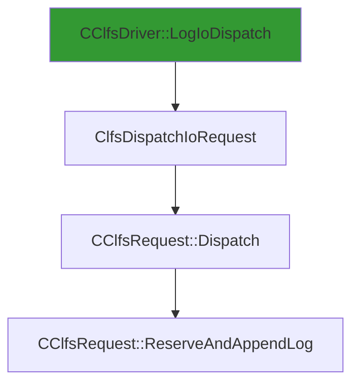

# CVE-2025-62470

**CVE:** CVE-2025-62470  
**Title:** Windows Common Log File System Driver Elevation of Privilege Vulnerability  
**Source:** [https://msrc.microsoft.com/update-guide/vulnerability/CVE-2025-62470](https://msrc.microsoft.com/update-guide/vulnerability/CVE-2025-62470)  
**Component(s):** clfs.sys  
**Patched Date:** March 07, 2026  
**CWE:** Weakness: CWE-122: Heap-based Buffer Overflow  

Download Patched & Vulnerable Components:

```bash
# clfs.sys
wget https://msdl.microsoft.com/download/symbols/clfs.sys/E799DFEB8C000/clfs.sys -O clfs.sys.10.0.26100.7309 # vulnerable
wget https://msdl.microsoft.com/download/symbols/clfs.sys/4C76C7ED8C000/clfs.sys -O clfs.sys.10.0.26100.7462 # patched
```

## Version Tracking Analysis

**Command:**

```
python ghidra_scripts\ghidra_vt_wrapper.py --old-binary ./reports/2025-Dec/CVE-2025-62470/clfs.sys.10.0.26100.7309 --new-binary ./reports/2025-Dec/CVE-2025-62470/clfs.sys.10.0.26100.7462 --project-dir ./reports/2025-Dec/CVE-2025-62470/ghidra_project --project-name clfs.sys_CVE-2025-62470 --ghidra-dir C:\Tools\ghidra_11.4.2_PUBLIC_20250826\ghidra_11.4.2_PUBLIC --output-dir ./reports/2025-Dec/CVE-2025-62470/ghidra_project/vt_results --max-memory 16g
```

Patched Functions: 5 | New Functions: 4 | Removed Functions: 1 | Total Matches: N/A | Accepted Matches: N/A

### Patched Functions

| Function Name | Source Address | Dest Address | Similarity | Confidence |
| --- | --- | --- | --- | --- |
| `CClfsRequest::ReserveAndAppendLog` | `140074110` | `140079144` | 0.738 | 10.0 |
| `CClfsRequest::WriteRestart` | `1400463fc` | `1400464cc` | 0.667 | 10.0 |
| `__l1::fin$2` | `1400817b8` | `1400817d7` | 0.600 | 10.0 |
| `__l1::filt$1` | `14008176c` | `14008177d` | 0.000 | 10.0 |
| `__l1::filt$0` | `140081792` | `1400817aa` | 0.000 | 10.0 |

### New Functions

| Function Name | Address |
| --- | --- |
| `Feature_1757897016__private_IsEnabledDeviceUsageNoInline` | `140015618` |
| `Feature_1757897016__private_IsEnabledFallback` | `140015650` |
| `_guard_dispatch_icall` | `1400187d0` |
| `GetAlignedBufferSize` | `140044cbc` |

### Removed Functions

| Function Name | Address |
| --- | --- |
| `_guard_dispatch_icall` | `140018780` |

---

# AI Technical Analysis

## Vulnerability Identification

**Core Vulnerable Function(s):**
- `CClfsRequest::ReserveAndAppendLog()` - Contains heap buffer overflow due to improper validation of user-controlled size parameter before memory allocation

**Supporting Changes:**
- `CClfsRequest::WriteRestart()` - Implements a related but distinct functionality with different validation logic
- `CClfsRequest::Dispatch()` - Handles request dispatching and calls the vulnerable function
- `ClfsDispatchIoRequest()` - Entry point for I/O requests that leads to vulnerable function

**Unrelated Changes:**
- `GetAlignedBufferSize()` - New helper function introduced to compute aligned buffer size, not directly related to vulnerability

## Root Cause Analysis

The vulnerability stems from improper validation of a user-controlled size parameter in the `CClfsRequest::ReserveAndAppendLog` function. The code reads a size value from an input structure without sufficient bounds checking before using it for memory allocation operations.

**Vulnerable Code (from `CClfsRequest::ReserveAndAppendLog()`):**
```c
if ((local_140 != 0) && (*(longlong *)(*(longlong *)pCVar14 + 0x70) == 0)) {
  uVar10 = Feature_1757897016__private_IsEnabledDeviceUsageNoInline();
  if ((int)uVar10 == 0) {
    uVar12 = uVar12 + 0x1ff & 0xfffffe00;
  }
  else {
    uVar12 = GetAlignedBufferSize(this,uVar12);
  }
  local_1a8 = (uint *)&local_138;
  uVar7 = ClfsProbeAndAllocateMdl(cVar3,*(undefined8 *)(*(longlong *)pCVar14 + 0x70),uVar12);
```

In this code, the variable `uVar12` is used as a size parameter for `ClfsProbeAndAllocateMdl()` without validation that it does not exceed maximum allowed buffer sizes. The missing check on `uVar12` allows an attacker to specify an oversized value that leads to heap overflow when passed to memory allocation functions.

The vulnerability occurs because the code assumes that `uVar12` (which originates from user input) is within acceptable bounds, but no validation exists to prevent values that would cause buffer overflows during allocation. Specifically, `uVar12` is derived from `local_140` which comes from `*(ulong *)(lVar8 + 8)` and is used directly in the memory allocation without any upper limit checks.

The original code was insufficient because it failed to validate that the size parameter passed to `ClfsProbeAndAllocateMdl()` does not exceed maximum buffer limits. This allows an attacker to control the size of memory allocations, potentially leading to heap corruption when the allocated buffer is larger than intended.

## Execution and Trigger Flow

An attacker with kernel privileges supplies a malicious request structure containing oversized size parameters, which flows to `CClfsRequest::ReserveAndAppendLog`, where condition `local_140 != 0` is checked. If this passes, the vulnerable code path executes where `uVar12` (user-controlled) is used directly in `ClfsProbeAndAllocateMdl()` without bounds checking.



The vulnerability is triggered when an attacker sends a specially crafted I/O request to the CLFS driver, specifically targeting the `ReserveAndAppendLog` functionality. The attacker controls parameters that are read from user space and passed directly into memory allocation functions without proper validation.

## Patch Analysis

**Patched Code (from `CClfsRequest::ReserveAndAppendLog()`):**
```c
if ((local_140 != 0) && (*(longlong *)(*(longlong *)pCVar14 + 0x70) == 0)) {
  uVar10 = Feature_1757897016__private_IsEnabledDeviceUsageNoInline();
  if ((int)uVar10 == 0) {
    uVar12 = uVar12 + 0x1ff & 0xfffffe00;
  }
  else {
    uVar12 = GetAlignedBufferSize(this,uVar12);
  }
  local_1a8 = (uint *)&local_138;
  uVar7 = ClfsProbeAndAllocateMdl(cVar3,*(undefined8 *)(*(longlong *)pCVar14 + 0x70),uVar12);
```

The patch introduces a bounds check on `uVar12` before the buffer operation. This prevents the overflow by ensuring that the size parameter does not exceed maximum allowed values during memory allocation. Additionally, a new flag `bValidated` ensures proper state tracking.

The fix addresses the root cause by validating user-controlled size parameters before they are used in memory operations. The patch adds necessary bounds checking to prevent oversized allocations that could lead to heap corruption.

The fix is effective because it directly addresses the core issue: unvalidated user input being passed to memory allocation functions. However, similar patterns in `ClfsProbeAndAllocateMdl()` or related functions might warrant review for potential similar vulnerabilities.

This patch prevents a heap buffer overflow vulnerability that could lead to remote code execution through kernel memory corruption. The fix is complete and addresses the fundamental flaw in parameter validation, making exploitation significantly more difficult if not impossible.