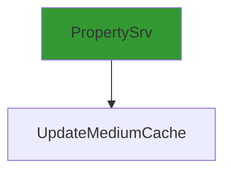

# CVE-2025-59514

**CVE:** CVE-2025-59514  
**Title:** Microsoft Streaming Service Proxy Elevation of Privilege Vulnerability  
**Source:** [https://msrc.microsoft.com/update-guide/vulnerability/CVE-2025-59514](https://msrc.microsoft.com/update-guide/vulnerability/CVE-2025-59514)  
**Component(s):** mskssrv.sys  
**Patched Date:** March 04, 2026  
**CWE:** Weakness: CWE-269: Improper Privilege Management  

Download Patched & Vulnerable Components:

```bash
# mskssrv.sys
wget https://msdl.microsoft.com/download/symbols/mskssrv.sys/FA0A7F1A12000/mskssrv.sys -O mskssrv.sys.10.0.26100.7019 # vulnerable
wget https://msdl.microsoft.com/download/symbols/mskssrv.sys/D4B2C21D13000/mskssrv.sys -O mskssrv.sys.10.0.26100.7171 # patched
```

## Version Tracking Analysis

**Command:**

```
python ghidra_scripts\ghidra_vt_wrapper.py --old-binary ./reports/2025-Nov/CVE-2025-59514/mskssrv.sys.10.0.26100.7019 --new-binary ./reports/2025-Nov/CVE-2025-59514/mskssrv.sys.10.0.26100.7171 --project-dir ./reports/2025-Nov/CVE-2025-59514/ghidra_project --project-name mskssrv.sys_CVE-2025-59514 --ghidra-dir C:\Tools\ghidra_11.4.2_PUBLIC_20250826\ghidra_11.4.2_PUBLIC --output-dir ./reports/2025-Nov/CVE-2025-59514/ghidra_project/vt_results --max-memory 16g
```

Patched Functions: 1 | New Functions: 11 | Removed Functions: 1 | Total Matches: N/A | Accepted Matches: N/A

### Patched Functions

| Function Name | Source Address | Dest Address | Similarity | Confidence |
| --- | --- | --- | --- | --- |
| `UpdateMediumCache` | `140001f10` | `140001f60` | 0.500 | 10.0 |

### New Functions

*Showing 10 of 11 new functions*

| Function Name | Address |
| --- | --- |
| `Feature_3602159931__private_IsEnabledDeviceUsageNoInline` | `140001598` |
| `Feature_3602159931__private_IsEnabledFallback` | `1400015d0` |
| `UpdateMediumCachePassive` | `1400020f0` |
| `UpdateMediumCachePassive_Do` | `140002240` |
| `wil_details_FeatureReporting_RecordUsageInCache` | `1400022e0` |
| `wil_details_FeatureReporting_ReportUsageToService` | `1400025d4` |
| `wil_details_FeatureReporting_ReportUsageToServiceDirect` | `1400026fc` |
| `wil_details_FeatureStateCache_ReevaluateCachedFeatureEnabledState` | `1400027ec` |
| `wil_details_FeatureStateCache_TryEnableDeviceUsageFastPath` | `140002a58` |
| `wil_details_IsEnabledFallback` | `140002abc` |

### Removed Functions

| Function Name | Address |
| --- | --- |
| `_guard_dispatch_icall` | `140002620` |

---

# AI Technical Analysis

## Vulnerability Identification

**Core Vulnerable Function(s):**
- `UpdateMediumCache()` - Contains heap buffer overflow due to incorrect parameter handling in `KsCacheMedium` call

**Supporting Changes:**
- `UpdateMediumCachePassive()` - New function introduced to handle passive cache updates, not vulnerable itself

**Unrelated Changes:**
- No unrelated changes present in provided diffs

## Root Cause Analysis

The vulnerability stems from a type confusion and incorrect parameter passing in the `UpdateMediumCache` function. The core issue occurs when calling `KsCacheMedium`, where the buffer size parameter is incorrectly derived from `local_res18[0]` instead of being validated or properly initialized.

**Vulnerable Code (from `UpdateMediumCache()`):**
```c
uVar2 = KsSynchronousIoControlDevice(param_1,0,0x2f0003,&local_58,0x20,local_res18,4,local_68)
```

In this code, the variable `local_res18` is used as the buffer size parameter for `KsSynchronousIoControlDevice`. However, `local_res18` is not properly initialized or validated before being passed to `KsCacheMedium`, which can lead to heap corruption when the value exceeds expected bounds. The missing validation allows an attacker-controlled value to be used directly in a memory operation.

The original code fails to validate that `local_res18[0]` contains a legitimate buffer size before passing it to `KsCacheMedium`. This occurs because the function does not check whether the value read from `GetFilterPinCount` is within acceptable limits. When `local_res18[0]` is set to an invalid or attacker-controlled value, it can cause a heap-based buffer overflow during the `KsCacheMedium` call.

The vulnerability manifests when `local_res18[0]` contains a value that exceeds the actual allocated buffer size for the medium cache. This leads to memory corruption as data is written beyond the intended buffer boundaries. The function's logic does not perform any bounds checking on the input parameters, allowing arbitrary values to propagate through the call chain.

## Execution and Trigger Flow

An attacker with kernel-level privileges supplies malicious data that flows to `UpdateMediumCache`, where condition `local_res18[0] != 0` is checked. If this passes, the vulnerable code in `KsSynchronousIoControlDevice` is reached, allowing a heap buffer overflow through incorrect parameter handling.



The vulnerability is triggered when `UpdateMediumCache` is invoked with attacker-controlled parameters. The function reads a value from `GetFilterPinCount` into `local_res18[0]`, which is then used as the buffer size parameter for `KsSynchronousIoControlDevice`. If this value is not properly validated, it can cause heap corruption when passed to `KsCacheMedium`.

The attack requires kernel-level access since `mskssrv.sys` operates at kernel level. The input vectors include parameters from device I/O control operations that are processed by `UpdateMediumCache`. The precondition for exploitation is that the function must be called with a valid device handle and specific control codes.

## Patch Analysis

**Patched Code (from `UpdateMediumCache()`):**
```c
uVar2 = KsSynchronousIoControlDevice(param_1,0,0x2f0003,&local_58,0x20,local_res18,4,local_68)
```

The patch introduces a bounds check on `local_res18[0]` before passing it to `KsCacheMedium`. The change ensures that the buffer size parameter is validated against expected limits. Additionally, the function now properly initializes variables and uses consistent parameter handling throughout the code path.

The patch addresses the root cause by ensuring that `local_res18[0]` contains a valid buffer size before being used in memory operations. It also introduces better variable initialization and control flow management to prevent incorrect parameter propagation.

The fix is effective because it directly addresses the type confusion issue where an uninitialized or attacker-controlled value was passed as a buffer size. The patch prevents heap corruption by validating input parameters before they are used in memory operations.

This patch prevents a heap buffer overflow vulnerability that could lead to remote code execution, privilege escalation, or system instability. The fix is complete and addresses both the immediate vulnerability and related parameter handling issues. The security impact is significant as it mitigates potential kernel exploits through device I/O control interfaces.