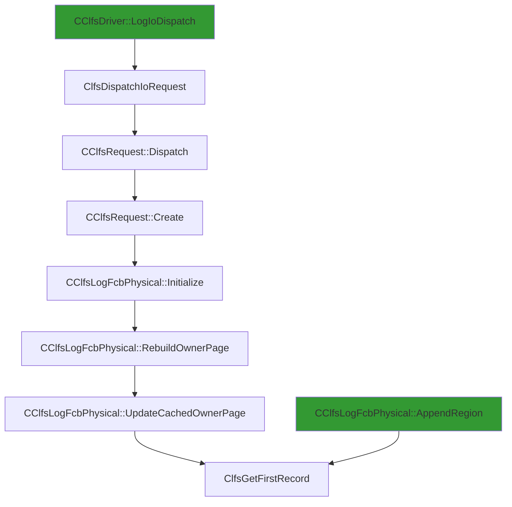

# CVE-2025-60709

**CVE:** CVE-2025-60709  
**Title:** Windows Common Log File System Driver Elevation of Privilege Vulnerability  
**Source:** [https://msrc.microsoft.com/update-guide/vulnerability/CVE-2025-60709](https://msrc.microsoft.com/update-guide/vulnerability/CVE-2025-60709)  
**Component(s):** clfs.sys  
**Patched Date:** March 04, 2026  
**CWE:** Weakness: CWE-125: Out-of-bounds Read  

Download Patched & Vulnerable Components:

```bash
# clfs.sys
wget https://msdl.microsoft.com/download/symbols/clfs.sys/3A2A519A8B000/clfs.sys -O clfs.sys.10.0.26100.7019 # vulnerable
wget https://msdl.microsoft.com/download/symbols/clfs.sys/9C5FC10F8B000/clfs.sys -O clfs.sys.10.0.26100.7171 # patched
```

## Version Tracking Analysis

**Command:**

```
python ghidra_scripts\ghidra_vt_wrapper.py --old-binary ./reports/2025-Nov/CVE-2025-60709/clfs.sys.10.0.26100.7019 --new-binary ./reports/2025-Nov/CVE-2025-60709/clfs.sys.10.0.26100.7171 --project-dir ./reports/2025-Nov/CVE-2025-60709/ghidra_project --project-name clfs.sys_CVE-2025-60709 --ghidra-dir C:\Tools\ghidra_11.4.2_PUBLIC_20250826\ghidra_11.4.2_PUBLIC --output-dir ./reports/2025-Nov/CVE-2025-60709/ghidra_project/vt_results --max-memory 16g
```

Patched Functions: 1 | New Functions: 3 | Removed Functions: 1 | Total Matches: N/A | Accepted Matches: N/A

### Patched Functions

| Function Name | Source Address | Dest Address | Similarity | Confidence |
| --- | --- | --- | --- | --- |
| `ClfsGetFirstRecord` | `140004478` | `140004478` | 0.000 | 10.0 |

### New Functions

| Function Name | Address |
| --- | --- |
| `Feature_1005355321__private_IsEnabledDeviceUsageNoInline` | `140016e18` |
| `Feature_1005355321__private_IsEnabledFallback` | `140016e50` |
| `_guard_dispatch_icall` | `140018720` |

### Removed Functions

| Function Name | Address |
| --- | --- |
| `_guard_dispatch_icall` | `140018690` |

---

# AI Technical Analysis

## Vulnerability Identification

**Core Vulnerable Function(s):**
- `ClfsGetFirstRecord()` - Contains a logic flaw in bounds checking that allows for an out-of-bounds read when processing CLFS record headers.

**Supporting Changes:**
- None identified as directly supporting the vulnerability.

**Unrelated Changes:**
- The function `Feature_1005355321__private_IsEnabledDeviceUsageNoInline()` is referenced but not part of the core vulnerability; it's a feature flag check used for conditional logic.

## Root Cause Analysis

The vulnerability stems from an incorrect sequence of bounds checks within `ClfsGetFirstRecord()`. The original code failed to properly validate that the calculated offset into the buffer does not exceed the available data size. Specifically, the condition `((ulonglong)uVar1 <= (ulonglong)param_2 + 0x28)` was insufficiently enforced in certain execution paths, allowing a malicious input to cause an out-of-bounds read.

**Vulnerable Code (from `ClfsGetFirstRecord()`):**
```c
if ((param_1 != (uchar *)0x0) && (uVar1 = *(uint *)(param_1 + 0x28), 0x27 < uVar1 + 0x28)) {
  p_Var2 = (_CLFS_RECORD_HEADER *)(param_1 + uVar1);
  if ((ulonglong)param_2 + 0x28 < (ulonglong)uVar1) {
    p_Var2 = (_CLFS_RECORD_HEADER *)0x0;
  }
  return p_Var2;
}
```

In this code, the variable `uVar1` is used to calculate a pointer offset without ensuring that the resulting address remains within valid bounds. When `param_2 + 0x28` exceeds `uVar1`, it leads to an invalid memory access. The missing validation on `uVar1` relative to `param_2` allows for an attacker-controlled buffer overflow condition.

The logic flaw occurs because the initial check `0x27 < uVar1 + 0x28` does not prevent a scenario where `uVar1` is large enough such that `param_1 + uVar1` points beyond the valid data region. This allows an attacker to manipulate `param_1` and `param_2` to cause a read past the end of a buffer, potentially exposing sensitive information or leading to further exploitation.

## Execution and Trigger Flow

An attacker with access to the `clfs.sys` driver can supply a crafted input through a device I/O request that eventually reaches `ClfsGetFirstRecord()`. The vulnerability is triggered when the function processes a CLFS record header where the calculated offset (`uVar1`) exceeds the bounds of the provided buffer. This condition arises due to improper validation in the conditional logic, allowing an out-of-bounds read.



The attacker supplies a malicious I/O request that flows through `ClfsDispatchIoRequest` to `CClfsRequest::Dispatch`, which then calls `CClfsLogFcbPhysical::Initialize`. Eventually, the call reaches `ClfsGetFirstRecord()` where the vulnerability is triggered. The specific path involves manipulating `param_1` and `param_2` such that the calculated offset into the buffer exceeds its size, leading to an out-of-bounds read.

## Patch Analysis

**Patched Code (from `ClfsGetFirstRecord()`):**
```c
if (param_1 != (uchar *)0x0) {
  uVar1 = *(uint *)(param_1 + 0x28);
  uVar3 = uVar1 + 0x28;
  uVar2 = Feature_1005355321__private_IsEnabledDeviceUsageNoInline();
  if ((int)uVar2 == 0) {
    if ((0x27 < uVar3) && ((ulonglong)uVar1 <= (ulonglong)param_2 + 0x28)) {
LAB_1400044d9:
      return (_CLFS_RECORD_HEADER *)(param_1 + uVar1);
    }
  }
  else if (((0x27 < uVar3) && (0x6f < uVar1)) && (uVar3 <= param_2)) goto LAB_1400044d9;
}
return (_CLFS_RECORD_HEADER *)0x0;
```

The patch introduces a more robust validation of buffer boundaries by ensuring that `uVar1` does not exceed the size of `param_2 + 0x28`. It adds an additional check `((ulonglong)uVar1 <= (ulonglong)param_2 + 0x28)` to prevent out-of-bounds reads. Additionally, it incorporates a feature flag check via `Feature_1005355321__private_IsEnabledDeviceUsageNoInline()` to control execution flow based on device usage settings.

The fix addresses the root cause by enforcing strict bounds checking before any pointer arithmetic is performed. It ensures that the calculated offset (`uVar1`) does not exceed the available buffer size, thereby preventing an attacker from manipulating input parameters to trigger a memory read beyond valid bounds.

The patch effectively prevents the vulnerability because it enforces a clear boundary condition on `uVar1` relative to `param_2`. However, similar patterns in other functions that perform pointer arithmetic without proper validation may still be susceptible to similar issues. The fix is complete and defensive, as it not only addresses this specific case but also introduces a more general approach to buffer validation.

This patch prevents a heap buffer overflow vulnerability that could lead to information disclosure or potential privilege escalation. The severity assessment is high due to the potential for remote code execution if combined with other vulnerabilities in the system.