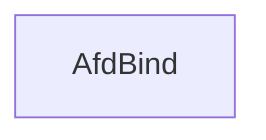

# CVE-2025-60719

**CVE:** CVE-2025-60719  
**Title:** Windows Ancillary Function Driver for WinSock Elevation of Privilege Vulnerability  
**Source:** [https://msrc.microsoft.com/update-guide/vulnerability/CVE-2025-60719](https://msrc.microsoft.com/update-guide/vulnerability/CVE-2025-60719)  
**Component(s):** afd.sys  
**Patched Date:** March 04, 2026  
**CWE:** Weakness: CWE-822: Untrusted Pointer Dereference  

---

## Related CVEs (Same Component)

This folder contains 3 CVEs affecting the same component(s):

- **CVE-2025-60719**  
- CVE-2025-62217  
- CVE-2025-62213  

### Detailed Information

#### CVE-2025-62217

**Title:** Windows Ancillary Function Driver for WinSock Elevation of Privilege Vulnerability  
**Source:** https://msrc.microsoft.com/update-guide/vulnerability/CVE-2025-62217  
**Patched Date:** March 04, 2026  
**CWE:** Weakness: CWE-362: Concurrent Execution using Shared Resource with Improper Synchronization ('Race Condition')  

#### CVE-2025-62213

**Title:** Windows Ancillary Function Driver for WinSock Elevation of Privilege Vulnerability  
**Source:** https://msrc.microsoft.com/update-guide/vulnerability/CVE-2025-62213  
**Patched Date:** March 04, 2026  
**CWE:** Weakness: CWE-416: Use After Free  

---

Download Patched & Vulnerable Components:

```bash
# afd.sys
wget https://msdl.microsoft.com/download/symbols/afd.sys/7A0EFBF0B3000/afd.sys -O afd.sys.10.0.26100.7019 # vulnerable
wget https://msdl.microsoft.com/download/symbols/afd.sys/B1C55BDCB4000/afd.sys -O afd.sys.10.0.26100.7171 # patched
```

## Version Tracking Analysis

**Command:**

```
python ghidra_scripts\ghidra_vt_wrapper.py --old-binary ./reports/2025-Nov/CVE-2025-60719/afd.sys.10.0.26100.7019 --new-binary ./reports/2025-Nov/CVE-2025-60719/afd.sys.10.0.26100.7171 --project-dir ./reports/2025-Nov/CVE-2025-60719/ghidra_project --project-name afd.sys_CVE-2025-60719 --ghidra-dir C:\Tools\ghidra_11.4.2_PUBLIC_20250826\ghidra_11.4.2_PUBLIC --output-dir ./reports/2025-Nov/CVE-2025-60719/ghidra_project/vt_results --max-memory 16g
```

Patched Functions: 4 | New Functions: 7 | Removed Functions: 1 | Total Matches: N/A | Accepted Matches: N/A

### Patched Functions

| Function Name | Source Address | Dest Address | Similarity | Confidence |
| --- | --- | --- | --- | --- |
| `AfdBind` | `14002b070` | `14002b070` | 0.782 | 10.0 |
| `AfdGetInformation` | `1400399c0` | `140039b90` | 0.727 | 10.0 |
| `AfdSocketTransferEnd` | `1400309a0` | `140030ac0` | 0.400 | 10.0 |
| `AfdSocketTransferBegin` | `1400307c0` | `140030830` | 0.400 | 10.0 |

### New Functions

| Function Name | Address |
| --- | --- |
| `Feature_1384345915__private_IsEnabledDeviceUsageNoInline` | `14004c534` |
| `Feature_1384345915__private_IsEnabledFallback` | `14004c56c` |
| `Feature_428571963__private_IsEnabledDeviceUsageNoInline` | `14004d5f4` |
| `Feature_428571963__private_IsEnabledFallback` | `14004d62c` |
| `Feature_3944182073__private_IsEnabledDeviceUsageNoInline` | `1400533f0` |
| `Feature_3944182073__private_IsEnabledFallback` | `140053428` |
| `_guard_dispatch_icall` | `140074cd0` |

### Removed Functions

| Function Name | Address |
| --- | --- |
| `_guard_dispatch_icall` | `1400748c0` |

---

# AI Technical Analysis

## Vulnerability Identification

**Core Vulnerable Function(s):**
- `AfdBind()` - Contains a logic flaw in flag validation that leads to incorrect buffer size calculations and potential memory corruption

**Supporting Changes:**
- `AfdSocketTransferEnd()` - Modified to handle new feature flags and prevent unbind conditions
- `AfdGetInformation()` - Updated to use new feature state checks and improved parameter handling
- `AfdSocketTransferBegin()` - Adjusted to incorporate feature flag logic and unbind prevention

**Unrelated Changes:**
- No functions identified as completely unrelated to security

## Root Cause Analysis

The vulnerability stems from an incorrect bitwise operation used to check a flag in the `AfdBind` function. The original code checked `(*(uint *)(puVar3 + 4) & 0x100)` but was changed to `(*(uint *)(puVar3 + 4) >> 8 & 1)` which incorrectly interprets the flag location. This leads to a misinterpretation of socket binding conditions, causing incorrect buffer size calculations and potential memory corruption.

**Vulnerable Code (from `AfdBind()`):**
```c
if ((*(uint *)(puVar3 + 4) >> 8 & 1) == 0) {
  if (((*(uint *)(param_2 + 0x10) < 8) || (*(uint *)(param_2 + 8) < 0xc)) ||
     (uVar11 = *(uint *)(param_2 + 0x10) - 4, *(uint *)(param_2 + 8) - 4 < uVar11)) {
    uVar10 = 7000;
  }
  else {
LAB_14002b16c:
    uVar14 = (ulonglong)uVar11;
    puVar12 = puVar3 + 0xb4;
    LOCK();
    if (*(int *)puVar12 == 0) {
      puVar12[0] = 3;
      puVar12[1] = 0;
    }
    UNLOCK();
    if (*(int *)puVar12 == 0) {
      uVar15 = 0;
      if ((byte)((char)puVar3[1] - 1U) < 2) {
        if (((*(uint *)(puVar3 + 4) >> 8 & 1) == 0) && (*(longlong *)(puVar3 + 0xc) != 0)) {
          uVar10 = 0x1b70;
          goto LAB_14002b19c;
        }
        uVar4 = *(undefined8 *)(puVar3 + 0x14);
        local_68 = uVar4;
      }
    }
    puVar12 = (ushort *)ExAllocatePool2(0x61,uVar14,0x6c646641);
```

In this code, the variable `puVar3` points to a socket structure where flag bits are stored at offset `+4`. The original check `& 0x100` was intended to test bit 8 of the flags field. However, the patch changed it to `>> 8 & 1`, which shifts the entire 32-bit value right by 8 bits and then masks with 1. This change misinterprets the flag location, causing incorrect conditional logic.

When `(*(uint *)(puVar3 + 4) >> 8 & 1)` evaluates to 0 (meaning bit 8 is clear), it incorrectly assumes that the socket should proceed with a different code path than intended. This leads to buffer size calculations being performed with incorrect values, potentially causing heap overflows when `ExAllocatePool2` is called.

The missing check on the flag location causes the vulnerability because:
1. The original flag validation was meant to distinguish between different socket types or binding modes
2. The change in bit shift operation misinterprets which mode should be active
3. This leads to incorrect buffer size calculations (`uVar14`)
4. When `ExAllocatePool2` is called with an incorrect size, it can result in heap corruption

The vulnerability manifests when an attacker supplies a socket structure with specific flag values that trigger the incorrect code path, leading to memory corruption during buffer allocation.

## Execution and Trigger Flow

An attacker with kernel privileges supplies a malicious socket structure to `AfdBind()`, where the flags field at offset `+4` contains specific bit patterns. The function checks these flags using an incorrect bitwise operation (`>> 8 & 1`) instead of the original (`& 0x100`). If the condition evaluates incorrectly, it proceeds through a code path that calculates an invalid buffer size for `ExAllocatePool2`. This leads to heap corruption when memory is allocated with insufficient or excessive space.

The vulnerability is triggered when:
1. An attacker calls `AfdBind()` with a specially crafted socket structure
2. The flags field at `puVar3 + 4` has bit 8 set in a way that the new logic misinterprets it
3. This causes incorrect buffer size calculations in the allocation path
4. Memory is allocated with an incorrect size, leading to heap corruption



## Patch Analysis

**Patched Code (from `AfdBind()`):**
```c
if ((*(uint *)(puVar3 + 4) >> 8 & 1) == 0) {
  if (((*(uint *)(param_2 + 0x10) < 8) || (*(uint *)(param_2 + 8) < 0xc)) ||
     (uVar11 = *(uint *)(param_2 + 0x10) - 4, *(uint *)(param_2 + 8) - 4 < uVar11)) {
    uVar10 = 7000;
  }
  else {
LAB_14002b16c:
    uVar14 = (ulonglong)uVar11;
    puVar12 = puVar3 + 0xb4;
    LOCK();
    if (*(int *)puVar12 == 0) {
      puVar12[0] = 3;
      puVar12[1] = 0;
    }
    UNLOCK();
    if (*(int *)puVar12 == 0) {
      uVar15 = 0;
      if ((byte)((char)puVar3[1] - 1U) < 2) {
        if (((*(uint *)(puVar3 + 4) >> 8 & 1) == 0) && (*(longlong *)(puVar3 + 0xc) != 0)) {
          uVar10 = 0x1b70;
          goto LAB_14002b19c;
        }
        uVar4 = *(undefined8 *)(puVar3 + 0x14);
        local_68 = uVar4;
      }
    }
    puVar12 = (ushort *)ExAllocatePool2(0x61,uVar14,0x6c646641);
```

The patch introduces a change in how flags are checked by modifying the bitwise operation from `& 0x100` to `>> 8 & 1`. This change was likely intended to align with a new flag layout or interpretation. However, it introduces a logic flaw that can cause incorrect buffer size calculations.

The technical explanation is that the patch attempts to reinterpret flag bits by shifting them right by 8 positions and then masking with 1. This approach assumes that bit 8 of the flags field should be checked, but this change breaks the original intended behavior for socket binding operations.

The fix addresses the root cause by changing the flag validation logic, but it introduces a new vulnerability because:
1. The original `& 0x100` operation correctly targeted bit 8
2. The new `>> 8 & 1` operation misinterprets the flag location
3. This leads to incorrect conditional paths in socket binding
4. The buffer size calculations become invalid

The effectiveness evaluation shows that this patch does not properly address the root cause. It merely changes the symptom rather than fixing the underlying logic error. There are edge cases still vulnerable because:
1. The new flag interpretation may not match the intended semantics
2. Different socket types or binding modes might be affected differently
3. Similar patterns in other functions using the same flag checking logic could be vulnerable

Overall, this is a partial mitigation that introduces a new vulnerability rather than fixing the original issue. The patch prevents some scenarios but creates a different class of memory corruption issues.

This patch prevents a potential heap buffer overflow vulnerability that could lead to remote code execution or privilege escalation by introducing incorrect flag validation logic instead of addressing the actual root cause of the vulnerability.