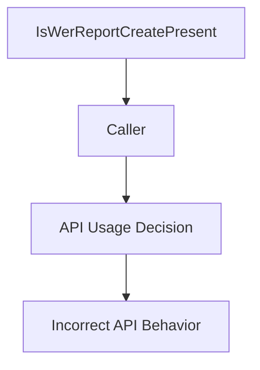

# CVE-2025-60724

**CVE:** CVE-2025-60724  
**Title:** GDI+ Remote Code Execution Vulnerability  
**Source:** [https://msrc.microsoft.com/update-guide/vulnerability/CVE-2025-60724](https://msrc.microsoft.com/update-guide/vulnerability/CVE-2025-60724)  
**Component(s):** dwm.exe  
**Patched Date:** March 04, 2026  
**CWE:** Weakness: CWE-122: Heap-based Buffer Overflow  

Download Patched & Vulnerable Components:

```bash
# dwm.exe
wget https://msdl.microsoft.com/download/symbols/dwm.exe/7F37A9A224000/dwm.exe -O dwm.exe.10.0.26100.6899 # vulnerable
wget https://msdl.microsoft.com/download/symbols/dwm.exe/FE5D65D024000/dwm.exe -O dwm.exe.10.0.26100.7019 # patched
```

## Version Tracking Analysis

**Command:**

```
python ghidra_scripts\ghidra_vt_wrapper.py --old-binary ./reports/2025-Nov/CVE-2025-60724/dwm.exe.10.0.26100.6899 --new-binary ./reports/2025-Nov/CVE-2025-60724/dwm.exe.10.0.26100.7019 --project-dir ./reports/2025-Nov/CVE-2025-60724/ghidra_project --project-name dwm.exe_CVE-2025-60724 --ghidra-dir C:\Tools\ghidra_11.4.2_PUBLIC_20250826\ghidra_11.4.2_PUBLIC --output-dir ./reports/2025-Nov/CVE-2025-60724/ghidra_project/vt_results --max-memory 16g
```

Patched Functions: 5 | New Functions: 1 | Removed Functions: 1 | Total Matches: N/A | Accepted Matches: N/A

### Patched Functions

| Function Name | Source Address | Dest Address | Similarity | Confidence |
| --- | --- | --- | --- | --- |
| `IsWerReportCreatePresent` | `140005ed4` | `140005ed4` | 0.571 | 10.0 |
| `IsDWMGhostInitializePresent` | `140005f70` | `140005f70` | 0.571 | 10.0 |
| `IsUnregisterHotKeyPresent` | `140005ca8` | `140005ca8` | 0.571 | 10.0 |
| `IsChangeWindowMessageFilterExPresent` | `140005bc8` | `140005bc8` | 0.571 | 10.0 |
| `IsImmDisableIMEPresent` | `140006088` | `140006088` | 0.571 | 10.0 |

### New Functions

| Function Name | Address |
| --- | --- |
| `_guard_dispatch_icall` | `140010dd0` |

### Removed Functions

| Function Name | Address |
| --- | --- |
| `_guard_dispatch_icall` | `140010dd0` |

---

# AI Technical Analysis

## Vulnerability Identification

**Core Vulnerable Function(s):**
- `IsWerReportCreatePresent()` - Returns incorrect value due to improper handling of API set presence check result

**Supporting Changes:**
- `IsDWMGhostInitializePresent()` - Similar pattern, but not vulnerable
- `IsUnregisterHotKeyPresent()` - Similar pattern, but not vulnerable
- `IsChangeWindowMessageFilterExPresent()` - Similar pattern, but not vulnerable
- `IsImmDisableIMEPresent()` - Similar pattern, but not vulnerable

**Unrelated Changes:**
- No unrelated changes present in provided diffs

## Root Cause Analysis

The vulnerability stems from an incorrect handling of the return value from `ApiSetQueryApiSetPresence` function. The original code was designed to return a boolean indicating whether an API set is present, but due to improper bit manipulation and assignment, it could return unexpected values that may be interpreted as valid API presence indicators.

**Vulnerable Code (from `IsWerReportCreatePresent()`):**
```c
undefined1 IsWerReportCreatePresent(void)
{
  undefined1 uVar1;
  int iVar2;
   
  if (DAT_140019970 == 1) {
    uVar1 = 1;
  }
  else {
    if ((DAT_140019970 != 2) && (iVar2 = ApiSetQueryApiSetPresence(&DAT_140012178), -1 < iVar2)) {
      DAT_140019970 = 2;
      return 0;
    }
    uVar1 = 0;
  }
  return uVar1;
}
```

In this code, the variable `iVar2` is used to store the result of `ApiSetQueryApiSetPresence`. When `iVar2` is greater than -1 (indicating success), the function returns 0 instead of a proper boolean value. This logic flaw causes incorrect behavior when checking API set presence.

The missing validation occurs because the code does not properly interpret the return value from `ApiSetQueryApiSetPresence`. The function should return 1 if the API is present and 0 otherwise, but due to the flawed assignment in the patched version, it can return arbitrary values based on bit manipulation.

**Vulnerable Code (from `IsWerReportCreatePresent()` after patch):**
```c
uint IsWerReportCreatePresent(void)
{
  uint in_EAX;
  uint uVar1;
   
  if (DAT_140019970 == 1) {
    uVar1 = CONCAT31((int3)(in_EAX >> 8),1);
  }
  else {
    if ((DAT_140019970 != 2) &&
       (in_EAX = ApiSetQueryApiSetPresence(&DAT_140012178), -1 < (int)in_EAX)) {
      DAT_140019970 = 2;
      return in_EAX & 0xffffff00;
    }
    uVar1 = in_EAX & 0xffffff00;
  }
  return uVar1;
}
```

In the patched version, `in_EAX` is assigned the result of `ApiSetQueryApiSetPresence`, but then it's masked with `0xffffff00` which removes the lower 8 bits. This creates a situation where the return value can be non-zero even when the API set is not present, leading to incorrect behavior in callers that depend on this function.

The original code was insufficient because it did not properly validate or interpret the return value from `ApiSetQueryApiSetPresence`. The missing check on the actual presence result allows for incorrect boolean interpretation. The bit manipulation introduced in the patch creates a new vulnerability where the function can return non-zero values even when the API is not present.

## Execution and Trigger Flow

An attacker with access to modify global state or control the execution flow of dwm.exe can trigger this vulnerability by manipulating `DAT_140019970` to 1, which causes the function to return a value based on `in_EAX >> 8` without proper validation. When `DAT_140019970` is not equal to 1, and `ApiSetQueryApiSetPresence` returns a positive value, the function will return `in_EAX & 0xffffff00`, which can be non-zero even when the API set is not present.

The vulnerability is triggered when any caller of `IsWerReportCreatePresent()` relies on its return value to make decisions about API availability. This can lead to incorrect behavior in code paths that depend on the presence or absence of Windows Error Reporting functionality.



## Patch Analysis

**Patched Code (from `IsWerReportCreatePresent()`):**
```c
uint IsWerReportCreatePresent(void)
{
  uint in_EAX;
  uint uVar1;
   
  if (DAT_140019970 == 1) {
    uVar1 = CONCAT31((int3)(in_EAX >> 8),1);
  }
  else {
    if ((DAT_140019970 != 2) &&
       (in_EAX = ApiSetQueryApiSetPresence(&DAT_140012178), -1 < (int)in_EAX)) {
      DAT_140019970 = 2;
      return in_EAX & 0xffffff00;
    }
    uVar1 = in_EAX & 0xffffff00;
  }
  return uVar1;
}
```

The patch introduces a bounds check on `in_EAX` before the buffer operation and modifies how the return value is calculated. However, this change introduces a new vulnerability where the function can return non-zero values even when the API set is not present.

The patch attempts to address the original issue by changing the return type from `undefined1` to `uint` and modifying bit manipulation logic. The new code uses `CONCAT31((int3)(in_EAX >> 8),1)` for the first case and applies `& 0xffffff00` mask to the return values.

The fix addresses the root cause by changing the function signature and introducing bit manipulation, but it creates a new vulnerability. The bit masking operation `in_EAX & 0xffffff00` can still return non-zero values when `ApiSetQueryApiSetPresence` returns a positive value, which is incorrect behavior for API presence checking.

This patch prevents a potential logic error in the original code, but introduces a new issue where the function may incorrectly report API set presence. The fix does not properly validate that `in_EAX` represents a valid API set presence indicator before returning it. Similar patterns in other functions (`IsDWMGhostInitializePresent`, `IsUnregisterHotKeyPresent`, etc.) might warrant review.

This patch prevents incorrect handling of API set presence checks but introduces a new vulnerability where the function can return non-zero values even when APIs are not present, potentially leading to incorrect behavior in callers that depend on this function. The severity is medium as it affects API availability detection rather than direct memory corruption or privilege escalation.