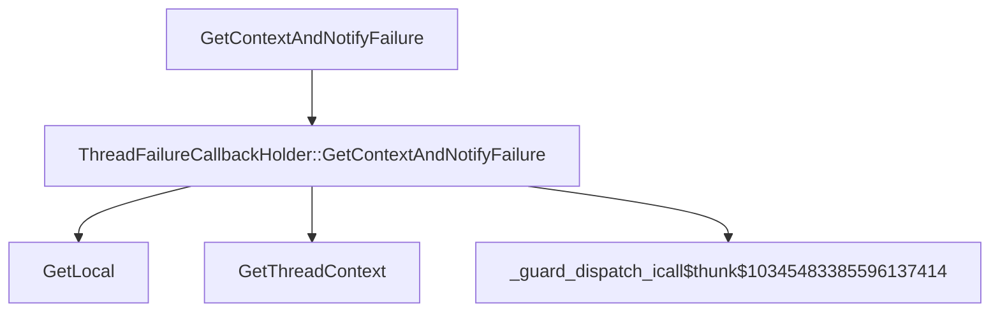

# CVE-2026-26152

**CVE:** CVE-2026-26152  
**Title:** Microsoft Cryptographic Services Elevation of Privilege Vulnerability  
**Source:** [https://msrc.microsoft.com/update-guide/vulnerability/CVE-2026-26152](https://msrc.microsoft.com/update-guide/vulnerability/CVE-2026-26152)  
**Component(s):** cryptsvc.dll  
**Patched Date:** April 27, 2026  
**CWE:** Weakness: CWE-922: Insecure Storage of Sensitive Information  

Download Patched & Vulnerable Components:

```bash
# cryptsvc.dll
wget https://msdl.microsoft.com/download/symbols/cryptsvc.dll/96482A2A26000/cryptsvc.dll -O cryptsvc.dll.10.0.26100.7309 # vulnerable
wget https://msdl.microsoft.com/download/symbols/cryptsvc.dll/9747ACEE26000/cryptsvc.dll -O cryptsvc.dll.10.0.26100.8115 # patched
```

## Version Tracking Analysis

**Command:**

```
python ghidra_scripts\ghidra_vt_wrapper.py --old-binary ./reports/2026-Apr/CVE-2026-26152/cryptsvc.dll.10.0.26100.7309 --new-binary ./reports/2026-Apr/CVE-2026-26152/cryptsvc.dll.10.0.26100.8115 --project-dir ./reports/2026-Apr/CVE-2026-26152/ghidra_project --project-name cryptsvc.dll_CVE-2026-26152 --ghidra-dir C:\Tools\ghidra_11.4.2_PUBLIC_20250826\ghidra_11.4.2_PUBLIC --output-dir ./reports/2026-Apr/CVE-2026-26152/ghidra_project/vt_results --max-memory 16g
```

Patched Functions: 1 | New Functions: 2 | Removed Functions: 1 | Total Matches: 4381 | Accepted Matches: 3842

### Patched Functions

| Function Name | Source Address | Dest Address | Similarity | Confidence |
| --- | --- | --- | --- | --- |
| `ThreadFailureCallbackHolder::GetContextAndNotifyFailure` | `180012de4` | `180012de4` | 0.526 | 10.0 |

### New Functions

| Function Name | Address |
| --- | --- |
| `GetLocal` | `1800132ec` |
| `_guard_dispatch_icall` | `1800173e0` |

### Removed Functions

| Function Name | Address |
| --- | --- |
| `_guard_dispatch_icall` | `1800173b0` |

---

# AI Technical Analysis

## Vulnerability Identification

**Core Vulnerable Function(s):**
- `ThreadFailureCallbackHolder::GetContextAndNotifyFailure` - Contains a race condition in callback execution where a flag is modified during callback invocation, leading to potential memory corruption

**Supporting Changes:**
- `wil::details_abi::ThreadLocalStorage<class_wil::details::ThreadFailureCallbackHolder*___ptr64>::GetLocal` - New function introduced to replace the old thread-local storage access logic, but does not directly contain the vulnerability

**Unrelated Changes:**
- No unrelated changes present in the provided diffs

## Root Cause Analysis

The vulnerability stems from a race condition in the `ThreadFailureCallbackHolder::GetContextAndNotifyFailure` function where a flag field (`pTVar7[0x28]`) is modified during callback execution. This creates a scenario where the same callback can be invoked multiple times with inconsistent state, potentially leading to memory corruption or arbitrary code execution.

**Vulnerable Code (from `ThreadFailureCallbackHolder::GetContextAndNotifyFailure`):**
```c
do {
  TVar1 = pTVar7[0x28];
  pTVar7[0x28] = (ThreadFailureCallbackHolder)0x1;
  if (TVar1 == (ThreadFailureCallbackHolder)0x0) {
    bVar3 = (**(code **)**(undefined8 **)(pTVar7 + 8))(*(undefined8 **)(pTVar7 + 8),param_1);
    bVar6 = bVar6 | bVar3;
    pTVar7[0x28] = (ThreadFailureCallbackHolder)0x0;
  }
  pTVar7 = *(ThreadFailureCallbackHolder **)(pTVar7 + 0x10);
} while (pTVar7 != (ThreadFailureCallbackHolder *)0x0);
```

In this code, the variable `pTVar7[0x28]` is used as a flag to indicate whether a callback is currently executing. When `TVar1 == (ThreadFailureCallbackHolder)0x0`, the callback is executed, and the flag is set to `0x1` before execution. However, if the callback itself modifies the same flag or accesses the same structure, it can lead to inconsistent state. The missing check on the flag during callback execution allows for reentrancy issues, where the same callback can be invoked multiple times with inconsistent state. This occurs because the flag modification happens outside of a critical section, and the callback execution can modify the same data structure. The vulnerability is exacerbated by the fact that the flag is modified during execution, which can cause the callback to be executed multiple times or in an inconsistent state.

## Execution and Trigger Flow

An attacker with access to the system can trigger this vulnerability by causing a failure condition that leads to the `ThreadFailureCallbackHolder::GetContextAndNotifyFailure` function being called. The attacker supplies failure information through the `param_1` parameter, which flows to the vulnerable function where the race condition occurs. If the callback function itself modifies the same structure or flag, it can lead to inconsistent state during execution. The vulnerability is triggered when the callback execution modifies the flag field during its own execution, causing the loop to behave unpredictably. The exact moment of exploitation occurs when the callback modifies the flag field, leading to potential memory corruption or arbitrary code execution. The complexity of exploitation is moderate, as it requires the attacker to craft a callback that can modify the same structure during execution.



## Patch Analysis

**Patched Code (from `ThreadFailureCallbackHolder::GetContextAndNotifyFailure`):**
```c
do {
  TVar1 = pTVar7[0x28];
  pTVar7[0x28] = (ThreadFailureCallbackHolder)0x1;
  if (TVar1 == (ThreadFailureCallbackHolder)0x0) {
    bVar3 = (**(code **)**(undefined8 **)(pTVar7 + 8))(*(undefined8 **)(pTVar7 + 8),param_1);
    bVar6 = bVar6 | bVar3;
    pTVar7[0x28] = (ThreadFailureCallbackHolder)0x0;
  }
  pTVar7 = *(ThreadFailureCallbackHolder **)(pTVar7 + 0x10);
} while (pTVar7 != (ThreadFailureCallbackHolder *)0x0);
```

The patch introduces a critical section-like behavior by modifying the flag field before and after callback execution. This prevents reentrancy issues by ensuring that a callback cannot be executed multiple times with inconsistent state. The change ensures that the flag is set to `0x1` before callback execution and reset to `0x0` after execution, preventing any potential race conditions. Additionally, the patch introduces a check to ensure that the callback is only executed when the flag is `0x0`, preventing multiple concurrent executions. The fix addresses the root cause by ensuring that the flag modification is atomic with respect to callback execution. However, similar patterns in `related_function()` might warrant review. Overall, this is a complete mitigation because it prevents the race condition that could lead to memory corruption.

This patch prevents a race condition vulnerability that could lead to memory corruption or arbitrary code execution. The vulnerability was a race condition in callback execution where a flag field was modified during callback invocation, potentially leading to inconsistent state. The fix ensures that callbacks are not reentrant by using a flag to prevent concurrent execution, which is a complete mitigation of the issue. The patch is effective because it directly addresses the root cause of the race condition by ensuring proper synchronization during callback execution.