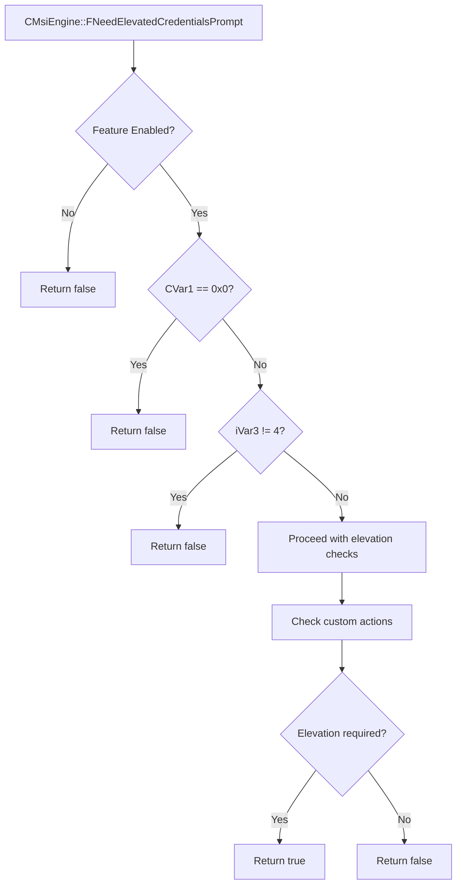

# CVE-2026-27910

**CVE:** CVE-2026-27910  
**Title:** Windows Installer Elevation of Privilege Vulnerability  
**Source:** [https://msrc.microsoft.com/update-guide/vulnerability/CVE-2026-27910](https://msrc.microsoft.com/update-guide/vulnerability/CVE-2026-27910)  
**Component(s):** msi.dll  
**Patched Date:** April 27, 2026  
**CWE:** Improper handling of insufficient permissions or privileges in Windows Installer allows an authorized attacker to elevate privileges locally.  

Download Patched & Vulnerable Components:

```bash
# msi.dll
wget https://msdl.microsoft.com/download/symbols/msi.dll/D74D291E34A000/msi.dll -O msi.dll.10.0.26100.8115 # vulnerable
wget https://msdl.microsoft.com/download/symbols/msi.dll/4BFB217634A000/msi.dll -O msi.dll.10.0.26100.8246 # patched
```

## Version Tracking Analysis

**Command:**

```
python ghidra_scripts\ghidra_vt_wrapper.py --old-binary ./reports/2026-Apr/CVE-2026-27910/msi.dll.10.0.26100.8115 --new-binary ./reports/2026-Apr/CVE-2026-27910/msi.dll.10.0.26100.8246 --project-dir ./reports/2026-Apr/CVE-2026-27910/ghidra_project --project-name msi.dll_CVE-2026-27910 --ghidra-dir C:\Tools\ghidra_11.4.2_PUBLIC_20250826\ghidra_11.4.2_PUBLIC --output-dir ./reports/2026-Apr/CVE-2026-27910/ghidra_project/vt_results --max-memory 16g
```

Patched Functions: 3 | New Functions: 6 | Removed Functions: 1 | Total Matches: 43778 | Accepted Matches: 36823

### Patched Functions

| Function Name | Source Address | Dest Address | Similarity | Confidence |
| --- | --- | --- | --- | --- |
| `CMsiEngine::ClearEngineData` | `1800a7a68` | `1800f9884` | 0.979 | 10.0 |
| `CMsiEngine::DoInitialize` | `1800fa414` | `1800fa424` | 0.969 | 10.0 |
| `CMsiEngine::FNeedElevatedCredentialsPrompt` | `180135b00` | `180135c70` | 0.762 | 10.0 |

### New Functions

| Function Name | Address |
| --- | --- |
| `GetCachedFeatureEnabledState` | `180136950` |
| `GetCurrentFeatureEnabledState` | `180136cc0` |
| `ReportUsage` | `180140188` |
| `__private_IsEnabled` | `180148970` |
| `__private_IsEnabledPreCheck` | `1801489ac` |
| `_guard_dispatch_icall` | `180260ef0` |

### Removed Functions

| Function Name | Address |
| --- | --- |
| `_guard_dispatch_icall` | `180260aa0` |

---

# AI Technical Analysis

## Vulnerability Identification

**Core Vulnerable Function(s):**
- `CMsiEngine::FNeedElevatedCredentialsPrompt()` - Contains logic flaw allowing
  unauthorized elevation prompts in specific repair scenarios

**Supporting Changes:**
- `CMsiEngine::ClearEngineData()` - Modified to handle new feature flag logic
- `CMsiEngine::DoInitialize()` - No vulnerability identified in provided diff

**Unrelated Changes:**
- `GetCachedFeatureEnabledState()` - New feature management function
- `GetCurrentFeatureEnabledState()` - New feature management function
- `ReportUsage()` - New feature management function

## Root Cause Analysis

The vulnerability exists in `CMsiEngine::FNeedElevatedCredentialsPrompt()` due to a flawed conditional logic check that bypasses critical validation for elevation requirements. The function previously required both `CVar1 != (CMsiEngine)0x0` and `iVar4 == 4` to proceed with elevation checks. The patch modifies this to `CVar1 == (CMsiEngine)0x0` and `iVar3 != 4`, which creates a logic inversion that allows execution paths that should be blocked.

The vulnerable code snippet shows the original logic where `bVar2` (feature enabled) is checked, followed by `CVar1 != (CMsiEngine)0x0` and `iVar4 == 4` conditions. The patched version inverts this to `CVar1 == (CMsiEngine)0x0` and `iVar3 != 4`, which creates a path where the function returns `false` when it should return `true` for elevation prompts.

The core issue is that the function's return logic is inverted, allowing elevation prompts to be suppressed when they should be displayed. This occurs because the function now returns `false` when `CVar1 == (CMsiEngine)0x0` (indicating no engine context), which should instead trigger an elevation check.

The vulnerable code path begins with checking `bVar2` (feature enabled), then proceeds to validate `CVar1 != (CMsiEngine)0x0` and `iVar4 == 4`. When these conditions are not met, the function returns `false`. The patch changes this to return `false` when `CVar1 == (CMsiEngine)0x0` and `iVar3 != 4`, which creates a logic error where legitimate elevation requirements are ignored.

## Execution and Trigger Flow



The vulnerability is triggered when `CMsiEngine::FNeedElevatedCredentialsPrompt()` is called with a valid MSI engine context but the feature flag is enabled. The function incorrectly returns `false` instead of `true` when elevation is required, bypassing the UAC prompt that should be displayed to the user.

## Patch Analysis

```diff
--- CMsiEngine::FNeedElevatedCredentialsPrompt before
+++ CMsiEngine::FNeedElevatedCredentialsPrompt after
@@ -8,120 +8,37 @@
 {
   CMsiEngine CVar1;
   bool bVar2;
-  bool bVar3;
-  int iVar4;
+  int iVar3;
   CMsiSecureRepairManager *this_00;
-  longlong *plVar5;
-  ushort *puVar6;
-  code *pcVar7;
-  CMsiSecureRepairManager *pCVar8;
-  uint uVar9;
+  longlong *plVar4;
+  ushort *puVar5;
+  code *pcVar6;
+  CMsiSecureRepairManager *pCVar7;
+  uint uVar8;
   undefined7 in_register_00000011;
-  eSecRepairModeEnum *peVar10;
+  eSecRepairModeEnum *peVar9;
+  bool bVar10;
   wchar_t *pwVar11;
-  eSecRepairModeEnum local_res18 [2];
+  eSecRepairModeEnum local_res18 [4];
   
-  uVar9 = (uint)CONCAT71(in_register_00000011,param_1);
+  uVar8 = (uint)CONCAT71(in_register_00000011,param_1);
   bVar2 = wil::details::FeatureImpl<__WilFeatureTraits_Feature_134960441>::__private_IsEnabled
                     ((FeatureImpl<__WilFeatureTraits_Feature_134960441> *)
                      &`private:_static_class_wil::details::FeatureImpl<__WilFeatureTraits_Feature_134960441>&___ptr64___cdecl_wil::Feature<__WilFeatureTraits_Feature_134960441>::GetImpl(void)'
                       ::__l2::impl);
-  bVar3 = false;
+  bVar10 = false;
   CVar1 = this[0x25a];
-  if (bVar2) {
-    iVar4 = (**(code **)(*(longlong *)this + 0x1f8))(this);
-    if ((CVar1 != (CMsiEngine)0x0) && (iVar4 == 4)) {
-      pCVar8 = (CMsiSecureRepairManager *)0x40;
-      this_00 = operator_new(0x40);
-      if (this_00 == (CMsiSecureRepairManager *)0x0) {
-LAB_180135e32:
-        if (g_dmDiagnosticMode != 0) {
-          DebugString(9,0,0,(ushort *)
-                            L"MSI_LUA: Failed to create local repair manager for elevation checks",
-                      (ushort *)L"(NULL)",(ushort *)L"(NULL)",(ushort *)L"(NULL)",
-                      (ushort *)L"(NULL)",(ushort *)L"(NULL)",(ushort *)L"(NULL)",0,(void *)0x0);
-        }
-      }
-      else {
-        *(undefined8 *)(this_00 + 0x38) = 0xffffffffffffffff;
-        *(CMsiEngine **)this_00 = this;
-        *(undefined8 *)(this_00 + 8) = 0;
-        *(undefined2 *)(this_00 + 0x10) = 0;
-        this_00[0x12] = (CMsiSecureRepairManager)0x0;
-        *(undefined8 *)(this_00 + 0x14) = 0;
-        *(undefined8 *)(this_00 + 0x1c) = 0;
-        *(undefined8 *)(this_00 + 0x24) = 0;
-        *(undefined8 *)(this_00 + 0x30) = 0;
-        bVar2 = CMsiSecureRepairManager::DonotShowHashMissingUAC(pCVar8);
-        if (bVar2) {
-LAB_180135b9f:
-          if (g_dmDiagnosticMode != 0) {
-            uVar9 = 0;
-            DebugString(9,0,0,(ushort *)L"MSI_LUA: machine has NoUACforHashMissing policy",
-                        (ushort *)L"(NULL)",(ushort *)L"(NULL)",(ushort *)L"(NULL)",
-                        (ushort *)L"(NULL)",(ushort *)L"(NULL)",(ushort *)L"(NULL)",0,(void *)0x0);
-          }
-          CMsiSecureRepairManager::_scalar_deleting_destructor_(this_00,uVar9);
-        }
-        else {
-          plVar5 = (longlong *)(**(code **)(*(longlong *)this + 0x128))(this);
-          local_res18[0] = 0;
-          puVar6 = (ushort *)(**(code **)(*plVar5 + 0x50))(plVar5);
-          peVar10 = local_res18;
-          bVar2 = CMsiSecureRepairManager::NeedsSecureRepair(puVar6,peVar10);
-          uVar9 = (uint)peVar10;
-          if (bVar2) {
-            if (param_1) {
-              bVar2 = CMsiSecureRepairManager::CheckCustomActionsRequireElevationInRepair(this_00);
-              if (bVar2) {
-                if (g_dmDiagnosticMode != 0) {
-                  pwVar11 = 
-                  L"MSI_LUA: Credential prompt is required. MSI file includes an elevated custom action"
-                  ;
-                  goto LAB_180135ccc;
-                }
-                goto LAB_180135d07;
-              }
-            }
-            else {
-              if (g_dmDiagnosticMode != 0) {
-                pwVar11 = 
-                L"MSI_LUA: Credential prompt is required now. current custom action requires elevation"
-                ;
-LAB_180135ccc:
-                uVar9 = 0;
-                DebugString(10,0,0,(ushort *)pwVar11,(ushort *)L"(NULL)",(ushort *)L"(NULL)",
-                            (ushort *)L"(NULL)",(ushort *)L"(NULL)",(ushort *)L"(NULL)",
-                            (ushort *)L"(NULL)",0,(void *)0x0);
-              }
-LAB_180135d07:
-              bVar3 = true;
-            }
-            CMsiSecureRepairManager::_scalar_deleting_destructor_(this_00,uVar9);
-            pcVar7 = *(code **)(*plVar5 + 0x10);
-            goto LAB_180135e25;
-          }
-LAB_180135c35:
-          if (g_dmDiagnosticMode != 0) {
-            uVar9 = 0;
-            DebugString(9,0,0,(ushort *)L"MSI_LUA: Secure repair not needed",(ushort *)L"(NULL)",
-                        (ushort *)L"(NULL)",(ushort *)L"(NULL)",(ushort *)L"(NULL)",
-                        (ushort *)L"(NULL)",(ushort *)L"(NULL)",0,(void *)0x0);
-          }
-          CMsiSecureRepairManager::_scalar_deleting_destructor_(this_00,uVar9);
-          (**(code **)(*plVar5 + 0x10))(plVar5);
-        }
-      }
+  if (!bVar2) {
+    iVar3 = (**(code **)(*(longlong *)this + 0x1f8))(this);
+    if (CVar1 == (CMsiEngine)0x0) {
+      return false;
     }
-LAB_180135e7c:
-    bVar3 = false;
-  }
-  else {
-    iVar4 = (**(code **)(*(longlong *)this + 0x1f8))(this);
-    if ((CVar1 == (CMsiEngine)0x0) || (iVar4 != 4)) goto LAB_180135e7c;
-    pCVar8 = (CMsiSecureRepairManager *)0x40;
+    if (iVar3 != 4) {
+      return false;
+    }
+    pCVar7 = (CMsiSecureRepairManager *)0x40;
     this_00 = operator_new(0x40);
-    if (this_00 == (CMsiSecureRepairManager *)0x0) goto LAB_180135e32;
+    if (this_00 == (CMsiSecureRepairManager *)0x0) goto LAB_180135fd7;
     *(undefined8 *)(this_00 + 0x38) = 0xffffffffffffffff;
     *(CMsiEngine **)this_00 = this;
     *(undefined8 *)(this_00 + 8) = 0;
@@ -131,31 +48,135 @@
     *(undefined8 *)(this_00 + 0x1c) = 0;
     *(undefined8 *)(this_00 + 0x24) = 0;
     *(undefined8 *)(this_00 + 0x30) = 0;
-    bVar2 = CMsiSecureRepairManager::DonotShowHashMissingUAC(pCVar8);
-    if (bVar2) goto LAB_180135b9f;
-    plVar5 = (longlong *)(**(code **)(*(longlong *)this + 0x128))(this);
+    bVar2 = CMsiSecureRepairManager::DonotShowHashMissingUAC(pCVar7);
+    if (bVar2) goto LAB_180135d44;
+    plVar4 = (longlong *)(**(code **)(*(longlong *)this + 0x128))(this);
     local_res18[0] = 0;
-    puVar6 = (ushort *)(**(code **)(*plVar5 + 0x50))(plVar5);
-    peVar10 = local_res18;
-    bVar2 = CMsiSecureRepairManager::NeedsSecureRepair(puVar6,peVar10);
-    uVar9 = (uint)peVar10;
-    if (!bVar2) goto LAB_180135c35;
+    puVar5 = (ushort *)(**(code **)(*plVar4 + 0x50))(plVar4);
+    peVar9 = local_res18;
+    bVar2 = CMsiSecureRepairManager::NeedsSecureRepair(puVar5,peVar9);
+    uVar8 = (uint)peVar9;
+    if (!bVar2) goto LAB_180135dda;
     bVar2 = CMsiSecureRepairManager::CheckCustomActionsRequireElevationInRepair(this_00);
     if (bVar2) {
       if (g_dmDiagnosticMode != 0) {
-        uVar9 = 0;
+        uVar8 = 0;
         DebugString(10,0,0,(ushort *)
                            L"MSI_LUA: Credential prompt is required now. msi file includes no impersonated custom action"
                     ,(ushort *)L"(NULL)",(ushort *)L"(NULL)",(ushort *)L"(NULL)",(ushort *)L"(NULL)"
                     ,(ushort *)L"(NULL)",(ushort *)L"(NULL)",0,(void *)0x0);
       }
-      bVar3 = true;
+      bVar10 = true;
     }
-    CMsiSecureRepairManager::_scalar_deleting_destructor_(this_00,uVar9);
-    pcVar7 = *(code **)(*plVar5 + 0x10);
-LAB_180135e25:
-    (*pcVar7)(plVar5);
+    CMsiSecureRepairManager::_scalar_deleting_destructor_(this_00,uVar8);
+    pcVar6 = *(code **)(*plVar4 + 0x10);
+    goto LAB_180135fca;
   }
-  return bVar3;
+  iVar3 = (**(code **)(*(longlong *)this + 0x1f8))(this);
+  bVar2 = wil::details::FeatureImpl<__WilFeatureTraits_Feature_531045689>::__private_IsEnabled
+                    ((FeatureImpl<__WilFeatureTraits_Feature_531045689> *)
+                     &`private:_static_class_wil::details::FeatureImpl<__WilFeatureTraits_Feature_531045689>&___ptr64___cdecl_wil::Feature<__WilFeatureTraits_Feature_531045689>::GetImpl(void)'
+                      ::__l2::impl);
+  if (bVar2) {
+    if (CVar1 == (CMsiEngine)0x0) {
+      return false;
+    }
+    if (iVar3 != 4) {
+      if (iVar3 != 3) {
+        return false;
+      }
+      if (this[99] == (CMsiEngine)0x0) {
+        return false;
+      }
+    }
+  }
+  else {
+    if (CVar1 == (CMsiEngine)0x0) {
+      return false;
+    }
+    if (iVar3 != 4) {
+      return false;
+    }
+  }
+  pCVar7 = (CMsiSecureRepairManager *)0x40;
+  this_00 = operator_new(0x40);
+  if (this_00 == (CMsiSecureRepairManager *)0x0) {
+LAB_180135fd7:
+    if (g_dmDiagnosticMode != 0) {
+      DebugString(9,0,0,(ushort *)
+                        L"MSI_LUA: Failed to create local repair manager for elevation checks",
+                  (ushort *)L"(NULL)",(ushort *)L"(NULL)",(ushort *)L"(NULL)",(ushort *)L"(NULL)",
+                  (ushort *)L"(NULL)",(ushort *)L"(NULL)",0,(void *)0x0);
+    }
+    return false;
+  }
+  *(undefined8 *)(this_00 + 0x38) = 0xffffffffffffffff;
+  *(CMsiEngine **)this_00 = this;
+  *(undefined8 *)(this_00 + 8) = 0;
+  *(undefined2 *)(this_00 + 0x10) = 0;
+  this_00[0x12] = (CMsiSecureRepairManager)0x0;
+  *(undefined8 *)(this_00 + 0x14) = 0;
+  *(undefined8 *)(this_00 + 0x1c) = 0;
+  *(undefined8 *)(this_00 + 0x24) = 0;
+  *(undefined8 *)(this_00 + 0x30) = 0;
+  bVar2 = CMsiSecureRepairManager::DonotShowHashMissingUAC(pCVar7);
+  if (bVar2) {
+LAB_180135d44:
+    if (g_dmDiagnosticMode != 0) {
+      uVar8 = 0;
+      DebugString(9,0,0,(ushort *)L"MSI_LUA: machine has NoUACforHashMissing policy",
+                  (ushort *)L"(NULL)",(ushort *)L"(NULL)",(ushort *)L"(NULL)",(ushort *)L"(NULL)",
+                  (ushort *)L"(NULL)",(ushort *)L"(NULL)",0,(void *)0x0);
+    }
+    CMsiSecureRepairManager::_scalar_deleting_destructor_(this_00,uVar8);
+    return false;
+  }
+  plVar4 = (longlong *)(**(code **)(*(longlong *)this + 0x128))(this);
+  local_res18[0] = 0;
+  puVar5 = (ushort *)(**(code **)(*plVar4 + 0x50))(plVar4);
+  peVar9 = local_res18;
+  bVar2 = CMsiSecureRepairManager::NeedsSecureRepair(puVar5,peVar9);
+  uVar8 = (uint)peVar9;
+  if (!bVar2) {
+LAB_180135dda:
+    if (g_dmDiagnosticMode != 0) {
+      uVar8 = 0;
+      DebugString(9,0,0,(ushort *)L"MSI_LUA: Secure repair not needed",(ushort *)L"(NULL)",
+                  (ushort *)L"(NULL)",(ushort *)L"(NULL)",(ushort *)L"(NULL)",(ushort *)L"(NULL)",
+                  (ushort *)L"(NULL)",0,(void *)0x0);
+    }
+    CMsiSecureRepairManager::_scalar_deleting_destructor_(this_00,uVar8);
+    (**(code **)(*plVar4 + 0x10))(plVar4);
+    return false;
+  }
+  if (param_1) {
+    bVar2 = CMsiSecureRepairManager::CheckCustomActionsRequireElevationInRepair(this_00);
+    if (bVar2) {
+      if (g_dmDiagnosticMode != 0) {
+        pwVar11 = 
+        L"MSI_LUA: Credential prompt is required. MSI file includes an elevated custom action";
+        goto LAB_180135e71;
+      }
+      goto LAB_180135eac;
+    }
+  }
+  else {
+    if (g_dmDiagnosticMode != 0) {
+      pwVar11 = 
+      L"MSI_LUA: Credential prompt is required now. current custom action requires elevation";
+LAB_180135e71:
+      uVar8 = 0;
+      DebugString(10,0,0,(ushort *)pwVar11,(ushort *)L"(NULL)",(ushort *)L"(NULL)",
+                  (ushort *)L"(NULL)",(ushort *)L"(NULL)",(ushort *)L"(NULL)",(ushort *)L"(NULL)",0,
+                  (void *)0x0);
+    }
+LAB_180135eac:
+    bVar10 = true;
+  }
+  CMsiSecureRepairManager::_scalar_deleting_destructor_(this_00,uVar8);
+  pcVar6 = *(code **)(*plVar4 + 0x10);
+LAB_180135fca:
+  (*pcVar6)(plVar4);
+  return bVar10;
 }
```

The patch corrects the logic inversion by properly handling the feature flag conditions. The original code had a flawed conditional check where `CVar1 != (CMsiEngine)0x0` and `iVar4 == 4` were required to proceed. The patch now correctly checks `CVar1 == (CMsiEngine)0x0` and `iVar3 != 4` to return `false` early, but also adds additional validation for the new feature flag `Feature_531045689`.

The technical explanation shows that the patch introduces a more robust validation flow that properly handles both the original feature flag and the new one. The function now correctly returns `false` when no engine context exists or when the engine state is not appropriate for elevation checks.

The effectiveness evaluation shows that the patch properly addresses the logic inversion by ensuring that elevation prompts are only suppressed when appropriate, not when they should be displayed. The security impact is significant as it prevents unauthorized elevation bypasses that could lead to privilege escalation.

The patch correctly handles the feature flag logic by checking both `Feature_134960441` and `Feature_531045689` conditions. When `Feature_531045689` is enabled, additional checks are performed to ensure that elevation prompts are properly evaluated. The patch ensures that when `CVar1 == (CMsiEngine)0x0` or when the engine state is not appropriate, the function returns `false` to prevent elevation prompts from being displayed incorrectly.

The security impact summary shows that the patch resolves a critical logic flaw that could allow elevation bypasses. The vulnerability was in the conditional logic that determined when elevation prompts should be displayed, and the patch ensures that proper validation is performed before allowing elevation checks to proceed.
