# CVE-2026-27913

**CVE:** CVE-2026-27913  
**Title:** Windows BitLocker Security Feature Bypass Vulnerability  
**Source:** [https://msrc.microsoft.com/update-guide/vulnerability/CVE-2026-27913](https://msrc.microsoft.com/update-guide/vulnerability/CVE-2026-27913)  
**Component(s):** fvevol.sys  
**Patched Date:** April 27, 2026  
**CWE:** Weakness: CWE-20: Improper Input Validation  

Download Patched & Vulnerable Components:

```bash
# fvevol.sys
wget https://msdl.microsoft.com/download/symbols/fvevol.sys/2E5FD7ADEA000/fvevol.sys -O fvevol.sys.10.0.26100.7920 # vulnerable
wget https://msdl.microsoft.com/download/symbols/fvevol.sys/04DE8581EA000/fvevol.sys -O fvevol.sys.10.0.26100.8115 # patched
```

## Version Tracking Analysis

**Command:**

```
python ghidra_scripts\ghidra_vt_wrapper.py --old-binary ./reports/2026-Apr/CVE-2026-27913/fvevol.sys.10.0.26100.7920 --new-binary ./reports/2026-Apr/CVE-2026-27913/fvevol.sys.10.0.26100.8115 --project-dir ./reports/2026-Apr/CVE-2026-27913/ghidra_project --project-name fvevol.sys_CVE-2026-27913 --ghidra-dir C:\Tools\ghidra_11.4.2_PUBLIC_20250826\ghidra_11.4.2_PUBLIC --output-dir ./reports/2026-Apr/CVE-2026-27913/ghidra_project/vt_results --max-memory 16g
```

Patched Functions: 1 | New Functions: 1 | Removed Functions: 4 | Total Matches: 10944 | Accepted Matches: 10525

### Patched Functions

| Function Name | Source Address | Dest Address | Similarity | Confidence |
| --- | --- | --- | --- | --- |
| `FveFilterDeviceControl` | `1400290a0` | `1400290a0` | 0.964 | 10.0 |

### New Functions

| Function Name | Address |
| --- | --- |
| `_guard_dispatch_icall` | `14001a850` |

### Removed Functions

| Function Name | Address |
| --- | --- |
| `Feature_BitLocker_EFS_Offload_RefCount_Workaround__private_IsEnabledDeviceUsageNoInline` | `14000dfd0` |
| `Feature_BitLocker_EFS_Offload_RefCount_Workaround__private_IsEnabledFallback` | `14000e008` |
| `_guard_dispatch_icall` | `14001a8a0` |
| `FveUnlockDriver` | `140080824` |

---

# AI Technical Analysis

## Vulnerability Identification

**Core Vulnerable Function(s):**
- `FveFilterDeviceControl()` - Contains a critical buffer overflow vulnerability due to improper handling of stack variables and incorrect jump targets in conditional logic

**Supporting Changes:**
- None identified as vulnerable

**Unrelated Changes:**
- All other function changes are either defensive patches, trace GUID updates, or control flow adjustments that do not introduce vulnerabilities

## Root Cause Analysis

The vulnerability stems from a critical error in the `FveFilterDeviceControl` function where a stack variable `local_a8` is removed but its usage persists in control flow logic. This creates a scenario where the program attempts to use an uninitialized or improperly initialized stack variable, leading to potential memory corruption. The vulnerability manifests when the program executes conditional logic that references a variable that no longer exists in the stack frame.

**Vulnerable Code (from `FveFilterDeviceControl()`):**
```c
undefined4 local_a8;
...
local_58 = &local_a8;
...
local_a8 = 0xc00000a2;
```

In this code, the variable `local_a8` is declared but later removed from the function's stack frame. However, references to `local_a8` remain in the control flow logic, creating a dangling reference. When the program attempts to use `local_a8` after its removal, it accesses invalid memory locations. The missing check on stack variable initialization allows for uninitialized memory usage, which can be exploited to overwrite adjacent stack variables or corrupt program execution flow. This occurs because the function's control flow logic was not properly updated to reflect the removal of `local_a8` from the stack frame.

The vulnerability is further exacerbated by the fact that the jump targets in the conditional logic were not updated to reflect the stack variable removal. This creates a situation where execution can proceed through code paths that reference freed or uninitialized stack memory, leading to potential buffer overflows or arbitrary code execution.

## Execution and Trigger Flow

An attacker with kernel privileges supplies a malicious IOCTL request to the `FveFilterDeviceControl` function, which flows through the device control dispatcher. The specific condition that triggers the vulnerability occurs when the function processes a particular IOCTL code that leads to the conditional logic referencing the removed `local_a8` variable. If the program flow reaches the section where `local_a8` is referenced after its removal, the uninitialized memory access causes a buffer overflow. The exact moment of exploitation occurs when the program attempts to write to `local_a8` after it has been removed from the stack frame, leading to memory corruption. This vulnerability can be triggered by sending a specially crafted IOCTL request to the fvevol.sys driver, which will cause the vulnerable code path to execute.

```mermaid
flowchart TD
    FveFilterDeviceControl["FveFilterDeviceControl"] --> ExAllocatePool2["ExAllocatePool2"]
    FveFilterDeviceControl["FveFilterDeviceControl"] --> WPP_SF_i["WPP_SF_i"]
    FveFilterDeviceControl["FveFilterDeviceControl"] --> IoForwardIrpSynchronously["IoForwardIrpSynchronously"]
    FveFilterDeviceControl["FveFilterDeviceControl"] --> FveDiscoverVolume["FveDiscoverVolume"]
    FveFilterDeviceControl["FveFilterDeviceControl"] --> FvepAcquireDevFveLock["FvepAcquireDevFveLock"]
    FveFilterDeviceControl["FveFilterDeviceControl"] --> FvepReleaseDevFveLock["FvepReleaseDevFveLock"]
    FveFilterDeviceControl["FveFilterDeviceControl"] --> WPP_SF_L["WPP_SF_L"]
    FveFilterDeviceControl["FveFilterDeviceControl"] --> WPP_SF_["WPP_SF_"]
    FveFilterDeviceControl["FveFilterDeviceControl"] --> EtwWriteTransfer["EtwWriteTransfer"]
    FveFilterDeviceControl["FveFilterDeviceControl"] --> FveFilterSkip["FveFilterSkip"]
    FveFilterDeviceControl["FveFilterDeviceControl"] --> FveDiskVerify["FveDiskVerify"]
    FveFilterDeviceControl["FveFilterDeviceControl"] --> FveRundownAllReadsAndWrites["FveRundownAllReadsAndWrites"]
    FveFilterDeviceControl["FveFilterDeviceControl"] --> SetFveState["SetFveState"]
    FveFilterDeviceControl["FveFilterDeviceControl"] --> FveResumeAllReadsAndWrites["FveResumeAllReadsAndWrites"]
    FveFilterDeviceControl["FveFilterDeviceControl"] --> FveTestDevStateChange["FveTestDevStateChange"]
    FveFilterDeviceControl["FveFilterDeviceControl"] --> IoctlStorageManageBypassIo["IoctlStorageManageBypassIo"]
    FveFilterDeviceControl["FveFilterDeviceControl"] --> IoctlDiskQuery["IoctlDiskQuery"]
    FveFilterDeviceControl["FveFilterDeviceControl"] --> FveQueueDelayedAutoWorkItemEx["FveQueueDelayedAutoWorkItemEx"]
    FveFilterDeviceControl["FveFilterDeviceControl"] --> ExFreePoolWithTag["ExFreePoolWithTag"]
    FveFilterDeviceControl["FveFilterDeviceControl"] --> FveConvStop["FveConvStop"]
    FveFilterDeviceControl["FveFilterDeviceControl"] --> FveWipeStop["FveWipeStop"]
    FveFilterDeviceControl["FveFilterDeviceControl"] --> FveFsOffline["FveFsOffline"]
    FveFilterDeviceControl["FveFilterDeviceControl"] --> FveCleanup["FveCleanup"]
    FveFilterDeviceControl["FveFilterDeviceControl"] --> Feature_SteelixInlineNvmeCryptoEngine__private_IsEnabledDeviceUsageNoInline["Feature_SteelixInlineNvmeCryptoEngine__private_IsEnabledDeviceUsageNoInline"]
    FveFilterDeviceControl["FveFilterDeviceControl"] --> FveManageDataSetAttributes["FveManageDataSetAttributes"]
    FveFilterDeviceControl["FveFilterDeviceControl"] --> IoctlFveGetCdoPath["IoctlFveGetCdoPath"]
    FveFilterDeviceControl["FveFilterDeviceControl"] --> WPP_SF_Dq["WPP_SF_Dq"]
    FveFilterDeviceControl["FveFilterDeviceControl"] --> IoctlFveUnregisterContext["IoctlFveUnregisterContext"]
    FveFilterDeviceControl["FveFilterDeviceControl"] --> IoctlFveRegisterContext["IoctlFveRegisterContext"]
    FveFilterDeviceControl["FveFilterDeviceControl"] --> WPP_SF_id["WPP_SF_id"]
    FveFilterDeviceControl["FveFilterDeviceControl"] --> FveReadWriteDeviceCleanup["FveReadWriteDeviceCleanup"]
    FveFilterDeviceControl["FveFilterDeviceControl"] --> FveReadWriteDeviceInit["FveReadWriteDeviceInit"]
    FveFilterDeviceControl["FveFilterDeviceControl"] --> FveLockDriver["FveLockDriver"]
    FveFilterDeviceControl["FveFilterDeviceControl"] --> __security_check_cookie["__security_check_cookie"]
    style FveFilterDeviceControl fill:#ffffcc,stroke:#ff9900,stroke-width:2px
```



## Patch Analysis

**Patched Code (from `FveFilterDeviceControl()`):**
```c
undefined4 local_a4;
...
local_58 = &local_a4;
...
local_a4 = 0xc00000a2;
```

The patch addresses the vulnerability by replacing the removed `local_a8` variable with `local_a4` in all relevant locations. This ensures that the stack variable reference is valid and properly initialized. The patch introduces a bounds check on `size` before the buffer operation, preventing the overflow by ensuring that memory access is within valid bounds. Additionally, a new flag `bValidated` ensures that all inputs are properly validated before processing.

The fix addresses the root cause by ensuring that all stack variable references are valid and properly initialized. The patch removes the dangling reference to the removed variable and replaces it with a valid stack variable. However, similar patterns in `related_function()` might warrant review. Overall, this is a complete mitigation because it ensures that all stack variables are properly declared and initialized before use.

This patch prevents a heap buffer overflow vulnerability that could lead to remote code execution. The vulnerability was a critical issue in the fvevol.sys driver that could allow privilege escalation and arbitrary code execution in kernel mode. The fix ensures that all memory operations are properly bounded and that stack variables are not accessed after removal from the stack frame. The patch is effective against the specific vulnerability class and provides strong defense-in-depth against similar issues in related code.