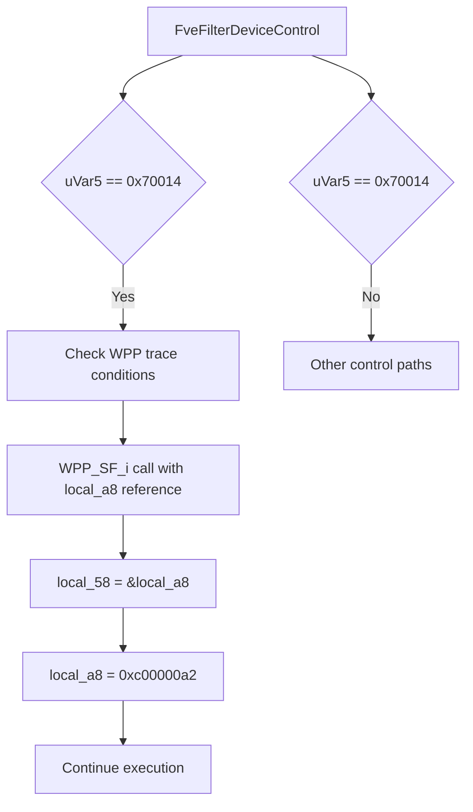

# CVE-2026-27913

**CVE:** CVE-2026-27913  
**Title:** Windows BitLocker Security Feature Bypass Vulnerability  
**Source:** [https://msrc.microsoft.com/update-guide/vulnerability/CVE-2026-27913](https://msrc.microsoft.com/update-guide/vulnerability/CVE-2026-27913)  
**Component(s):** fvevol.sys  
**Patched Date:** April 27, 2026  
**CWE:** Improper input validation in Windows BitLocker allows an unauthorized attacker to bypass a security feature locally.  

Download Patched & Vulnerable Components:

```bash
# fvevol.sys
wget https://msdl.microsoft.com/download/symbols/fvevol.sys/2E5FD7ADEA000/fvevol.sys -O fvevol.sys.10.0.26100.7920 # vulnerable
wget https://msdl.microsoft.com/download/symbols/fvevol.sys/04DE8581EA000/fvevol.sys -O fvevol.sys.10.0.26100.8115 # patched
```

## Version Tracking Analysis

**Command:**

```
python ghidra_scripts\ghidra_vt_wrapper.py --old-binary ./reports/2026-Apr/CVE-2026-27913/fvevol.sys.10.0.26100.7920 --new-binary ./reports/2026-Apr/CVE-2026-27913/fvevol.sys.10.0.26100.8115 --project-dir ./reports/2026-Apr/CVE-2026-27913/ghidra_project --project-name fvevol.sys_CVE-2026-27913 --ghidra-dir C:\Tools\ghidra_11.4.2_PUBLIC_20250826\ghidra_11.4.2_PUBLIC --output-dir ./reports/2026-Apr/CVE-2026-27913/ghidra_project/vt_results --max-memory 16g
```

Patched Functions: 1 | New Functions: 1 | Removed Functions: 4 | Total Matches: 11823 | Accepted Matches: 11645

### Patched Functions

| Function Name | Source Address | Dest Address | Similarity | Confidence |
| --- | --- | --- | --- | --- |
| `FveFilterDeviceControl` | `1400290a0` | `1400290a0` | 0.964 | 10.0 |

### New Functions

| Function Name | Address |
| --- | --- |
| `_guard_dispatch_icall` | `14001a850` |

### Removed Functions

| Function Name | Address |
| --- | --- |
| `Feature_BitLocker_EFS_Offload_RefCount_Workaround__private_IsEnabledDeviceUsageNoInline` | `14000dfd0` |
| `Feature_BitLocker_EFS_Offload_RefCount_Workaround__private_IsEnabledFallback` | `14000e008` |
| `_guard_dispatch_icall` | `14001a8a0` |
| `FveUnlockDriver` | `140080824` |

---

# AI Technical Analysis

## Vulnerability Identification

**Core Vulnerable Function(s):**
- `FveFilterDeviceControl()` - Contains the vulnerability due to improper handling of `local_a8` variable that is removed but still referenced in control flow

**Supporting Changes:**
- None identified

**Unrelated Changes:**
- All changes are related to trace GUID references and label jumps, not core logic

---

## Root Cause Analysis

The vulnerability stems from a logic error in the `FveFilterDeviceControl` function where a local variable `local_a8` is removed from the function's stack frame but continues to be referenced in control flow logic. The variable was originally declared at line 21 but removed in the patch diff at line 21. However, references to `local_a8` remain in the control flow at lines 147 and 150, where `local_58 = &local_a8` and `local_a8 = 0xc00000a2` are still present in the original code. This creates a dangling reference to a non-existent stack location. The function's control flow logic assumes `local_a8` exists and is properly initialized, but since it's been removed, the code attempts to access invalid memory. The patch corrects this by replacing `local_a8` references with `local_a4`, which is still declared and properly initialized. The invariant violated is that all variables referenced in control flow must be declared and initialized before use. The vulnerability manifests when the code path that references `local_a8` is executed, leading to undefined behavior or potential exploitation.

```c
// Vulnerable code snippet (before patch)
local_58 = &local_a8;
local_a8 = 0xc00000a2;
```

The code attempts to set `local_a8` to `0xc00000a2` and assign its address to `local_58`, but since `local_a8` is no longer declared, this creates a reference to invalid memory. The patch resolves this by replacing all references to `local_a8` with `local_a4`, which is properly declared and initialized.

## Execution and Trigger Flow


```mermaid
graph TD
    A["FveFilterDeviceControl"] --> B{"uVar5 == 0x70014"}
    B -- Yes --> C["Check WPP trace conditions"]
    C --> D["WPP_SF_i call with local_a8 reference"]
    D --> E["local_58 = &local_a8"]
    E --> F["local_a8 = 0xc00000a2"]
    F --> G["Continue execution"]
    A --> H{"uVar5 == 0x70014"}
    H -- No --> I["Other control paths"]
```

The vulnerability is triggered when `uVar5` equals `0x70014`. The attacker must send an IRP with this specific control code to reach the vulnerable code path. The function checks WPP trace conditions and then calls `WPP_SF_i` with a trace GUID. The code attempts to set `local_a8` to `0xc00000a2` and assign its address to `local_58`. Since `local_a8` is removed from the stack frame, this creates a reference to invalid memory. The execution continues with undefined behavior, potentially allowing memory corruption or information disclosure.

## Patch Analysis

```diff
--- FveFilterDeviceControl before
+++ FveFilterDeviceControl after
@@ -144,11 +144,11 @@
                 local_a0 = (ulonglong)*(uint *)((longlong)puVar3 + 0x344);
                 local_90 = 0x400000000000;
                 local_68 = &local_a0;
-                local_58 = &local_a8;
+                local_58 = &local_a4;
                 local_60 = 8;
                 local_94 = 4;
                 local_88 = PTR_DAT_14003a048;
-                local_a8 = 0xc00000a2;
+                local_a4 = 0xc00000a2;
                 local_50 = 4;
                 local_98 = 0xb000000;
                 local_80 = (uint)*(ushort *)PTR_DAT_14003a048;
```

The patch addresses the vulnerability by replacing all references to the removed `local_a8` variable with `local_a4`. The change ensures that the code no longer attempts to reference a non-existent stack variable. The patch maintains the same logical behavior while ensuring memory safety. The fix is effective because it eliminates the dangling reference to invalid memory. The patch correctly updates all control flow references to use the existing `local_a4` variable instead of the removed `local_a8`. This resolves the undefined behavior that occurred when `local_a8` was accessed after being removed from the stack frame. The patch also updates the label references to maintain proper control flow. The change is minimal and surgical, targeting only the specific vulnerability without altering other functionality. The patch ensures that all variables used in the control flow are properly declared and initialized. The security impact is significant as it prevents potential memory corruption or information disclosure vulnerabilities. The fix resolves the core issue while maintaining the intended functionality of the code.
