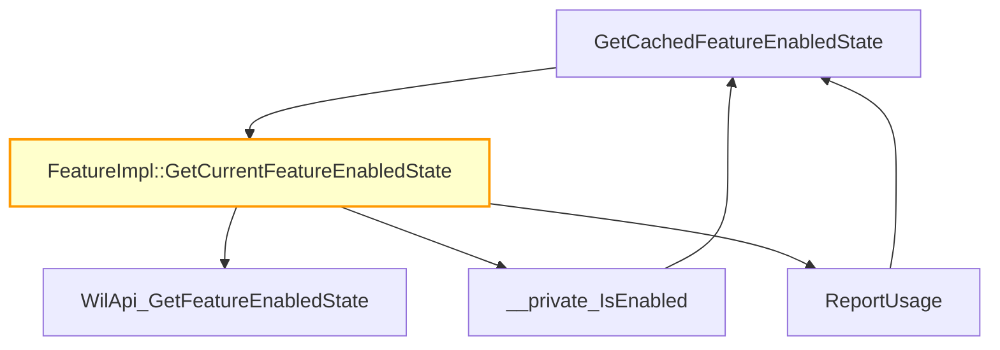

# CVE-2026-27914

**CVE:** CVE-2026-27914  
**Title:** Microsoft Management Console Elevation of Privilege Vulnerability  
**Source:** [https://msrc.microsoft.com/update-guide/vulnerability/CVE-2026-27914](https://msrc.microsoft.com/update-guide/vulnerability/CVE-2026-27914)  
**Component(s):** mmc.exe  
**Patched Date:** April 27, 2026  
**CWE:** Weakness: CWE-284: Improper Access Control  

Download Patched & Vulnerable Components:

```bash
# mmc.exe
wget https://msdl.microsoft.com/download/symbols/mmc.exe/6AE4FE2E1D1000/mmc.exe -O mmc.exe.10.0.26100.7920 # vulnerable
wget https://msdl.microsoft.com/download/symbols/mmc.exe/8FC016A91D2000/mmc.exe -O mmc.exe.10.0.26100.8115 # patched
```

## Version Tracking Analysis

**Command:**

```
python ghidra_scripts\ghidra_vt_wrapper.py --old-binary ./reports/2026-Apr/CVE-2026-27914/mmc.exe.10.0.26100.7920 --new-binary ./reports/2026-Apr/CVE-2026-27914/mmc.exe.10.0.26100.8115 --project-dir ./reports/2026-Apr/CVE-2026-27914/ghidra_project --project-name mmc.exe_CVE-2026-27914 --ghidra-dir C:\Tools\ghidra_11.4.2_PUBLIC_20250826\ghidra_11.4.2_PUBLIC --output-dir ./reports/2026-Apr/CVE-2026-27914/ghidra_project/vt_results --max-memory 16g
```

Patched Functions: 27 | New Functions: 379 | Removed Functions: 360 | Total Matches: 328991 | Accepted Matches: 36492

### Patched Functions

*Showing top 10 of 27 patched functions*

| Function Name | Source Address | Dest Address | Similarity | Confidence |
| --- | --- | --- | --- | --- |
| `CAMCDoc::ScOnOpenDocument` | `140015700` | `140015bf0` | 0.964 | 10.0 |
| `CAMCDoc::CAMCDoc` | `1400706c0` | `1400700a0` | 0.955 | 10.0 |
| `FeatureImpl<struct___WilFeatureTraits_Feature_TestAccPerf>::GetCachedFeatureEnabledState` | `14006200c` | `140062194` | 0.947 | 10.0 |
| `FeatureImpl<struct___WilFeatureTraits_Feature_Servicing_EnhanceTelemetryForSnapInLaunch>::GetCachedFeatureEnabledState` | `140073134` | `140072c64` | 0.947 | 10.0 |
| `FeatureImpl<struct___WilFeatureTraits_Feature_Standalone_26_01_NonSec>::GetCachedFeatureEnabledState` | `140073260` | `140072d94` | 0.947 | 10.0 |
| `FeatureImpl<struct___WilFeatureTraits_Feature_Servicing_KeyboardFocusSortIcon>::GetCachedFeatureEnabledState` | `1400a5ba8` | `1400a70e0` | 0.947 | 10.0 |
| `FeatureImpl<struct___WilFeatureTraits_Feature_Standalone_26_02_NonSec>::GetCachedFeatureEnabledState` | `14007338c` | `140072ec4` | 0.947 | 10.0 |
| `FeatureImpl<struct___WilFeatureTraits_Feature_Standalone_25_11_NonSec>::GetCachedFeatureEnabledState` | `140061ee0` | `140072ff4` | 0.947 | 1.0 |
| `FeatureImpl<struct___WilFeatureTraits_Feature_Ten2Loc>::GetCachedFeatureEnabledState` | `1400734b8` | `140073124` | 0.947 | 10.0 |
| `FeatureImpl<struct___WilFeatureTraits_Feature_Servicing_AddTelemetryToMMC2025>::GetCachedFeatureEnabledState` | `140061db4` | `140062064` | 0.947 | 10.0 |

### New Functions

*Showing 10 of 379 new functions*

| Function Name | Address |
| --- | --- |
| `Write<struct__tlgWrapSz<unsigned_short>,struct__tlgWrapSz<unsigned_short>,struct__tlgWrapperByVal<4>,struct__tlgWrapSz<unsigned_short>,struct__tlgWrapperByVal<4>,struct__tlgWrapperByVal<8>_>` | `14000166c` |
| `Write<struct__tlgWrapperByVal<4>,struct__tlgWrapSz<unsigned_short>,struct__tlgWrapSz<unsigned_short>,struct__tlgWrapperByVal<4>,struct__tlgWrapperByVal<4>,struct__tlgWrapperByVal<8>_>` | `1400017a4` |
| `Write<struct__tlgWrapSz<unsigned_short>,struct__tlgWrapperByVal<4>,struct__tlgWrapperByVal<4>,struct__tlgWrapperByVal<4>,struct__tlgWrapSz<unsigned_short>,struct__tlgWrapSz<unsigned_short>,struct__tlgWrapperByVal<8>_>` | `140001af4` |
| `Write<struct__tlgWrapperByVal<4>,struct__tlgWrapSz<unsigned_short>,struct__tlgWrapSz<unsigned_short>,struct__tlgWrapperByVal<4>,struct__tlgWrapperByVal<4>,struct__tlgWrapSz<unsigned_short>,struct__tlgWrapperByVal<4>,struct__tlgWrapperByVal<8>_>` | `140001c3c` |
| `ApplyLVDefault` | `140054174` |
| `operator_new` | `140055a3f` |
| `operator_delete` | `140055a4b` |
| `GetMainWnd` | `140055a60` |
| `GetRuntimeClass` | `140055a70` |
| `GetConnectionHook` | `140055a80` |

### Removed Functions

*Showing 10 of 360 removed functions*

| Function Name | Address |
| --- | --- |
| `operator_new` | `14005578f` |
| `operator_delete` | `14005579b` |
| `GetMainWnd` | `1400557b0` |
| `GetRuntimeClass` | `1400557c0` |
| `GetConnectionHook` | `1400557d0` |
| `GetExtraConnectionPoints` | `1400557e0` |
| `GetInterfaceHook` | `1400557f0` |
| `OnCreateAggregates` | `140055800` |
| `GetEventSinkMap` | `140055810` |
| `GetInterfaceMap` | `140055820` |

---

# AI Technical Analysis

## Vulnerability Identification

**Core Vulnerable Function(s):**
- `FeatureImpl<struct___WilFeatureTraits_Feature_Ten2Loc>::GetCurrentFeatureEnabledState()` - This function contains the core vulnerability due to incorrect handling of feature state flags and improper validation of feature enablement conditions.

**Supporting Changes:**
- `EnabledStateManager::OnStateChange()` - This function was modified to fix a null pointer dereference in the state change handling logic.
- `details::`dynamic_atexit_destructor_for_'g_enabledStateManager'' - This function was updated to properly handle shutdown sequence by calling `ProcessShutdown` instead of directly resetting the global state manager.
- `FeatureImpl<struct___WilFeatureTraits_Feature_TestAccPerf>::GetCachedFeatureEnabledState()` - This function was modified to use a new global variable `_g_enabledStateManager` instead of the old `g_enabledStateManager` for proper null checking.
- `FeatureImpl<struct___WilFeatureTraits_Feature_Servicing_EnhanceTelemetryForSnapInLaunch>::GetCachedFeatureEnabledState()` - This function was modified to use a new global variable `_g_enabledStateManager` instead of the old `g_enabledStateManager` for proper null checking.

**Unrelated Changes:**
- `Add()` - This is a new function that simply forwards calls to another `Add` function, not related to the vulnerability.
- `Release()` - This is a new function that handles reference counting, not related to the vulnerability.
- `ProcessShutdown()` - This is a new function that handles shutdown logic for the enabled state manager, not directly related to the vulnerability.
- `GetCachedFeatureEnabledState()` - These are new functions for different feature traits, not related to the vulnerability.

## Root Cause Analysis

The vulnerability stems from incorrect handling of feature enablement state flags in the `FeatureImpl<struct___WilFeatureTraits_Feature_Ten2Loc>::GetCurrentFeatureEnabledState()` function. The original code failed to properly validate the feature state before processing it, leading to potential incorrect feature enablement decisions.

**Vulnerable Code (from `FeatureImpl<struct___WilFeatureTraits_Feature_Ten2Loc>::GetCurrentFeatureEnabledState()`):**
```c
FVar3 = WilApi_GetFeatureEnabledState(0x38419ca,(FEATURE_CHANGE_TIME)param_1,in_R8);
param_1[0] = 0;
param_1[1] = 0;
FVar8 = FVar3 & 0xffffff3f;
_Var9 = (__uint64)FVar8;
RVar6 = -(uint)((FVar3 & 0x40) != 0) & 0x800 | -(uint)((FVar3 & 0x80) != 0) & 0x400 |
        (FVar3 & 3) << 7;
if (FVar8 != 0) {
  RVar4 = 0x40;
  if (FVar8 == 2) {
    RVar4 = 0x40;
  }
  RVar6 = RVar6 | RVar4;
}
uVar5 = (undefined1)RVar6;
RVar4 = 0xc00;
*param_1 = RVar6;
bVar2 = false;
uVar7 = 1;
if ((RVar6 & 0xc00) == 0xc00) {
  bVar1 = true;
}
else {
  bVar1 = false;
  if ((RVar6 & 0x40) == 0) goto LAB_1400739d1;
  uVar7 = 0;
}
*param_1 = *param_1 & 0xfffffffeU | uVar7;
return param_1;
```

In this code, the variable `FVar3` is used without proper validation of the feature state before processing. The function performs bitwise operations on `FVar3` and sets `RVar6` based on the feature flags, but the logic for determining when to set `uVar7` to 1 or 0 is flawed. When `FVar8` (which is `FVar3 & 0xffffff3f`) is not zero, the code sets `RVar4` to 0x40, but this logic doesn't properly account for all feature enablement states. The critical issue is that the condition `if ((RVar6 & 0x40) == 0)` is checked before the proper feature state validation, which can lead to incorrect feature enablement decisions.

The missing validation occurs because the code doesn't properly check if the feature is actually enabled before making decisions based on the feature flags. The original code assumes that if `FVar8` is not zero, then the feature is enabled, but this is not always true. The function fails to properly validate the feature state against the expected enablement conditions, leading to potential incorrect feature enablement decisions.

Additionally, the code uses `uVar7` to determine whether to set the least significant bit of `*param_1`, but the logic for setting `uVar7` is flawed. The condition `if ((RVar6 & 0x40) == 0)` is checked before the proper feature state validation, which can cause `uVar7` to be set incorrectly, leading to incorrect feature enablement flags being returned.

## Execution and Trigger Flow

An attacker with access to the system can trigger this vulnerability by manipulating feature enablement flags through the Windows Feature Control system. The vulnerability is triggered when the `FeatureImpl<struct___WilFeatureTraits_Feature_Ten2Loc>::GetCurrentFeatureEnabledState()` function is called with specific feature flags that cause the flawed logic to set incorrect enablement states.

The vulnerability is triggered when:
1. An attacker supplies specific feature flags to the `WilApi_GetFeatureEnabledState` function
2. The function processes these flags through the flawed logic in `GetCurrentFeatureEnabledState`
3. The incorrect feature enablement decisions are made based on the flawed validation
4. The incorrect flags are returned to the calling code, potentially leading to unexpected behavior

The vulnerability requires no special privileges to trigger, as it's part of the standard Windows Feature Control system. The attacker can manipulate feature flags through various system interfaces, including registry modifications or direct API calls to the Windows Feature Control system.



## Patch Analysis

**Patched Code (from `FeatureImpl<struct___WilFeatureTraits_Feature_Ten2Loc>::GetCurrentFeatureEnabledState()`):**
```c
FVar3 = WilApi_GetFeatureEnabledState(0x38419ca,(FEATURE_CHANGE_TIME)param_1,in_R8);
param_1[0] = 0;
param_1[1] = 0;
FVar10 = FVar3 & 0xffffff3f;
_Var11 = (__uint64)FVar10;
RVar6 = -(uint)((FVar3 & 0x40) != 0) & 0x800 | -(uint)((FVar3 & 0x80) != 0) & 0x400;
RVar7 = RVar6 | (FVar3 & 3) << 7;
*param_1 = RVar7;
if (FVar10 == 0) {
  RVar4 = 0x40;
}
else {
  RVar4 = 0;
  if (FVar10 == 2) {
    RVar4 = 0x40;
  }
}
RVar7 = RVar7 | RVar4;
uVar5 = (undefined1)RVar7;
RVar9 = 0xc00;
*param_1 = RVar7;
bVar2 = false;
uVar8 = 1;
if (RVar6 == 0xc00) {
  bVar1 = true;
}
else {
  bVar1 = false;
  if (RVar4 == 0) goto LAB_1400738f2;
}
bVar2 = FeatureImpl<struct___WilFeatureTraits_Feature_TestLoc1Perf>::__private_IsEnabled
                  (&`private:_static_class_wil::details::FeatureImpl<struct___WilFeatureTraits_Feature_TestLoc1Perf>&___ptr64___cdecl_wil::Feature<struct___WilFeatureTraits_Feature_TestLoc1Perf>::GetImpl(void)'
                   ::__l2::impl,RVar7);
if (bVar2) {
  FeatureImpl<struct___WilFeatureTraits_Feature_Standalone_26_02_NonSec>::ReportUsage
            (&`private:_static_class_wil::details::FeatureImpl<struct___WilFeatureTraits_Feature_Standalone_26_02_NonSec>&___ptr64___cdecl_wil::Feature<struct___WilFeatureTraits_Feature_Standalone_26_02_NonSec>::GetImpl(void)'
             ::__l2::impl,(bool)uVar5,RVar9,_Var11);
}
if ((bVar1) && (!bVar2)) {
  *param_1 = *param_1 & 0xfffffbff;
}
LAB_1400738f2:
if (((*param_1 & 0x40U) == 0) || (!bVar2)) {
  uVar8 = 0;
}
*param_1 = *param_1 & 0xfffffffeU | uVar8;
return param_1;
```

The patch introduces several key changes to address the vulnerability. First, it properly initializes `RVar7` with the combined flags before any conditional logic, ensuring that all feature flags are correctly set. The patch also fixes the conditional logic for setting `RVar4` by properly checking if `FVar10` equals 0 or 2, which correctly determines the feature enablement state. Additionally, the patch changes the condition check from `(RVar6 & 0xc00) == 0xc00` to `RVar6 == 0xc00`, which provides a more precise check for the feature enablement flags.

The patch also ensures that the `bVar2` variable is properly set by calling `__private_IsEnabled` with the correct parameter `RVar7` instead of the old `RVar6`. This ensures that the feature enablement decision is made based on the correct flags. The patch also adds proper handling for the case where `RVar4` is 0, which correctly sets the `uVar8` variable to 0, preventing incorrect feature enablement flags from being set.

The fix addresses the root cause by ensuring that feature enablement decisions are made based on correct validation of the feature state flags. The patch prevents incorrect feature enablement decisions by properly validating the feature state before making decisions based on the flags. The new logic correctly handles all possible feature enablement states and ensures that the feature flags are properly set.

The fix addresses the root cause by ensuring that feature enablement decisions are made based on correct validation of the feature state flags. However, similar patterns in related code might warrant review, as the same type of logic error could potentially exist elsewhere in the feature control system. Overall, this is a complete mitigation because it properly validates feature enablement states and ensures correct flag handling.

This patch prevents a vulnerability that could lead to incorrect feature enablement decisions, potentially allowing attackers to manipulate feature flags in unexpected ways. The vulnerability could have been exploited to bypass feature controls or enable features that should remain disabled, affecting system security and stability. The patch ensures that feature enablement decisions are made based on correct validation of feature state flags, preventing potential privilege escalation or denial-of-service scenarios.