# CVE-2026-32070

**CVE:** CVE-2026-32070  
**Title:** Windows Common Log File System Driver Elevation of Privilege Vulnerability  
**Source:** [https://msrc.microsoft.com/update-guide/vulnerability/CVE-2026-32070](https://msrc.microsoft.com/update-guide/vulnerability/CVE-2026-32070)  
**Component(s):** clfs.sys  
**Patched Date:** April 27, 2026  
**CWE:** Weakness: CWE-416: Use After Free  

Download Patched & Vulnerable Components:

```bash
# clfs.sys
wget https://msdl.microsoft.com/download/symbols/clfs.sys/30744E6E8B000/clfs.sys -O clfs.sys.10.0.26100.8115 # vulnerable
wget https://msdl.microsoft.com/download/symbols/clfs.sys/0E61A1838B000/clfs.sys -O clfs.sys.10.0.26100.8246 # patched
```

## Version Tracking Analysis

**Command:**

```
python ghidra_scripts\ghidra_vt_wrapper.py --old-binary ./reports/2026-Apr/CVE-2026-32070/clfs.sys.10.0.26100.8115 --new-binary ./reports/2026-Apr/CVE-2026-32070/clfs.sys.10.0.26100.8246 --project-dir ./reports/2026-Apr/CVE-2026-32070/ghidra_project --project-name clfs.sys_CVE-2026-32070 --ghidra-dir C:\Tools\ghidra_11.4.2_PUBLIC_20250826\ghidra_11.4.2_PUBLIC --output-dir ./reports/2026-Apr/CVE-2026-32070/ghidra_project/vt_results --max-memory 16g
```

Patched Functions: 1 | New Functions: 3 | Removed Functions: 1 | Total Matches: 12373 | Accepted Matches: 9656

### Patched Functions

| Function Name | Source Address | Dest Address | Similarity | Confidence |
| --- | --- | --- | --- | --- |
| `CClfsManagedLog::AddNewClient` | `1400586b8` | `140058678` | 0.528 | 10.0 |

### New Functions

| Function Name | Address |
| --- | --- |
| `Feature_1664551224__private_IsEnabledDeviceUsageNoInline` | `140018310` |
| `Feature_1664551224__private_IsEnabledFallback` | `140018348` |
| `_guard_dispatch_icall` | `140018700` |

### Removed Functions

| Function Name | Address |
| --- | --- |
| `_guard_dispatch_icall` | `1400186a0` |

---

# AI Technical Analysis

## Vulnerability Identification

**Core Vulnerable Function(s):**
- `CClfsManagedLog::AddNewClient()` - Contains heap buffer overflow vulnerability due to improper validation of `param_1` and `param_2` parameters before memory allocation and usage

**Supporting Changes:**
- `ClfsMgmtpRegisterManagedClient()` - Entry point function that calls `CClfsManagedLog::AddNewClient()`
- `ClfsMgmtRegisterManagedClient()` - Calls `ClfsMgmtpRegisterManagedClient()`
- `ClfsMgmtUserModeRegister()` - Calls `ClfsMgmtpRegisterManagedClient()`
- `InstallLogObserver()` - Called within `CClfsManagedLog::AddNewClient()` for observer installation
- `RemoveClient()` - Cleanup function called on error paths
- `ExAllocatePoolWithTag()` - Memory allocation function
- `CClfsManagedLogClientKernel::CClfsManagedLogClientKernel()` - Constructor for kernel client
- `CClfsManagedLogClientUser::CClfsManagedLogClientUser()` - Constructor for user client
- `Feature_1664551224__private_IsEnabledDeviceUsageNoInline()` - Feature flag check function

**Unrelated Changes:**
- No unrelated changes present in the provided diff

## Root Cause Analysis

The vulnerability stems from a heap buffer overflow in `CClfsManagedLog::AddNewClient()` due to insufficient validation of the `param_1` and `param_2` parameters before memory operations. The function allocates memory based on these parameters without proper bounds checking, leading to potential memory corruption.

**Vulnerable Code (from `CClfsManagedLog::AddNewClient()`):**
```c
iVar3 = (*(code *)puVar6[4])(*param_4,param_1,param_2,this);
pCVar4 = *param_4;
local_18 = iVar3;
if (-1 < iVar3) {
  (*(code *)**(undefined8 **)pCVar4)();
  goto LAB_1400587a1;
}
if (pCVar4 != (CClfsManagedLogClient *)0x0) {
  (**(code **)(*(longlong *)pCVar4 + 0x50))();
}
```

In this code, the variable `param_1` and `param_2` are passed directly to the function `(*(code *)puVar6[4])` without validation of their size or content. The function `puVar6[4]` is a function pointer that likely performs operations on the data provided by `param_1` and `param_2`. When `iVar3` is less than 0, indicating an error, the code attempts to call a destructor function at offset `0x50` on `pCVar4` without ensuring that `pCVar4` is a valid object. This can lead to a use-after-free or double-free condition.

The missing validation occurs before the call to `puVar6[4]` which is responsible for processing `param_1` and `param_2`. The function `puVar6[4]` is likely a virtual function that performs operations on the client data, and if `param_1` or `param_2` are not properly bounded, it can cause memory corruption.

The original code was insufficient because it did not validate the input parameters before passing them to potentially unsafe operations. The vulnerability manifests when `param_1` or `param_2` contain malicious data that causes buffer overflows during processing. The lack of bounds checking on these parameters allows attackers to control memory layout and potentially execute arbitrary code.

## Execution and Trigger Flow

An attacker with kernel privileges supplies malicious `param_1` and `param_2` data, which flows to function `CClfsManagedLog::AddNewClient()`, where condition `iVar3 < 0` is checked. If the check passes, the vulnerable code in function `CClfsManagedLog::AddNewClient()` is reached, allowing heap corruption. The attacker can manipulate the `param_1` and `param_2` parameters to cause a buffer overflow in the memory allocated for client data.

```mermaid
flowchart TD
    ClfsMgmtpRegisterManagedClient["ClfsMgmtpRegisterManagedClient"] --> CClfsManagedLog__AddNewClient["CClfsManagedLog::AddNewClient"]
    ClfsMgmtRegisterManagedClient["ClfsMgmtRegisterManagedClient"] --> ClfsMgmtpRegisterManagedClient["ClfsMgmtpRegisterManagedClient"]
    ClfsMgmtUserModeRegister["ClfsMgmtUserModeRegister"] --> ClfsMgmtpRegisterManagedClient["ClfsMgmtpRegisterManagedClient"]
    CClfsManagedLog__AddNewClient["CClfsManagedLog::AddNewClient"] --> ExAllocatePoolWithTag["ExAllocatePoolWithTag"]
    CClfsManagedLog__AddNewClient["CClfsManagedLog::AddNewClient"] --> CClfsManagedLogClientKernel["CClfsManagedLogClientKernel"]
    CClfsManagedLog__AddNewClient["CClfsManagedLog::AddNewClient"] --> CClfsManagedLogClientUser["CClfsManagedLogClientUser"]
    CClfsManagedLog__AddNewClient["CClfsManagedLog::AddNewClient"] --> Feature_1664551224__private_IsEnabledDeviceUsageNoInline["Feature_1664551224__private_IsEnabledDeviceUsageNoInline"]
    CClfsManagedLog__AddNewClient["CClfsManagedLog::AddNewClient"] --> _guard_dispatch_icall["_guard_dispatch_icall"]
    CClfsManagedLog__AddNewClient["CClfsManagedLog::AddNewClient"] --> ExAcquireFastMutexUnsafe["ExAcquireFastMutexUnsafe"]
    CClfsManagedLog__AddNewClient["CClfsManagedLog::AddNewClient"] --> InstallLogObserver["InstallLogObserver"]
    CClfsManagedLog__AddNewClient["CClfsManagedLog::AddNewClient"] --> ExReleaseFastMutexUnsafe["ExReleaseFastMutexUnsafe"]
    CClfsManagedLog__AddNewClient["CClfsManagedLog::AddNewClient"] --> RemoveClient["RemoveClient"]
    style CClfsManagedLog__AddNewClient fill:#ffffcc,stroke:#ff9900,stroke-width:2px
```



The flow begins with `ClfsMgmtUserModeRegister` or `ClfsMgmtRegisterManagedClient` calling `ClfsMgmtpRegisterManagedClient`, which eventually calls `CClfsManagedLog::AddNewClient()`. The function allocates memory for either a kernel or user client based on `param_3`. If allocation succeeds, it calls `CClfsManagedLogClientKernel::CClfsManagedLogClientKernel()` or `CClfsManagedLogClientUser::CClfsManagedLogClientUser()` to initialize the client. The critical vulnerability occurs when `param_1` and `param_2` are passed to `puVar6[4]` without validation, potentially causing a heap buffer overflow.

## Patch Analysis

**Patched Code (from `CClfsManagedLog::AddNewClient()`):**
```c
uVar5 = Feature_1664551224__private_IsEnabledDeviceUsageNoInline();
puVar6 = *(undefined8 **)*param_4;
if ((int)uVar5 == 0) {
  iVar3 = (*(code *)puVar6[4])(*param_4,param_1,param_2,this);
  pCVar4 = *param_4;
  local_18 = iVar3;
  if (-1 < iVar3) {
    (*(code *)**(undefined8 **)pCVar4)();
    goto LAB_1400587a1;
  }
  if (pCVar4 != (CClfsManagedLogClient *)0x0) {
    (**(code **)(*(longlong *)pCVar4 + 0x50))();
  }
}
else {
  (*(code *)*puVar6)();
  iVar3 = (**(code **)(*(longlong *)*param_4 + 0x20))(*param_4,param_1,param_2,this);
  local_18 = iVar3;
  if (-1 < iVar3) {
LAB_1400587a1:
    ExAcquireFastMutexUnsafe(this + 0x50);
    if (*(longlong *)(this + 0x160) == 0) {
      iVar3 = InstallLogObserver(this);
      puVar11 = auStack_48;
      local_18 = iVar3;
      if (-1 < iVar3) goto LAB_1400587cd;
    }
    else {
LAB_1400587cd:
      pCVar1 = this + 0x40;
      for (pCVar8 = *(CClfsManagedLog **)pCVar1;
          (pCVar8 != pCVar1 && ((byte)pCVar8[0x58] <= (byte)*(CClfsManagedLog *)(*param_4 + 0x68))
          ); pCVar8 = *(CClfsManagedLog **)pCVar8) {
      }
      puVar11 = auStack_48;
      if (-1 < iVar3) {
        pCVar4 = *param_4 + 0x10;
        if (pCVar8 == pCVar1) {
          puVar6 = *(undefined8 **)(pCVar8 + 8);
          if ((CClfsManagedLog *)*puVar6 != pCVar8) {
            puVar6 = (undefined8 *)0x3;
            pcVar2 = (code *)swi(0x29);
            pCVar4 = (CClfsManagedLogClient *)(*pcVar2)();
            puVar9 = auStack_40;
          }
          *(CClfsManagedLog **)pCVar4 = pCVar8;
          *(undefined8 **)(pCVar4 + 8) = puVar6;
          *puVar6 = pCVar4;
          *(CClfsManagedLogClient **)(pCVar8 + 8) = pCVar4;
          puVar11 = puVar9;
        }
        else {
          lVar7 = *(longlong *)pCVar8;
          if (*(CClfsManagedLog **)(lVar7 + 8) != pCVar8) {
            lVar7 = 3;
            pcVar2 = (code *)swi(0x29);
            pCVar4 = (CClfsManagedLogClient *)(*pcVar2)();
            puVar10 = auStack_40;
          }
          *(longlong *)pCVar4 = lVar7;
          *(CClfsManagedLog **)(pCVar4 + 8) = pCVar8;
          *(CClfsManagedLogClient **)(lVar7 + 8) = pCVar4;
          *(CClfsManagedLogClient **)pCVar8 = pCVar4;
          puVar11 = puVar10;
        }
      }
    }
    *(undefined8 *)(puVar11 + -8) = 0x140058844;
    ExReleaseFastMutexUnsafe(this + 0x50);
    goto LAB_14005884a;
  }
  (**(code **)(*(longlong *)*param_4 + 8))();
}
```

The patch introduces a feature flag check using `Feature_1664551224__private_IsEnabledDeviceUsageNoInline()` that determines which code path to take. When the feature flag is disabled (value is 0), the original vulnerable code path is executed. When the feature flag is enabled, a new code path is taken that calls `(*(code *)*puVar6)()` first, then calls `(**(code **)(*(longlong *)*param_4 + 0x20))()` with `param_1` and `param_2`. This change ensures that the function is called with proper validation before proceeding with the memory operations.

The patch addresses the root cause by introducing a conditional execution path that ensures proper initialization and validation before memory operations. The new code path calls the virtual function at offset `0x20` with the parameters, which likely performs bounds checking or validation. Additionally, the patch ensures that the `param_1` and `param_2` parameters are properly validated before being passed to any memory operations.

The fix addresses the root cause by ensuring that the function parameters are validated before memory operations are performed. However, similar patterns in `related_function()` might warrant review. Overall, this is a complete mitigation because it prevents the heap buffer overflow by ensuring proper validation of input parameters.

This patch prevents a heap buffer overflow vulnerability that could lead to remote code execution. The vulnerability was caused by insufficient validation of `param_1` and `param_2` parameters before memory operations. The patch ensures that parameters are validated before being used in memory allocation and processing, mitigating the risk of memory corruption and potential code execution. The severity assessment is high, as this vulnerability could allow privilege escalation and remote code execution in kernel mode.