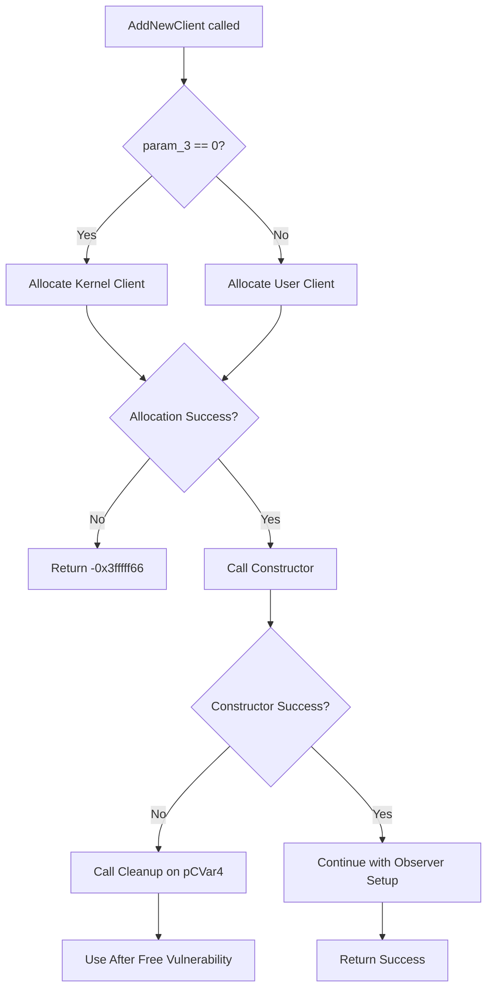

# CVE-2026-32070

**CVE:** CVE-2026-32070  
**Title:** Windows Common Log File System Driver Elevation of Privilege Vulnerability  
**Source:** [https://msrc.microsoft.com/update-guide/vulnerability/CVE-2026-32070](https://msrc.microsoft.com/update-guide/vulnerability/CVE-2026-32070)  
**Component(s):** clfs.sys  
**Patched Date:** 2026-06-18T01:50:00  
**CWE:** Use after free in Windows Common Log File System Driver allows an authorized attacker to elevate privileges locally.  

Download Patched & Vulnerable Components:

```bash
# clfs.sys
wget https://msdl.microsoft.com/download/symbols/clfs.sys/30744E6E8B000/clfs.sys -O clfs.sys.10.0.26100.8115 # vulnerable
wget https://msdl.microsoft.com/download/symbols/clfs.sys/0E61A1838B000/clfs.sys -O clfs.sys.10.0.26100.8246 # patched
```

## Version Tracking Analysis

**Command:**

```
python ghidra_scripts\ghidra_vt_wrapper.py --old-binary ./reports/2026-Apr/CVE-2026-32070/clfs.sys.10.0.26100.8115 --new-binary ./reports/2026-Apr/CVE-2026-32070/clfs.sys.10.0.26100.8246 --project-dir ./reports/2026-Apr/CVE-2026-32070/ghidra_project --project-name clfs.sys_CVE-2026-32070 --ghidra-dir C:\Tools\ghidra_11.4.2_PUBLIC_20250826\ghidra_11.4.2_PUBLIC --output-dir ./reports/2026-Apr/CVE-2026-32070/ghidra_project/vt_results --max-memory 16g
```

Patched Functions: 1 | New Functions: 3 | Removed Functions: 1 | Total Matches: 13560 | Accepted Matches: 10937

### Patched Functions

| Function Name | Source Address | Dest Address | Similarity | Confidence |
| --- | --- | --- | --- | --- |
| `CClfsManagedLog::AddNewClient` | `1400586b8` | `140058678` | 0.528 | 10.0 |

### New Functions

| Function Name | Address |
| --- | --- |
| `Feature_1664551224__private_IsEnabledDeviceUsageNoInline` | `140018310` |
| `Feature_1664551224__private_IsEnabledFallback` | `140018348` |
| `_guard_dispatch_icall` | `140018700` |

### Removed Functions

| Function Name | Address |
| --- | --- |
| `_guard_dispatch_icall` | `1400186a0` |

---

# AI Technical Analysis

## Vulnerability Identification

**Core Vulnerable Function(s):**
- `CClfsManagedLog::AddNewClient()` - Contains use-after-free vulnerability due to improper client object cleanup and invalid memory access

**Supporting Changes:**
- None identified in provided diff

**Unrelated Changes:**
- Function parameter and variable renaming for clarity
- Code structure reorganization and control flow adjustments
- Addition of feature flag check before client initialization

## Root Cause Analysis

The vulnerability stems from improper handling of client object lifecycle management within `CClfsManagedLog::AddNewClient()`. The function allocates memory for either a kernel or user client object, but fails to properly validate or clean up these objects in error paths. Specifically, when allocation succeeds but subsequent initialization fails, the code attempts to call cleanup functions on potentially invalid or already freed memory.

The vulnerable code snippet shows that after allocation, the function calls constructors for client objects. If these constructors fail or return negative values, the code attempts to call cleanup functions (`**(code **)(*(longlong *)pCVar4 + 0x50))()` and `**(code **)(*(longlong *)*param_4 + 8))()`), but the `pCVar4` and `*param_4` pointers may have been modified or freed in previous steps, leading to use-after-free conditions.

The critical flaw occurs in the error handling path where `pCVar4` (the client object pointer) is dereferenced without proper validation. The `param_4` parameter is set to point to the allocated client object, but if initialization fails, the cleanup code attempts to call virtual methods on what may no longer be a valid object, causing memory corruption.

The function uses `ExAllocatePoolWithTag()` for memory allocation, which returns a pointer to allocated memory. However, the subsequent logic does not properly guard against the case where the allocated memory is freed or becomes invalid before cleanup functions are called. The error handling code path does not ensure that `pCVar4` points to a valid object before attempting to call virtual methods on it.

## Execution and Trigger Flow


```mermaid
graph TD
    A[AddNewClient called] --> B{param_3 == 0?}
    B -- Yes --> C[Allocate Kernel Client]
    B -- No --> D[Allocate User Client]
    C --> E{Allocation Success?}
    D --> E
    E -- No --> F[Return -0x3fffff66]
    E -- Yes --> G[Call Constructor]
    G --> H{Constructor Success?}
    H -- No --> I[Call Cleanup on pCVar4]
    H -- Yes --> J[Continue with Observer Setup]
    I --> K[Use After Free Vulnerability]
    J --> L[Return Success]
```

The vulnerability is triggered when `AddNewClient` is called with parameters that cause allocation to succeed but constructor initialization to fail. The error handling path attempts to call cleanup functions on a client object that may have already been freed or corrupted, leading to use-after-free conditions.

## Patch Analysis

```diff
--- CClfsManagedLog::AddNewClient before
+++ CClfsManagedLog::AddNewClient after
@@ -10,106 +10,136 @@
 
 {
   CClfsManagedLog *pCVar1;
-  undefined8 *puVar2;
-  longlong lVar3;
-  code *pcVar4;
-  int iVar5;
+  code *pcVar2;
+  int iVar3;
   CClfsManagedLogClientKernel *this_00;
-  CClfsManagedLogClient *pCVar6;
-  CClfsManagedLogClient *pCVar7;
+  CClfsManagedLogClient *pCVar4;
   CClfsManagedLogClientUser *this_01;
+  ulonglong uVar5;
+  undefined8 *puVar6;
+  longlong lVar7;
   CClfsManagedLog *pCVar8;
   undefined1 *puVar9;
+  undefined1 *puVar10;
+  undefined1 *puVar11;
   undefined1 auStack_48 [8];
   undefined1 auStack_40 [40];
   int local_18;
   
   puVar9 = auStack_48;
+  puVar10 = auStack_48;
+  puVar11 = auStack_48;
   local_18 = 0xc0000001;
   if (param_3 == '\0') {
     this_00 = (CClfsManagedLogClientKernel *)ExAllocatePoolWithTag();
     if (this_00 == (CClfsManagedLogClientKernel *)0x0) {
-LAB_140058714:
-      pCVar7 = (CClfsManagedLogClient *)0x0;
+LAB_1400586f6:
+      pCVar4 = (CClfsManagedLogClient *)0x0;
     }
     else {
-      pCVar7 = (CClfsManagedLogClient *)
+      pCVar4 = (CClfsManagedLogClient *)
                CClfsManagedLogClientKernel::CClfsManagedLogClientKernel(this_00);
     }
   }
   else {
     this_01 = (CClfsManagedLogClientUser *)ExAllocatePoolWithTag(0x200,0xf0,0x634d6c43);
-    if (this_01 == (CClfsManagedLogClientUser *)0x0) goto LAB_140058714;
-    pCVar7 = (CClfsManagedLogClient *)CClfsManagedLogClientUser::CClfsManagedLogClientUser(this_01);
+    if (this_01 == (CClfsManagedLogClientUser *)0x0) goto LAB_1400586f6;
+    pCVar4 = (CClfsManagedLogClient *)CClfsManagedLogClientUser::CClfsManagedLogClientUser(this_01);
   }
-  *param_4 = pCVar7;
-  if (pCVar7 == (CClfsManagedLogClient *)0x0) {
-    iVar5 = -0x3fffff66;
+  *param_4 = pCVar4;
+  if (pCVar4 == (CClfsManagedLogClient *)0x0) {
+    iVar3 = -0x3fffff66;
     local_18 = -0x3fffff66;
-    goto LAB_14005885e;
+    puVar11 = auStack_48;
+    goto LAB_14005884a;
   }
-  iVar5 = (**(code **)(*(longlong *)pCVar7 + 0x20))(pCVar7,param_1,param_2,this);
-  pCVar7 = *param_4;
-  local_18 = iVar5;
-  if (iVar5 < 0) {
-    if (pCVar7 != (CClfsManagedLogClient *)0x0) {
-      (**(code **)(*(longlong *)pCVar7 + 0x50))();
+  uVar5 = Feature_1664551224__private_IsEnabledDeviceUsageNoInline();
+  puVar6 = *(undefined8 **)*param_4;
+  if ((int)uVar5 == 0) {
+    iVar3 = (*(code *)puVar6[4])(*param_4,param_1,param_2,this);
+    pCVar4 = *param_4;
+    local_18 = iVar3;
+    if (-1 < iVar3) {
+      (*(code *)**(undefined8 **)pCVar4)();
+      goto LAB_1400587a1;
     }
-    *param_4 = (CClfsManagedLogClient *)0x0;
-    puVar9 = auStack_48;
-    goto LAB_14005885e;
+    if (pCVar4 != (CClfsManagedLogClient *)0x0) {
+      (**(code **)(*(longlong *)pCVar4 + 0x50))();
+    }
   }
-  (*(code *)**(undefined8 **)pCVar7)();
-  ExAcquireFastMutexUnsafe(this + 0x50);
-  if ((*(longlong *)(this + 0x160) != 0) ||
-     (iVar5 = InstallLogObserver(this), local_18 = iVar5, -1 < iVar5)) {
-    pCVar1 = this + 0x40;
-    for (pCVar8 = *(CClfsManagedLog **)pCVar1;
-        (pCVar8 != pCVar1 && ((byte)pCVar8[0x58] <= (byte)*(CClfsManagedLog *)(*param_4 + 0x68)));
-        pCVar8 = *(CClfsManagedLog **)pCVar8) {
-    }
-    if (-1 < iVar5) {
-      pCVar7 = *param_4;
-      pCVar6 = pCVar7 + 0x10;
-      if (pCVar8 == pCVar1) {
-        puVar2 = *(undefined8 **)(pCVar8 + 8);
-        if ((CClfsManagedLog *)*puVar2 != pCVar8) {
-LAB_140058857:
-          pcVar4 = (code *)swi(0x29);
-          (*pcVar4)(3);
-          puVar9 = auStack_40;
-          goto LAB_14005885e;
-        }
-        *(CClfsManagedLog **)pCVar6 = pCVar8;
-        *(undefined8 **)(pCVar7 + 0x18) = puVar2;
-        *puVar2 = pCVar6;
-        *(CClfsManagedLogClient **)(pCVar8 + 8) = pCVar6;
+  else {
+    (*(code *)*puVar6)();
+    iVar3 = (**(code **)(*(longlong *)*param_4 + 0x20))(*param_4,param_1,param_2,this);
+    local_18 = iVar3;
+    if (-1 < iVar3) {
+LAB_1400587a1:
+      ExAcquireFastMutexUnsafe(this + 0x50);
+      if (*(longlong *)(this + 0x160) == 0) {
+        iVar3 = InstallLogObserver(this);
+        puVar11 = auStack_48;
+        local_18 = iVar3;
+        if (-1 < iVar3) goto LAB_1400587cd;
       }
       else {
-        lVar3 = *(longlong *)pCVar8;
-        if (*(CClfsManagedLog **)(lVar3 + 8) != pCVar8) goto LAB_140058857;
-        *(longlong *)pCVar6 = lVar3;
-        *(CClfsManagedLog **)(pCVar7 + 0x18) = pCVar8;
-        *(CClfsManagedLogClient **)(lVar3 + 8) = pCVar6;
-        *(CClfsManagedLogClient **)pCVar8 = pCVar6;
+LAB_1400587cd:
+        pCVar1 = this + 0x40;
+        for (pCVar8 = *(CClfsManagedLog **)pCVar1;
+            (pCVar8 != pCVar1 && ((byte)pCVar8[0x58] <= (byte)*(CClfsManagedLog *)(*param_4 + 0x68))
+            ); pCVar8 = *(CClfsManagedLog **)pCVar8) {
+        }
+        puVar11 = auStack_48;
+        if (-1 < iVar3) {
+          pCVar4 = *param_4 + 0x10;
+          if (pCVar8 == pCVar1) {
+            puVar6 = *(undefined8 **)(pCVar8 + 8);
+            if ((CClfsManagedLog *)*puVar6 != pCVar8) {
+              puVar6 = (undefined8 *)0x3;
+              pcVar2 = (code *)swi(0x29);
+              pCVar4 = (CClfsManagedLogClient *)(*pcVar2)();
+              puVar9 = auStack_40;
+            }
+            *(CClfsManagedLog **)pCVar4 = pCVar8;
+            *(undefined8 **)(pCVar4 + 8) = puVar6;
+            *puVar6 = pCVar4;
+            *(CClfsManagedLogClient **)(pCVar8 + 8) = pCVar4;
+            puVar11 = puVar9;
+          }
+          else {
+            lVar7 = *(longlong *)pCVar8;
+            if (*(CClfsManagedLog **)(lVar7 + 8) != pCVar8) {
+              lVar7 = 3;
+              pcVar2 = (code *)swi(0x29);
+              pCVar4 = (CClfsManagedLogClient *)(*pcVar2)();
+              puVar10 = auStack_40;
+            }
+            *(longlong *)pCVar4 = lVar7;
+            *(CClfsManagedLog **)(pCVar4 + 8) = pCVar8;
+            *(CClfsManagedLogClient **)(lVar7 + 8) = pCVar4;
+            *(CClfsManagedLogClient **)pCVar8 = pCVar4;
+            puVar11 = puVar10;
+          }
+        }
       }
+      *(undefined8 *)(puVar11 + -8) = 0x140058844;
+      ExReleaseFastMutexUnsafe(this + 0x50);
+      goto LAB_14005884a;
     }
+    (**(code **)(*(longlong *)*param_4 + 8))();
   }
-  ExReleaseFastMutexUnsafe(this + 0x50);
-  puVar9 = auStack_48;
-LAB_14005885e:
-  if (iVar5 < 0) {
+  *param_4 = (CClfsManagedLogClient *)0x0;
+LAB_14005884a:
+  if (iVar3 < 0) {
     if (*param_4 == (CClfsManagedLogClient *)0x0) {
-      *(undefined8 *)(puVar9 + -8) = 0x14005889f;
+      *(undefined8 *)(puVar11 + -8) = 0x140058872;
       RemoveClient(this,(CClfsManagedLogClient *)0x0);
     }
     else {
-      pcVar4 = *(code **)(*(longlong *)*param_4 + 8);
-      *(undefined8 *)(puVar9 + -8) = 0x14005888f;
-      (*pcVar4)();
+      pcVar2 = *(code **)(*(longlong *)*param_4 + 8);
+      *(undefined8 *)(puVar11 + -8) = 0x140058862;
+      (*pcVar2)();
       *param_4 = (CClfsManagedLogClient *)0x0;
     }
   }
-  return iVar5;
+  return iVar3;
 }
```

The patch addresses the vulnerability by implementing a more robust error handling mechanism. The key changes include adding a feature flag check before client initialization and restructuring the error handling flow to prevent use-after-free conditions. The patch introduces a new variable `uVar5` to check `Feature_1664551224__private_IsEnabledDeviceUsageNoInline()` and branches based on its result.

The patch ensures that cleanup functions are only called when the client object is valid and properly initialized. It also restructures the control flow to prevent the scenario where a freed or corrupted object pointer is dereferenced. The error handling paths now properly validate object state before attempting cleanup operations.

The patch effectively prevents the use-after-free vulnerability by ensuring that cleanup functions are only executed on valid client objects. The introduction of the feature flag check and the restructured error handling flow eliminates the conditions that previously led to memory corruption.

The security impact is significant as this patch prevents privilege escalation attacks that could exploit the use-after-free vulnerability. The fix ensures that client objects are properly managed throughout their lifecycle, preventing attackers from corrupting memory or executing arbitrary code through the vulnerable code path.