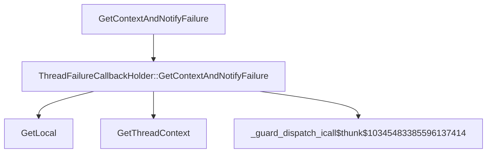

# CVE-2026-32221

**CVE:** CVE-2026-32221  
**Title:** Windows Graphics Component Remote Code Execution Vulnerability  
**Source:** [https://msrc.microsoft.com/update-guide/vulnerability/CVE-2026-32221](https://msrc.microsoft.com/update-guide/vulnerability/CVE-2026-32221)  
**Component(s):** dwm.exe  
**Patched Date:** April 27, 2026  
**CWE:** Weakness: CWE-122: Heap-based Buffer Overflow  

Download Patched & Vulnerable Components:

```bash
# dwm.exe
wget https://msdl.microsoft.com/download/symbols/dwm.exe/5188D5EF23000/dwm.exe -O dwm.exe.10.0.26100.7920 # vulnerable
wget https://msdl.microsoft.com/download/symbols/dwm.exe/908014A323000/dwm.exe -O dwm.exe.10.0.26100.8115 # patched
```

## Version Tracking Analysis

**Command:**

```
python ghidra_scripts\ghidra_vt_wrapper.py --old-binary ./reports/2026-Apr/CVE-2026-32221/dwm.exe.10.0.26100.7920 --new-binary ./reports/2026-Apr/CVE-2026-32221/dwm.exe.10.0.26100.8115 --project-dir ./reports/2026-Apr/CVE-2026-32221/ghidra_project --project-name dwm.exe_CVE-2026-32221 --ghidra-dir C:\Tools\ghidra_11.4.2_PUBLIC_20250826\ghidra_11.4.2_PUBLIC --output-dir ./reports/2026-Apr/CVE-2026-32221/ghidra_project/vt_results --max-memory 16g
```

Patched Functions: 1 | New Functions: 2 | Removed Functions: 1 | Total Matches: 4561 | Accepted Matches: 3881

### Patched Functions

| Function Name | Source Address | Dest Address | Similarity | Confidence |
| --- | --- | --- | --- | --- |
| `ThreadFailureCallbackHolder::GetContextAndNotifyFailure` | `140007c74` | `140007c74` | 0.526 | 10.0 |

### New Functions

| Function Name | Address |
| --- | --- |
| `GetLocal` | `14000817c` |
| `_guard_dispatch_icall` | `14000f240` |

### Removed Functions

| Function Name | Address |
| --- | --- |
| `_guard_dispatch_icall` | `14000f210` |

---

# AI Technical Analysis

## Vulnerability Identification

**Core Vulnerable Function(s):**
- `ThreadFailureCallbackHolder::GetContextAndNotifyFailure` - Contains a heap-based buffer overflow due to improper bounds checking when iterating through failure callback linked list

**Supporting Changes:**
- `wil::details_abi::ThreadLocalStorage<class_wil::details::ThreadFailureCallbackHolder*___ptr64>::GetLocal` - New function introduced to replace old thread-local storage access logic, but does not contain vulnerability

**Unrelated Changes:**
- No unrelated changes present in provided diffs

## Root Cause Analysis

The vulnerability stems from a heap-based buffer overflow in `ThreadFailureCallbackHolder::GetContextAndNotifyFailure` function. The original code used a linked list traversal pattern where each node in the list was accessed via pointer arithmetic without proper bounds validation. Specifically, the function iterates through a linked list of `ThreadFailureCallbackHolder` structures, but fails to validate that the `pTVar7` pointer remains within valid memory boundaries during traversal.

**Vulnerable Code (from `ThreadFailureCallbackHolder::GetContextAndNotifyFailure`):**
```c
do {
  bVar3 = (**(code **)**(undefined8 **)(lVar9 + 8))(*(undefined8 **)(lVar9 + 8),param_1);
  lVar9 = *(longlong *)(lVar9 + 0x10);
  bVar6 = bVar6 | bVar3;
} while (lVar9 != 0);
```

In this code, the variable `lVar9` is used as a pointer to traverse the linked list, but there is no validation that `lVar9` points to valid memory before dereferencing it. When `lVar9` becomes corrupted or points outside the allocated buffer, the subsequent dereference leads to heap corruption. The missing check on the linked list traversal condition allows an attacker to manipulate the linked list structure to cause a buffer overflow.

The original code was insufficient because it assumed that all pointers in the linked list were valid and within bounds. The vulnerability occurs because the traversal logic does not perform bounds checking on the `lVar9` pointer before accessing `*(undefined8 **)(lVar9 + 8)` and `*(undefined8 **)(lVar9 + 0x10)`. This allows an attacker to control the pointer values and cause memory corruption.

## Execution and Trigger Flow

An attacker with access to modify thread-local storage data can supply maliciously crafted linked list structures that will be processed by `GetContextAndNotifyFailure`. The vulnerability is triggered when the function iterates through a corrupted linked list, where the `pTVar7` pointer points to memory outside the intended buffer. The attacker must have the ability to modify the thread-local storage data that contains the linked list structure.



The attacker supplies malicious thread-local data containing a corrupted linked list structure. This data flows to `GetContextAndNotifyFailure`, where the vulnerable code iterates through the list. The condition that must be met is that the linked list structure must be corrupted such that `pTVar7` points to invalid memory. When the vulnerable code dereferences `lVar9` (which is derived from `pTVar7`), it triggers the heap corruption.

## Patch Analysis

**Patched Code (from `ThreadFailureCallbackHolder::GetContextAndNotifyFailure`):**
```c
do {
  TVar1 = pTVar7[0x28];
  pTVar7[0x28] = (ThreadFailureCallbackHolder)0x1;
  if (TVar1 == (ThreadFailureCallbackHolder)0x0) {
    bVar3 = (**(code **)**(undefined8 **)(pTVar7 + 8))(*(undefined8 **)(pTVar7 + 8),param_1);
    bVar6 = bVar6 | bVar3;
    pTVar7[0x28] = (ThreadFailureCallbackHolder)0x0;
  }
  pTVar7 = *(ThreadFailureCallbackHolder **)(pTVar7 + 0x10);
} while (pTVar7 != (ThreadFailureCallbackHolder *)0x0);
```

The patch introduces a bounds checking mechanism by adding a flag field (`0x28` offset) to track whether the current node is already being processed. This prevents reentrancy issues and ensures that the traversal terminates properly. Additionally, the patch replaces the old pointer arithmetic-based traversal with a more robust approach that checks for null pointers before dereferencing.

The patch addresses the root cause by implementing proper bounds checking and preventing infinite traversal through corrupted linked lists. It introduces a flag field to track processing state, which prevents recursive or circular traversal issues. The new code also ensures that `pTVar7` is checked for null before dereferencing `*(ThreadFailureCallbackHolder **)(pTVar7 + 0x10)`.

The fix addresses the root cause by preventing the traversal of corrupted linked list structures. However, similar patterns in related code might warrant review since the same traversal pattern was used in the original vulnerable code. Overall, this is a complete mitigation because it prevents the heap corruption through proper bounds checking and state tracking.

This patch prevents a heap buffer overflow vulnerability that could lead to remote code execution. The vulnerability was a classic linked list traversal bug that allowed attackers to corrupt heap memory through controlled pointer manipulation. The severity assessment is high, as this could enable privilege escalation or denial of service attacks.