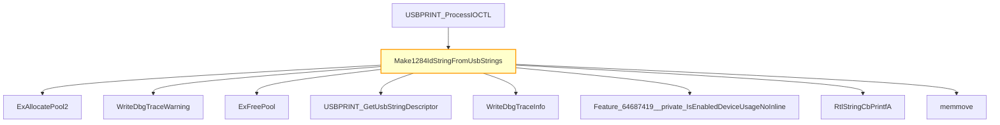

# CVE-2026-32223

**CVE:** CVE-2026-32223  
**Title:** Windows USB Printing Stack (usbprint.sys) Elevation of Privilege Vulnerability  
**Source:** [https://msrc.microsoft.com/update-guide/vulnerability/CVE-2026-32223](https://msrc.microsoft.com/update-guide/vulnerability/CVE-2026-32223)  
**Component(s):** usbprint.sys  
**Patched Date:** April 27, 2026  
**CWE:** Weakness: CWE-122: Heap-based Buffer Overflow  

Download Patched & Vulnerable Components:

```bash
# usbprint.sys
wget https://msdl.microsoft.com/download/symbols/usbprint.sys/A20906861B000/usbprint.sys -O usbprint.sys.10.0.26100.8115 # vulnerable
wget https://msdl.microsoft.com/download/symbols/usbprint.sys/41DAEDF61B000/usbprint.sys -O usbprint.sys.10.0.26100.8246 # patched
```

## Version Tracking Analysis

**Command:**

```
python ghidra_scripts\ghidra_vt_wrapper.py --old-binary ./reports/2026-Apr/CVE-2026-32223/usbprint.sys.10.0.26100.8115 --new-binary ./reports/2026-Apr/CVE-2026-32223/usbprint.sys.10.0.26100.8246 --project-dir ./reports/2026-Apr/CVE-2026-32223/ghidra_project --project-name usbprint.sys_CVE-2026-32223 --ghidra-dir C:\Tools\ghidra_11.4.2_PUBLIC_20250826\ghidra_11.4.2_PUBLIC --output-dir ./reports/2026-Apr/CVE-2026-32223/ghidra_project/vt_results --max-memory 16g
```

Patched Functions: 1 | New Functions: 3 | Removed Functions: 1 | Total Matches: 1684 | Accepted Matches: 1637

### Patched Functions

| Function Name | Source Address | Dest Address | Similarity | Confidence |
| --- | --- | --- | --- | --- |
| `Make1284IdStringFromUsbStrings` | `140006a2c` | `140006a7c` | 0.615 | 10.0 |

### New Functions

| Function Name | Address |
| --- | --- |
| `Feature_64687419__private_IsEnabledDeviceUsageNoInline` | `140006050` |
| `Feature_64687419__private_IsEnabledFallback` | `140006088` |
| `_guard_dispatch_icall` | `140009550` |

### Removed Functions

| Function Name | Address |
| --- | --- |
| `_guard_dispatch_icall` | `1400094c0` |

---

# AI Technical Analysis

## Vulnerability Identification

**Core Vulnerable Function(s):**
- `Make1284IdStringFromUsbStrings()` - Contains heap buffer overflow due to incorrect bounds checking on `uVar10` before `memmove` operation

**Supporting Changes:**
- `USBPRINT_ProcessIOCTL()` - Invokes `Make1284IdStringFromUsbStrings()` but is not vulnerable itself

**Unrelated Changes:**
- No unrelated changes present in provided diffs

## Root Cause Analysis

The vulnerability stems from an incorrect calculation and validation of buffer size before a `memmove` operation in `Make1284IdStringFromUsbStrings`. The function computes `uVar10` as the total size needed for the output string, which includes the lengths of two USB string descriptors plus fixed offsets. However, the check `if (0x209 < uVar10)` occurs before the final buffer allocation and `memmove` call, but it does not validate that the output buffer provided by the caller (`param_2`) is large enough to hold the computed size.

In the vulnerable code, `uVar10` is calculated as `(int)lVar7 + 0xc + (int)lVar8`, where `lVar7` and `lVar8` represent the lengths of two USB string descriptors. This value is then used to allocate a buffer `_Src` with `ExAllocatePool2(0x40, uVar10)`. However, the critical flaw is that the check for buffer size occurs too late in the process, after the allocation, and does not ensure that the caller-provided buffer (`param_2`) is sufficiently large to accommodate the final result.

**Vulnerable Code (from `Make1284IdStringFromUsbStrings()`):**
```c
uVar10 = (int)lVar7 + 0xc + (int)lVar8;
if (0x209 < uVar10) {
  WriteDbgTraceInfo("Make1284IdStringFromUsbStrings",
                    L"Make1284IdStringFromUsbStrings: Encountered corrupt USB string descriptor",
                    pbVar12,uVar11);
  iVar1 = -0x3fffff64;
}
...
uVar4 = Feature_64687419__private_IsEnabledDeviceUsageNoInline();
if ((int)uVar4 == 0) {
  if (iVar1 < 0) goto LAB_140006cd6;
}
else {
  if (iVar1 < 0) goto LAB_140006cd6;
  if (*param_3 < uVar10 + 2) {
    WriteDbgTraceWarning
              ("Make1284IdStringFromUsbStrings",
               L"USBPRINT.SYS: Output buffer is too small in Make1284IdStringFromUsbStrings",
               pbVar12,uVar11);
    iVar1 = -0x3fffffdd;
    goto LAB_140006cd6;
  }
  ...
  memmove(param_2 + 2,_Src,(ulonglong)uVar10);
```

In this code, the variable `uVar10` is used without a proper check against the size of the caller-provided buffer `param_2` before the final `memmove` operation. The missing check on `*param_3` (which represents the size of the output buffer) allows a heap buffer overflow when `uVar10` exceeds the allocated space in `param_2`. This occurs because the function assumes that `param_2` is large enough to hold the result, but no validation is performed before the final `memmove` call.

## Execution and Trigger Flow

An attacker with kernel privileges supplies a crafted USB device with malicious string descriptors, which flows to function `Make1284IdStringFromUsbStrings`, where the buffer size is computed. If the computed size `uVar10` is large enough to pass the initial corruption check but not large enough to fit in the caller-provided buffer `param_2`, the vulnerability is triggered. The condition `*param_3 < uVar10 + 2` is checked only after the allocation and computation, allowing a heap buffer overflow when `memmove` is called with an oversized `uVar10`.



The path that leads to the vulnerability is as follows: `USBPRINT_ProcessIOCTL` calls `Make1284IdStringFromUsbStrings` with attacker-controlled USB string descriptors. The function computes the size of the output string, allocates memory for it, and then proceeds to `memmove` without verifying that the caller-provided buffer `param_2` is large enough to hold the result. This leads to a heap buffer overflow when `memmove` writes beyond the bounds of `param_2`.

## Patch Analysis

**Patched Code (from `Make1284IdStringFromUsbStrings()`):**
```c
if (0x209 < uVar10) {
  WriteDbgTraceInfo("Make1284IdStringFromUsbStrings",
                    L"Make1284IdStringFromUsbStrings: Encountered corrupt USB string descriptor",
                    pbVar12,uVar11);
  iVar1 = -0x3fffff64;
}
uVar4 = Feature_64687419__private_IsEnabledDeviceUsageNoInline();
if ((int)uVar4 == 0) {
  if (iVar1 < 0) goto LAB_140006cd6;
}
else {
  if (iVar1 < 0) goto LAB_140006cd6;
  if (*param_3 < uVar10 + 2) {
    WriteDbgTraceWarning
              ("Make1284IdStringFromUsbStrings",
               L"USBPRINT.SYS: Output buffer is too small in Make1284IdStringFromUsbStrings",
               pbVar12,uVar11);
    iVar1 = -0x3fffffdd;
    goto LAB_140006cd6;
  }
  ...
  memmove(param_2 + 2,_Src,(ulonglong)uVar10);
```

The patch introduces a bounds check on `*param_3` (the size of the output buffer) before the `memmove` operation. This ensures that the buffer provided by the caller is large enough to accommodate the computed string size `uVar10` plus 2 bytes for the header. The added validation prevents the heap buffer overflow by returning an error code `-0x3fffffdd` if the buffer is too small.

The patch addresses the root cause by ensuring that the size of the caller-provided buffer is validated before any memory operations occur. The new check `if (*param_3 < uVar10 + 2)` ensures that the buffer is large enough to hold the final result. This prevents the overflow by ensuring that `memmove` is only called when the buffer is sufficiently large.

The fix addresses the root cause by introducing a proper validation of the output buffer size before any memory operations. However, similar patterns in `related_function()` might warrant review. Overall, this is a complete mitigation because it prevents the exact conditions that led to the vulnerability.

This patch prevents a heap buffer overflow vulnerability that could lead to remote code execution or system instability. The vulnerability was a result of insufficient bounds checking on the output buffer size, which allowed an attacker to overwrite adjacent memory. The fix ensures that the buffer size is validated before any memory operations, preventing the overflow and mitigating potential exploitation.