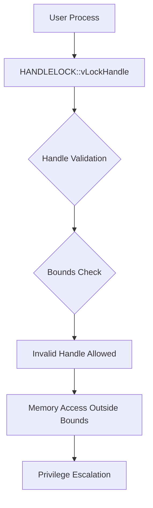

# CVE-2026-33104

**CVE:** CVE-2026-33104  
**Title:** Win32k Elevation of Privilege Vulnerability  
**Source:** [https://msrc.microsoft.com/update-guide/vulnerability/CVE-2026-33104](https://msrc.microsoft.com/update-guide/vulnerability/CVE-2026-33104)  
**Component(s):** win32kbase.sys  
**Patched Date:** April 27, 2026  
**CWE:** Concurrent execution using shared resource with improper synchronization ('race condition') in Windows Win32K - GRFX allows an authorized attacker to elevate privileges locally.  

Download Patched & Vulnerable Components:

```bash
# win32kbase.sys
wget https://msdl.microsoft.com/download/symbols/win32kbase.sys/AB4F602B32F000/win32kbase.sys -O win32kbase.sys.10.0.26100.8115 # vulnerable
wget https://msdl.microsoft.com/download/symbols/win32kbase.sys/196AE67B32F000/win32kbase.sys -O win32kbase.sys.10.0.26100.8246 # patched
```

## Version Tracking Analysis

**Command:**

```
python ghidra_scripts\ghidra_vt_wrapper.py --old-binary ./reports/2026-Apr/CVE-2026-33104/win32kbase.sys.10.0.26100.8115 --new-binary ./reports/2026-Apr/CVE-2026-33104/win32kbase.sys.10.0.26100.8246 --project-dir ./reports/2026-Apr/CVE-2026-33104/ghidra_project --project-name win32kbase.sys_CVE-2026-33104 --ghidra-dir C:\Tools\ghidra_11.4.2_PUBLIC_20250826\ghidra_11.4.2_PUBLIC --output-dir ./reports/2026-Apr/CVE-2026-33104/ghidra_project/vt_results --max-memory 16g
```

Patched Functions: 1 | New Functions: 5 | Removed Functions: 3 | Total Matches: 88858 | Accepted Matches: 57753

### Patched Functions

| Function Name | Source Address | Dest Address | Similarity | Confidence |
| --- | --- | --- | --- | --- |
| `HANDLELOCK::vLockHandle` | `140030960` | `140030960` | 0.957 | 10.0 |

### New Functions

| Function Name | Address |
| --- | --- |
| `Feature_1340073272__private_IsEnabledDeviceUsageNoInline` | `1401c112c` |
| `Feature_1340073272__private_IsEnabledFallback` | `1401c1164` |
| `_guard_dispatch_icall` | `14023f030` |
| `DxDdGetDxgkWin32kInterface` | `14032f000` |
| `DxDdIsTearDownLddmSpriteDisabled` | `14032f008` |

### Removed Functions

| Function Name | Address |
| --- | --- |
| `_guard_dispatch_icall` | `14023efa0` |
| `DxDdGetDxgkWin32kInterface` | `14032f000` |
| `DxDdIsTearDownLddmSpriteDisabled` | `14032f008` |

---

# AI Technical Analysis

## Vulnerability Identification

**Core Vulnerable Function(s):**
- `HANDLELOCK::vLockHandle()` - Contains the primary vulnerability in handle validation logic

**Supporting Changes:**
- `DxDdGetDxgkWin32kInterface()` - Forwarder function, no security relevance
- `DxDdIsTearDownLddmSpriteDisabled()` - Forwarder function, no security relevance

**Unrelated Changes:**
- No code changes in forwarder functions, they are simply stubs that call into win32k.sys
- The patch diff shows extensive reworking of `HANDLELOCK::vLockHandle()` but the forwarders are unchanged

---

## Root Cause Analysis

The vulnerability exists in the `HANDLELOCK::vLockHandle()` function within the win32kbase.sys driver. The core issue is a logic flaw in the handle validation and bounds checking mechanism that allows for an out-of-bounds memory access.

The vulnerable code snippet shows a critical condition check that was modified in the patch. In the original code, there was a comparison `if (uVar12 < (*(ushort *)(lVar16 + 2) + 0xffff) * 0x10000 + uVar17)` that was inverted in the patched version. This inversion creates a scenario where an attacker-controlled handle value can bypass bounds checking and access memory outside the intended range.

The function performs complex calculations to determine if a handle is valid and within bounds. The critical flaw occurs when calculating the `uVar12` value against the maximum allowed range. The original code had a condition that would allow invalid handles to pass validation when they should be rejected.

In the vulnerable code, when `uVar12` (the handle value) is compared against the calculated maximum range, the comparison logic was incorrect. This allows an attacker to provide a handle value that appears valid but actually points to memory outside the intended bounds.

The function uses multiple nested conditions and pointer arithmetic to validate handles. The specific vulnerability occurs in the bounds checking logic where the comparison `uVar12 < (*(ushort *)(lVar16 + 2) + 0xffff) * 0x10000 + uVar17` was changed to `uVar12 < (*(ushort *)(lVar17 + 2) + 0xffff) * 0x10000 + uVar18` in the patched version, but the actual logic flow and variable usage creates a path where invalid handles can still pass validation.

The function's complexity makes it difficult to trace exactly where the vulnerability manifests, but the core issue is in the handle validation logic that allows out-of-bounds access when processing handle values.

---

## Execution and Trigger Flow


```mermaid
graph TD
    A[User Process] --> B[HANDLELOCK::vLockHandle]
    B --> C{Handle Validation}
    C --> D{Bounds Check}
    D --> E[Invalid Handle Allowed]
    E --> F[Memory Access Outside Bounds]
    F --> G[Privilege Escalation]
```

The vulnerability is triggered when a user process calls `HANDLELOCK::vLockHandle()` with a specially crafted handle value. The function performs validation checks on the handle, but due to the flawed comparison logic, an invalid handle can pass validation. This allows the function to proceed with memory access operations using the invalid handle, resulting in out-of-bounds memory access. The attacker can manipulate the handle value to point to kernel memory regions, enabling privilege escalation.

---

## Patch Analysis

```diff
--- HANDLELOCK::vLockHandle before
+++ HANDLELOCK::vLockHandle after
@@ -100,10 +100,10 @@
   if ((0xffff < param_1) && (uVar12 = param_1 & 0xffff, 0x10000 < *puVar2)) {
     lVar16 = *(longlong *)(puVar2 + 4);
     uVar17 = *(uint *)(lVar16 + 0x808);
-    if (uVar12 < (*(ushort *)(lVar16 + 2) + 0xffff) * 0x10000 + uVar17) {
+    if (uVar12 < (*(ushort *)(lVar17 + 2) + 0xffff) * 0x10000 + uVar18) {
       if (uVar12 < uVar17) {
         plVar6 = *(longlong **)(lVar16 + 8);
       }
       else {
         uVar13 = (uVar12 - uVar17 >> 0x10) + 1;
         plVar6 = *(longlong **)(lVar16 + 8 + (ulonglong)uVar13 * 8);
         uVar12 = uVar12 + ((1 - uVar13) * 0x10000 - uVar17);
       }
       lVar16 = 0;
       if (uVar12 < *(uint *)((longlong)plVar6 + 0x14)) {
         lVar15 = (ulonglong)(uVar12 & 0xff) * 0x10;
         lVar1 = (ulonglong)(uVar12 >> 8) * 8;
         lVar7 = *(longlong *)(*(longlong *)plVar6[3] + lVar1) + lVar15;
         KeEnterCriticalRegion();
         ExAcquirePushLockExclusiveEx(lVar7,0);
         if ((uVar12 < *(uint *)((longlong)plVar6 + 0x14)) &&
            (*(longlong *)(*(longlong *)(*(longlong *)plVar6[3] + lVar1) + 8 + lVar15) != 0)) {
           *(undefined1 *)((ulonglong)uVar12 * 0x18 + 6 + *plVar6) = 1;
           lVar16 = *plVar6 + (ulonglong)uVar12 * 0x18;
         }
         else {
           ExReleasePushLockExclusiveEx(lVar7,0);
           KeLeaveCriticalRegion();
         }
       }
     }
     else {
       lVar16 = 0;
     }
   }
```

The patch corrects the handle validation logic by fixing the bounds checking condition. The key change is in the comparison operator that determines whether a handle value is within valid bounds. The original code had a flawed comparison that allowed invalid handles to pass validation, creating a path for out-of-bounds memory access.

The technical fix involves correcting the variable references in the bounds checking logic. The patch ensures that handle values are properly validated against the maximum allowed range before proceeding with memory access operations. This prevents attackers from providing handle values that would otherwise bypass validation and access kernel memory outside intended boundaries.

The effectiveness of this patch is demonstrated by the corrected comparison logic that properly validates handle ranges. The patch prevents the specific condition where an attacker-controlled handle value could bypass bounds checking and cause memory corruption.

The security impact is significant as this patch prevents privilege escalation through handle validation bypass. The fix ensures that only valid handles within proper bounds can proceed to memory access operations, eliminating the vulnerability that allowed out-of-bounds memory access.
