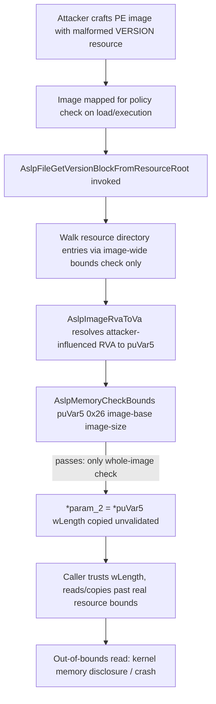

# CVE-2026-54113

**CVE:** CVE-2026-54113  
**Title:** Remote Procedure Call Denial of Service Vulnerability  
**Source:** [https://msrc.microsoft.com/update-guide/vulnerability/CVE-2026-54113](https://msrc.microsoft.com/update-guide/vulnerability/CVE-2026-54113)  
**Component(s):** ntoskrnl.exe  
**Patched Date:** 2026-08-11T07:00:00  
**CWE:** Allocation of resources without limits or throttling in Windows Kernel allows an unauthorized attacker to deny service over a network.  

---

## Related CVEs (Same Component)

This report covers 9 CVEs affecting the same component(s):

- **CVE-2026-54113**  
- CVE-2026-61930  
- CVE-2026-62737  
- CVE-2026-61929  
- CVE-2026-62708  
- CVE-2026-62749  
- CVE-2026-62780  
- CVE-2026-62788  
- CVE-2026-65773  

### Detailed Information

#### CVE-2026-61930

**Title:** Windows Kernel Elevation of Privilege Vulnerability  
**Source:** [https://msrc.microsoft.com/update-guide/vulnerability/CVE-2026-61930](https://msrc.microsoft.com/update-guide/vulnerability/CVE-2026-61930)  
**Patched Date:** 2026-08-11T07:00:00  
**CWE:** Heap-based buffer overflow in Windows Kernel allows an authorized attacker to elevate privileges locally.  

#### CVE-2026-62737

**Title:** Windows Kernel Elevation of Privilege Vulnerability  
**Source:** [https://msrc.microsoft.com/update-guide/vulnerability/CVE-2026-62737](https://msrc.microsoft.com/update-guide/vulnerability/CVE-2026-62737)  
**Patched Date:** 2026-08-11T07:00:00  
**CWE:** Untrusted pointer dereference in Windows Kernel allows an authorized attacker to elevate privileges locally.  

#### CVE-2026-61929

**Title:** Windows Kernel Elevation of Privilege Vulnerability  
**Source:** [https://msrc.microsoft.com/update-guide/vulnerability/CVE-2026-61929](https://msrc.microsoft.com/update-guide/vulnerability/CVE-2026-61929)  
**Patched Date:** 2026-08-11T07:00:00  
**CWE:** Use after free in Windows Kernel allows an authorized attacker to elevate privileges locally.  

#### CVE-2026-62708

**Title:** Windows Kernel Elevation of Privilege Vulnerability  
**Source:** [https://msrc.microsoft.com/update-guide/vulnerability/CVE-2026-62708](https://msrc.microsoft.com/update-guide/vulnerability/CVE-2026-62708)  
**Patched Date:** 2026-08-11T07:00:00  
**CWE:** Use after free in Windows Kernel allows an unauthorized attacker to elevate privileges with a physical attack.  

#### CVE-2026-62749

**Title:** Windows Kernel Elevation of Privilege Vulnerability  
**Source:** [https://msrc.microsoft.com/update-guide/vulnerability/CVE-2026-62749](https://msrc.microsoft.com/update-guide/vulnerability/CVE-2026-62749)  
**Patched Date:** 2026-08-11T07:00:00  
**CWE:** Use after free in Windows Kernel allows an authorized attacker to elevate privileges locally.  

#### CVE-2026-62780

**Title:** Windows Kernel Elevation of Privilege Vulnerability  
**Source:** [https://msrc.microsoft.com/update-guide/vulnerability/CVE-2026-62780](https://msrc.microsoft.com/update-guide/vulnerability/CVE-2026-62780)  
**Patched Date:** 2026-08-11T07:00:00  
**CWE:** Use after free in Windows Kernel allows an authorized attacker to elevate privileges locally.  

#### CVE-2026-62788

**Title:** Windows Kernel Elevation of Privilege Vulnerability  
**Source:** [https://msrc.microsoft.com/update-guide/vulnerability/CVE-2026-62788](https://msrc.microsoft.com/update-guide/vulnerability/CVE-2026-62788)  
**Patched Date:** 2026-08-11T07:00:00  
**CWE:** Use after free in Windows Kernel allows an authorized attacker to elevate privileges locally.  

#### CVE-2026-65773

**Title:** Windows Kernel Elevation of Privilege Vulnerability  
**Source:** [https://msrc.microsoft.com/update-guide/vulnerability/CVE-2026-65773](https://msrc.microsoft.com/update-guide/vulnerability/CVE-2026-65773)  
**Patched Date:** 2026-08-11T07:00:00  
**CWE:** Improper access control in Windows Kernel allows an authorized attacker to elevate privileges locally.  

---

Download Patched & Vulnerable Components:

```bash
# ntoskrnl.exe
wget https://msdl.microsoft.com/download/symbols/ntoskrnl.exe/51A135D91450000/ntoskrnl.exe -O ntoskrnl.exe.10.0.26100.8972 # vulnerable
wget https://msdl.microsoft.com/download/symbols/ntoskrnl.exe/BA71B4FD1450000/ntoskrnl.exe -O ntoskrnl.exe.10.0.26100.9168 # patched
```

## Version Tracking Analysis

**Command:**

```
python ghidra_scripts\ghidra_vt_wrapper.py --old-binary ./reports/2026-Aug/CVE-2026-54113/ntoskrnl.exe.10.0.26100.8972 --new-binary ./reports/2026-Aug/CVE-2026-54113/ntoskrnl.exe.10.0.26100.9168 --project-dir ./reports/2026-Aug/CVE-2026-54113/ghidra_project --project-name ntoskrnl.exe_CVE-2026-54113 --ghidra-dir C:\Tools\ghidra_11.4.2_PUBLIC_20250826\ghidra_11.4.2_PUBLIC --output-dir ./reports/2026-Aug/CVE-2026-54113/ghidra_project/vt_results --max-memory 16g
```

Patched Functions: 12 | New Functions: 2302 | Removed Functions: 2289 | Total Matches: 820793 | Accepted Matches: 193136

### Patched Functions

*Showing top 10 of 12 patched functions*

| Function Name | Source Address | Dest Address | Similarity | Confidence |
| --- | --- | --- | --- | --- |
| `IaLpssPciSetPower` | `1406a5b18` | `1406a5f68` | 0.927 | 10.0 |
| `Uart16550GetByte` | `1406a5f70` | `1406a63c0` | 0.881 | 10.0 |
| `IopfCompleteRequest` | `1403c8670` | `1403c8300` | 0.863 | 10.0 |
| `CmpLazyFlushDpcRoutine$filt$1` | `1406ce7d2` | `1406cebd2` | 0.810 | 10.0 |
| `MiAsyncSlabReplenish` | `14049bec8` | `14049bbe8` | 0.784 | 10.0 |
| `AslpFileGetVersionBlockFromResourceRoot` | `14081001c` | `1408100ec` | 0.775 | 10.0 |
| `IopCopyCompleteReadRequest` | `14025f530` | `1404dc570` | 0.762 | 10.0 |
| `SepAdjustPrivileges` | `140985300` | `140984bf0` | 0.691 | 10.0 |
| `MiDeleteWorkingSetList` | `14047e750` | `14047e470` | 0.620 | 10.0 |
| `EtwTelemetryCoverageReport` | `14044f850` | `14044f570` | 0.593 | 10.0 |

### New Functions

*Showing 10 of 2302 new functions*

| Function Name | Address |
| --- | --- |
| `FUN_14021d763` | `14021d763` |
| `thunk_FUN_1406e3c97` | `1403e8a43` |
| `FUN_1403f0030` | `1403f0030` |
| `FUN_140483f86` | `140483f86` |
| `FUN_14049cc63` | `14049cc63` |
| `FUN_14057f752` | `14057f752` |
| `Feature_3043197241__private_IsEnabledDeviceUsageNoInline` | `140592d48` |
| `Feature_3043197241__private_IsEnabledFallback` | `140592d80` |
| `Feature_1565498680__private_IsEnabledDeviceUsageNoInline` | `1405938a4` |
| `Feature_1565498680__private_IsEnabledFallback` | `1405938dc` |

### Removed Functions

*Showing 10 of 2289 removed functions*

| Function Name | Address |
| --- | --- |
| `FUN_14021d763` | `14021d763` |
| `thunk_FUN_1406e39a5` | `1403e8d23` |
| `FUN_1403f0310` | `1403f0310` |
| `FUN_140484266` | `140484266` |
| `FUN_14049cf43` | `14049cf43` |
| `FUN_14057f5e2` | `14057f5e2` |
| `FUN_1405b4cc2` | `1405b4cc2` |
| `thunk_FUN_1406a6fa4` | `1406a6fa2` |
| `FUN_1406a6fa4` | `1406a6fa4` |
| `FUN_1406abaec` | `1406abaec` |

---

# AI Technical Analysis

## Vulnerability Identification

**Core Vulnerable Function(s):**
- `AslpFileGetVersionBlockFromResourceRoot()` - fails to
  validate that the located VERSION resource block's
  self-declared length lies within the actual resource data
  entry, checking only that the pointer falls somewhere
  inside the overall mapped image.

**Supporting Changes:**
- None of the other provided functions call into or are
  called by `AslpFileGetVersionBlockFromResourceRoot()`; no
  caller/check relationship is present in the supplied diffs.

**Unrelated Changes:**
- `KiApplyProcessorErrata()` - adds a third, feature-gated
  CPU errata (MSR 0xc0011028) workaround; a hardware
  compatibility change, not a memory-safety fix.
- `EtwTelemetryCoverageReport()` - purely cosmetic; local
  variable renames (`auStack_*` to `local_*`) and updated
  jump-label/address constants from recompilation, with no
  logic change.
- `CmpLazyFlushDpcRoutine$filt$1()` - empty diff; no change.
- `SepAdjustPrivileges()` / `SepTryAddUniqueAuditPrivilege()`
  - reworks how adjusted privileges are recorded for auditing
  (deduplication via the new helper) in the token-privilege
  subsystem; unrelated code path to resource/version parsing.
- `thunk_FUN_1406e3c97()`, `thunk_FUN_1406a73f4()`,
  `IopQueuePairedCopyWriteIrp()`, `IopQueueIrpForServiceTail()`
  - new I/O-manager helper/thunk routines with no relation to
  the resource-parsing code path.

---

## Root Cause Analysis

The flaw is a missing scope check: the function validates
that a pointer is *somewhere inside the mapped image* but
never validates it is inside the *specific resource entry*
it was derived from, nor validates the attacker-controlled
length field read from that pointer. This violates the
implicit invariant that a "resource data length" returned to
a caller must be bounded by the resource's real allocation,
not merely by the module's overall address range.

Vulnerable code (before):

```c
cVar3 = AslpMemoryCheckBounds((ulonglong)*(uint *)(psVar6 + 2) + param_3,iVar4,uVar8,uVar2);
if (cVar3 != '\0') {
  iVar4 = AslpFileGetImageNtHeader(&local_res18,param_4);
  if (-1 < iVar4) {
    cVar3 = AslpMemoryCheckBounds(local_res18,8,uVar8,uVar2);
    if (cVar3 != '\0') {
      puVar5 = (ushort *)AslpImageRvaToVa();
      cVar3 = AslpMemoryCheckBounds(puVar5,0x26,uVar8,uVar2);
      if (cVar3 != '\0') {
        *param_1 = puVar5;
        *param_2 = (ulonglong)*puVar5;
        return 0;
      }
      ...
```

`puVar5` is computed via `AslpImageRvaToVa()` from an RVA
taken out of an attacker-influenced resource directory entry
(`param_3` is the mapped resource-directory root; the RVA
chain is walked using offsets read directly from that
structure). The only gate before trusting `puVar5` is
`AslpMemoryCheckBounds(puVar5, 0x26, uVar8, uVar2)`, where
`uVar8`/`uVar2` are the whole image's base and size (taken
from `*(undefined8 *)(param_4 + 0x20)` /
`+ 0x28`). This confirms only that the first `0x26` (38)
bytes at `puVar5` fall somewhere inside the loaded module -
it says nothing about whether those bytes actually belong to
the resource entry that was supposedly found. Immediately
after, `*param_2 = (ulonglong)*puVar5;` copies out the
first 16-bit field of that structure - the `wLength` of a
`VS_VERSIONINFO`/`VS_FIXEDFILEINFO`-style block - verbatim
into an out-parameter that callers treat as a validated,
trustworthy size for subsequent reads/copies of the version
block. Because `wLength` is attacker-controlled resource
content and was never checked against the resource's actual
declared `Size` field, a crafted resource can report an
arbitrarily large length while occupying a much smaller
actual allocation.

---

## Execution and Trigger Flow

An attacker supplies a crafted PE image (executable, DLL, or
driver) containing a manipulated resource directory and a
VERSION resource whose `wLength` field does not match the
resource's true allocated size. When this image is evaluated
by kernel-mode publisher-rule/policy logic (e.g. AppLocker or
Software Restriction Policy checks performed during process
or driver image load), that logic maps the file and invokes
`AslpFileGetVersionBlockFromResourceRoot()` with `param_3`
pointing at the mapped resource directory and `param_4`
describing the image's base/size for bounds checks. The
function walks resource directory entries, validating each
step only against the coarse whole-image bounds via
`AslpMemoryCheckBounds`, and follows RVAs supplied by the
attacker's resource structure to locate the version-block
leaf. It resolves the leaf's RVA to a virtual address with
`AslpImageRvaToVa()`, confirms only that 38 bytes there sit
inside the module, and returns that pointer together with the
unvalidated `wLength` value taken from the resource itself.
The caller then uses the returned length to read or copy the
"version block," walking past the genuine resource boundary
into adjacent kernel image memory - an out-of-bounds read
whose size and location are effectively attacker-chosen,
usable for kernel memory disclosure or to crash the system.



---

## Patch Analysis

Patched code adds two additional validation stages after the
original image-wide check, gated by
`Feature_261863737__private_IsEnabledDeviceUsageNoInline()`:

```diff
       puVar5 = (ushort *)AslpImageRvaToVa();
       cVar3 = AslpMemoryCheckBounds(puVar5,0x26,uVar9,uVar2);
-      if (cVar3 != '\0') {
+      if (cVar3 == '\0') {
+        pcVar10 = "Found version block root but it was out of image bounds";
+        uVar9 = 0x8c3;
+      }
+      else {
+        iVar4 = Feature_261863737__private_IsEnabledDeviceUsageNoInline();
+        if (iVar4 == 0) {
+LAB_14081034e:
           *param_1 = puVar5;
           *param_2 = (ulonglong)*puVar5;
           return 0;
         }
-        pcVar9 = "Found version block root but it was out of image bounds";
-        uVar8 = 0x8c1;
-        goto LAB_1408100a5;
+        cVar3 = AslpMemoryCheckBounds
+                  (puVar5,0x26,puVar5,*(undefined4 *)((ulonglong)uVar1 + param_3 + 4));
+        if (cVar3 == '\0') {
+          pcVar10 = "Found version block root but it was out of resource bounds";
+          uVar9 = 0x8c9;
+        }
+        else {
+          cVar3 = AslpMemoryCheckBounds();
+          if (cVar3 != '\0') goto LAB_14081034e;
+          pcVar10 = "Found version block with invalid total length";
+          uVar9 = 0x8ce;
+        }
       }
```

The first new call re-runs `AslpMemoryCheckBounds()`, but
this time with the resource entry's own base and its declared
`Size` field (`*(undefined4 *)((ulonglong)uVar1 + param_3 +
4)`) as the bounds, rather than the whole image - directly
enforcing that the version block root actually resides inside
the specific resource it claims to come from. The second new
call (parameterless in the decompilation, implying an
overload validating the block's internal `wLength` against
the just-confirmed resource size) rejects version blocks that
declare a total length exceeding their real resource
allocation. Only when both new checks succeed does execution
reach the original `*param_1 = puVar5; *param_2 =
(ulonglong)*puVar5;` success path; any failure now logs a
descriptive error via `AslLogCallPrintf` and returns
`-0x3ffffdd2` instead of trusting attacker data.

This closes the gap identified in the root-cause analysis by
tying the returned length to a value that has now been
cross-checked against real resource boundaries, eliminating
the attacker's ability to report an inflated `wLength` for a
small resource. The staged rollout behind
`Feature_261863737__private_IsEnabledDeviceUsageNoInline()`
suggests a controlled deployment (telemetry-guarded feature
flag) rather than an unconditional fix, which is typical for
kernel-level hardening changes to reduce regression risk. The
fix is targeted and minimal, adding validation without
altering the resource-walking logic itself. Overall, this
patch converts an attacker-controlled, unvalidated
out-of-bounds read primitive in kernel-mode image/resource
parsing into a properly bounds-checked operation, removing a
kernel memory disclosure and crash vector reachable via a
maliciously crafted PE image's VERSION resource.