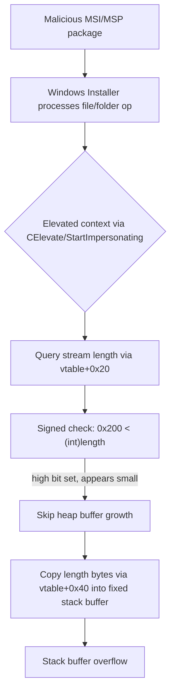

# CVE-2026-59127

**CVE:** CVE-2026-59127  
**Title:** Windows Installer Elevation of Privilege Vulnerability  
**Source:** [https://msrc.microsoft.com/update-guide/vulnerability/CVE-2026-59127](https://msrc.microsoft.com/update-guide/vulnerability/CVE-2026-59127)  
**Component(s):** msi.dll  
**Patched Date:** 2026-08-11T07:00:00  
**CWE:** Integer overflow or wraparound in Windows Installer allows an authorized attacker to elevate privileges locally.  

---

## Related CVEs (Same Component)

This report covers 9 CVEs affecting the same component(s):

- **CVE-2026-59127**  
- CVE-2026-61925  
- CVE-2026-70344  
- CVE-2026-70345  
- CVE-2026-70346  
- CVE-2026-70347  
- CVE-2026-61938  
- CVE-2026-62768  
- CVE-2026-65774  

### Detailed Information

#### CVE-2026-61925

**Title:** Windows Installer Elevation of Privilege Vulnerability  
**Source:** [https://msrc.microsoft.com/update-guide/vulnerability/CVE-2026-61925](https://msrc.microsoft.com/update-guide/vulnerability/CVE-2026-61925)  
**Patched Date:** 2026-08-11T07:00:00  
**CWE:** Incorrect authorization in Windows Installer allows an authorized attacker to elevate privileges locally.  

#### CVE-2026-70344

**Title:** Windows Installer Elevation of Privilege Vulnerability  
**Source:** [https://msrc.microsoft.com/update-guide/vulnerability/CVE-2026-70344](https://msrc.microsoft.com/update-guide/vulnerability/CVE-2026-70344)  
**Patched Date:** 2026-08-11T07:00:00  
**CWE:** Stack-based buffer overflow in Windows Installer allows an authorized attacker to elevate privileges locally.  

#### CVE-2026-70345

**Title:** Windows Installer Elevation of Privilege Vulnerability  
**Source:** [https://msrc.microsoft.com/update-guide/vulnerability/CVE-2026-70345](https://msrc.microsoft.com/update-guide/vulnerability/CVE-2026-70345)  
**Patched Date:** 2026-08-11T07:00:00  
**CWE:** Heap-based buffer overflow in Windows Installer allows an authorized attacker to elevate privileges locally.  

#### CVE-2026-70346

**Title:** Windows Installer Elevation of Privilege Vulnerability  
**Source:** [https://msrc.microsoft.com/update-guide/vulnerability/CVE-2026-70346](https://msrc.microsoft.com/update-guide/vulnerability/CVE-2026-70346)  
**Patched Date:** 2026-08-11T07:00:00  
**CWE:** Stack-based buffer overflow in Windows Installer allows an authorized attacker to elevate privileges locally.  

#### CVE-2026-70347

**Title:** Windows Installer Elevation of Privilege Vulnerability  
**Source:** [https://msrc.microsoft.com/update-guide/vulnerability/CVE-2026-70347](https://msrc.microsoft.com/update-guide/vulnerability/CVE-2026-70347)  
**Patched Date:** 2026-08-11T07:00:00  
**CWE:** Heap-based buffer overflow in Windows Installer allows an authorized attacker to elevate privileges locally.  

#### CVE-2026-61938

**Title:** Windows Installer Elevation of Privilege Vulnerability  
**Source:** [https://msrc.microsoft.com/update-guide/vulnerability/CVE-2026-61938](https://msrc.microsoft.com/update-guide/vulnerability/CVE-2026-61938)  
**Patched Date:** 2026-08-11T07:00:00  
**CWE:** Use after free in Windows Installer allows an authorized attacker to elevate privileges locally.  

#### CVE-2026-62768

**Title:** Windows Installer Elevation of Privilege Vulnerability  
**Source:** [https://msrc.microsoft.com/update-guide/vulnerability/CVE-2026-62768](https://msrc.microsoft.com/update-guide/vulnerability/CVE-2026-62768)  
**Patched Date:** 2026-08-11T07:00:00  
**CWE:** Stack-based buffer overflow in Windows Installer allows an authorized attacker to elevate privileges locally.  

#### CVE-2026-65774

**Title:** Windows Installer Elevation of Privilege Vulnerability  
**Source:** [https://msrc.microsoft.com/update-guide/vulnerability/CVE-2026-65774](https://msrc.microsoft.com/update-guide/vulnerability/CVE-2026-65774)  
**Patched Date:** 2026-08-11T07:00:00  
**CWE:** Heap-based buffer overflow in Windows Installer allows an authorized attacker to elevate privileges locally.  

---

Download Patched & Vulnerable Components:

```bash
# msi.dll
wget https://msdl.microsoft.com/download/symbols/msi.dll/615D0D09349000/msi.dll -O msi.dll.10.0.26100.8972 # vulnerable
wget https://msdl.microsoft.com/download/symbols/msi.dll/EB27628D34B000/msi.dll -O msi.dll.10.0.26100.9168 # patched
```

## Version Tracking Analysis

**Command:**

```
python ghidra_scripts\ghidra_vt_wrapper.py --old-binary ./reports/2026-Aug/CVE-2026-59127/msi.dll.10.0.26100.8972 --new-binary ./reports/2026-Aug/CVE-2026-59127/msi.dll.10.0.26100.9168 --project-dir ./reports/2026-Aug/CVE-2026-59127/ghidra_project --project-name msi.dll_CVE-2026-59127 --ghidra-dir C:\Tools\ghidra_11.4.2_PUBLIC_20250826\ghidra_11.4.2_PUBLIC --output-dir ./reports/2026-Aug/CVE-2026-59127/ghidra_project/vt_results --max-memory 16g
```

Patched Functions: 9 | New Functions: 40 | Removed Functions: 2 | Total Matches: 42367 | Accepted Matches: 35563

### Patched Functions

| Function Name | Source Address | Dest Address | Similarity | Confidence |
| --- | --- | --- | --- | --- |
| `CMsiEngine::DoInitialize` | `1800fa3f4` | `1800f8e64` | 0.950 | 10.0 |
| `CMsiOpExecute::CreateFolder` | `1801c85d8` | `1801c9028` | 0.854 | 10.0 |
| `CAutoRecord::ReadStream` | `1801531a0` | `1801535c0` | 0.846 | 10.0 |
| `EnumVersionResLangProc` | `1800c26e0` | `18010f9d0` | 0.817 | 10.0 |
| `CMsiStream::GetMsiStringValue` | `180249210` | `18024b140` | 0.762 | 10.0 |
| `CMsiFileCopy::OpenDestination` | `18007a7bc` | `180110eb4` | 0.665 | 10.0 |
| `GetAllFileVersionInfo` | `18003c068` | `18010fbac` | 0.626 | 10.0 |
| `CMsiOpExecute::ixfServiceInstall` | `1801efd20` | `1801f0a70` | 0.608 | 10.0 |
| `CMsiTable::SaveToStorage` | `1800e6b18` | `18010fee0` | 0.607 | 10.0 |

### New Functions

*Showing 10 of 40 new functions*

| Function Name | Address |
| --- | --- |
| `~CTempBuffer<unsigned_char,512>` | `18012977c` |
| `GetCachedFeatureEnabledState` | `180136750` |
| `GetCurrentFeatureEnabledState` | `180136b44` |
| `ReportUsage` | `180140040` |
| `__private_IsEnabled` | `180148884` |
| `GetCachedFeatureEnabledState` | `18014f120` |
| `GetCurrentFeatureEnabledState` | `18014f258` |
| `ReportUsage` | `180154520` |
| `__private_IsEnabled` | `1801563bc` |
| `GetCachedFeatureEnabledState` | `180182020` |

### Removed Functions

| Function Name | Address |
| --- | --- |
| `SetSize` | `18003c400` |
| `_guard_dispatch_icall` | `18025fbc0` |

---

# AI Technical Analysis

## Vulnerability Identification

**Core Vulnerable Function(s):**
- `CMsiFileCopy::OpenDestination()` - uses a signed
  comparison on an attacker-influenced length value to
  decide whether to grow a heap buffer, then copies that
  same length into a small buffer.
- `CMsiOpExecute::CreateFolder()` - identical pattern:
  signed length check on a security-descriptor stream size
  gates buffer growth before an unchecked-length copy into
  a 512-byte stack scratch buffer.
- `CMsiStream::GetMsiStringValue()` - a stored length field
  (`this + 0x41c`) is used directly as a copy size into a
  1024-byte stack buffer without validating its sign/range.

**Supporting Changes:**
- None. The added `wil::details::FeatureImpl<...>::
  __private_IsEnabled()` calls in all three functions are
  themselves the fix, not preparatory checks.

**Unrelated Changes:**
- Local variable renumbering/renaming (`pcVar3` ->
  `pcVar4`, `CVar1` -> `plVar3`, label address shifts such
  as `LAB_18007a9d9` -> `LAB_1801110d9`) are decompiler
  artifacts from recompilation and carry no security
  meaning.

---

## Root Cause Analysis

The flaw is a signed/unsigned length-validation error
(CWE-190/CWE-131) that leads to a stack-based buffer
overflow (CWE-121). All three functions obtain a 32-bit
length value from an OLE/MSI storage object (a security
descriptor stream, a folder security stream, or a stored
string length field) and validate it only with a signed
comparison such as `0x200 < (int)uVar7`. An attacker who
controls the MSI package/patch stream can set this length
to a value with the high bit set (`>= 0x80000000`), which
evaluates as a negative `int`. The signed check then
incorrectly treats the value as "small," so the code skips
the heap-reallocation branch and keeps using a fixed-size
stack buffer.

In `OpenDestination`, the vulnerable sequence is:

```c
uVar7 = (**(code **)(*plVar18 + 0x20))(plVar18);
if (0x200 < (int)uVar7) {
    local_248 = operator_new((longlong)(int)uVar7);
    ...
}
pMVar24 = local_248;
(**(code **)(*plVar18 + 0x40))(plVar18,local_248,uVar7);
```

In `CreateFolder`:

```c
iVar18 = (**(code **)(*(longlong *)param_4 + 0x20))(param_4);
if ((0x200 < iVar18) &&
   (CTempBuffer<char,512>::SetSize(&local_258,iVar18),
    local_258 == 0)) { ... }
(**(code **)(*(longlong *)param_4 + 0x40))(param_4,local_258,iVar18);
```

In `GetMsiStringValue`, `*(int *)(this + 0x41c)` is passed
unchecked as the copy length into `local_428` (backed by a
1024-byte `local_418`).

In each case, `uVar7`/`iVar18`/`this+0x41c` originates from
untrusted MSI stream metadata, the signed comparison
against `0x200` fails to catch the high-bit-set case, and
the same value is then handed unmodified (reinterpreted as
`uint`) to a vtable copy routine that writes that many
bytes into the fixed-size buffer (`local_238`, `local_258`,
or `local_418`), overrunning it.

---

## Execution and Trigger Flow

An attacker crafts a malicious MSI installer package or
patch (.msp) containing a manipulated stream that backs a
file security descriptor, a folder security descriptor, or
a string-table entry. The declared length field for that
stream is set to a value `>= 0x80000000`. During
installation or repair, the Windows Installer service
(`msiexec.exe`, running as SYSTEM) processes file-copy or
folder-creation actions and, for elevated operations, may
call `StartImpersonating`/`CElevate` around the affected
code paths. The vulnerable function queries the stream
length via a virtual call (offset `0x20`), receives the
attacker-controlled value, and the signed `(int)` bounds
check misclassifies it as within the 512/1024-byte stack
buffer range. The routine then invokes the stream's read
method (offset `0x40` in the vtable) with that length,
writing far more data than the stack buffer can hold. This
corrupts adjacent stack memory including the stack cookie
and return address, enabling denial of service or, if
stack-cookie/CFG mitigations are bypassed or the corrupted
data is otherwise leveraged, elevation of privilege to
SYSTEM during install/repair.



---

## Patch Analysis

Each function gains an identical feature-gated validation
step before the buffer-size decision:

```diff
+  bVar7 = wil::details::FeatureImpl<...>::__private_IsEnabled(...);
+  if ((bVar7) && ((int)uVar8 < 0)) {
+      pIVar17 = ::PostError(0x11);
+      goto <cleanup_and_return>;
+  }
   if (0x200 < (int)uVar8) {
       local_248 = operator_new((longlong)(int)uVar8);
       ...
   }
```

For `GetMsiStringValue`, the equivalent check is inlined
into the guard condition:

```diff
-  if (((*(int *)(this + 0x41c) != 0) && (*(int *)(this + 0x418) == 0)) &&
+  bVar1 = wil::details::FeatureImpl<...>::__private_IsEnabled(...);
+  if ((((!bVar1) || (*(uint *)(this + 0x41c) < 0x80000000)) &&
+       (*(int *)(this + 0x41c) != 0)) &&
+      ((*(int *)(this + 0x418) == 0 &&
```

The patch explicitly tests the raw length as a signed
value (`< 0`) or against the unsigned threshold
`0x80000000`, and when the feature flag is enabled, rejects
the operation with `PostError(0x11)` before any buffer
sizing or copy occurs, rather than allowing the flawed
`0x200 <` signed comparison to be the sole gate. This
directly closes the misclassification window: a
high-bit-set length can no longer slip past the "is this
larger than my scratch buffer" check and reach the raw copy
call. The fix is effective because it validates the length
at the earliest point, before it influences either the
allocation decision or the copy size argument, and it is
applied consistently across all three independent call
sites that shared the same defect. The `wil::Feature`
gating indicates Microsoft is rolling the fix out under a
controlled/telemetry-monitored flag, standard practice for
core OS component patches. Overall, this closes a stack
buffer overflow reachable via a crafted MSI package/patch
processed by the elevated Windows Installer service,
mitigating a local privilege-escalation and potential code
execution vector.