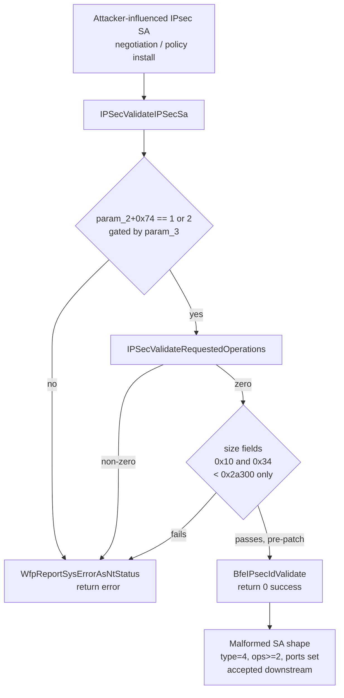

# CVE-2026-59132

**CVE:** CVE-2026-59132  
**Title:** Windows TCP/IP Denial of Service Vulnerability  
**Source:** [https://msrc.microsoft.com/update-guide/vulnerability/CVE-2026-59132](https://msrc.microsoft.com/update-guide/vulnerability/CVE-2026-59132)  
**Component(s):** tcpip.sys  
**Patched Date:** 2026-08-11T07:00:00  
**CWE:** Null pointer dereference in Windows TCP/IP allows an unauthorized attacker to deny service over a network.  

---

## Related CVEs (Same Component)

This report covers 2 CVEs affecting the same component(s):

- **CVE-2026-59132**  
- CVE-2026-62792  

### Detailed Information

#### CVE-2026-62792

**Title:** Windows TCP/IP Remote Code Execution Vulnerability  
**Source:** [https://msrc.microsoft.com/update-guide/vulnerability/CVE-2026-62792](https://msrc.microsoft.com/update-guide/vulnerability/CVE-2026-62792)  
**Patched Date:** 2026-08-11T07:00:00  
**CWE:** Stack-based buffer overflow in Windows TCP/IP allows an unauthorized attacker to execute code over a network.  

---

Download Patched & Vulnerable Components:

```bash
# tcpip.sys
wget https://msdl.microsoft.com/download/symbols/tcpip.sys/0FFEA792358000/tcpip.sys -O tcpip.sys.10.0.26100.8972 # vulnerable
wget https://msdl.microsoft.com/download/symbols/tcpip.sys/4A0CB231358000/tcpip.sys -O tcpip.sys.10.0.26100.9168 # patched
```

## Version Tracking Analysis

**Command:**

```
python ghidra_scripts\ghidra_vt_wrapper.py --old-binary ./reports/2026-Aug/CVE-2026-59132/tcpip.sys.10.0.26100.8972 --new-binary ./reports/2026-Aug/CVE-2026-59132/tcpip.sys.10.0.26100.9168 --project-dir ./reports/2026-Aug/CVE-2026-59132/ghidra_project --project-name tcpip.sys_CVE-2026-59132 --ghidra-dir C:\Tools\ghidra_11.4.2_PUBLIC_20250826\ghidra_11.4.2_PUBLIC --output-dir ./reports/2026-Aug/CVE-2026-59132/ghidra_project/vt_results --max-memory 16g
```

Patched Functions: 1 | New Functions: 29 | Removed Functions: 28 | Total Matches: 52819 | Accepted Matches: 46244

### Patched Functions

| Function Name | Source Address | Dest Address | Similarity | Confidence |
| --- | --- | --- | --- | --- |
| `IPSecValidateIPSecSa` | `14026d910` | `14026d810` | 0.568 | 10.0 |

### New Functions

*Showing 10 of 29 new functions*

| Function Name | Address |
| --- | --- |
| `FUN_14005127f` | `14005127f` |
| `FUN_1400bd80a` | `1400bd80a` |
| `caseD_24` | `1400e57c8` |
| `Feature_734502202__private_IsEnabledDeviceUsageNoInline` | `1401924e4` |
| `Feature_734502202__private_IsEnabledFallback` | `14019251c` |
| `Feature_3488336184__private_IsEnabledDeviceUsageNoInline` | `1401a3ef8` |
| `Feature_3488336184__private_IsEnabledFallback` | `1401a3f30` |
| `_guard_dispatch_icall` | `1401c1e50` |
| `FUN_1401c5f16` | `1401c5f16` |
| `FUN_1401c85e7` | `1401c85e7` |

### Removed Functions

*Showing 10 of 28 removed functions*

| Function Name | Address |
| --- | --- |
| `FUN_14005127f` | `14005127f` |
| `FUN_1400bd80a` | `1400bd80a` |
| `caseD_24` | `1400e57c8` |
| `_guard_dispatch_icall` | `1401c1d70` |
| `FUN_1401c5e56` | `1401c5e56` |
| `FUN_1401c8527` | `1401c8527` |
| `FUN_1401cdec6` | `1401cdec6` |
| `FUN_1401cf13a` | `1401cf13a` |
| `FUN_1401d0746` | `1401d0746` |
| `FUN_1401d0848` | `1401d0848` |

---

# AI Technical Analysis

## Vulnerability Identification

**Core Vulnerable Function(s):**
- `IPSecValidateIPSecSa()` - The pre-patch version approves an
  IPsec Security Association (SA) as valid based solely on two
  generic size fields, without inspecting the SA's algorithm
  count, SA type, or configured port fields. This allows a
  specific class of malformed/adversarial SA descriptors to pass
  validation and reach downstream IPsec processing.

**Supporting Changes:**
- `Feature_734502202__private_IsEnabledDeviceUsageNoInline()` -
  newly referenced feature-flag accessor; gates whether the
  additional validation logic is enforced (caller/config check,
  not itself vulnerable).
- `WfpReportErrorIPSec()` call site - the literal line-number
  argument changes from `0x78` to `0x89`, a byproduct of the
  function growing in size, not a functional change.

**Unrelated Changes:**
- `caseD_24()` - a trivial jump-table case handler
  (`switchD_1401d4c84::caseD_24`) that unconditionally returns
  `1`. It belongs to an unrelated switch statement elsewhere in
  the binary and has no relationship to SA validation.

---

## Root Cause Analysis

The vulnerability is a validation-completeness flaw: the SA
acceptance path treated two generic size fields as sufficient
proof that an SA was safe to accept, without verifying that the
SA's *combination* of algorithm count, SA type, and port
configuration was one the downstream size limits were actually
valid for. The code implicitly assumed that "size fields below
`0x2a300`" was a universally sufficient safety condition,
regardless of SA shape, which is not true for every SA type.

Vulnerable code:

```c
longlong IPSecValidateIPSecSa(longlong param_1,longlong param_2,int param_3)
{
  longlong lVar1;

  if (param_3 == 0) {
    if (*(int *)(param_2 + 0x74) == 1) goto LAB_14026d93d;
  }
  else if (*(int *)(param_2 + 0x74) == 2) {
LAB_14026d93d:
    lVar1 = IPSecValidateRequestedOperations
              (*(undefined8 *)(param_1 + 0x20),*(undefined4 *)(param_1 + 0x30));
    if (lVar1 != 0) goto LAB_14026d98d;
    if ((*(uint *)(param_1 + 0x10) < 0x2a300) && (*(uint *)(param_1 + 0x34) < 0x2a300)) {
      if ((*(longlong *)(param_1 + 0x40) != 0) && (lVar1 = BfeIPsecIdValidate(), lVar1 != 0))
      goto LAB_14026d98d;
      if (*(int *)(param_1 + 0x70) < 7) {
        return 0;
      }
    }
  }
  lVar1 = WfpReportSysErrorAsNtStatus();
LAB_14026d98d:
  if (lVar1 != 0) {
    WfpReportErrorIPSec(lVar1,"IPSecValidateIPSecSa",0x78);
  }
  return lVar1;
}
```

`param_2 + 0x74` selects the code path based on the requested
SA direction/action (`1` or `2`, gated additionally by
`param_3`). Once that gate is passed,
`IPSecValidateRequestedOperations()` is invoked using
`param_1 + 0x20` and `param_1 + 0x30` (a pointer and an
operation/algorithm count) and any non-zero result short-circuits
straight to the error path. The only remaining gate before the
SA is treated as acceptable is `(*(uint *)(param_1+0x10) <
0x2a300) && (*(uint *)(param_1+0x34) < 0x2a300)` - two raw
size/count fields compared against the constant `0x2a300`
(172800). Crucially, this check does not examine `param_1+0x30`
(operation count), `param_1+0x70` (SA type), or the port fields
at `param_1+0x7c`/`param_1+0x7e`. If the size gate passes, the
code proceeds to `BfeIPsecIdValidate()` (only if `param_1+0x40`
is non-null) and then returns success (`0`) as long as
`*(int *)(param_1+0x70) < 7`. This means an SA whose `0x70` type
field indicates a specific, more complex construction (algorithm
bundles combined with specific ports) is validated using the
same coarse size threshold as any simple SA, even though that
combination requires additional constraints to be safe for
downstream consumers.

---

## Execution and Trigger Flow

The trigger path begins with an entity able to supply or
negotiate an IPsec Security Association that is processed by the
Windows kernel network stack (`tcpip.sys`) via the WFP/BFE IPsec
policy engine - typically reachable through IKE-negotiated SAs or
programmatically installed SA policy. The caller invokes
`IPSecValidateIPSecSa()` with `param_1` pointing to the candidate
SA descriptor and `param_2` pointing to a related policy/filter
object, along with a `param_3` selector. The function first
selects a branch based on the action field at `param_2 + 0x74`
and the value of `param_3`, which determines whether validation
proceeds at all. Once inside the validated branch,
`IPSecValidateRequestedOperations()` checks the requested
operation set; a failure here safely aborts. If that check
passes, the function relies exclusively on the two size fields
at `param_1 + 0x10` and `param_1 + 0x34` being below `0x2a300` to
decide the SA is well-formed. An attacker who can construct an SA
with a type value at `param_1 + 0x70` equal to `4`, an operation
count at `param_1 + 0x30` of `2` or more, and non-zero port
fields at `param_1 + 0x7c`/`0x7e` - while still keeping the two
size fields under the generic threshold - reaches the same
success path (`return 0`) as any ordinary SA, even though this
specific shape was not intended to be considered safe under a
purely size-based check. Because validation succeeds, the
malformed SA is accepted and handed to later IPsec/WFP processing
stages that assume validated data.



---

## Patch Analysis

Patched code:

```diff
-    if ((*(uint *)(param_1 + 0x10) < 0x2a300) && (*(uint *)(param_1 + 0x34) < 0x2a300)) {
+    if ((Feature_734502202__private_featureState & 0x10) == 0) {
+      uVar1 = Feature_734502202__private_IsEnabledDeviceUsageNoInline();
+    }
+    else {
+      uVar1 = Feature_734502202__private_featureState & 1;
+    }
+    if (((((uVar1 == 0) || (*(uint *)(param_1 + 0x30) < 2)) ||
+          (*(int *)(param_1 + 0x70) != 4)) ||
+         ((*(short *)(param_1 + 0x7c) == 0 &&
+           *(short *)(param_1 + 0x7e) == 0))) &&
+        ((*(uint *)(param_1 + 0x10) < 0x2a300 &&
+          *(uint *)(param_1 + 0x34) < 0x2a300))) {
       if ((*(longlong *)(param_1 + 0x40) != 0) && (lVar2 = BfeIPsecIdValidate(), lVar2 != 0))
       goto LAB_14026d8c4;
       if (*(int *)(param_1 + 0x70) < 7) {
         return 0;
       }
     }
```

The patch reads a feature-flag state (`Feature_734502202`) to
obtain `uVar1`, then wraps the original size-only gate inside an
additional compound condition `(A || B || C || D) && (E && F)`.
`E && F` is the original size check; the new `A || B || C || D`
term requires at least one of: the feature being disabled
(`uVar1 == 0`), the operation count at `param_1 + 0x30` being
less than `2`, the SA type at `param_1 + 0x70` not being `4`, or
both port fields (`0x7c`, `0x7e`) being zero. Consequently, when
the feature is enabled and the SA simultaneously has an operation
count of `2` or more, type `4`, and at least one non-zero port
field, the whole condition evaluates false and the function falls
through to `WfpReportSysErrorAsNtStatus()`, rejecting the SA
instead of returning success. This closes the specific
under-validated configuration identified above by requiring
additional structural checks before the coarse size comparison is
allowed to approve the SA. The fix is scoped narrowly to the
exact SA shape that previously bypassed meaningful validation,
preserving prior behavior for all other SA types and minimizing
regression risk, while the feature-flag gating suggests a staged
rollout typical of Windows servicing fixes. Effectiveness is high
for the identified shape (type `4`, multi-operation, non-zero
ports) since it now requires an explicit rejection rather than
falling back on an insufficient generic bound. Overall, this
remediates a validation-gap vulnerability in the Windows IPsec
policy engine within `tcpip.sys` that could allow a crafted SA to
bypass adequate structural checks and reach subsequent IPsec
processing logic that assumed such checks had already occurred.