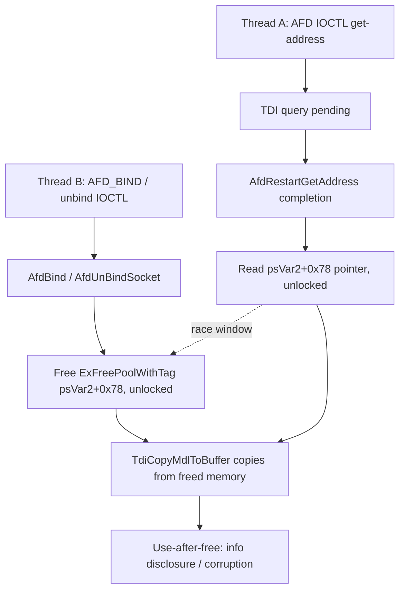

# CVE-2026-61348

**CVE:** CVE-2026-61348  
**Title:** Windows Ancillary Function Driver for WinSock Elevation of Privilege Vulnerability  
**Source:** [https://msrc.microsoft.com/update-guide/vulnerability/CVE-2026-61348](https://msrc.microsoft.com/update-guide/vulnerability/CVE-2026-61348)  
**Component(s):** afd.sys  
**Patched Date:** 2026-08-11T07:00:00  
**CWE:** Use after free in Windows Ancillary Function Driver for WinSock allows an authorized attacker to elevate privileges locally.  

---

## Related CVEs (Same Component)

This report covers 3 CVEs affecting the same component(s):

- **CVE-2026-61348**  
- CVE-2026-68820  
- CVE-2026-70307  

### Detailed Information

#### CVE-2026-68820

**Title:** Windows Ancillary Function Driver for WinSock Elevation of Privilege Vulnerability  
**Source:** [https://msrc.microsoft.com/update-guide/vulnerability/CVE-2026-68820](https://msrc.microsoft.com/update-guide/vulnerability/CVE-2026-68820)  
**Patched Date:** 2026-08-11T07:00:00  
**CWE:** Use after free in Windows Ancillary Function Driver for WinSock allows an authorized attacker to elevate privileges locally.  

#### CVE-2026-70307

**Title:** Windows Ancillary Function Driver for WinSock Elevation of Privilege Vulnerability  
**Source:** [https://msrc.microsoft.com/update-guide/vulnerability/CVE-2026-70307](https://msrc.microsoft.com/update-guide/vulnerability/CVE-2026-70307)  
**Patched Date:** 2026-08-11T07:00:00  
**CWE:** Use after free in Windows Ancillary Function Driver for WinSock allows an authorized attacker to elevate privileges locally.  

---

Download Patched & Vulnerable Components:

```bash
# afd.sys
wget https://msdl.microsoft.com/download/symbols/afd.sys/3A38442CB5000/afd.sys -O afd.sys.10.0.26100.8972 # vulnerable
wget https://msdl.microsoft.com/download/symbols/afd.sys/1010E8EFB6000/afd.sys -O afd.sys.10.0.26100.9168 # patched
```

## Version Tracking Analysis

**Command:**

```
python ghidra_scripts\ghidra_vt_wrapper.py --old-binary ./reports/2026-Aug/CVE-2026-61348/afd.sys.10.0.26100.8972 --new-binary ./reports/2026-Aug/CVE-2026-61348/afd.sys.10.0.26100.9168 --project-dir ./reports/2026-Aug/CVE-2026-61348/ghidra_project --project-name afd.sys_CVE-2026-61348 --ghidra-dir C:\Tools\ghidra_11.4.2_PUBLIC_20250826\ghidra_11.4.2_PUBLIC --output-dir ./reports/2026-Aug/CVE-2026-61348/ghidra_project/vt_results --max-memory 16g
```

Patched Functions: 4 | New Functions: 5 | Removed Functions: 1 | Total Matches: 18680 | Accepted Matches: 8392

### Patched Functions

| Function Name | Source Address | Dest Address | Similarity | Confidence |
| --- | --- | --- | --- | --- |
| `AfdUnBindSocket` | `14004c200` | `14004c420` | 0.937 | 10.0 |
| `AfdBind` | `140029bf0` | `140029bf0` | 0.913 | 10.0 |
| `AfdStartNextTPacketsIrp` | `14005b0b0` | `14005b390` | 0.655 | 10.0 |
| `AfdRestartGetAddress` | `14002b1a0` | `14002b310` | 0.504 | 10.0 |

### New Functions

| Function Name | Address |
| --- | --- |
| `Feature_2405591354__private_IsEnabledDeviceUsageNoInline` | `14004d00c` |
| `Feature_2405591354__private_IsEnabledFallback` | `14004d044` |
| `Feature_2081934649__private_IsEnabledDeviceUsageNoInline` | `14005d1d0` |
| `Feature_2081934649__private_IsEnabledFallback` | `14005d208` |
| `_guard_dispatch_icall` | `140076f70` |

### Removed Functions

| Function Name | Address |
| --- | --- |
| `_guard_dispatch_icall` | `140076c20` |

---

# AI Technical Analysis

## Vulnerability Identification

**Core Vulnerable Function(s):**
- `AfdRestartGetAddress()` - reads and copies out the socket's
  cached local-address buffer (`psVar2[0x78]` /
  `psVar2 + 0x76`) via `TdiCopyMdlToBuffer()` without holding
  the endpoint's per-object spin lock, allowing the buffer to
  be freed/replaced concurrently by a bind or unbind operation
  on another thread (use-after-free).

**Supporting Changes:**
- `AfdBind()` - allocates and later tears down the same
  address buffer (`puVar5[0x78]` / `puVar5[0x76]`) on error
  and rebind paths; patched to acquire the endpoint queued
  spin lock (`puVar5 + 0x1c`) before clearing/freeing the
  pointer, closing one side of the race window.
- `AfdUnBindSocket()` - frees the identical buffer fields
  (`psVar2[0x78]`, `psVar2[0x76]`) during unbind; patched with
  the same spin-lock-guarded clear sequence.

**Unrelated Changes:**
- `AfdStartNextTPacketsIrp()` - restructures the transmit-
  packet (`TPackets`) completion-queue drain loop and is
  gated by a different feature flag
  (`Feature_2081934649`). It operates on the transmit-file
  queue (offsets `+0xf`, `-0xc`, `-0xf`), not on the bound-
  address buffer, and shows no relationship to the
  `psVar2 + 0x78` / `+0x76` fields involved in the core issue.

---

## Root Cause Analysis

The vulnerability is a time-of-check-to-time-of-use (TOCTOU)
race condition. The AFD endpoint object caches the socket's
bound local transport address in a heap buffer referenced by
a raw pointer/length pair stored directly in the endpoint
structure, at offsets `+0x78` (pointer) and `+0x76` (length).
Multiple code paths read or free this pointer, but none of
them synchronized access to it with the endpoint's own queued
spin lock before the patch, violating the implicit invariant
that the buffer's lifetime is protected by that lock.

```c
/* AfdRestartGetAddress (before) - unlocked read/use */
uVar2 = *(uint *)(psVar3 + 0x76);
if ((uVar2 < local_res10[0]) &&
   (local_res10[0] = *(int *)(param_2 + 0x38) - 4,
    uVar2 < local_res10[0])) {
  ...
}
else {
  local_res18[0] = uVar2;
  TdiCopyMdlToBuffer(*(undefined8 *)(param_2 + 8),4,
                      *(undefined8 *)(psVar3 + 0x78),0,
                      local_res10[0],local_res18);
}
```

```c
/* AfdUnBindSocket (before) - unlocked free of same buffer */
uVar13 = *(undefined8 *)(psVar2 + 0x78);
ExEnterCriticalRegionAndAcquireResourceExclusive(AfdGlobalData);
psVar2[0x78] = 0;
psVar2[0x79] = 0;
psVar2[0x7a] = 0;
psVar2[0x7b] = 0;
psVar2[0x76] = 0;
psVar2[0x77] = 0;
ExReleaseResourceAndLeaveCriticalRegion(AfdGlobalData);
ExFreePoolWithTag(uVar13,0x6c646641);
```

`AfdRestartGetAddress` runs as the completion callback for a
TDI address-query IRP (used by a `getsockname`-style AFD
IOCTL). It dereferences `psVar3 + 0x78` directly as the source
pointer for `TdiCopyMdlToBuffer`, and only serializes against
`AfdGlobalData` (a resource used elsewhere to protect a
different aggregate structure), never against the endpoint's
own `KeAcquireInStackQueuedSpinLock(psVar2 + 0x1c, ...)`.
Meanwhile `AfdUnBindSocket` and `AfdBind` snapshot the
pointer, zero the fields, and call `ExFreePoolWithTag` while
holding only `AfdGlobalData`, not the endpoint spin lock.
Because both sides use a different or no lock, a second
thread can unbind/rebind the same socket handle between the
`getsockname` completion routine's load of `psVar3 + 0x78` and
the actual `TdiCopyMdlToBuffer` copy, causing the copy to
operate on already-freed pool memory.

---

## Execution and Trigger Flow

An attacker needs a socket handle shared or duplicated across
two threads (or two handles referencing the same endpoint via
`DuplicateHandle`/`WSADuplicateSocket`), which is achievable
entirely from user mode. Thread A issues an AFD IOCTL that
resolves to a `getsockname`/get-address style query on the
socket; the kernel dispatches a TDI query and returns
`STATUS_PENDING`, later invoking `AfdRestartGetAddress` as the
completion routine once the transport responds. Thread B
concurrently issues an `AFD_BIND` or unbind IOCTL on the same
endpoint, driving execution into `AfdBind` or
`AfdUnBindSocket`, both of which free and zero the address
buffer at `+0x78`/`+0x76`. If Thread B's free runs between
Thread A's load of the pointer and its use in
`TdiCopyMdlToBuffer`, Thread A copies from freed pool memory
back toward a user-controlled MDL, yielding a use-after-free
read (information disclosure) and, depending on pool grooming,
potential memory corruption or crash (DoS) if the freed block
is reallocated with attacker-controlled content in the race
window.



---

## Patch Analysis

```diff
+  local_38 = 0;
+  uStack_30 = 0;
+  local_28 = 0;
+  KeAcquireInStackQueuedSpinLock(psVar2 + 0x1c,&local_38);
+  if (*(longlong *)(psVar2 + 0x78) != 0) {
+    uVar4 = *(uint *)(psVar2 + 0x76);
+    if (uVar4 < local_res10[0]) {
+      local_res10[0] = *(int *)(param_2 + 0x38) - 4;
+      if (uVar4 < local_res10[0]) { ... goto LAB_14002b476; }
+    }
+    local_res18[0] = uVar4;
+    TdiCopyMdlToBuffer(...,*(longlong *)(psVar2 + 0x78),0,
+                        local_res10[0],local_res18);
+  }
+LAB_14002b476:
+  KeReleaseInStackQueuedSpinLock(&local_38);
```

```diff
+  KeAcquireInStackQueuedSpinLock(psVar2 + 0x1c,&local_150);
+  uVar13 = *(undefined8 *)(psVar2 + 0x78);
+  psVar2[0x78] = 0; psVar2[0x79] = 0;
+  psVar2[0x7a] = 0; psVar2[0x7b] = 0;
+  psVar2[0x76] = 0; psVar2[0x77] = 0;
+  KeReleaseInStackQueuedSpinLock(&local_150);
```

The fix introduces `KeAcquireInStackQueuedSpinLock` on the
endpoint's existing per-object lock (`+0x1c`) around every
access to the `+0x78`/`+0x76` address-buffer fields in all
three affected functions, making the pointer load, length
check, `TdiCopyMdlToBuffer` copy, zeroing, and
`ExFreePoolWithTag` mutually exclusive with each other. In
`AfdRestartGetAddress`, the pointer is now re-checked for
non-NULL and re-read for the buffer length *inside* the locked
region immediately before the copy, eliminating the stale-
pointer window. In `AfdBind` and `AfdUnBindSocket`, the
snapshot-and-free sequence is likewise moved inside the same
lock. The change is gated behind
`Feature_2405591354__private_featureState`, consistent with a
staged/controlled rollout of a security fix, but the locked
code path fully closes the original race once the feature is
enabled. This effectively converts an unsynchronized shared-
pointer lifetime into one correctly protected by the object's
lock, removing the use-after-free primitive. The fix is
narrowly scoped to the racy fields and does not alter the
buffer's allocation, size validation, or copy logic otherwise,
minimizing regression risk. Overall, this remediates a locally
triggerable kernel use-after-free in a widely loaded system
driver (`afd.sys`), which without the patch could be leveraged
for information disclosure or, with successful pool grooming,
local privilege escalation.