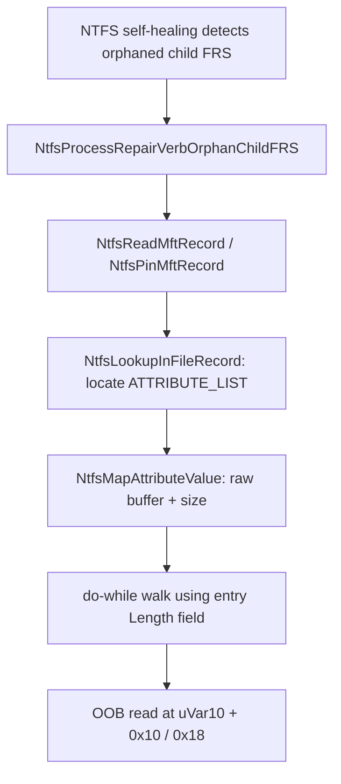
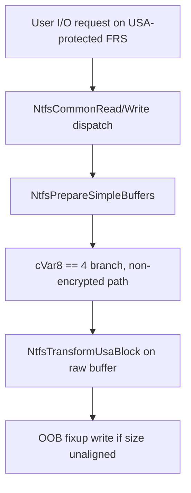

# CVE-2026-61350

**CVE:** CVE-2026-61350  
**Title:** Windows NTFS Information Disclosure Vulnerability  
**Source:** [https://msrc.microsoft.com/update-guide/vulnerability/CVE-2026-61350](https://msrc.microsoft.com/update-guide/vulnerability/CVE-2026-61350)  
**Component(s):** ntfs.sys  
**Patched Date:** 2026-08-11T07:00:00  
**CWE:** Buffer over-read in Windows NTFS allows an unauthorized attacker to disclose information with a physical attack.  

---

## Related CVEs (Same Component)

This report covers 8 CVEs affecting the same component(s):

- **CVE-2026-61350**  
- CVE-2026-62796  
- CVE-2026-62797  
- CVE-2026-65784  
- CVE-2026-62700  
- CVE-2026-62793  
- CVE-2026-62880  
- CVE-2026-62887  

### Detailed Information

#### CVE-2026-62796

**Title:** Windows NTFS Information Disclosure Vulnerability  
**Source:** [https://msrc.microsoft.com/update-guide/vulnerability/CVE-2026-62796](https://msrc.microsoft.com/update-guide/vulnerability/CVE-2026-62796)  
**Patched Date:** 2026-08-11T07:00:00  
**CWE:** Out-of-bounds read in Windows NTFS allows an authorized attacker to disclose information locally.  

#### CVE-2026-62797

**Title:** Windows NTFS Elevation of Privilege Vulnerability  
**Source:** [https://msrc.microsoft.com/update-guide/vulnerability/CVE-2026-62797](https://msrc.microsoft.com/update-guide/vulnerability/CVE-2026-62797)  
**Patched Date:** 2026-08-11T07:00:00  
**CWE:** Heap-based buffer overflow in Windows NTFS allows an authorized attacker to elevate privileges locally.  

#### CVE-2026-65784

**Title:** Windows NTFS Information Disclosure Vulnerability  
**Source:** [https://msrc.microsoft.com/update-guide/vulnerability/CVE-2026-65784](https://msrc.microsoft.com/update-guide/vulnerability/CVE-2026-65784)  
**Patched Date:** 2026-08-11T07:00:00  
**CWE:** Out-of-bounds read in Windows NTFS allows an authorized attacker to disclose information locally.  

#### CVE-2026-62700

**Title:** Windows NTFS Elevation of Privilege Vulnerability  
**Source:** [https://msrc.microsoft.com/update-guide/vulnerability/CVE-2026-62700](https://msrc.microsoft.com/update-guide/vulnerability/CVE-2026-62700)  
**Patched Date:** 2026-08-11T07:00:00  
**CWE:** Heap-based buffer overflow in Windows NTFS allows an authorized attacker to elevate privileges locally.  

#### CVE-2026-62793

**Title:** Windows NTFS Information Disclosure Vulnerability  
**Source:** [https://msrc.microsoft.com/update-guide/vulnerability/CVE-2026-62793](https://msrc.microsoft.com/update-guide/vulnerability/CVE-2026-62793)  
**Patched Date:** 2026-08-11T07:00:00  
**CWE:** Buffer over-read in Windows NTFS allows an authorized attacker to disclose information locally.  

#### CVE-2026-62880

**Title:** Windows NTFS Elevation of Privilege Vulnerability  
**Source:** [https://msrc.microsoft.com/update-guide/vulnerability/CVE-2026-62880](https://msrc.microsoft.com/update-guide/vulnerability/CVE-2026-62880)  
**Patched Date:** 2026-08-11T07:00:00  
**CWE:** Out-of-bounds read in Windows NTFS allows an authorized attacker to elevate privileges locally.  

#### CVE-2026-62887

**Title:** Windows NTFS Information Disclosure Vulnerability  
**Source:** [https://msrc.microsoft.com/update-guide/vulnerability/CVE-2026-62887](https://msrc.microsoft.com/update-guide/vulnerability/CVE-2026-62887)  
**Patched Date:** 2026-08-11T07:00:00  
**CWE:** Out-of-bounds read in Windows NTFS allows an authorized attacker to disclose information locally.  

---

Download Patched & Vulnerable Components:

```bash
# ntfs.sys
wget https://msdl.microsoft.com/download/symbols/ntfs.sys/F611B96336A000/ntfs.sys -O ntfs.sys.10.0.26100.8972 # vulnerable
wget https://msdl.microsoft.com/download/symbols/ntfs.sys/0CCD39E136A000/ntfs.sys -O ntfs.sys.10.0.26100.9168 # patched
```

## Version Tracking Analysis

**Command:**

```
python ghidra_scripts\ghidra_vt_wrapper.py --old-binary ./reports/2026-Aug/CVE-2026-61350/ntfs.sys.10.0.26100.8972 --new-binary ./reports/2026-Aug/CVE-2026-61350/ntfs.sys.10.0.26100.9168 --project-dir ./reports/2026-Aug/CVE-2026-61350/ghidra_project --project-name ntfs.sys_CVE-2026-61350 --ghidra-dir C:\Tools\ghidra_11.4.2_PUBLIC_20250826\ghidra_11.4.2_PUBLIC --output-dir ./reports/2026-Aug/CVE-2026-61350/ghidra_project/vt_results --max-memory 16g
```

Patched Functions: 29 | New Functions: 32 | Removed Functions: 21 | Total Matches: 35839 | Accepted Matches: 26104

### Patched Functions

*Showing top 10 of 29 patched functions*

| Function Name | Source Address | Dest Address | Similarity | Confidence |
| --- | --- | --- | --- | --- |
| `NtfsSetEncryption` | `14021f3d8` | `14021d438` | 0.998 | 10.0 |
| `NtfsSetObjectId` | `140236750` | `1402335c8` | 0.984 | 10.0 |
| `NtfsSetObjectIdExtendedInfo` | `14022dcec` | `14022adec` | 0.983 | 10.0 |
| `NtfsDeleteFile` | `140254db0` | `140251e00` | 0.973 | 10.0 |
| `NtfsDeleteReparsePoint` | `14027a640` | `140278880` | 0.961 | 10.0 |
| `NtfsGetMftRecord` | `1401e69e0` | `1401b26f0` | 0.961 | 10.0 |
| `TxfAddTxfFcbToNoRenameList` | `140199060` | `14021bd3c` | 0.932 | 10.0 |
| `DeleteSimple` | `140139a90` | `14017ca80` | 0.919 | 10.0 |
| `NtfsRepairObjectId` | `1400b27d0` | `1400d8300` | 0.902 | 10.0 |
| `NtfsOpenExistingAttr` | `1401328b0` | `140132b50` | 0.864 | 10.0 |

### New Functions

*Showing 10 of 32 new functions*

| Function Name | Address |
| --- | --- |
| `Feature_1103601978__private_IsEnabledDeviceUsageNoInline` | `14003db00` |
| `Feature_1103601978__private_IsEnabledFallback` | `14003db38` |
| `Feature_2079555898__private_IsEnabledDeviceUsageNoInline` | `14003db54` |
| `Feature_2079555898__private_IsEnabledFallback` | `14003db8c` |
| `Feature_925335864__private_IsEnabledDeviceUsageNoInline` | `14003f784` |
| `Feature_925335864__private_IsEnabledFallback` | `14003f7bc` |
| `Feature_2779480376__private_IsEnabledDeviceUsageNoInline` | `14003f8ec` |
| `Feature_2779480376__private_IsEnabledFallback` | `14003f924` |
| `Feature_3124199737__private_IsEnabledDeviceUsageNoInline` | `14003f940` |
| `Feature_3124199737__private_IsEnabledFallback` | `14003f978` |

### Removed Functions

*Showing 10 of 21 removed functions*

| Function Name | Address |
| --- | --- |
| `_guard_dispatch_icall` | `140055010` |
| `FUN_14005a9c8` | `14005a9c8` |
| `FUN_14005c9d6` | `14005c9d6` |
| `NtfsCheckFileName` | `140146fe0` |
| `FUN_14018acb5` | `14018acb5` |
| `FUN_1401f7071` | `1401f7071` |
| `FUN_1402ba752` | `1402ba752` |
| `FUN_1402badf4` | `1402badf4` |
| `FUN_1402bae06` | `1402bae06` |
| `FUN_1402bae22` | `1402bae22` |

---

# AI Technical Analysis

## Vulnerability Identification

**Core Vulnerable Function(s):**
- `NtfsProcessRepairVerbOrphanChildFRS()` - Walks `$ATTRIBUTE_LIST`
  entries recovered from a Master File Table Segment (MFT record)
  using an attacker/disk-controlled entry-length field, without
  validating that the length is large enough to contain a full
  entry header or that the name-length/name-offset fields are
  self-consistent. This permits an out-of-bounds read past the
  mapped attribute-list buffer during NTFS self-healing repair.
- `NtfsPrepareSimpleBuffers()` - Invokes `NtfsTransformUsaBlock`
  (the Update Sequence Array "fixup" routine) on a raw I/O buffer
  without first validating that the buffer size is a non-zero
  multiple of the on-disk sector/USA block size, allowing the
  fixup routine to write outside the intended buffer bounds when
  the requested transfer length is not sector-aligned.

**Supporting Changes:**
- `NtfsLookupInFileRecord()` / `NtfsMapAttributeValue()` (callers
  in `NtfsProcessRepairVerbOrphanChildFRS`) - Supply the raw,
  disk-controlled attribute buffer that is later walked
  unsafely; not vulnerable themselves.
- `NtfsAttachCorruption_BadOrOrphanFRS()` /
  `NtfsRaiseStatusInternal()` - Pre-existing and newly added error
  paths that report corruption once detected; defensive, not
  vulnerable.

**Unrelated Changes:**
- Widespread variable renaming, type re-numbering (e.g. `uVar3`
  to `bVar3`, `local_78` to `local_d0`) and stack-layout shifts
  throughout both functions are artifacts of decompiler output
  from a recompiled binary and carry no security meaning.

---

## Root Cause Analysis

Both functions share the same class of defect: attacker-influenced
on-disk NTFS metadata (an `$ATTRIBUTE_LIST` value and a raw I/O
transfer length, respectively) is consumed by pointer arithmetic
without first validating that declared size fields are consistent
with the actual buffer extent. The implicit invariant "a length
field read from disk correctly bounds the region it describes" is
never checked, so a corrupted or maliciously crafted volume can
make the parser walk or transform memory beyond the buffer that
was actually mapped/allocated.

In `NtfsProcessRepairVerbOrphanChildFRS`, the pre-patch attribute-
list walk was:

```c
do {
  local_c8 = uVar10;
  if (local_130 == *(ulonglong *)(uVar10 + 0x10)) {
    /* raise 0x2e51c2 */
  }
  if (*(ushort *)(uVar10 + 4) == 0) {
    /* raise 0x2e51c7 */
  }
  local_c8 = uVar10 + *(ushort *)(uVar10 + 4);
  uVar10 = local_c8;
} while (local_c8 < local_78);
```

`uVar10` iterates over `ATTRIBUTE_LIST_ENTRY` records; `*(ushort
*)(uVar10 + 4)` is the entry `Length` field used both to advance
the cursor and, before that, to read an 8-byte segment reference
at `uVar10 + 0x10`. The only sanity check is `Length != 0`; there
is no check that `Length >= 0x1a` (the fixed header size) or that
`uVar10 + 0x18` stays within `local_78` (the mapped buffer end).
A crafted final entry with a small but nonzero `Length` (e.g. 1)
causes the next iteration to dereference `*(ulonglong
*)(uVar10 + 0x10)` at an offset that can fall past the end of the
buffer returned by `NtfsMapAttributeValue`.

In `NtfsPrepareSimpleBuffers`, the pre-patch non-encrypted branch
unconditionally called:

```c
else {
  NtfsTransformUsaBlock(*(undefined8 *)(param_8 + 0x30),param_3);
}
```

`NtfsTransformUsaBlock` applies the Update Sequence Array fixup
per fixed-size block across the whole supplied buffer; without a
prior check that the transfer size (`_Size`) is both non-zero and
an exact multiple of the per-record block size, a buffer whose
length is not sector-aligned lets the fixup logic touch memory
past the buffer's true end.

---

## Execution and Trigger Flow

An attacker who can present a crafted or corrupted NTFS volume (a
mounted USB/virtual disk image, or a volume reachable during
online self-healing) can reach both paths without needing local
code execution first. For `NtfsProcessRepairVerbOrphanChildFRS`,
the NTFS repair subsystem detects an orphaned child File Record
Segment during metadata self-healing and calls this function to
re-attach or delete it. The function reads the file's MFT record
via `NtfsReadMftRecord`/`NtfsPinMftRecord`, then calls
`NtfsLookupInFileRecord` to locate a resident `$ATTRIBUTE_LIST`
(type `0x20`) and `NtfsMapAttributeValue` to obtain a pointer/size
pair for that attribute's raw bytes. The vulnerable do-while loop
then walks that attacker-supplied byte range using only the
`Length` field embedded in the data itself, with no bound derived
from the mapped size other than the loop-continuation compare.
For `NtfsPrepareSimpleBuffers`, an ordinary read/write I/O request
against a file whose FRS is flagged with the Update Sequence
Array bit reaches this function through the common read/write
dispatch path, which calls it to stage buffers before the fixup
transform runs on raw sector data pulled from disk.





---

## Patch Analysis

Both fixes insert an explicit structural-validation gate ahead of
the previously unchecked memory access, each guarded by a feature
flag (`Feature_1103601978__private_IsEnabledDeviceUsageNoInline`
and `Feature_2576057656__private_IsEnabledDeviceUsageNoInline`)
that appears to control staged rollout of the hardening.

```diff
+ iVar10 = Feature_1103601978__private_IsEnabledDeviceUsageNoInline();
+ if (iVar10 != 0) {
+   for (; local_d8 = uVar11, uVar11 < local_88; uVar11 = uVar11 + uVar9) {
+     uVar9 = (uint)*(ushort *)(uVar11 + 4);
+     if (((uVar9 < 0x1a) || (*(char *)(uVar11 + 7) != '\x1a')) ||
+        ((ulonglong)uVar9 < (ulonglong)*(byte *)(uVar11 + 6) * 2 + 0x1a))
+     goto LAB_14027f554;
+   }
+   if (uVar11 != local_88) {
+ LAB_14027f554:
+     NtfsRaiseStatusInternal(param_1,0xc0000102,0,0,0x2e51da);
+   }
+ }
```

```diff
+ iVar22 = Feature_2576057656__private_IsEnabledDeviceUsageNoInline();
+ if (iVar22 != 0) {
+   uVar15 = /* sector size derived from record type */;
+   if (((uVar15 == 0) || (uVar14 < uVar15)) ||
+       ((int)(_Size % (ulonglong)uVar15) != 0)) {
+     NtfsAttachCorruption_BadOrOrphanFRS(param_1,2,0xd5000c10c9);
+     NtfsRaiseStatusInternal(param_1,0xc0000102, ... );
+   }
+ }
  NtfsTransformUsaBlock(*(undefined8 *)(param_8 + 0x30),param_3);
```

The first patch pre-scans every `$ATTRIBUTE_LIST` entry before the
consuming loop runs, rejecting any entry whose `Length` is below
the minimum header size (`0x1a`), whose tag byte at offset `+7`
is not `0x1a`, or whose declared name length is inconsistent with
`Length`; any violation raises `STATUS_FILE_CORRUPT_ERROR`
(`0xc0000102`) instead of being dereferenced. The second patch
computes the expected per-record block size and rejects transfer
sizes that are zero, smaller than the block size, or not an exact
multiple of it, before the USA fixup routine is allowed to run,
flagging the FRS as corrupt via
`NtfsAttachCorruption_BadOrOrphanFRS` otherwise. Both checks move
validation of disk-controlled length metadata ahead of the
pointer arithmetic that previously trusted it implicitly. The fix
is effective because it constrains the exact fields (`Length`,
`_Size`) that previously drove out-of-bounds offsets, converting
malformed input into a handled corruption status rather than an
unchecked memory access; the feature-flag gating is an operational
rollout mechanism, not a scoping limitation on the fix's coverage.
Combined, the patch eliminates an out-of-bounds read reachable
through NTFS metadata repair and an out-of-bounds write reachable
through ordinary sector-fixup I/O, both triggerable purely by
mounting or accessing a maliciously crafted NTFS volume.