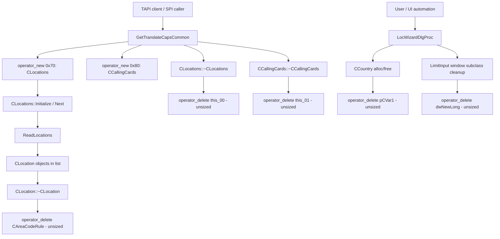

# CVE-2026-61353

**CVE:** CVE-2026-61353  
**Title:** Windows Telephony Service Elevation of Privilege Vulnerability  
**Source:** [https://msrc.microsoft.com/update-guide/vulnerability/CVE-2026-61353](https://msrc.microsoft.com/update-guide/vulnerability/CVE-2026-61353)  
**Component(s):** tapi32.dll  
**Patched Date:** 2026-08-11T07:00:00  
**CWE:** Heap-based buffer overflow in Windows Telephony Service allows an authorized attacker to elevate privileges locally.  

---

## Related CVEs (Same Component)

This report covers 11 CVEs affecting the same component(s):

- **CVE-2026-61353**  
- CVE-2026-62723  
- CVE-2026-62724  
- CVE-2026-62748  
- CVE-2026-62729  
- CVE-2026-59122  
- CVE-2026-62701  
- CVE-2026-62725  
- CVE-2026-62726  
- CVE-2026-62732  
- CVE-2026-62734  

### Detailed Information

#### CVE-2026-62723

**Title:** Windows Telephony Service Elevation of Privilege Vulnerability  
**Source:** [https://msrc.microsoft.com/update-guide/vulnerability/CVE-2026-62723](https://msrc.microsoft.com/update-guide/vulnerability/CVE-2026-62723)  
**Patched Date:** 2026-08-11T07:00:00  
**CWE:** Use after free in Windows Telephony Service allows an authorized attacker to elevate privileges locally.  

#### CVE-2026-62724

**Title:** Windows Telephony Service Elevation of Privilege Vulnerability  
**Source:** [https://msrc.microsoft.com/update-guide/vulnerability/CVE-2026-62724](https://msrc.microsoft.com/update-guide/vulnerability/CVE-2026-62724)  
**Patched Date:** 2026-08-11T07:00:00  
**CWE:** Use after free in Windows Telephony Service allows an authorized attacker to elevate privileges locally.  

#### CVE-2026-62748

**Title:** Windows Telephony Service Elevation of Privilege Vulnerability  
**Source:** [https://msrc.microsoft.com/update-guide/vulnerability/CVE-2026-62748](https://msrc.microsoft.com/update-guide/vulnerability/CVE-2026-62748)  
**Patched Date:** 2026-08-11T07:00:00  
**CWE:** Concurrent execution using shared resource with improper synchronization ('race condition') in Windows Telephony Service allows an authorized attacker to elevate privileges locally.  

#### CVE-2026-62729

**Title:** Windows Telephony Service Elevation of Privilege Vulnerability  
**Source:** [https://msrc.microsoft.com/update-guide/vulnerability/CVE-2026-62729](https://msrc.microsoft.com/update-guide/vulnerability/CVE-2026-62729)  
**Patched Date:** 2026-08-11T07:00:00  
**CWE:** Concurrent execution using shared resource with improper synchronization ('race condition') in Windows Telephony Service allows an authorized attacker to elevate privileges locally.  

#### CVE-2026-59122

**Title:** Windows Telephony Service Elevation of Privilege Vulnerability  
**Source:** [https://msrc.microsoft.com/update-guide/vulnerability/CVE-2026-59122](https://msrc.microsoft.com/update-guide/vulnerability/CVE-2026-59122)  
**Patched Date:** 2026-08-11T07:00:00  
**CWE:** Concurrent execution using shared resource with improper synchronization ('race condition') in Windows Telephony Service allows an authorized attacker to elevate privileges locally.  

#### CVE-2026-62701

**Title:** Windows Telephony Service Elevation of Privilege Vulnerability  
**Source:** [https://msrc.microsoft.com/update-guide/vulnerability/CVE-2026-62701](https://msrc.microsoft.com/update-guide/vulnerability/CVE-2026-62701)  
**Patched Date:** 2026-08-11T07:00:00  
**CWE:** Use after free in Windows Telephony Service allows an authorized attacker to elevate privileges locally.  

#### CVE-2026-62725

**Title:** Windows Telephony Service Elevation of Privilege Vulnerability  
**Source:** [https://msrc.microsoft.com/update-guide/vulnerability/CVE-2026-62725](https://msrc.microsoft.com/update-guide/vulnerability/CVE-2026-62725)  
**Patched Date:** 2026-08-11T07:00:00  
**CWE:** Use after free in Windows Telephony Service allows an authorized attacker to elevate privileges locally.  

#### CVE-2026-62726

**Title:** Windows Telephony Service Elevation of Privilege Vulnerability  
**Source:** [https://msrc.microsoft.com/update-guide/vulnerability/CVE-2026-62726](https://msrc.microsoft.com/update-guide/vulnerability/CVE-2026-62726)  
**Patched Date:** 2026-08-11T07:00:00  
**CWE:** Use after free in Windows Telephony Service allows an authorized attacker to elevate privileges locally.  

#### CVE-2026-62732

**Title:** Windows Telephony Service Elevation of Privilege Vulnerability  
**Source:** [https://msrc.microsoft.com/update-guide/vulnerability/CVE-2026-62732](https://msrc.microsoft.com/update-guide/vulnerability/CVE-2026-62732)  
**Patched Date:** 2026-08-11T07:00:00  
**CWE:** Heap-based buffer overflow in Windows Telephony Service allows an authorized attacker to elevate privileges locally.  

#### CVE-2026-62734

**Title:** Windows Telephony Service Elevation of Privilege Vulnerability  
**Source:** [https://msrc.microsoft.com/update-guide/vulnerability/CVE-2026-62734](https://msrc.microsoft.com/update-guide/vulnerability/CVE-2026-62734)  
**Patched Date:** 2026-08-11T07:00:00  
**CWE:** Concurrent execution using shared resource with improper synchronization ('race condition') in Windows Telephony Service allows an authorized attacker to elevate privileges locally.  

---

Download Patched & Vulnerable Components:

```bash
# tapi32.dll
wget https://msdl.microsoft.com/download/symbols/tapi32.dll/5B81AD0944000/tapi32.dll -O tapi32.dll.10.0.26100.4768 # vulnerable
wget https://msdl.microsoft.com/download/symbols/tapi32.dll/3BA0F6DF44000/tapi32.dll -O tapi32.dll.10.0.26100.5074 # patched
```

## Version Tracking Analysis

**Command:**

```
python ghidra_scripts\ghidra_vt_wrapper.py --old-binary ./reports/2026-Aug/CVE-2026-61353/tapi32.dll.10.0.26100.4768 --new-binary ./reports/2026-Aug/CVE-2026-61353/tapi32.dll.10.0.26100.5074 --project-dir ./reports/2026-Aug/CVE-2026-61353/ghidra_project --project-name tapi32.dll_CVE-2026-61353 --ghidra-dir C:\Tools\ghidra_11.4.2_PUBLIC_20250826\ghidra_11.4.2_PUBLIC --output-dir ./reports/2026-Aug/CVE-2026-61353/ghidra_project/vt_results --max-memory 16g
```

Patched Functions: 52 | New Functions: 59 | Removed Functions: 19 | Total Matches: 10090 | Accepted Matches: 5355

### Patched Functions

*Showing top 10 of 52 patched functions*

| Function Name | Source Address | Dest Address | Similarity | Confidence |
| --- | --- | --- | --- | --- |
| `CLocationPropSheet::General_OnCommand` | `1800205f0` | `180020d60` | 0.985 | 10.0 |
| `CLocation::TranslateAddress` | `18002936c` | `180029bec` | 0.984 | 10.0 |
| `StringCbPrintfExW` | `18002c178` | `18002c9ec` | 0.981 | 10.0 |
| `CCallingCards::Initialize` | `180015148` | `180015880` | 0.978 | 10.0 |
| `CCallingCardPropSheet::OnCommand` | `18001b194` | `18001b8e4` | 0.976 | 10.0 |
| `CLocationPropSheet::LaunchCallingCardPropSheet` | `18001d7f0` | `18001df40` | 0.962 | 10.0 |
| `CLocation::~CLocation` | `180026ac8` | `180027194` | 0.957 | 10.0 |
| `CCallingCards::CreateFreshCards` | `180014434` | `180014b60` | 0.956 | 10.0 |
| `LocWizardDlgProc` | `180022d50` | `180023360` | 0.949 | 10.0 |
| `CAreaCodeRuleDialog::AddPrefix` | `1800182f4` | `180018a1c` | 0.947 | 10.0 |

### New Functions

*Showing 10 of 59 new functions*

| Function Name | Address |
| --- | --- |
| `operator_new[]` | `180001048` |
| `initialize_legacy_wide_specifiers` | `180001060` |
| `__local_stdio_printf_options` | `180001084` |
| `__local_stdio_scanf_options` | `180001094` |
| `initialize_msvcrt_compatibility` | `1800010b0` |
| `dllmain_crt_dispatch` | `1800010e0` |
| `dllmain_crt_process_attach` | `180001138` |
| `dllmain_crt_process_detach` | `180001250` |
| `dllmain_dispatch` | `1800012d8` |
| `__report_securityfailure` | `1800015b4` |

### Removed Functions

*Showing 10 of 19 removed functions*

| Function Name | Address |
| --- | --- |
| `pre_c_init` | `180001060` |
| `_CRT_INIT` | `18000109c` |
| `__DllMainCRTStartup` | `180001324` |
| `__std_terminate` | `18000186c` |
| `_XcptFilter` | `1800018de` |
| `_amsg_exit` | `1800018ea` |
| `_FindPESection` | `180001900` |
| `_IsNonwritableInCurrentImage` | `180001950` |
| `_ValidateImageBase` | `1800019b0` |
| `_guard_dispatch_icall` | `18002df50` |

---

# AI Technical Analysis

## Vulnerability Identification

**Core Vulnerable Function(s):**
- `GetTranslateCapsCommon()` - primary externally reachable TAPI
  service-provider entry point; frees heap-allocated `CLocations`
  (0x70 bytes) and `CCallingCards` (0x80 bytes) objects using the
  unsized global `operator delete(void*)` instead of the
  size-aware overload the objects require.
- `CLocation::~CLocation()` - destructor frees a pooled
  `CAreaCodeRule` node (0x30 bytes) with the same unsized
  `operator delete(void*)` call, corrupting the custom node pool's
  bookkeeping.
- `LimitInput()` - frees a 0x10-byte subclass-thunk structure with
  unsized `operator delete(void*)` during window unsubclassing.
- `LocWizardDlgProc()` - frees `CCountry` objects (0x40 bytes) at
  three separate cleanup sites using the same unsized delete call.

**Supporting Changes:**
- Variable renumbering/renaming inside `GetTranslateCapsCommon`
  (`local_9c`->`local_a0`, `local_88`<->`local_90`, `iVar20`-
  >`iVar19`, etc.) is purely decompiler/relocation noise from
  recompilation and carries no functional difference.
- Relocated literal addresses in `LocWizardDlgProc`
  (`0x180022160`->`0x180022760`, `DAT_18003e0d0`->`DAT_18003e120`)
  are load-address artifacts of the rebuild, not logic changes.

**Unrelated Changes:**
- `CDialingRulesPropSheet::TRACELogPrint()` - diff body is empty;
  no code change occurred in this function.

---

## Root Cause Analysis

The vulnerability is a mismatched memory-management routine
(CWE-762). Several classes in `tapi32.dll` (`CLocations`,
`CCallingCards`, `CLocation`'s internal `CAreaCodeRule` pool
nodes, `CCountry`, and a window-subclass thunk) are allocated
through `operator new(size_t)` and are torn down via a
class-specific, size-aware deallocation path. Prior to the patch,
every destruction site instead called the unsized global
`operator delete(void*)`:

```c
CLocations::~CLocations(this_00);
operator_delete(this_00);
```

```c
CAreaCodeRule::~CAreaCodeRule(this_00);
operator_delete(this_00);
```

Because these objects are backed by TAPI's internal
size-segregated pool/heap bookkeeping (evidenced by the
`NodePool<CAreaCodeRule*>::deallocate` call immediately following
the freed node in `CLocation::~CLocation`), the deallocator needs
the original allocation size to return the block to the correct
free-list bucket or slab. Invoking the size-less overload strips
that size information, so the runtime deallocator must guess or
derive the size from potentially attacker-influenced object state
instead of the true allocation size recorded by the compiler.

Walking `GetTranslateCapsCommon`: `this_00` (a `CLocations`,
allocated with `operator_new(0x70)`) and `this_01` (a
`CCallingCards`, allocated with `operator_new(0x80)`) are built,
populated via `CLocations::Initialize`/`CCallingCards::Initialize`,
walked with `CLocations::Next`/`CCallingCards::Next` to serialize
location and calling-card records into the caller-supplied
`param_3` buffer, and then torn down on every exit path -
including the `Initialize()` failure branches and the final
success path - using the unsized delete. Every one of these
teardown sites is reachable from a single call into the exported
TAPI SPI function, and each one frees objects whose backing size
class (0x70/0x80 bytes) no longer accompanies the free request.
The same defect recurs in `CLocation::~CLocation` (0x30-byte
`CAreaCodeRule` nodes), `LimitInput` (0x10-byte subclass thunk),
and `LocWizardDlgProc` (0x40-byte `CCountry` objects), showing this
was a systemic pattern across the module rather than an isolated
typo.

---

## Execution and Trigger Flow

An attacker reaches the flaw through the standard TAPI
service-provider interface exposed by `tapi32.dll`. A caller (a
TAPI client application, or a malicious/compromised process using
the TAPI API surface) invokes the translate-caps query path that
resolves into `GetTranslateCapsCommon`, supplying a
`LPLINETRANSLATECAPS` buffer (`param_3`) and version/flag
parameters. The function validates the buffer pointer and
`dwTotalSize` field, then allocates a `CLocations` object and a
`CCallingCards` object to enumerate configured dialing locations
and calling cards. On virtually every control-flow exit -
successful completion, `Initialize()` failure, or insufficient
buffer size - the function tears down these two heap objects.
Because the teardown uses the unsized `operator delete`, each call
returns memory to the allocator without the size metadata the
allocator's internal pool/heap logic expects, corrupting adjacent
heap or pool bookkeeping structures. Repeated invocation of the
TAPI translate-caps query (a normal, unprivileged operation for
any process with TAPI access) reliably drives this code path,
letting an attacker groom the heap and trigger corruption on
demand. The same trigger mechanism applies independently to the
Locations Wizard property-sheet UI (`LocWizardDlgProc`/
`LimitInput`), reachable whenever a user or automated UI-driving
attacker opens the dialing-locations Control Panel applet, and to
`CLocation::~CLocation`, reachable any time a `CLocations`
collection (itself reachable from `GetTranslateCapsCommon` or the
wizard) is destroyed.



---

## Patch Analysis

The fix adds the correct allocation size as the second argument to
every affected `operator delete` call site, switching from the
non-sized global deallocation overload to the sized-deallocation
overload:

```diff
-      operator_delete(this_00);
+      operator_delete(this_00,0x30);
```

```diff
-        operator_delete(this_00);
+        operator_delete(this_00,0x70);
```

```diff
-          operator_delete(this_01);
+          operator_delete(this_01,0x80);
```

```diff
-      operator_delete(pCVar1);
+      operator_delete(pCVar1,0x40);
```

```diff
-      operator_delete(dwNewLong);
+      operator_delete(dwNewLong,0x10);
```

Technically, this forces the compiler to emit calls to `operator
delete(void*, size_t)` with the literal, compiler-known object
size (0x30, 0x40, 0x70, 0x80, 0x10 bytes respectively) baked in at
each call site, rather than delegating to the size-oblivious
`operator delete(void*)` entry point. This guarantees the
deallocator receives the exact size it needs to identify the
correct pool bucket or heap size-class for the block being freed,
removing any dependency on the allocator inferring or
reconstructing that size from potentially corrupted or
attacker-influenced runtime state. The change is applied
uniformly at every destruction site for each affected type
(`CLocations`, `CCallingCards`, `CAreaCodeRule`, `CCountry`, and
the window-subclass thunk), including all error/early-return paths
in `GetTranslateCapsCommon`, so no teardown path was left using the
old unsized call.

This is an effective, complete fix for the identified defect: it
eliminates the size ambiguity at the point of deallocation for
every code path that was previously vulnerable, and it requires no
behavioral change to the surrounding allocation/initialization
logic, minimizing regression risk. Because the fix is purely
additive (extra constant argument) it does not alter control flow,
return values, or the serialized `LINETRANSLATECAPS` output
observed by callers.

The security impact of the fix is a hardening of heap integrity
across a network/API-reachable TAPI code path: it prevents
allocator/pool bookkeeping corruption that could previously be
triggered by routine, low-privilege calls into
`GetTranslateCapsCommon` and the Locations Wizard UI, closing off a
heap-corruption primitive that could plausibly be escalated toward
memory corruption or code execution.