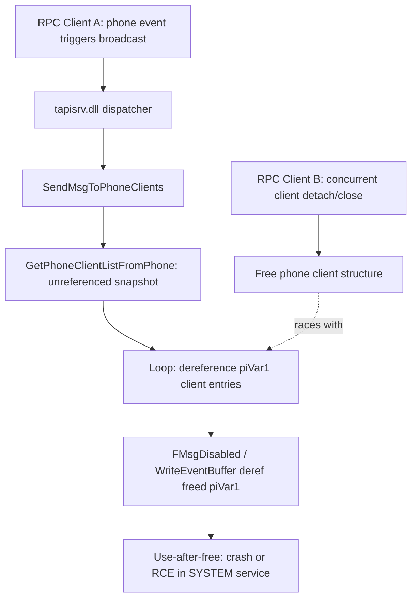

# CVE-2026-61353

**CVE:** CVE-2026-61353  
**Title:** Windows Telephony Service Elevation of Privilege Vulnerability  
**Source:** [https://msrc.microsoft.com/update-guide/vulnerability/CVE-2026-61353](https://msrc.microsoft.com/update-guide/vulnerability/CVE-2026-61353)  
**Component(s):** tapisrv.dll  
**Patched Date:** 2026-08-11T07:00:00  
**CWE:** Heap-based buffer overflow in Windows Telephony Service allows an authorized attacker to elevate privileges locally.  

---

## Related CVEs (Same Component)

This report covers 11 CVEs affecting the same component(s):

- **CVE-2026-61353**  
- CVE-2026-62723  
- CVE-2026-62724  
- CVE-2026-62748  
- CVE-2026-62729  
- CVE-2026-59122  
- CVE-2026-62701  
- CVE-2026-62725  
- CVE-2026-62726  
- CVE-2026-62732  
- CVE-2026-62734  

### Detailed Information

#### CVE-2026-62723

**Title:** Windows Telephony Service Elevation of Privilege Vulnerability  
**Source:** [https://msrc.microsoft.com/update-guide/vulnerability/CVE-2026-62723](https://msrc.microsoft.com/update-guide/vulnerability/CVE-2026-62723)  
**Patched Date:** 2026-08-11T07:00:00  
**CWE:** Use after free in Windows Telephony Service allows an authorized attacker to elevate privileges locally.  

#### CVE-2026-62724

**Title:** Windows Telephony Service Elevation of Privilege Vulnerability  
**Source:** [https://msrc.microsoft.com/update-guide/vulnerability/CVE-2026-62724](https://msrc.microsoft.com/update-guide/vulnerability/CVE-2026-62724)  
**Patched Date:** 2026-08-11T07:00:00  
**CWE:** Use after free in Windows Telephony Service allows an authorized attacker to elevate privileges locally.  

#### CVE-2026-62748

**Title:** Windows Telephony Service Elevation of Privilege Vulnerability  
**Source:** [https://msrc.microsoft.com/update-guide/vulnerability/CVE-2026-62748](https://msrc.microsoft.com/update-guide/vulnerability/CVE-2026-62748)  
**Patched Date:** 2026-08-11T07:00:00  
**CWE:** Concurrent execution using shared resource with improper synchronization ('race condition') in Windows Telephony Service allows an authorized attacker to elevate privileges locally.  

#### CVE-2026-62729

**Title:** Windows Telephony Service Elevation of Privilege Vulnerability  
**Source:** [https://msrc.microsoft.com/update-guide/vulnerability/CVE-2026-62729](https://msrc.microsoft.com/update-guide/vulnerability/CVE-2026-62729)  
**Patched Date:** 2026-08-11T07:00:00  
**CWE:** Concurrent execution using shared resource with improper synchronization ('race condition') in Windows Telephony Service allows an authorized attacker to elevate privileges locally.  

#### CVE-2026-59122

**Title:** Windows Telephony Service Elevation of Privilege Vulnerability  
**Source:** [https://msrc.microsoft.com/update-guide/vulnerability/CVE-2026-59122](https://msrc.microsoft.com/update-guide/vulnerability/CVE-2026-59122)  
**Patched Date:** 2026-08-11T07:00:00  
**CWE:** Concurrent execution using shared resource with improper synchronization ('race condition') in Windows Telephony Service allows an authorized attacker to elevate privileges locally.  

#### CVE-2026-62701

**Title:** Windows Telephony Service Elevation of Privilege Vulnerability  
**Source:** [https://msrc.microsoft.com/update-guide/vulnerability/CVE-2026-62701](https://msrc.microsoft.com/update-guide/vulnerability/CVE-2026-62701)  
**Patched Date:** 2026-08-11T07:00:00  
**CWE:** Use after free in Windows Telephony Service allows an authorized attacker to elevate privileges locally.  

#### CVE-2026-62725

**Title:** Windows Telephony Service Elevation of Privilege Vulnerability  
**Source:** [https://msrc.microsoft.com/update-guide/vulnerability/CVE-2026-62725](https://msrc.microsoft.com/update-guide/vulnerability/CVE-2026-62725)  
**Patched Date:** 2026-08-11T07:00:00  
**CWE:** Use after free in Windows Telephony Service allows an authorized attacker to elevate privileges locally.  

#### CVE-2026-62726

**Title:** Windows Telephony Service Elevation of Privilege Vulnerability  
**Source:** [https://msrc.microsoft.com/update-guide/vulnerability/CVE-2026-62726](https://msrc.microsoft.com/update-guide/vulnerability/CVE-2026-62726)  
**Patched Date:** 2026-08-11T07:00:00  
**CWE:** Use after free in Windows Telephony Service allows an authorized attacker to elevate privileges locally.  

#### CVE-2026-62732

**Title:** Windows Telephony Service Elevation of Privilege Vulnerability  
**Source:** [https://msrc.microsoft.com/update-guide/vulnerability/CVE-2026-62732](https://msrc.microsoft.com/update-guide/vulnerability/CVE-2026-62732)  
**Patched Date:** 2026-08-11T07:00:00  
**CWE:** Heap-based buffer overflow in Windows Telephony Service allows an authorized attacker to elevate privileges locally.  

#### CVE-2026-62734

**Title:** Windows Telephony Service Elevation of Privilege Vulnerability  
**Source:** [https://msrc.microsoft.com/update-guide/vulnerability/CVE-2026-62734](https://msrc.microsoft.com/update-guide/vulnerability/CVE-2026-62734)  
**Patched Date:** 2026-08-11T07:00:00  
**CWE:** Concurrent execution using shared resource with improper synchronization ('race condition') in Windows Telephony Service allows an authorized attacker to elevate privileges locally.  

---

Download Patched & Vulnerable Components:

```bash
# tapisrv.dll
wget https://msdl.microsoft.com/download/symbols/tapisrv.dll/366496185E000/tapisrv.dll -O tapisrv.dll.10.0.26100.8972 # vulnerable
wget https://msdl.microsoft.com/download/symbols/tapisrv.dll/0719523260000/tapisrv.dll -O tapisrv.dll.10.0.26100.9168 # patched
```

## Version Tracking Analysis

**Command:**

```
python ghidra_scripts\ghidra_vt_wrapper.py --old-binary ./reports/2026-Aug/CVE-2026-61353/tapisrv.dll.10.0.26100.8972 --new-binary ./reports/2026-Aug/CVE-2026-61353/tapisrv.dll.10.0.26100.9168 --project-dir ./reports/2026-Aug/CVE-2026-61353/ghidra_project --project-name tapisrv.dll_CVE-2026-61353 --ghidra-dir C:\Tools\ghidra_11.4.2_PUBLIC_20250826\ghidra_11.4.2_PUBLIC --output-dir ./reports/2026-Aug/CVE-2026-61353/ghidra_project/vt_results --max-memory 16g
```

Patched Functions: 17 | New Functions: 22 | Removed Functions: 1 | Total Matches: 10394 | Accepted Matches: 6756

### Patched Functions

*Showing top 10 of 17 patched functions*

| Function Name | Source Address | Dest Address | Similarity | Confidence |
| --- | --- | --- | --- | --- |
| `CreatetCallClient` | `18000452c` | `180004640` | 0.886 | 10.0 |
| `PhoneEventProc` | `180027008` | `180029b68` | 0.777 | 10.0 |
| `LGetHubRelatedCalls` | `18000e260` | `18000f5a0` | 0.771 | 10.0 |
| `LGetConfRelatedCalls` | `18000d200` | `18000e4e0` | 0.762 | 10.0 |
| `LineEventProc` | `180018a70` | `18001a430` | 0.744 | 10.0 |
| `DestroytPhone` | `1800229e4` | `180024ec4` | 0.744 | 10.0 |
| `SendMsgToPhoneClients` | `180027d40` | `18002a920` | 0.720 | 10.0 |
| `SetDeviceInfo` | `1800365dc` | `18003929c` | 0.695 | 10.0 |
| `SendMsgToLineClients` | `18001cd18` | `18001f114` | 0.650 | 10.0 |
| `DestroytLine` | `1800054ac` | `1800055e0` | 0.638 | 10.0 |

### New Functions

*Showing 10 of 22 new functions*

| Function Name | Address |
| --- | --- |
| `Feature_1332455739__private_IsEnabledDeviceUsageNoInline` | `180006ccc` |
| `Feature_1486334266__private_IsEnabledDeviceUsageNoInline` | `180006d10` |
| `Feature_1637329210__private_IsEnabledDeviceUsageNoInline` | `180006d54` |
| `Feature_2014030136__private_IsEnabledDeviceUsageNoInline` | `180006d98` |
| `Feature_2627184955__private_IsEnabledDeviceUsageNoInline` | `180006ddc` |
| `Feature_3381373243__private_IsEnabledDeviceUsageNoInline` | `180006e64` |
| `Feature_46639419__private_IsEnabledDeviceUsageNoInline` | `180006eec` |
| `Feature_629654841__private_IsEnabledDeviceUsageNoInline` | `180006f30` |
| `GetCallClientListWithRefs` | `18000745c` |
| `GetCallListWithRefs` | `180007a00` |

### Removed Functions

| Function Name | Address |
| --- | --- |
| `_guard_dispatch_icall` | `180043e70` |

---

# AI Technical Analysis

## Vulnerability Identification

**Core Vulnerable Function(s):**
- `SendMsgToPhoneClients()` - the legacy code path (still present,
  taken when the new feature flag is off) enumerates phone client
  list entries returned by `GetPhoneClientListFromPhone()` without
  acquiring any reference on the enumerated entries, then
  dereferences those entries (`piVar1`/`piVar7`) later while
  dispatching to `FMsgDisabled()` and `WriteEventBuffer()`. A
  concurrent RPC call that tears down a phone client can free the
  entry while it is still being walked, producing a
  time-of-check-to-time-of-use (TOCTOU) use-after-free.

**Supporting Changes:**
- `GetPhoneClientListWithRefs()` / `ReleaseLineClientListWithRefs()`
  - newly invoked helper pair that acquires references on the list
  before enumeration and releases them afterward; this is the actual
  fix mechanism.
- `Feature_2290854203__private_IsEnabledDeviceUsageNoInline()` -
  feature-flag gate that selects between the legacy unreferenced
  path and the new referenced-list path; not itself vulnerable.
- `local_f8` / `uVar1` (loop-bound capture) - caches the client
  count once before the loop instead of re-deriving it per branch;
  supports the new referenced path.

**Unrelated Changes:**
- Variable renumbering (`piVar1` -> `piVar7`, `local_e8`/`local_e4`/
  `local_e0` -> `local_f8`/`local_f4`/`local_f0`, stack buffer
  `auStack_108[32]` -> `auStack_118[32]`) - decompiler artifacts of
  recompilation, not security-relevant.
- `memset(local_b8, 0, 0x44/0x48)` sizing logic - unchanged
  behavior, unrelated to the fix.

---

## Root Cause Analysis

The vulnerability is a classic TOCTOU use-after-free: the function
takes an unsynchronized snapshot pointer to a phone's client list,
then iterates and dereferences each list entry over an extended
window without holding any reference count, violating the implicit
assumption that the referenced client objects remain valid for the
lifetime of the enumeration.

```c
uVar4 = GetPhoneClientListFromPhone(param_1,(longlong *)&local_d0);
puVar5 = local_d0;
if ((int)uVar4 == 0) {
    local_68 = 0x28;
    ...
    uVar6 = 0;
    while (uVar2 = (uint)uVar6, local_d8 = uVar2, uVar2 < *puVar5) {
      piVar1 = *(int **)(puVar5 + uVar6 * 2 + 2);
      if (piVar1 != param_2) {
        pvVar7 = (void *)(ulonglong)param_4;
        uVar6 = (ulonglong)param_3;
        uVar3 = FMsgDisabled(*(uint *)(*(longlong *)(piVar1 + 4) + 0x40),
                             (longlong)(piVar1 + 0x19), uVar6, pvVar7);
        if (uVar3 == 0) {
          ...
          if (*piVar1 == 0x494c4350) {
            WriteEventBuffer(*(int **)(piVar1 + 2),&local_68,uVar6,pvVar7);
          }
        }
      }
LAB_180027f97:
      uVar6 = (ulonglong)(uVar2 + 1);
    }
```

`GetPhoneClientListFromPhone()` hands back `local_d0`, a raw pointer
into shared server state, with no lock or reference held on the
individual client entries stored inside it. The loop bound
`*puVar5` and the entry `piVar1 = *(int **)(puVar5 + uVar6 * 2 + 2)`
are dereferenced fresh on every iteration, meaning any concurrent
mutation of the underlying list is observed mid-enumeration. Inside
the loop, `piVar1` is dereferenced multiple times: `*(longlong *)
(piVar1 + 4)` to fetch a function-context pointer passed to
`FMsgDisabled()`, `piVar1[8]`/`piVar1[0xc]`/`piVar1[9]` for
per-client flags, and `*piVar1`/`*(int **)(piVar1 + 2)` before
`WriteEventBuffer()` is called. If another RPC thread frees the
client object referenced by `piVar1` (for example via a client
disconnect handler) while this loop is executing, all of these
dereferences operate on freed heap memory.

---

## Execution and Trigger Flow

The affected function is reached from the TAPI RPC service
(`tapisrv.dll`) whenever an event associated with a phone device
must be broadcast to every attached phone client -- for example on
a ringing, media, or device-status change. An attacker with two RPC
sessions attached to the same phone device can win a race: session
A triggers a broadcast event that causes `SendMsgToPhoneClients()`
to call `GetPhoneClientListFromPhone()` and begin iterating the
returned list without any reference held. Session B, running
concurrently, issues a close/detach style RPC call that causes the
server to tear down and free its own client-list entry. Because
the enumeration in session A holds no reference and re-reads the
list state each iteration, it can observe and dereference the entry
just freed by session B's teardown path. The freed memory can then
be reclaimed by an attacker-controlled allocation (heap grooming
via other TAPI RPC calls) before `FMsgDisabled()` and
`WriteEventBuffer()` consume attacker-controlled fields from
`piVar1`, turning the use-after-free into a controlled read/write
primitive inside the SYSTEM-privileged telephony service.



---

## Patch Analysis

```diff
-  uVar4 = GetPhoneClientListFromPhone(param_1,(longlong *)&local_d0);
-  puVar5 = local_d0;
-  if ((int)uVar4 == 0) {
+  uVar1 = Feature_2290854203__private_IsEnabledDeviceUsageNoInline();
+  if (uVar1 == 0) {
+    uVar4 = GetPhoneClientListFromPhone(param_1,(longlong *)&local_d8);
+    if ((int)uVar4 != 0) {
+      ...
+    }
+    local_f8 = *local_d8;
+    puVar5 = local_d8;
+  }
+  else {
+    uVar4 = GetPhoneClientListWithRefs(param_1,local_c8,(int *)&local_f8);
+    if ((int)uVar4 != 0) {
+      return;
+    }
+  }
+  uVar1 = local_f8;
+  while (uVar3 = (uint)uVar6, local_e0 = uVar3, uVar3 < uVar1) {
+    uVar2 = Feature_2290854203__private_IsEnabledDeviceUsageNoInline();
+    if (uVar2 == 0) {
+      piVar7 = *(int **)(puVar5 + uVar6 * 2 + 2);
+    }
+    else {
+      piVar7 = *(int **)((longlong)local_c8[0] + uVar6 * 0x18);
+    }
+    ...
+  }
+  uVar3 = Feature_2290854203__private_IsEnabledDeviceUsageNoInline();
+  if (uVar3 != 0) {
+    ReleaseLineClientListWithRefs(local_c8[0],uVar1);
+    return;
+  }
```

The patch adds a second, feature-flag-gated retrieval path built on
`GetPhoneClientListWithRefs()`, which returns both a list pointer
(`local_c8[0]`) and a count (`local_f8`) that were acquired under
reference-counting semantics, rather than a raw shared-state
pointer. The loop bound is now captured once into `uVar1` before
iteration begins, instead of being re-derived from `*puVar5` on
every pass, removing the window where a shrinking/mutating list
could be observed mid-enumeration. After the dispatch loop
completes, `ReleaseLineClientListWithRefs(local_c8[0], uVar1)` is
called to explicitly drop the references taken for enumeration,
symmetric with the acquisition step. The legacy unreferenced path
via `GetPhoneClientListFromPhone()` is retained for compatibility
when the feature flag is disabled, but the new path structurally
eliminates the race by pinning each client object for the duration
of the loop.

This is an effective fix for the TOCTOU/use-after-free: by tying
object lifetime to explicit reference acquire/release calls around
the entire enumeration and dispatch region, a concurrent detach on
another RPC session can no longer free an entry that is still being
read by `FMsgDisabled()` or `WriteEventBuffer()`. Effectiveness is
however contingent on the feature flag
`Feature_2290854203__private_IsEnabledDeviceUsageNoInline()` being
enabled; the unreferenced legacy branch remains reachable in the
binary. Overall, the change converts an unsynchronized shared-state
walk into a reference-counted walk, closing the primary
remote-triggerable use-after-free that could be escalated to code
execution within the SYSTEM-context telephony server.