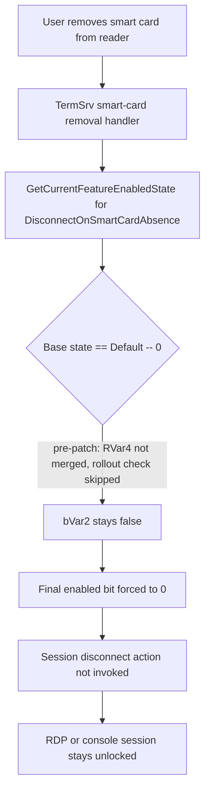

# CVE-2026-61356

**CVE:** CVE-2026-61356  
**Title:** Windows Remote Desktop Services Elevation of Privilege Vulnerability  
**Source:** [https://msrc.microsoft.com/update-guide/vulnerability/CVE-2026-61356](https://msrc.microsoft.com/update-guide/vulnerability/CVE-2026-61356)  
**Component(s):** termsrv.dll  
**Patched Date:** 2026-08-11T07:00:00  
**CWE:** Missing authentication for critical function in Windows Remote Desktop Services allows an authorized attacker to elevate privileges locally.  

---

## Related CVEs (Same Component)

This report covers 5 CVEs affecting the same component(s):

- **CVE-2026-61356**  
- CVE-2026-61367  
- CVE-2026-62692  
- CVE-2026-61364  
- CVE-2026-61365  

### Detailed Information

#### CVE-2026-61367

**Title:** Windows Remote Desktop Services Elevation of Privilege Vulnerability  
**Source:** [https://msrc.microsoft.com/update-guide/vulnerability/CVE-2026-61367](https://msrc.microsoft.com/update-guide/vulnerability/CVE-2026-61367)  
**Patched Date:** 2026-08-11T07:00:00  
**CWE:** Missing authentication for critical function in Windows Remote Desktop Services allows an authorized attacker to elevate privileges locally.  

#### CVE-2026-62692

**Title:** Windows Remote Desktop Services Elevation of Privilege Vulnerability  
**Source:** [https://msrc.microsoft.com/update-guide/vulnerability/CVE-2026-62692](https://msrc.microsoft.com/update-guide/vulnerability/CVE-2026-62692)  
**Patched Date:** 2026-08-11T07:00:00  
**CWE:** Heap-based buffer overflow in Windows Remote Desktop Services allows an authorized attacker to elevate privileges locally.  

#### CVE-2026-61364

**Title:** Windows Remote Desktop Services Elevation of Privilege Vulnerability  
**Source:** [https://msrc.microsoft.com/update-guide/vulnerability/CVE-2026-61364](https://msrc.microsoft.com/update-guide/vulnerability/CVE-2026-61364)  
**Patched Date:** 2026-08-11T07:00:00  
**CWE:** Missing authentication for critical function in Windows Remote Desktop Services allows an authorized attacker to elevate privileges locally.  

#### CVE-2026-61365

**Title:** Windows Remote Desktop Services Elevation of Privilege Vulnerability  
**Source:** [https://msrc.microsoft.com/update-guide/vulnerability/CVE-2026-61365](https://msrc.microsoft.com/update-guide/vulnerability/CVE-2026-61365)  
**Patched Date:** 2026-08-11T07:00:00  
**CWE:** Missing authentication for critical function in Windows Remote Desktop Services allows an authorized attacker to elevate privileges locally.  

---

Download Patched & Vulnerable Components:

```bash
# termsrv.dll
wget https://msdl.microsoft.com/download/symbols/termsrv.dll/0B8D1ED713C000/termsrv.dll -O termsrv.dll.10.0.26100.8737 # vulnerable
wget https://msdl.microsoft.com/download/symbols/termsrv.dll/B61B103A13C000/termsrv.dll -O termsrv.dll.10.0.26100.8972 # patched
```

## Version Tracking Analysis

**Command:**

```
python ghidra_scripts\ghidra_vt_wrapper.py --old-binary ./reports/2026-Aug/CVE-2026-61356/termsrv.dll.10.0.26100.8737 --new-binary ./reports/2026-Aug/CVE-2026-61356/termsrv.dll.10.0.26100.8972 --project-dir ./reports/2026-Aug/CVE-2026-61356/ghidra_project --project-name termsrv.dll_CVE-2026-61356 --ghidra-dir C:\Tools\ghidra_11.4.2_PUBLIC_20250826\ghidra_11.4.2_PUBLIC --output-dir ./reports/2026-Aug/CVE-2026-61356/ghidra_project/vt_results --max-memory 16g
```

Patched Functions: 6 | New Functions: 14 | Removed Functions: 4 | Total Matches: 110072 | Accepted Matches: 25269

### Patched Functions

| Function Name | Source Address | Dest Address | Similarity | Confidence |
| --- | --- | --- | --- | --- |
| `wil_details_RecordCachedUsage` | `180033c04` | `180033c84` | 0.996 | 10.0 |
| `VerifyCallerIsLogonUIAndGetSession` | `1800518fc` | `18005197c` | 0.951 | 10.0 |
| `CTSRpcClientTrackerMgr::TrackCaller` | `180048b60` | `180048be0` | 0.897 | 10.0 |
| `FeatureImpl<__WilFeatureTraits_Feature_TestLoc03>::GetCurrentFeatureEnabledState` | `180088e00` | `18007ed68` | 0.762 | 10.0 |
| `CallWithHangTimeout::CallWithHangTimeout` | `18007a8f4` | `18007a944` | 0.632 | 10.0 |
| `FeatureImpl<__WilFeatureTraits_Feature_DisconnectOnSmartCardAbsence>::GetCurrentFeatureEnabledState` | `18007d9b4` | `18007e484` | 0.562 | 10.0 |

### New Functions

*Showing 10 of 14 new functions*

| Function Name | Address |
| --- | --- |
| `ImpersonateRpcClient` | `18002c148` |
| `GetSystemDirectoryW<wil::unique_any_t<wil::details::unique_storage<wil::details::resource_policy<unsigned_short*___ptr64,void_(__cdecl*)(void*___ptr64),&void___cdecl_CoTaskMemFree(void*___ptr64),wistd::integral_constant<unsigned___int64,0>,unsigned_short*___ptr64,unsigned_short*___ptr64,0,std::nullptr_t>_>_>,256>` | `180050a1c` |
| `put` | `180051f78` |
| `GetCachedFeatureEnabledState` | `18007da48` |
| `GetCurrentFeatureEnabledState` | `18007e840` |
| `GetCurrentFeatureEnabledState` | `18007ebd4` |
| `ReportUsage` | `18008376c` |
| `ReportUsage` | `180083a14` |
| `TimeoutDurationToFileTimeUnits` | `180085204` |
| `__private_IsEnabled` | `180085684` |

### Removed Functions

| Function Name | Address |
| --- | --- |
| `GetCurrentFeatureEnabledState` | `180088fe8` |
| `ReportUsage` | `180089a1c` |
| `_guard_dispatch_icall` | `1800caad0` |
| `dtor$5` | `1800cbfb7` |

---

# AI Technical Analysis

## Vulnerability Identification

**Core Vulnerable Function(s):**
- `FeatureImpl<Feature_DisconnectOnSmartCardAbsence>::GetCurrentFeatureEnabledState()`
  - Contains a fail-open logic defect in how the "Default"
    (unconfigured) feature-flag state is resolved, causing the
    smart-card-removal session-disconnect security control to
    silently evaluate as disabled instead of consulting the
    staged-rollout override.

**Supporting Changes:**
- `FeatureImpl<Feature_TestLoc03>::GetCurrentFeatureEnabledState()`
  - Sibling instantiation of the same shared WIL feature-flighting
    template; shows the identical control-flow correction and
    corroborates the root cause.
- `GetCurrentFeatureEnabledState()` (new, for `Feature_LocPerfVal`)
  - Dependency invoked by the patched function; still contains the
    pre-fix pattern, confirming which branch the patch changed.

**Unrelated Changes:**
- `VerifyCallerIsLogonUIAndGetSession()` - variable/handle-policy
  renaming only (`handle_invalid_resource_policy` to
  `handle_null_resource_policy`, `reset()` to `put()`); the
  LogonUI path-comparison logic itself is byte-for-byte identical.
- `CTSRpcClientTrackerMgr::TrackCaller()` - impersonation call
  extracted into `ImpersonateRpcClient()`; the rate-limit/max-count
  enforcement logic is unchanged.
- `CImpersonate::ImpersonateRpcClient()` - new helper, functionally
  equivalent to the inlined code it replaces.
- `CallWithHangTimeout::CallWithHangTimeout()` - constant branches
  consolidated into `TimeoutDurationToFileTimeUnits()`; observably
  equivalent timeout/AppVerifier-multiplier behavior.
- `GetSystemDirectoryW<...>()` - extraction of a previously inline
  lambda into a named helper; no behavior change.

---

## Root Cause Analysis

The flaw is a control-flow inversion in the routine that converts a
raw `WilApi_GetFeatureEnabledState()` result into the cached
enabled/disabled decision for `Feature_DisconnectOnSmartCardAbsence`,
the flag that governs whether Terminal Services disconnects a
session when its authenticating smart card is removed. The
pre-patch code assumed the "Default" (unconfigured) state never
needs to consult the staged-rollout override, violating the
invariant that an unconfigured feature must still resolve through
the rollout check before being treated as disabled.

Vulnerable code:

```c
RVar5 = -(uint)((FVar3 & 0x40) != 0) & 0x800 |
        -(uint)((FVar3 & 0x80) != 0) & 0x400 |
        (FVar3 & 3) << 7;
if ((FVar3 & 0xffffff3f) != 0) {
  RVar4 = 0;
  if ((FVar3 & 0xffffff3f) == 2) {
    RVar4 = 0x40;
  }
  RVar5 = RVar5 | RVar4;
}
*param_1 = RVar5;
bVar2 = false;
if ((RVar5 & 0xc00) == 0xc00) {
  bVar1 = true;
} else {
  bVar1 = false;
  if ((RVar5 & 0x40) == 0) goto LAB_18007da6d;
}
bVar2 = FeatureImpl<UxAccOptimization>::__private_IsEnabled(...);
```

`FVar3 & 0xffffff3f` isolates the base `FEATURE_ENABLED_STATE`
(bits 6-7 masked off). When that value is `0` ("Default"/not
explicitly configured), the `if` body never executes, so `RVar4`
is never merged into `RVar5`, and bit `0x40` of `RVar5` stays
clear. Further down, `(RVar5 & 0x40) == 0` sends control straight
to `LAB_18007da6d`, bypassing the call to
`FeatureImpl<UxAccOptimization>::__private_IsEnabled()`, which is
the only path that can set `bVar2 = true`. Because `bVar2` was
initialized `false` and is never reassigned on this path, the
final enabled bit (`uVar6`) is forced to `0`: the feature resolves
to disabled unconditionally, regardless of what the staged-rollout
configuration actually specifies.

---

## Execution and Trigger Flow

Terminal Services (`termsrv.dll`) consults
`FeatureImpl<Feature_DisconnectOnSmartCardAbsence>::GetCurrentFeatureEnabledState()`
whenever it needs to decide if a session must be torn down after
its smart card is removed. `WilApi_GetFeatureEnabledState()` returns
`FEATURE_ENABLED_STATE` `Default` for any machine that has not been
explicitly opted in or out via Group Policy/feature configuration -
the common, out-of-the-box case. On such a machine, the vulnerable
branch is taken every time the check runs: the base state equals
`0`, the rollout-override call is skipped, and the cached result is
pinned to "disabled" before the caller ever inspects the flag.

Trigger sequence: a user authenticates an RDP or console session
using a smart card; the session manager arms the smart-card-removal
watch; the user removes the card; the removal-event handler asks
the feature-state function whether the disconnect policy is active;
the function short-circuits to the disabled result; the disconnect
action is never invoked. The session remains unlocked and fully
interactive. No attacker input is required to reach the vulnerable
branch - it fires under default configuration - but the impact is
directly exploitable by any local/physical attacker who waits for a
legitimate user to step away without manually locking the machine.



---

## Patch Analysis

```diff
-  if ((FVar3 & 0xffffff3f) != 0) {
-    RVar4 = 0;
-    if ((FVar3 & 0xffffff3f) == 2) {
-      RVar4 = 0x40;
-    }
-    RVar5 = RVar5 | RVar4;
-  }
-  *param_1 = RVar5;
+  if ((FVar3 & 0xffffff3f) == 0) {
+    RVar4 = 0x40;
+  } else {
+    RVar4 = 0;
+    if ((FVar3 & 0xffffff3f) == 2) {
+      RVar4 = 0x40;
+    }
+  }
+  RVar6 = RVar6 | RVar4;
+  *param_1 = RVar6;
```

The patch replaces the one-sided `if` with an `if`/`else` that
gives the Default case (`(FVar3 & 0xffffff3f) == 0`) an explicit
outcome: `RVar4 = 0x40`. That value is now unconditionally OR'd
into the working state (`RVar6`) regardless of which arm executed,
so the `0x40` gating bit downstream is always set for the Default
case. Consequently the later `(RVar6 & 0x40) == 0` early-exit is no
longer taken on this path, and execution proceeds into the
`FeatureImpl<LocPerfVal>::__private_IsEnabled()` rollout check
(renamed dependency, functionally equivalent to the prior
`UxAccOptimization` call) before the final enabled/disabled bit is
committed with `*param_1 = RVar6 & 0xfffffffe | RVar7`.

This closes the fail-open path: an unconfigured/Default feature
state can no longer resolve to "disabled" purely by construction -
it must go through the same override/rollout evaluation as every
other state, so a server-side rollout decision to enable
`DisconnectOnSmartCardAbsence` actually takes effect. The fix is a
minimal, targeted control-flow correction that does not alter the
Enabled (`== 2`) or Disabled (other non-zero) cases, limiting
regression risk while removing the specific branch that previously
guaranteed a disabled result.

The security impact of the fix is a restoration of intended
fail-secure behavior for a session-lockout control: with the patch
applied, machines relying on default/rollout-driven configuration
correctly enforce session disconnection on smart-card removal,
closing the local session-hijacking window that existed when the
control silently never activated.