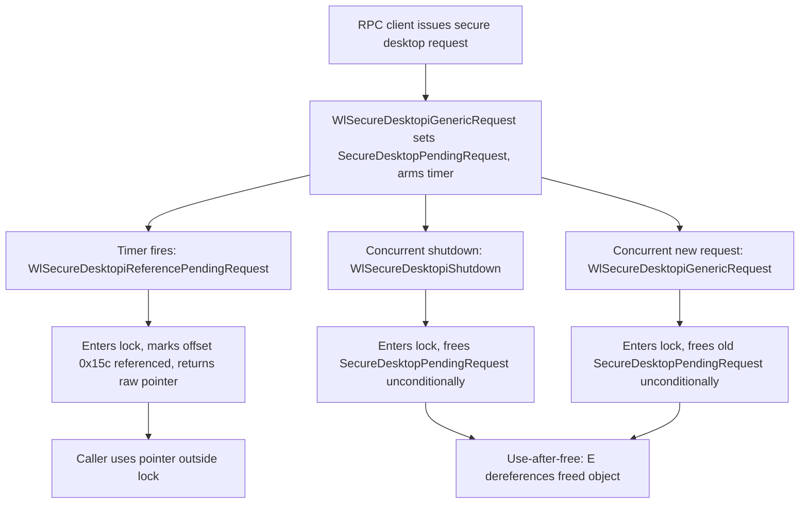

# CVE-2026-61939

**CVE:** CVE-2026-61939  
**Title:** Winlogon Elevation of Privilege Vulnerability  
**Source:** [https://msrc.microsoft.com/update-guide/vulnerability/CVE-2026-61939](https://msrc.microsoft.com/update-guide/vulnerability/CVE-2026-61939)  
**Component(s):** winlogon.exe  
**Patched Date:** 2026-08-11T07:00:00  
**CWE:** Use after free in Winlogon allows an authorized attacker to elevate privileges locally.  

Download Patched & Vulnerable Components:

```bash
# winlogon.exe
wget https://msdl.microsoft.com/download/symbols/winlogon.exe/F578E7A3F1000/winlogon.exe -O winlogon.exe.10.0.26100.8972 # vulnerable
wget https://msdl.microsoft.com/download/symbols/winlogon.exe/9873519DF1000/winlogon.exe -O winlogon.exe.10.0.26100.9168 # patched
```

## Version Tracking Analysis

**Command:**

```
python ghidra_scripts\ghidra_vt_wrapper.py --old-binary ./reports/2026-Aug/CVE-2026-61939/winlogon.exe.10.0.26100.8972 --new-binary ./reports/2026-Aug/CVE-2026-61939/winlogon.exe.10.0.26100.9168 --project-dir ./reports/2026-Aug/CVE-2026-61939/ghidra_project --project-name winlogon.exe_CVE-2026-61939 --ghidra-dir C:\Tools\ghidra_11.4.2_PUBLIC_20250826\ghidra_11.4.2_PUBLIC --output-dir ./reports/2026-Aug/CVE-2026-61939/ghidra_project/vt_results --max-memory 16g
```

Patched Functions: 3 | New Functions: 3 | Removed Functions: 2 | Total Matches: 56458 | Accepted Matches: 17798

### Patched Functions

| Function Name | Source Address | Dest Address | Similarity | Confidence |
| --- | --- | --- | --- | --- |
| `WlSecureDesktopiGenericRequest` | `14009fb20` | `14009fbb4` | 0.736 | 10.0 |
| `WlSecureDesktopiShutdown` | `140060534` | `140060534` | 0.525 | 10.0 |
| `WlSecureDesktopiReferencePendingRequest` | `14009fc34` | `14009fcf8` | 0.525 | 10.0 |

### New Functions

| Function Name | Address |
| --- | --- |
| `FUN_14009beb0` | `14009beb0` |
| `Feature_2120987962__private_IsEnabledDeviceUsageNoInline` | `14009f9e8` |
| `_guard_dispatch_icall` | `1400a9bb0` |

### Removed Functions

| Function Name | Address |
| --- | --- |
| `FUN_14009be60` | `14009be60` |
| `_guard_dispatch_icall` | `1400a9ac0` |

---

# AI Technical Analysis

## Vulnerability Identification

**Core Vulnerable Function(s):**
- `WlSecureDesktopiReferencePendingRequest()` - hands a live raw
  pointer to `SecureDesktopPendingRequest` back to its caller (via
  the `lVar4` return value) after only a lock-protected pointer
  read, without any mechanism ensuring the object cannot be freed
  while that returned reference is still in use outside the lock.
- `WlSecureDesktopiShutdown()` - unconditionally called
  `WlSecureDesktoppAbortAndFreeRequest()` on
  `SecureDesktopPendingRequest` during teardown, with no check for
  whether the object was concurrently referenced/in flight.
- `WlSecureDesktopiGenericRequest()` - unconditionally freed and
  replaced the existing `SecureDesktopPendingRequest` whenever a
  new secure-desktop RPC request arrived, with the same missing
  check.

**Supporting Changes:**
- `Feature_2120987962__private_IsEnabledDeviceUsageNoInline()` -
  feature-flighting gate controlling staged rollout of the fix;
  not itself security-relevant.
- `WlSecureDesktoppUnsubscribeEvents()` / `RpcAsyncAbortCall()` -
  new safe-teardown path used when a live reference is detected,
  aborting the async RPC call instead of freeing memory directly.

**Unrelated Changes:**
- Local variable renames (`lVar1` -> `lVar3`, `puVar2` -> `puVar4`,
  etc.) - decompiler artifacts from re-numbering, no behavioral or
  security impact.

---

## Root Cause Analysis

The flaw is a use-after-free caused by missing lifetime
synchronization on the shared `SecureDesktopPendingRequest` object.
Three code paths - the RPC request handler, the timer-driven
reference callback, and the shutdown routine - all read/write this
pointer under `SecureDesktopRequestLock`, but the critical section
only protected the pointer value, not the underlying object's
lifetime once a raw reference had been handed out.

```c
/* WlSecureDesktopiReferencePendingRequest (before) */
if ((SecureDesktopServerIsStarted != '\0') &&
    (SecureDesktopPendingRequest != 0)) {
  bVar1 = WlSecureDesktoppIsRequestInProgress(SecureDesktopPendingRequest);
  lVar4 = SecureDesktopPendingRequest;
  if (bVar1) {
    *(undefined1 *)(SecureDesktopPendingRequest + 0x15c) = 1;
  }
  ...
}
```

```c
/* WlSecureDesktopiShutdown (before) */
if (SecureDesktopPendingRequest != 0) {
  WlSecureDesktoppAbortAndFreeRequest(puVar2,0x45b);
  SecureDesktopPendingRequest = 0;
}
```

`WlSecureDesktopiReferencePendingRequest` runs on a timer callback,
sets a byte at offset `0x15c` to mark the request as
"in-progress/referenced", and returns `lVar4`, a raw pointer that
the caller then uses outside the critical section. Meanwhile,
`WlSecureDesktopiShutdown` and `WlSecureDesktopiGenericRequest` both
test only `SecureDesktopPendingRequest != 0` before calling
`WlSecureDesktoppAbortAndFreeRequest()`, which frees the object.
Neither function consulted the `0x15c` flag, so if shutdown or a
new incoming request raced with an in-flight reference obtained via
the timer callback, the object could be freed while still held and
subsequently dereferenced by the other thread - a classic
free-while-referenced condition.

---

## Execution and Trigger Flow

Exploitation requires two asynchronous winlogon secure-desktop code
paths to race on the same `SecureDesktopPendingRequest` object. A
prior RPC client initiates a secure-desktop request, which is
recorded in `SecureDesktopPendingRequest` and armed with a timeout
timer via `TpSetTimer`. When the timer fires,
`WlSecureDesktopiReferencePendingRequest` runs, enters the lock,
confirms the request is in progress, marks it referenced at offset
`0x15c`, and returns the raw pointer to its caller, which then uses
the object outside the lock (e.g., to continue servicing the RPC
call). Concurrently, an attacker-influenced event - either the
session/desktop tearing down (`WlSecureDesktopiShutdown`) or a
second RPC client issuing a new secure-desktop request
(`WlSecureDesktopiGenericRequest`) - acquires the same lock and, in
the unpatched code, unconditionally frees
`SecureDesktopPendingRequest` without checking whether it is the
same object currently referenced by the timer path. Once freed, the
timer-path caller's outstanding raw pointer becomes dangling; any
subsequent access to it constitutes a use-after-free that can
corrupt heap metadata or be leveraged for further memory corruption
in the winlogon process, which runs with elevated privileges.



---

## Patch Analysis

```diff
-    if (SecureDesktopPendingRequest != 0) {
-      WlSecureDesktoppAbortAndFreeRequest(puVar2,0x45b);
-      SecureDesktopPendingRequest = 0;
+    if (SecureDesktopPendingRequest != (undefined *)0x0) {
+      uVar1 = Feature_2120987962__private_IsEnabledDeviceUsageNoInline();
+      if ((uVar1 == 0) ||
+         (puVar4 = SecureDesktopPendingRequest,
+          SecureDesktopPendingRequest[0x15c] == '\0')) {
+        WlSecureDesktoppAbortAndFreeRequest(puVar4,0x45b);
+      }
+      else {
+        WlSecureDesktoppUnsubscribeEvents((longlong)SecureDesktopPendingRequest);
+        RVar2 = RpcAsyncAbortCall(*(PRPC_ASYNC_STATE *)(SecureDesktopPendingRequest + 0x108),0x45b);
+        I_RpcMapWin32Status(RVar2);
+      }
+      SecureDesktopPendingRequest = (undefined *)0x0;
     }
```

The patch introduces the `0x15c` flag as an explicit in-use
indicator that all three call sites must now honor before freeing
`SecureDesktopPendingRequest`. In `WlSecureDesktopiShutdown`, if the
flag is set, the code no longer frees the object directly; instead
it unsubscribes event notifications and issues
`RpcAsyncAbortCall()`, letting the RPC runtime tear down the
in-flight call safely rather than freeing memory a concurrent
thread still holds. In `WlSecureDesktopiReferencePendingRequest`,
the added check `(SecureDesktopPendingRequest[0x15c] == '\0')`
skips re-processing (and re-marking) a request that is already
flagged referenced, preventing overlapping reference grants. In
`WlSecureDesktopiGenericRequest`, if the existing pending request is
already flagged in-use, the function now rejects the new request
with error `0xc000042a` instead of freeing the still-referenced
object to make room for it.

This effectively converts an unsynchronized shared-pointer lifetime
into a flag-gated one: freeing only occurs when no other path has
marked the object as actively referenced, and the alternate
abort-without-free path lets an in-flight RPC unwind on its own
schedule. The fix is scoped correctly to the three sites that both
read and free the shared object, closing the race at its point of
origin rather than only at one call site. Because all mutations
still occur under `SecureDesktopRequestLock`, the flag read/write is
itself race-free relative to the pointer swap.

The change is gated behind
`Feature_2120987962__private_IsEnabledDeviceUsageNoInline()`,
indicating a staged rollout typical of Windows feature-flighted
servicing fixes; when the feature is disabled the original
vulnerable behavior remains active. This is a defense-in-depth
consideration for deployment but does not change the correctness of
the fix once fully enabled. Overall, the patch eliminates the
identified use-after-free by tying object lifetime to an explicit,
lock-protected reference flag shared across all three code paths.