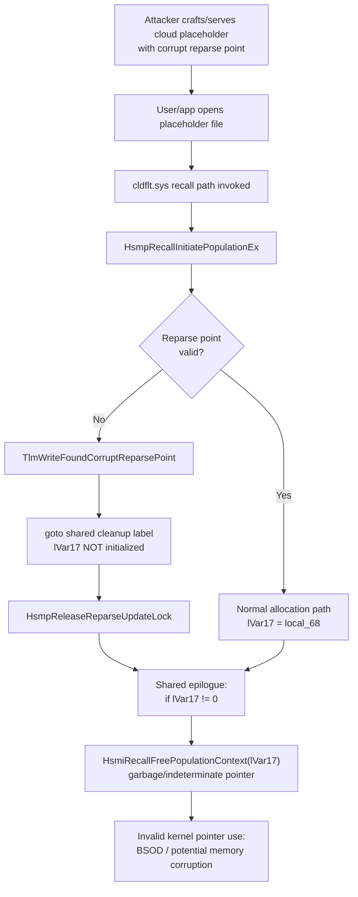

# CVE-2026-62713

**CVE:** CVE-2026-62713  
**Title:** Windows Cloud Files Mini Filter Driver Elevation of Privilege Vulnerability  
**Source:** [https://msrc.microsoft.com/update-guide/vulnerability/CVE-2026-62713](https://msrc.microsoft.com/update-guide/vulnerability/CVE-2026-62713)  
**Component(s):** cldflt.sys  
**Patched Date:** 2026-08-11T07:00:00  
**CWE:** Heap-based buffer overflow in Windows Cloud Files Mini Filter Driver allows an authorized attacker to elevate privileges locally.  

---

## Related CVEs (Same Component)

This report covers 2 CVEs affecting the same component(s):

- **CVE-2026-62713**  
- CVE-2026-62771  

### Detailed Information

#### CVE-2026-62771

**Title:** Windows Cloud Files Mini Filter Driver Elevation of Privilege Vulnerability  
**Source:** [https://msrc.microsoft.com/update-guide/vulnerability/CVE-2026-62771](https://msrc.microsoft.com/update-guide/vulnerability/CVE-2026-62771)  
**Patched Date:** 2026-08-11T07:00:00  
**CWE:** Heap-based buffer overflow in Windows Cloud Files Mini Filter Driver allows an authorized attacker to elevate privileges locally.  

---

Download Patched & Vulnerable Components:

```bash
# cldflt.sys
wget https://msdl.microsoft.com/download/symbols/cldflt.sys/3A5C7DF893000/cldflt.sys -O cldflt.sys.10.0.26100.8972 # vulnerable
wget https://msdl.microsoft.com/download/symbols/cldflt.sys/EE050F6F94000/cldflt.sys -O cldflt.sys.10.0.26100.9168 # patched
```

## Version Tracking Analysis

**Command:**

```
python ghidra_scripts\ghidra_vt_wrapper.py --old-binary ./reports/2026-Aug/CVE-2026-62713/cldflt.sys.10.0.26100.8972 --new-binary ./reports/2026-Aug/CVE-2026-62713/cldflt.sys.10.0.26100.9168 --project-dir ./reports/2026-Aug/CVE-2026-62713/ghidra_project --project-name cldflt.sys_CVE-2026-62713 --ghidra-dir C:\Tools\ghidra_11.4.2_PUBLIC_20250826\ghidra_11.4.2_PUBLIC --output-dir ./reports/2026-Aug/CVE-2026-62713/ghidra_project/vt_results --max-memory 16g
```

Patched Functions: 4 | New Functions: 7 | Removed Functions: 1 | Total Matches: 8618 | Accepted Matches: 7396

### Patched Functions

| Function Name | Source Address | Dest Address | Similarity | Confidence |
| --- | --- | --- | --- | --- |
| `HsmIBitmapNORMALPrepareCommit` | `14006693c` | `14006693c` | 0.997 | 10.0 |
| `HsmpRecallInitiatePopulationEx` | `140003670` | `140003670` | 0.889 | 10.0 |
| `HsmiRecallPostProcessUserHydrationRequest` | `140086bf4` | `140085924` | 0.773 | 10.0 |
| `HsmiBitmapNORMALOpenOnDisk` | `14006c8bc` | `1400861c4` | 0.640 | 10.0 |

### New Functions

| Function Name | Address |
| --- | --- |
| `Feature_1008182587__private_IsEnabledDeviceUsageNoInline` | `140017dac` |
| `Feature_1008182587__private_IsEnabledFallback` | `140017de4` |
| `WPP_SF_qqqLiid` | `1400188d4` |
| `Feature_3051065658__private_IsEnabledDeviceUsageNoInline` | `140018adc` |
| `Feature_3051065658__private_IsEnabledFallback` | `140018b14` |
| `WPP_SF_qisdDd` | `1400191a8` |
| `_guard_dispatch_icall` | `14001e670` |

### Removed Functions

| Function Name | Address |
| --- | --- |
| `_guard_dispatch_icall` | `14001e470` |

---

# AI Technical Analysis

## Vulnerability Identification

**Core Vulnerable Function(s):**
- `HsmpRecallInitiatePopulationEx()` - An early-exit branch that
  detects a corrupt on-disk reparse point jumps to the function's
  shared cleanup/epilogue without initializing the population
  context pointer `lVar17`, allowing an indeterminate stack value
  to reach `HsmiRecallFreePopulationContext()` as if it were a
  valid pointer.

**Supporting Changes:**
- None. The vulnerable function's fix is self-contained (a single
  local initialization added before an existing `goto`).

**Unrelated Changes:**
- `HsmIBitmapNORMALPrepareCommit()` - Every substantive branch
  condition, offset, and size check (e.g. `0x18`, the `0xfff`
  masks) is byte-for-byte identical before and after. The only
  differences are WPP trace-message ID renumbering, label
  renumbering, and two `memmove` -> `memcpy` decompiler
  re-renderings with no change to overlap-relevant bounds logic -
  consistent with recompilation noise, not a logic change.
- `HsmiRecallPostProcessUserHydrationRequest()` - The diff is
  decompiler-level churn: local variable renaming/reordering, a
  parameter type refinement from `ulonglong` to `int` for
  `param_3`, and removal of "unreachable block" annotations at
  different addresses. Control flow, comparisons, and called
  functions are unchanged, indicating this is a byproduct of the
  binary recompiling around the real fix rather than an
  independent security change.

---

## Root Cause Analysis

The defect is a use of an uninitialized (indeterminate) local
variable that is later treated as a heap/context pointer and
passed to a free routine. The invariant violated is that every
code path reaching the function's shared cleanup epilogue must
have `lVar17` set to either a valid, owned population-context
pointer or `0`; the corrupt-reparse-point exit path violated this
by jumping to the shared epilogue before that variable was ever
assigned.

Vulnerable code (before):

```c
if (*(char *)(lVar3 + 0x18) != '\0') {
    uVar6 = 0xc000cf0c;
    HsmDbgBreakOnStatus(-0x3fff30f4);
    ...
    TlmWriteFoundCorruptReparsePoint(lVar12,uVar6);
    goto LAB_140003773;
}
...
/* much later, only on the success path: */
local_60 = (uint *)0x0;
*(undefined **)(local_68 + 0x50) = param_7;
...
lVar17 = local_68;
...
LAB_140003773:
    HsmpReleaseReparseUpdateLock(param_2);
...
/* shared epilogue, reached from all paths */
if (lVar17 != 0) {
    HsmiRecallFreePopulationContext(lVar17);
}
```

`lVar17` is only ever given a defined value (`lVar17 = local_68`)
after `HsmiRecallAllocatePopulationContext()` succeeds, deep in
the "happy path" of the function. Multiple earlier branches -
most notably the one that calls `TlmWriteFoundCorruptReparsePoint`
upon detecting an invalid reparse point in `lVar3 + 0x18` - use
`goto LAB_140003773` to reach `HsmpReleaseReparseUpdateLock` and
fall through to the function's single shared exit block. That
exit block unconditionally tests `lVar17 != 0` and, if true,
calls `HsmiRecallFreePopulationContext(lVar17)`. Because the
corrupt-reparse-point branch executes before `lVar17` is ever
written, the variable still holds whatever bit pattern was
present in that stack slot at function entry - leftover data from
a prior call frame on the kernel stack. If that stale value is
non-zero, `HsmiRecallFreePopulationContext` is invoked on an
attacker-uninitialized, effectively arbitrary pointer.

---

## Execution and Trigger Flow

The vulnerable path is reached during hydration ("recall") of a
Cloud Filter placeholder file, e.g. a OneDrive Files-On-Demand
stub. An attacker who can place or influence a placeholder's
on-disk reparse-point metadata (via a malicious sync provider, a
crafted cloud provider payload, or direct manipulation of the
reparse buffer through a lower-privileged component) causes the
buffer at `lVar3 + 0x18` to be marked invalid. When any process
opens or reads the placeholder, the file system triggers a
recall/hydration request that the Cloud Filter minifilter
(`cldflt.sys`) processes through `HsmpRecallInitiatePopulationEx`.
The function first resolves attribution information and acquires
the reparse-update lock, then checks the reparse point's validity
flag. On the corrupt-reparse branch it logs the event via
`TlmWriteFoundCorruptReparsePoint` and jumps directly to the
shared cleanup label, skipping the later code that would normally
initialize the population-context pointer. Execution falls
through `HsmpReleaseReparseUpdateLock`, computes the function's
return status, and reaches the common epilogue, where the stale,
uninitialized `lVar17` is tested and, if non-zero, handed to
`HsmiRecallFreePopulationContext`. Because this all executes in
kernel mode inside the filter driver's I/O completion context, a
non-zero garbage value manifests as an invalid kernel pointer
dereference/free, causing a crash, and under favorable stack
conditions potentially further memory corruption.



---

## Patch Analysis

Patched code:

```diff
       TlmWriteFoundCorruptReparsePoint(lVar12,uVar6);
-      goto LAB_140003773;
+      lVar17 = 0;
+      goto LAB_140003765;
```

The fix inserts a single explicit assignment, `lVar17 = 0;`,
immediately before the existing jump to the shared cleanup path
that follows detection of a corrupt reparse point. All other
logic in the function - the reparse validity check, the lock
acquire/release sequence, the status codes, and the later
allocation and assignment of `lVar17 = local_68` on the success
path - is untouched. The renamed labels (`LAB_140003773` ->
`LAB_140003765`, etc.) are cosmetic artifacts of address shifts
caused by the newly inserted instruction and do not reflect
control-flow changes.

Technically, this guarantees that when the corrupt-reparse-point
branch is taken, `lVar17` carries a well-defined value (`0`)
into the function's shared epilogue instead of whatever
indeterminate data occupied that stack slot. The epilogue's guard,
`if (lVar17 != 0) { HsmiRecallFreePopulationContext(lVar17); }`,
now correctly evaluates to false on this path, so the free routine
is never called with a bogus pointer.

This is a minimal, surgical fix: it does not restructure control
flow, add new locks, or change the allocation lifecycle - it
simply ensures a pointer variable is deterministically
initialized on every path that reaches a shared cleanup routine
guarded by a non-null check. This pattern (seed-to-zero before an
early-exit `goto`) fully closes the specific uninitialized-use
window without altering behavior on any other path, since those
paths already reach the epilogue with `lVar17` correctly set
(either `0` from prior initialization or a valid context pointer
after a successful allocation).

Security impact: the patch eliminates a kernel-mode invalid/
arbitrary pointer free reachable by any user or process able to
trigger hydration of a placeholder file with a corrupt reparse
point, removing a denial-of-service and potential local privilege
escalation vector in the `cldflt.sys` Cloud Filter driver.