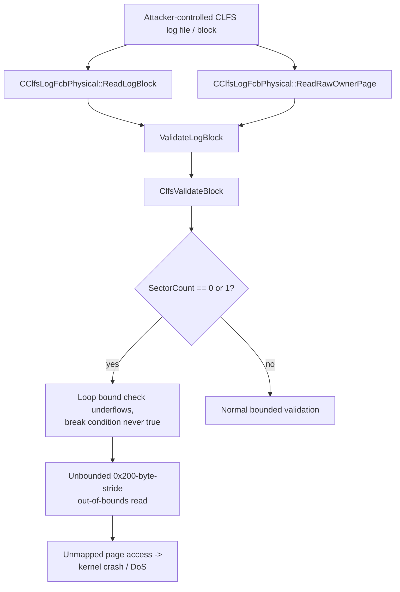

# CVE-2026-62728

**CVE:** CVE-2026-62728  
**Title:** Windows Common Log File System Driver Elevation of Privilege Vulnerability  
**Source:** [https://msrc.microsoft.com/update-guide/vulnerability/CVE-2026-62728](https://msrc.microsoft.com/update-guide/vulnerability/CVE-2026-62728)  
**Component(s):** clfs.sys  
**Patched Date:** 2026-08-11T07:00:00  
**CWE:** Time-of-check time-of-use (toctou) race condition in Windows Common Log File System Driver allows an authorized attacker to elevate privileges locally.  

Download Patched & Vulnerable Components:

```bash
# clfs.sys
wget https://msdl.microsoft.com/download/symbols/clfs.sys/92B569108C000/clfs.sys -O clfs.sys.10.0.26100.8972 # vulnerable
wget https://msdl.microsoft.com/download/symbols/clfs.sys/F44FD6298C000/clfs.sys -O clfs.sys.10.0.26100.9168 # patched
```

## Version Tracking Analysis

**Command:**

```
python ghidra_scripts\ghidra_vt_wrapper.py --old-binary ./reports/2026-Aug/CVE-2026-62728/clfs.sys.10.0.26100.8972 --new-binary ./reports/2026-Aug/CVE-2026-62728/clfs.sys.10.0.26100.9168 --project-dir ./reports/2026-Aug/CVE-2026-62728/ghidra_project --project-name clfs.sys_CVE-2026-62728 --ghidra-dir C:\Tools\ghidra_11.4.2_PUBLIC_20250826\ghidra_11.4.2_PUBLIC --output-dir ./reports/2026-Aug/CVE-2026-62728/ghidra_project/vt_results --max-memory 16g
```

Patched Functions: 3 | New Functions: 3 | Removed Functions: 1 | Total Matches: 12621 | Accepted Matches: 9672

### Patched Functions

| Function Name | Source Address | Dest Address | Similarity | Confidence |
| --- | --- | --- | --- | --- |
| `CClfsLogFcbPhysical::ReadRawOwnerPage` | `14006912c` | `140068dc4` | 0.980 | 10.0 |
| `CClfsLogFcbPhysical::ReadLogBlock` | `14000f0b0` | `14000eda0` | 0.902 | 10.0 |
| `ClfsValidateBlock` | `140008e20` | `14000dfc0` | 0.519 | 10.0 |

### New Functions

| Function Name | Address |
| --- | --- |
| `Feature_344697147__private_IsEnabledDeviceUsageNoInline` | `140016de0` |
| `Feature_344697147__private_IsEnabledFallback` | `140016e18` |
| `_guard_dispatch_icall` | `1400189d0` |

### Removed Functions

| Function Name | Address |
| --- | --- |
| `_guard_dispatch_icall` | `140018ac0` |

---

# AI Technical Analysis

## Vulnerability Identification

**Core Vulnerable Function(s):**
- `ClfsValidateBlock()` - Validates the sector-signature chain
  of a log block using an attacker-influenced `SectorCount`
  field without properly bounding the validation loop,
  allowing an out-of-bounds read past the log block buffer.

**Supporting Changes:**
- `CClfsLogFcbPhysical::ReadLogBlock()` - Caller that reads a
  log block from disk/cache and invokes `ValidateLogBlock()`
  (which wraps `ClfsValidateBlock()`) on the resulting buffer;
  also adds a new cached-read fast path and feature-flag
  branches unrelated to the core flaw.
- `CClfsLogFcbPhysical::ReadRawOwnerPage()` - Caller that reads
  the owner page and invokes `ValidateLogBlock()`; the patch
  replaces a hardcoded zero signature byte
  (`in_stack_ffffffffffffff98`) with the actual buffer byte
  `param_2[2]`, tightening what value is accepted as the
  expected sector signature.

**Unrelated Changes:**
- Variable/stack-frame renaming (`local_ec` -> `local_104`,
  etc.) throughout both `ReadLogBlock()` and
  `ReadRawOwnerPage()` - purely cosmetic decompiler artifacts
  from recompilation, not security relevant.
- `Feature_344697147__private_IsEnabledDeviceUsageNoInline()`
  and `Feature_950255931__private_IsEnabledDeviceUsageNoInline()`
  gated branches - feature-flag plumbing for an alternate
  read/telemetry path, not the root cause of the fix.

---

## Root Cause Analysis

The flaw is a classic unsigned-integer-underflow-driven missing
bounds check. `ClfsValidateBlock()` reads a 16-bit `SectorCount`
field (`*(ushort *)(param_2 + 4)`) directly from the log block
header, a structure supplied from the on-disk/in-cache log file
that an attacker with write access to a BLF log (or the ability
to inject a crafted log block) fully controls. The code assumed
this value is always large enough that `SectorCount - 1` stays
non-negative, but never enforced that assumption before using it
to bound a validation loop.

Vulnerable code (before):

```c
uVar8 = 1;
while( true ) {
    *param_6 = uVar8;
    if (*(ushort *)(param_2 + 4) - 1 <= uVar8) break;
    _Var1 = param_2[(ulonglong)uVar8 * 0x200 + 0x1fe];
    ...
    if (param_2[(ulonglong)uVar8 * 0x200 + 0x1ff] !=
        (_CLFS_LOG_BLOCK_HEADER)param_4) {
        return -0x3fe5fffe;
    }
    ...
    uVar8 = uVar8 + 1;
}
```

`*(ushort *)(param_2 + 4)` is promoted to `int` before the
subtraction, so when `SectorCount` is `0` or `1` the expression
evaluates to `-1` or `0`. The comparison `<= uVar8` mixes this
signed result with the unsigned loop counter `uVar8`, so the C
usual-arithmetic-conversion rules convert `-1` to `0xFFFFFFFF`.
The break condition `0xFFFFFFFF <= uVar8` is then false for any
realistic `uVar8`, so the loop never terminates via the intended
guard. Each iteration indexes `param_2[uVar8 * 0x200 + 0x1fe]`
and `param_2[uVar8 * 0x200 + 0x1ff]`, walking 0x200 bytes past
the block buffer on every pass. Because the earlier size check
`param_3 < (uint)uVar2 << 9` collapses to `param_3 < 0` when
`SectorCount` is `0`, it is always false and provides no
protection either. The loop only stops once it happens to read
a byte that fails the signature comparison or the high-bit
check, which in practice means walking arbitrarily far past the
allocated block until it faults on an unmapped page.

---

## Execution and Trigger Flow

An attacker who can supply or tamper with a CLFS log file (a
`.blf`/container file, reachable by any component that opens a
transactional log through `CreateLogFile`/`ReadLogRecord`-style
APIs, or a local process with write access to a log used by a
privileged service) crafts a log block whose header field at
offset `0x4` (`SectorCount`) is set to `0` or `1`, while keeping
the leading signature checks satisfiable. When a privileged
component subsequently reads that block, `ReadLogBlock()` (or
`ReadRawOwnerPage()` for owner-page reads) loads the block into
a fixed-size buffer and calls `ValidateLogBlock()`, which
dispatches into `ClfsValidateBlock()`. Inside
`ClfsValidateBlock()`, the crafted `SectorCount` passes the
initial `*(ushort *)(param_2 + 6) < uVar2` sanity check (since a
small count is not "too large"), and the buffer-size gate
collapses to a no-op due to the same underflow. Execution enters
the per-sector validation loop, and because the loop-termination
comparison suffers the signed/unsigned conversion bug, the
attacker-controlled block causes the kernel driver to read
memory far outside the 4 KB/0x1000-byte block buffer, one 0x200
byte stride at a time, until it hits unmapped memory and the
system crashes, or until it happens to encounter data that
satisfies/violates the comparisons.



---

## Patch Analysis

```diff
+  lVar4 = ClfsValidateSector((uchar *)param_2,param_4,param_5 | 0x40);
+  if (lVar4 < 0) {
+    return lVar4;
+  }
...
-    uVar8 = 1;
-    while( true ) {
-      *param_6 = uVar8;
-      if (*(ushort *)(param_2 + 4) - 1 <= uVar8) break;
-      _Var1 = param_2[(ulonglong)uVar8 * 0x200 + 0x1fe];
+    uVar5 = 1;
+    *param_6 = 1;
+    uVar2 = *(ushort *)(param_2 + 4);
+    if (1 < uVar2 - 1) {
+      do {
+        _Var1 = param_2[uVar5 * 0x200 + 0x1fe];
         ...
-      uVar8 = uVar8 + 1;
-    }
+        uVar6 = *param_6 + 1;
+        uVar5 = (ulonglong)uVar6;
+        *param_6 = uVar6;
+        uVar2 = *(ushort *)(param_2 + 4);
+      } while (uVar6 < uVar2 - 1);
+    }
...
+  lVar4 = ClfsValidateSector((uchar *)(param_2 + ((ulonglong)uVar2 - 1) * 0x200),
+                             param_4,param_5 | 0x20);
+  return lVar4;
```

The patch introduces an explicit `if (1 < uVar2 - 1)` guard
before the loop body executes at all. `uVar2 - 1` is evaluated
once as a local `ushort` snapshot and compared against the
literal `1` rather than being compared, mid-loop, against an
unsigned counter that triggers a sign-conversion trap; this
means a `SectorCount` of `0` or `1` now causes the loop to be
skipped entirely instead of running unbounded. The rewritten
`do...while (uVar6 < uVar2 - 1)` structure also re-reads
`SectorCount` freshly each iteration but now only after the
initial guard has already established that at least two
sectors exist, closing the underflow window. In addition, the
patch adds explicit `ClfsValidateSector()` calls on both the
first sector (flag `0x40`) and the final sector (flag `0x20`)
of the block, providing dedicated per-sector integrity
validation that did not exist before, independent of the
loop-based check. In `ReadRawOwnerPage()`, replacing the
hardcoded zero (`in_stack_ffffffffffffff98`) with `param_2[2]`
ensures the real signature byte embedded in the block is used
for comparison instead of a constant, removing a related
validation-bypass opportunity.

Together these changes are effective: the entry guard
eliminates the unsigned-underflow path that produced the
unbounded loop, and the added `ClfsValidateSector()` calls give
defense-in-depth verification of the sectors most likely to be
tampered with. The fix directly targets the root cause (loop
bound derived from unchecked attacker input) rather than only
patching a symptom. Residual risk is low since the guard uses a
simple literal comparison that cannot itself underflow.
Security impact: this closes an out-of-bounds read in a kernel
driver reachable through crafted CLFS log content, preventing a
local, low-privilege-triggerable denial-of-service (system
crash) and removing a potential kernel memory-disclosure
primitive.