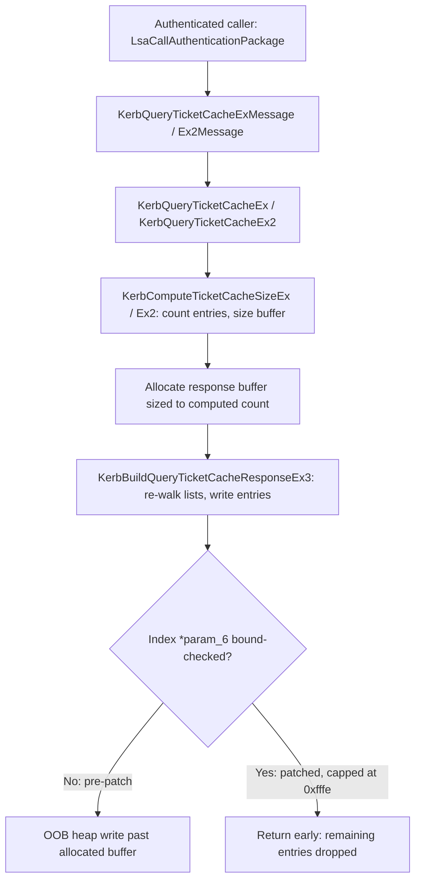

# CVE-2026-62754

**CVE:** CVE-2026-62754  
**Title:** Windows Kerberos Elevation of Privilege Vulnerability  
**Source:** [https://msrc.microsoft.com/update-guide/vulnerability/CVE-2026-62754](https://msrc.microsoft.com/update-guide/vulnerability/CVE-2026-62754)  
**Component(s):** kerberos.dll  
**Patched Date:** 2026-08-11T07:00:00  
**CWE:** Heap-based buffer overflow in Windows Kerberos allows an authorized attacker to elevate privileges locally.  

---

## Related CVEs (Same Component)

This report covers 4 CVEs affecting the same component(s):

- **CVE-2026-62754**  
- CVE-2026-62766  
- CVE-2026-62773  
- CVE-2026-62752  

### Detailed Information

#### CVE-2026-62766

**Title:** Windows Kerberos Elevation of Privilege Vulnerability  
**Source:** [https://msrc.microsoft.com/update-guide/vulnerability/CVE-2026-62766](https://msrc.microsoft.com/update-guide/vulnerability/CVE-2026-62766)  
**Patched Date:** 2026-08-11T07:00:00  
**CWE:** Double free in Windows Kerberos allows an authorized attacker to elevate privileges locally.  

#### CVE-2026-62773

**Title:** Windows Kerberos Elevation of Privilege Vulnerability  
**Source:** [https://msrc.microsoft.com/update-guide/vulnerability/CVE-2026-62773](https://msrc.microsoft.com/update-guide/vulnerability/CVE-2026-62773)  
**Patched Date:** 2026-08-11T07:00:00  
**CWE:** Use after free in Windows Kerberos allows an authorized attacker to elevate privileges locally.  

#### CVE-2026-62752

**Title:** Windows Kerberos Elevation of Privilege Vulnerability  
**Source:** [https://msrc.microsoft.com/update-guide/vulnerability/CVE-2026-62752](https://msrc.microsoft.com/update-guide/vulnerability/CVE-2026-62752)  
**Patched Date:** 2026-08-11T07:00:00  
**CWE:** Heap-based buffer overflow in Windows Kerberos allows an authorized attacker to elevate privileges locally.  

---

Download Patched & Vulnerable Components:

```bash
# kerberos.dll
wget https://msdl.microsoft.com/download/symbols/kerberos.dll/EA0B084A168000/kerberos.dll -O kerberos.dll.10.0.26100.8972 # vulnerable
wget https://msdl.microsoft.com/download/symbols/kerberos.dll/7487B6CB169000/kerberos.dll -O kerberos.dll.10.0.26100.9168 # patched
```

## Version Tracking Analysis

**Command:**

```
python ghidra_scripts\ghidra_vt_wrapper.py --old-binary ./reports/2026-Aug/CVE-2026-62754/kerberos.dll.10.0.26100.8972 --new-binary ./reports/2026-Aug/CVE-2026-62754/kerberos.dll.10.0.26100.9168 --project-dir ./reports/2026-Aug/CVE-2026-62754/ghidra_project --project-name kerberos.dll_CVE-2026-62754 --ghidra-dir C:\Tools\ghidra_11.4.2_PUBLIC_20250826\ghidra_11.4.2_PUBLIC --output-dir ./reports/2026-Aug/CVE-2026-62754/ghidra_project/vt_results --max-memory 16g
```

Patched Functions: 13 | New Functions: 29 | Removed Functions: 15 | Total Matches: 213112 | Accepted Matches: 21542

### Patched Functions

*Showing top 10 of 13 patched functions*

| Function Name | Source Address | Dest Address | Similarity | Confidence |
| --- | --- | --- | --- | --- |
| `__KerbGetTgsTicket` | `1800324d0` | `18002e0d0` | 0.981 | 10.0 |
| `KerbQuerySupplementalCredentials` | `1800c4460` | `1800c48f0` | 0.964 | 10.0 |
| `KerbQueryTicketCacheEx` | `1800677c0` | `18006ff90` | 0.955 | 10.0 |
| `KerbQueryTicketCacheEx2` | `1800c4fc0` | `1800c5490` | 0.955 | 10.0 |
| `KerbCreateCredential` | `18006f2a0` | `18006d9e0` | 0.917 | 10.0 |
| `KerbQueryTicketCache` | `1800c4ca0` | `1800c5150` | 0.917 | 10.0 |
| `<lambda_07760d64eefa13bb22e3fdea25ccc0fb>::operator()` | `1800b29ac` | `1800b22cc` | 0.864 | 1.0 |
| `KerbLocateCredential` | `18006fbe0` | `18006e3a0` | 0.848 | 10.0 |
| `KerbCaptureKdcProxy` | `1800b446c` | `1800b3f14` | 0.841 | 10.0 |
| `KerbSendMessageOverNetwork` | `18007f564` | `1800cd620` | 0.795 | 10.0 |

### New Functions

*Showing 10 of 29 new functions*

| Function Name | Address |
| --- | --- |
| `~basic_streambuf<unsigned_short,std::char_traits<unsigned_short>_>` | `18008c1c8` |
| `_Lock` | `18008c1e0` |
| `_Unlock` | `18008c1f0` |
| `showmanyc` | `18008c200` |
| `uflow` | `18008c210` |
| `xsgetn` | `18008c220` |
| `xsputn` | `18008c230` |
| `setbuf` | `18008c240` |
| `sync` | `18008c250` |
| `imbue` | `18008c260` |

### Removed Functions

*Showing 10 of 15 removed functions*

| Function Name | Address |
| --- | --- |
| `~basic_streambuf<unsigned_short,std::char_traits<unsigned_short>_>` | `18008cb78` |
| `_Lock` | `18008cb90` |
| `_Unlock` | `18008cba0` |
| `showmanyc` | `18008cbb0` |
| `uflow` | `18008cbc0` |
| `xsgetn` | `18008cbd0` |
| `xsputn` | `18008cbe0` |
| `setbuf` | `18008cbf0` |
| `sync` | `18008cc00` |
| `imbue` | `18008cc10` |

---

# AI Technical Analysis

## Vulnerability Identification

**Core Vulnerable Function(s):**
- `KerbBuildQueryTicketCacheResponseEx3()` - iterates three
  linked lists of cached credentials and writes one
  fixed-size ticket-cache entry per credential into a
  caller-supplied output buffer at offset
  `*param_6 * 0x80` (or `* 0x58` for the WOW64 layout),
  incrementing `*param_6` on every entry with no check
  that the index still fits inside the buffer that was
  sized earlier. This is the actual out-of-bounds write.

**Supporting Changes:**
- `KerbQueryTicketCacheEx()` / `KerbQueryTicketCacheEx2()`
  - callers that invoke `KerbComputeTicketCacheSizeEx`/
  `Ex2` to size the response buffer and then hand that
  buffer, plus a running-count pointer, to the vulnerable
  builder while holding `KerberosTicketCacheLock` and the
  per-logon-session critical sections. The patch also adds
  a feature-gated write of a second size field
  (`local_78[1]`) into the response header so the reported
  size stays consistent with whatever the capped builder
  actually wrote.
- `KerbCacheBinding()` - replaces bespoke inline
  `UNICODE_STRING` duplication for `param_1` with the
  vetted `KerbDuplicateStringEx()` helper, incidentally
  fixing corruption of the case-sensitivity flag byte
  (`uVar8`) that the old inline path clobbered. Hardening,
  not the buffer-overflow root cause.
- `KerbLocateCredential()` - adds `AcquireSRWLockShared`/
  `ReleaseSRWLockShared` around reads of a credential's
  supplemental-credential pointer, closing a narrow
  TOCTOU read race unrelated to the array-index overflow.

**Unrelated Changes:**
- `~basic_streambuf<unsigned_short,...>`, `_Lock`,
  `_Unlock`, `showmanyc`, `uflow` - these are compiler-
  generated `std::basic_streambuf<unsigned short>` vtable
  thunks surfaced by symbol/template re-resolution between
  binary versions. They have no code path into Kerberos
  ticket-cache handling and carry no security relevance.

---

## Root Cause Analysis

The flaw is a classic size-then-fill mismatch (CWE-131 /
CWE-787): the number of entries used to size the output
buffer is computed in one pass (`KerbComputeTicketCacheSizeEx`
/ `Ex2`), but the buffer is populated in a second, independent
pass (`KerbBuildQueryTicketCacheResponseEx3`) that walks the
same credential lists again and increments a raw array index
with no upper bound tied to the allocation. If the second walk
observes more entries than the first walk counted -
attacker-achievable by adding supplemental credentials or
additional cached tickets to a logon session between/within
these operations - the write index runs past the end of the
allocated response buffer.

Vulnerable code (`KerbBuildQueryTicketCacheResponseEx3`,
before):

```c
do {
    local_60 = *local_68;
    p_Var7 = *(_KERB_PRIMARY_CREDENTIAL **)local_60;
    local_78 = p_Var7;
    uVar3 = local_88;
    if (p_Var7 != local_68) {
      do {
        uVar8 = 0;
        if (uVar3 == '\0') {
          *(longlong *)(param_2 + (ulonglong)*param_6 * 0x80
                        + 0x48) = *(longlong *)(p_Var7 + 0xf8);
          ... /* many more writes at param_2 + *param_6*0x80 */
        }
        else {
          ... /* WOW64 path at param_2 + *param_6*0x58 */
        }
        *param_6 = *param_6 + 1;
        p_Var7 = *(_KERB_PRIMARY_CREDENTIAL **)(p_Var7 + 0x1b8);
      } while (...);
    }
    local_70 = local_70 + 1;
    uVar9 = uVar9 + 1;
    if (2 < uVar9) return;
} while (true);
```

Each linked-list entry (`p_Var7`) triggers writes at
`param_2 + (*param_6) * 0x80`, and `*param_6` is
unconditionally incremented afterward. `param_6` is the
same count pointer that `KerbQueryTicketCacheEx`/`Ex2`
threaded through from `KerbComputeTicketCacheSizeEx`,
which drove the earlier heap allocation size. Nothing in
the loop compares the running index against that
allocation size, so once the outer `do { } while` walks
through `local_58`, `local_50`, `local_48` (the three
sub-lists at `param_1 + 0xd0/0xa0/0xb8`), any extra
entries beyond what was originally counted are written
past the allocated buffer, corrupting adjacent heap
memory.

---

## Execution and Trigger Flow

An authenticated caller (local or, depending on the RPC
transport used to reach LSA, a network principal)
requests ticket-cache information via
`LsaCallAuthenticationPackage` with a
`KerbQueryTicketCacheExMessage`/`Ex2Message` sub-message,
which the Kerberos SSP dispatches to
`KerbQueryTicketCacheEx`/`KerbQueryTicketCacheEx2`. The
attacker first arranges their logon session to hold many
cached tickets and/or supplemental credentials - for
example by requesting numerous service tickets or
triggering supplemental credential caching across
multiple linked credential entries. When the query is
issued, the target function locates the logon session,
acquires `KerberosTicketCacheLock` and the session's
critical sections, then calls
`KerbComputeTicketCacheSizeEx`/`Ex2` to compute an entry
count and byte size, which drives a stack or heap
allocation (`g_pfnAllocate` or a stack probe path) for the
response buffer. It then calls the vulnerable builder,
passing the same buffer and a pointer to the entry-count
variable. The builder re-walks the credential lists and
writes one entry per credential without ever checking the
running index against the previously computed capacity.
If the second walk yields more entries than the first
(e.g., due to concurrent credential/ticket insertion or an
inconsistency between how the two passes traverse the
supplemental-credential sublists), writes proceed past the
end of the allocated buffer, corrupting heap metadata or
adjacent allocations - a memory-corruption primitive
usable for local privilege escalation or crash/DoS.



---

## Patch Analysis

Patched code:

```diff
       do {
+        bVar3 = wil::details::FeatureImpl<__WilFeatureTraits_Feature_1045933371>::
+                __private_IsEnabled(...);
         uVar8 = 0;
-        if (uVar3 == '\0') {
+        uVar9 = 0;
+        if ((bVar3) && (0xfffe < *param_6)) {
+          return;
+        }
+        if (param_3 == '\0') {
           *(longlong *)(param_2 + (ulonglong)*param_6 * 0x80
                         + 0x48) = *(longlong *)(p_Var7 + 0xf8);
           ...
```

Together with the companion change in
`KerbQueryTicketCacheEx`/`Ex2`:

```diff
+        bVar10 = wil::details::FeatureImpl<__WilFeatureTraits_Feature_1045933371>::
+                 __private_IsEnabled(...);
+        if (bVar10) {
+          *(ulong *)(p_Var18 + 4) = local_78[1];
+        }
```

The fix introduces a hard ceiling of `0xfffe` (65534)
entries on the running index `*param_6` before any further
per-entry writes occur, gated behind feature flag
`Feature_1045933371`. Once the index would exceed that
ceiling, the builder returns immediately instead of
continuing to write past the caller's buffer. The paired
change in the callers writes a corrected size value
(`local_78[1]`) back into the response header so that the
size the caller observes matches the (possibly truncated)
data that was actually written, preventing a secondary
inconsistency between reported and actual buffer size.

This is a bounding/capping mitigation rather than a
structural fix: it does not reconcile the count produced
by `KerbComputeTicketCacheSizeEx`/`Ex2` with the count
observed by the builder, it simply refuses to write beyond
an arbitrary large threshold, and it also does not check
the index against the buffer's actual allocated capacity
(which could be smaller than `0xfffe` entries). It is,
however, effective at eliminating the primary attacker-
reachable path to unbounded heap corruption, since the
number of writes is now capped independent of how many
credential/ticket entries an attacker can accumulate. The
feature-flag gating suggests a staged rollout, meaning
builds where the flag is disabled remain exposed to the
original unbounded write.

Security impact: prior to the patch, an attacker who can
inflate their logon session's cached ticket or
supplemental-credential count could corrupt heap memory
adjacent to the ticket-cache response buffer via an
out-of-bounds write, a primitive with potential for local
privilege escalation or denial of service in the LSASS
process. The patch substantially reduces exploitability by
bounding the maximum write index, though it is a mitigating
cap rather than a full elimination of the size/build
count discrepancy.