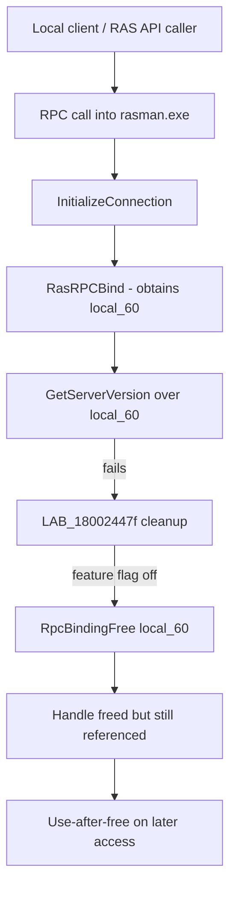

# CVE-2026-62783

**CVE:** CVE-2026-62783  
**Title:** Windows Remote Access Connection Manager Elevation of Privilege Vulnerability  
**Source:** [https://msrc.microsoft.com/update-guide/vulnerability/CVE-2026-62783](https://msrc.microsoft.com/update-guide/vulnerability/CVE-2026-62783)  
**Component(s):** rasman.dll  
**Patched Date:** 2026-08-11T07:00:00  
**CWE:** Heap-based buffer overflow in Windows Remote Access Connection Manager allows an authorized attacker to elevate privileges locally.  

---

## Related CVEs (Same Component)

This report covers 2 CVEs affecting the same component(s):

- **CVE-2026-62783**  
- CVE-2026-62758  

### Detailed Information

#### CVE-2026-62758

**Title:** Windows Remote Access Connection Manager Elevation of Privilege Vulnerability  
**Source:** [https://msrc.microsoft.com/update-guide/vulnerability/CVE-2026-62758](https://msrc.microsoft.com/update-guide/vulnerability/CVE-2026-62758)  
**Patched Date:** 2026-08-11T07:00:00  
**CWE:** Heap-based buffer overflow in Windows Remote Access Connection Manager allows an authorized attacker to elevate privileges locally.  

---

Download Patched & Vulnerable Components:

```bash
# rasman.dll
wget https://msdl.microsoft.com/download/symbols/rasman.dll/173BBBE738000/rasman.dll -O rasman.dll.10.0.26100.8328 # vulnerable
wget https://msdl.microsoft.com/download/symbols/rasman.dll/5E2C7F0636000/rasman.dll -O rasman.dll.10.0.26100.8521 # patched
```

## Version Tracking Analysis

**Command:**

```
python ghidra_scripts\ghidra_vt_wrapper.py --old-binary ./reports/2026-Aug/CVE-2026-62783/rasman.dll.10.0.26100.8328 --new-binary ./reports/2026-Aug/CVE-2026-62783/rasman.dll.10.0.26100.8521 --project-dir ./reports/2026-Aug/CVE-2026-62783/ghidra_project --project-name rasman.dll_CVE-2026-62783 --ghidra-dir C:\Tools\ghidra_11.4.2_PUBLIC_20250826\ghidra_11.4.2_PUBLIC --output-dir ./reports/2026-Aug/CVE-2026-62783/ghidra_project/vt_results --max-memory 16g
```

Patched Functions: 1 | New Functions: 1 | Removed Functions: 16 | Total Matches: 4393 | Accepted Matches: 2955

### Patched Functions

| Function Name | Source Address | Dest Address | Similarity | Confidence |
| --- | --- | --- | --- | --- |
| `InitializeConnection` | `180024374` | `180024338` | 0.694 | 10.0 |

### New Functions

| Function Name | Address |
| --- | --- |
| `_guard_dispatch_icall` | `1800275f0` |

### Removed Functions

*Showing 10 of 16 removed functions*

| Function Name | Address |
| --- | --- |
| `Feature_VPN_BugFixes_25B_Use_After_Free_Fix__private_IsEnabledDeviceUsageNoInline` | `1800242f0` |
| `wil_RtlStagingConfig_QueryFeatureState` | `180024944` |
| `wil_RtlStagingConfig_RecordFeatureUsage` | `180024a3c` |
| `wil_details_AreDependenciesEnabled` | `180024a9c` |
| `wil_details_FeatureReporting_IncrementOpportunityInCache` | `180024b3c` |
| `wil_details_FeatureReporting_IncrementUsageInCache` | `180024c14` |
| `wil_details_FeatureReporting_RecordUsageInCache` | `180024cf8` |
| `wil_details_FeatureReporting_ReportUsageToService` | `180024e78` |
| `wil_details_FeatureReporting_ReportUsageToServiceDirect` | `180024ef4` |
| `wil_details_FeatureStateCache_ReevaluateCachedFeatureEnabledState` | `180024f84` |

---

# AI Technical Analysis

## Vulnerability Identification

**Core Vulnerable Function(s):**
- `InitializeConnection()` - the error-cleanup path exercised after
  `RasRPCBind()`/`GetServerVersion()`/`StringCchCopyWrapW()` failure
  could release the RPC binding handle `local_60` via
  `RpcBindingFree()` while that handle remained reachable/usable
  elsewhere, producing a use-after-free (CWE-416).

**Supporting Changes:**
- `InitializeConnection()` (patched revision) - the same function,
  rewritten so the failure path unconditionally calls
  `RasRpcDisconnect(&local_60)` and frees the heap block `hMem`,
  eliminating the vulnerable branch entirely.

**Unrelated Changes:**
- Local variable renumbering/retyping (`local_68` vs `local_58`,
  `iVar7` vs `iVar5`, `uVar4` vs `uVar5`, `RVar6`) - cosmetic
  decompiler-naming differences between the two binary builds. The
  effective behavior (`GetComputerNameW` size field set to `0x10`,
  status field zeroed, then passed to `GetComputerNameW`) is
  identical in both versions and carries no security relevance.

---

## Root Cause Analysis

The flaw is a conditionally-compiled cleanup path that freed a
shared RPC binding handle instead of properly disconnecting it. The
code assumed that once `local_60` needed to be torn down on an
error path, an outright `RpcBindingFree()` was a safe, terminal
operation. That assumption is violated because the fixed code
(reachable only when a feature-state flag happened to be off)
released the handle while other logic in the connection-teardown
sequence, or another caller sharing the same underlying RPC
connection state, could still reference it afterward.

Vulnerable code (failure-path cleanup):

```c
LAB_18002447f:
  if (local_60 != (RPC_BINDING_HANDLE)0x0) {
    if ((Feature_VPN_BugFixes_25B_Use_After_Free_Fix__private_featureState & 0x10) == 0) {
      uVar4 = Feature_VPN_BugFixes_25B_Use_After_Free_Fix__private_IsEnabledDeviceUsageNoInline();
    }
    else {
      uVar4 = Feature_VPN_BugFixes_25B_Use_After_Free_Fix__private_featureState & 1;
    }
    if (uVar4 == 0) {
      RVar6 = RpcBindingFree(&local_60);
      if ((RVar6 != 0) && (g_dwTraceId != -1)) {
        TracePrintfExA(g_dwTraceId,0xc,
          "InitializeConnection: RpcBindingFree failed with error %#x",
          RVar6);
      }
    }
    else {
      RasRpcDisconnect(&local_60);
      if (hMem != (longlong *)0x0) { LocalFree(hMem); }
    }
  }
  return DVar3;
```

When `uVar4` evaluates to `0` (the disabled/default feature state
in many deployments), execution takes the `RpcBindingFree(&local_60)`
branch. `local_60` was populated moments earlier by `RasRPCBind()`
and reused by `GetServerVersion(local_60, ...)`; when
`GetServerVersion` returns non-zero, the code jumps to
`LAB_18002447f` and frees `local_60` via `RpcBindingFree`. Critically,
`hMem` (the `LocalAlloc`'d connection block that stores a copy of
`local_60` at offset `0`) is never freed on this branch, and the
handle itself is torn down through the low-level RPC API rather than
through the connection-aware `RasRpcDisconnect()` path used on the
alternate branch. The mismatch between which teardown routine runs
depends purely on the feature-flag's runtime state, meaning the
unsafe `RpcBindingFree` path was a live, reachable code path in
shipped builds, not dead code.

---

## Execution and Trigger Flow

`InitializeConnection()` runs inside the RAS Manager service
(`rasman.exe`, hosting `rasman.dll`), invoked when a client (via the
RAS client API / RPC to the RasMan service) requests a new
connection to a phone-book entry or device name. The function first
resolves the local computer name via `GetComputerNameW`, then binds
an RPC connection to the target RAS server with `RasRPCBind()`. On
success it immediately calls `GetServerVersion()` over that same
binding to negotiate protocol version.

An attacker who can influence this negotiation to fail - for
example by presenting a malformed or unresponsive RAS server
endpoint, or by manipulating conditions so `GetServerVersion` or the
subsequent `StringCchCopyWrapW` returns an error - forces control
flow into the failure-cleanup label. If the vulnerable
`RpcBindingFree` branch executes, the RPC binding handle is
released while the caller's higher-level connection-management
state still believes the handle may be valid or still holds a
reference into associated allocations. Because `rasman.exe` runs
with SYSTEM privileges and is reachable from lower-privileged local
callers through its RPC interface, subsequent use of the dangling
handle by another operation on the same connection object can
corrupt process memory, enabling denial of service or local
privilege escalation.



---

## Patch Analysis

```diff
-LAB_18002447f:
+LAB_180024443:
   if (local_60 != (RPC_BINDING_HANDLE)0x0) {
-    if ((Feature_VPN_BugFixes_25B_Use_After_Free_Fix__private_featureState & 0x10) == 0) {
-      uVar4 = Feature_VPN_BugFixes_25B_Use_After_Free_Fix__private_IsEnabledDeviceUsageNoInline();
+    if (g_dwTraceId != -1) {
+      TracePrintfExA(g_dwTraceId,0xc,
+        "InitializeConnection: failed with error %#x",DVar3);
     }
-    else {
-      uVar4 = Feature_VPN_BugFixes_25B_Use_After_Free_Fix__private_featureState & 1;
-    }
-    if (uVar4 == 0) {
-      RVar6 = RpcBindingFree(&local_60);
-      ...
-    }
-    else {
-      if (g_dwTraceId != -1) { ... }
-      RasRpcDisconnect(&local_60);
-      if (hMem != (longlong *)0x0) { LocalFree(hMem); }
-    }
+    RasRpcDisconnect(&local_60);
+    if (hMem != (longlong *)0x0) {
+      LocalFree(hMem);
+    }
   }
   return DVar3;
```

The patch deletes the feature-flag gate entirely and collapses the
cleanup logic to a single, unconditional path: on any failure after
`local_60` is populated, the code always calls
`RasRpcDisconnect(&local_60)` and, if the connection block was
already allocated, always frees `hMem` with `LocalFree`. The
`RpcBindingFree(&local_60)` call - previously reachable whenever the
feature state evaluated to `0` - is removed outright, so the binding
handle can no longer be released through the low-level RPC API
during error handling. `RasRpcDisconnect` presumably performs
connection-aware teardown (unregistering the handle from whatever
shared/connection-tracking state referenced it) before any
underlying resources are released, closing the window in which
`local_60` could be freed while still reachable.

This is an effective fix because it removes the vulnerable branch
rather than just narrowing its trigger conditions, and it also
closes a latent memory leak by ensuring `hMem` is freed on every
failure path, not only the previously "enabled" branch. Making the
correct teardown routine unconditional also removes the dependency
on a runtime feature-state variable, so the fix cannot be
inadvertently disabled by feature-flag configuration or A/B rollout
state, which was effectively the root enabler of the original bug.

The security impact of the fix is the elimination of a
locally-triggerable use-after-free in a SYSTEM-privileged Windows
service, removing a primitive usable for memory corruption and
potential local privilege escalation or denial of service via
`rasman.dll`.