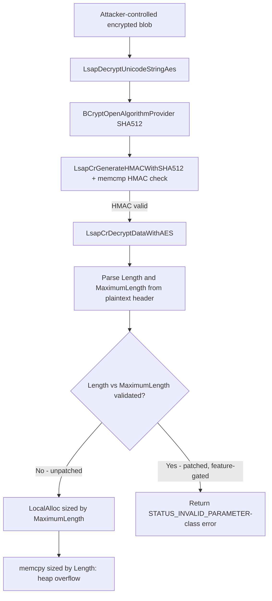

# CVE-2026-62784

**CVE:** CVE-2026-62784  
**Title:** Microsoft Local Security Authority Server (lsasrv) Remote Code Execution Vulnerability  
**Source:** [https://msrc.microsoft.com/update-guide/vulnerability/CVE-2026-62784](https://msrc.microsoft.com/update-guide/vulnerability/CVE-2026-62784)  
**Component(s):** lsasrv.dll  
**Patched Date:** 2026-08-11T07:00:00  
**CWE:** Heap-based buffer overflow in Microsoft Local Security Authority Server (lsasrv) allows an authorized attacker to execute code over a network.  

Download Patched & Vulnerable Components:

```bash
# lsasrv.dll
wget https://msdl.microsoft.com/download/symbols/lsasrv.dll/2F7773D01BC000/lsasrv.dll -O lsasrv.dll.10.0.26100.8972 # vulnerable
wget https://msdl.microsoft.com/download/symbols/lsasrv.dll/6A9BFB231BC000/lsasrv.dll -O lsasrv.dll.10.0.26100.9168 # patched
```

## Version Tracking Analysis

**Command:**

```
python ghidra_scripts\ghidra_vt_wrapper.py --old-binary ./reports/2026-Aug/CVE-2026-62784/lsasrv.dll.10.0.26100.8972 --new-binary ./reports/2026-Aug/CVE-2026-62784/lsasrv.dll.10.0.26100.9168 --project-dir ./reports/2026-Aug/CVE-2026-62784/ghidra_project --project-name lsasrv.dll_CVE-2026-62784 --ghidra-dir C:\Tools\ghidra_11.4.2_PUBLIC_20250826\ghidra_11.4.2_PUBLIC --output-dir ./reports/2026-Aug/CVE-2026-62784/ghidra_project/vt_results --max-memory 16g
```

Patched Functions: 6 | New Functions: 4 | Removed Functions: 3 | Total Matches: 268851 | Accepted Matches: 30980

### Patched Functions

| Function Name | Source Address | Dest Address | Similarity | Confidence |
| --- | --- | --- | --- | --- |
| `LsapDecryptUnicodeStringAes` | `18013cc3c` | `18013ccec` | 0.908 | 10.0 |
| `LsapEncryptUnicodeStringAes` | `18013d058` | `18013d104` | 0.783 | 10.0 |
| `Feature_ShadowAdmin__private_IsEnabledDeviceUsageNoInline` | `1801340a8` | `1801340a8` | 0.762 | 10.0 |
| `wil_details_FeatureStateCache_TryEnableDeviceUsageFastPath` | `1801345d8` | `1801345e0` | 0.729 | 10.0 |
| `wil_details_FeatureReporting_ReportUsageToService` | `1801343bc` | `1801343c4` | 0.525 | 10.0 |
| `wil_details_FeatureReporting_ReportUsageToServiceDirect` | `180134438` | `180134448` | 0.519 | 10.0 |

### New Functions

| Function Name | Address |
| --- | --- |
| `FUN_1800ef2d0` | `1800ef2d0` |
| `Feature_2477759800__private_IsEnabledDeviceUsageNoInline` | `18013c18c` |
| `_guard_dispatch_icall` | `180145360` |
| `PackageLock''` | `180146130` |

### Removed Functions

| Function Name | Address |
| --- | --- |
| `FUN_1800ef2d0` | `1800ef2d0` |
| `_guard_dispatch_icall` | `180145290` |
| `PackageLock''` | `180146060` |

---

# AI Technical Analysis

## Vulnerability Identification

**Core Vulnerable Function(s):**
- `LsapDecryptUnicodeStringAes()` - decrypts an AES-CBC/HMAC-SHA512
  protected blob into a length-prefixed buffer, then allocates an
  output buffer sized from an attacker-controlled `MaximumLength`
  field while copying an independently attacker-controlled
  `Length` field into it, without validating `Length <=
  MaximumLength`. This allows a heap buffer overflow.

**Supporting Changes:**
- `LsapEncryptUnicodeStringAes()` - mirrors the same `Length <=
  MaximumLength` check on the encode path before packaging the
  plaintext `UNICODE_STRING`-like structure for encryption. The
  allocation on this path is sized from `Length` itself (not
  `MaximumLength`), so it is not independently exploitable as a
  heap overflow; the added check is best understood as input
  hardening / consistency enforcement rather than a fix for a
  distinct memory-safety bug.

**Unrelated Changes:**
- `` `dynamic_atexit_destructor_for_'LsaTelemetry::PackageLock''`
  `` - a compiler-generated static-object atexit destructor stub
  for a telemetry/lock object. It performs no logic beyond
  `return;` and has no bearing on the AES decryption path or the
  security fix.

---

## Root Cause Analysis

The vulnerability is a classic size-confusion heap buffer overflow.
`LsapDecryptUnicodeStringAes` decrypts a caller-supplied AES-CBC/
HMAC-SHA512 protected blob and interprets the first four decrypted
bytes as a pair of `ushort` fields, `Length` and `MaximumLength`,
analogous to a `UNICODE_STRING` header. The unpatched code
allocates the output buffer using `MaximumLength` but copies
`Length` bytes of decrypted string data into it, without ever
checking that `Length` does not exceed `MaximumLength`. Since both
values originate from attacker-controlled ciphertext that
successfully passes HMAC verification (an attacker who can supply
or replay a validly-MACed blob controls the plaintext), the
invariant `Length <= MaximumLength` that the allocation size relies
on is never enforced.

```c
if (local_110 < 4) goto LAB_18013ce29;
uVar1 = *local_f8;
uVar16 = local_f8[1];
local_e8 = local_f8 + 2;
local_110 = CONCAT22(local_110._2_2_,uVar1);
local_114 = CONCAT22(local_114._2_2_,uVar16);
if (uVar2 == uVar1 + 4) {
  ...
  if ((ulonglong)uVar16 + 0x10 < 0x10) {
    uVar10 = 0xc0000095;
  }
  else {
    puVar6 = LocalAlloc(0x40,(ulonglong)uVar16 + 0x10);
    if (puVar6 == (ushort *)0x0) {
      uVar10 = 0xc0000017;
    }
    else {
      *puVar6 = (ushort)local_110;
      puVar6[1] = uVar16;
      memcpy(puVar6 + 8,local_e8,
             (ulonglong)(ushort)local_110);
      *local_c0 = puVar6;
    }
  }
}
```

Here `uVar1` is `Length`, `uVar16` is `MaximumLength`, and `uVar2`
is the actual number of bytes produced by `LsapCrDecryptDataWithAES`.
The check `uVar2 == uVar1 + 4` only confirms the decrypted payload
is exactly `Length + 4` bytes long (header plus string data) - it
does not constrain `Length` relative to `MaximumLength`. The
allocation `LocalAlloc(0x40, uVar16 + 0x10)` sizes the buffer using
`MaximumLength`, but the subsequent `memcpy(puVar6 + 8, local_e8,
(ushort)local_110)` writes `Length` bytes. An attacker who crafts a
blob where `Length` is large (up to ~0xFFFB, bounded only by
`uVar1 + 4 == uVar2`) while `MaximumLength` is small or zero causes
`LocalAlloc` to under-allocate relative to the `memcpy` size,
producing a heap-based buffer overflow of attacker-controlled data
and length.

---

## Execution and Trigger Flow

`LsapDecryptUnicodeStringAes` is reached whenever LSASS decrypts an
AES-protected secret blob (e.g. a trusted-domain auth information
or similarly encrypted `UNICODE_STRING` field) supplied through an
LSA RPC interface or a domain-trust protocol exchange. The attacker
supplies ciphertext plus the associated authentication tag; because
`LsapCrGenerateHMACWithSHA512` and the `memcmp` HMAC comparison
only validate integrity/authenticity of the blob, not the
semantic validity of its plaintext contents, an attacker who
possesses (or can obtain, e.g. via a prior legitimate exchange, a
replay, or a position where they control the values being sealed)
a validly-MACed blob can freely choose the plaintext `Length` and
`MaximumLength` header fields. Once HMAC verification and AES
decryption succeed, execution proceeds to the length-handling
block, where the crafted mismatch between `Length` and
`MaximumLength` drives an undersized `LocalAlloc` followed by an
oversized `memcpy`, corrupting adjacent heap memory inside the
LSASS process. Because LSASS runs as SYSTEM/Protected Process
Light, successful heap corruption here has severe impact, ranging
from denial of service (crash) to potential remote code execution
depending on heap layout and adjacent allocations.



---

## Patch Analysis

```diff
+ uVar4 = Feature_2477759800__private_IsEnabledDeviceUsageNoInline();
+ if (((uVar4 == 0) || (uVar1 <= uVar13)) && (uVar2 == uVar1 + 4)) {
```

The patch introduces a call to a feature-flag query function,
`Feature_2477759800__private_IsEnabledDeviceUsageNoInline`, and
folds a new comparison `uVar1 <= uVar13` (i.e. `Length <=
MaximumLength`) into the existing size-agreement check before the
allocation and copy are permitted to proceed. `uVar1` and `uVar13`
are the same `Length`/`MaximumLength` values extracted from the
decrypted header as in the original code; the new predicate simply
rejects the record before `LocalAlloc`/`memcpy` are reached if
`Length` exceeds `MaximumLength`. The parallel change in
`LsapEncryptUnicodeStringAes` applies the identical `*param_5 <=
param_5[1]` comparison, gated by the same feature flag, before the
plaintext structure is packaged for encryption, preventing
malformed `Length`/`MaximumLength` pairs from being sealed in the
first place.

Functionally, this closes the size-confusion gap: once enforced,
`MaximumLength` (the value driving the `LocalAlloc` size) can no
longer be smaller than `Length` (the value driving the `memcpy`
size), eliminating the undersized-allocation-with-oversized-copy
condition. The fix is scoped narrowly and does not otherwise change
the control flow, error codes, or cleanup/zeroization logic
surrounding the decrypted buffers.

The notable caveat is that the new validation is wrapped in `(uVar4
== 0) || (uVar1 <= uVar13)` - when the feature flag reports
disabled (`uVar4 == 0`), the length check is unconditionally
bypassed and the code falls back to the original vulnerable
behavior. This indicates the fix ships behind a controlled feature
rollout mechanism; environments where the flag remains disabled are
not protected by this change despite having the patched binary
installed. Aside from that rollout caveat, the check itself is
correctly placed ahead of both the allocation and the copy,
directly addressing the root cause. Once the feature flag is fully
enabled, the fix eliminates the heap overflow primitive by
restoring the invariant the allocation size depends on.