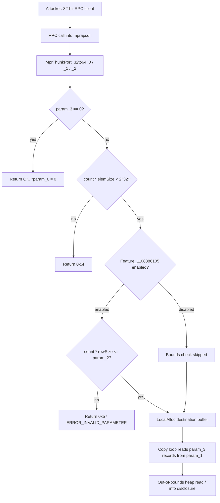

# CVE-2026-62819

**CVE:** CVE-2026-62819  
**Title:** Windows Routing and Remote Access Service (RRAS) Remote Code Execution Vulnerability  
**Source:** [https://msrc.microsoft.com/update-guide/vulnerability/CVE-2026-62819](https://msrc.microsoft.com/update-guide/vulnerability/CVE-2026-62819)  
**Component(s):** mprapi.dll  
**Patched Date:** 2026-08-11T07:00:00  
**CWE:** Remote Code Execution in Windows Routing and Remote Access Service (RRAS) allows attacker to gain an unauthorized access to victim's machine  

Download Patched & Vulnerable Components:

```bash
# mprapi.dll
wget https://msdl.microsoft.com/download/symbols/mprapi.dll/3C9247C684000/mprapi.dll -O mprapi.dll.10.0.26100.7705 # vulnerable
wget https://msdl.microsoft.com/download/symbols/mprapi.dll/290F8AC484000/mprapi.dll -O mprapi.dll.10.0.26100.7920 # patched
```

## Version Tracking Analysis

**Command:**

```
python ghidra_scripts\ghidra_vt_wrapper.py --old-binary ./reports/2026-Aug/CVE-2026-62819/mprapi.dll.10.0.26100.7705 --new-binary ./reports/2026-Aug/CVE-2026-62819/mprapi.dll.10.0.26100.7920 --project-dir ./reports/2026-Aug/CVE-2026-62819/ghidra_project --project-name mprapi.dll_CVE-2026-62819 --ghidra-dir C:\Tools\ghidra_11.4.2_PUBLIC_20250826\ghidra_11.4.2_PUBLIC --output-dir ./reports/2026-Aug/CVE-2026-62819/ghidra_project/vt_results --max-memory 16g
```

Patched Functions: 4 | New Functions: 9 | Removed Functions: 17 | Total Matches: 18331 | Accepted Matches: 7660

### Patched Functions

| Function Name | Source Address | Dest Address | Similarity | Confidence |
| --- | --- | --- | --- | --- |
| `FUN_180045300` | `180045300` | `180044960` | 0.988 | 1.0 |
| `MprThunkPort_32to64_0` | `1800327e4` | `1800327a8` | 0.908 | 10.0 |
| `MprThunkPort_32to64_2` | `180032b3c` | `180032ad4` | 0.877 | 10.0 |
| `MprThunkPort_32to64_1` | `1800329f8` | `1800329a8` | 0.747 | 10.0 |

### New Functions

| Function Name | Address |
| --- | --- |
| `operator_delete` | `180002861` |
| `what` | `1800028d0` |
| `~exception` | `1800028dc` |
| `exception` | `1800028e8` |
| `exception` | `1800028f4` |
| `exception` | `180002900` |
| `GdiGradientFill` | `180044990` |
| `MulDiv` | `1800449d0` |
| `_guard_dispatch_icall` | `180056370` |

### Removed Functions

*Showing 10 of 17 removed functions*

| Function Name | Address |
| --- | --- |
| `operator_delete` | `180002861` |
| `what` | `1800028d0` |
| `~exception` | `1800028dc` |
| `exception` | `1800028e8` |
| `exception` | `1800028f4` |
| `exception` | `180002900` |
| `Feature_1108386105__private_IsEnabledDeviceUsageNoInline` | `1800305a4` |
| `wil_details_FeatureReporting_RecordUsageInCache` | `180032f64` |
| `wil_details_FeatureReporting_ReportUsageToService` | `180033258` |
| `wil_details_FeatureReporting_ReportUsageToServiceDirect` | `180033374` |

---

# AI Technical Analysis

## Vulnerability Identification

**Core Vulnerable Function(s):**
- `MprThunkPort_32to64_0()` - Bounds check on the
  attacker-supplied element count against the caller-supplied
  buffer size was conditionally bypassed.
- `MprThunkPort_32to64_1()` - Same flawed pattern, smaller
  per-element structure size (0x48 bytes).
- `MprThunkPort_32to64_2()` - Same flawed pattern, larger
  per-element structure size (0x1f0 bytes).

**Supporting Changes:**
- None. All three functions independently contain the same
  vulnerable logic and are each independently patched; there is
  no separate caller/wrapper change in this diff set.

**Unrelated Changes:**
- `operator_delete()`, `exception::what()`, `exception::~exception()`,
  `exception::exception(char const *&)`, `exception::exception(const
  exception&)` - these are standard C++ runtime/RTTI thunks
  (recovered as new symbols only because Ghidra could not resolve
  their jump tables in this binary revision). They contain no
  logic changes relevant to the CVE and are compiler/CRT
  boilerplate, not part of the fix.

---

## Root Cause Analysis

The vulnerability is a missing (conditionally-skipped) bounds
check in the 32-bit-to-64-bit RPC parameter thunking routines used
by `mprapi.dll`. These functions marshal an attacker/client
supplied array of `param_3` fixed-size records from a 32-bit
layout (`param_1`) into a freshly allocated 64-bit layout, using
`param_2` as the declared size in bytes of the source buffer. The
invariant that must hold is: `param_3 * elementSize <= param_2`,
i.e. the number of records the code is about to read must not
exceed the actual size of the buffer the client claims to have
supplied. This invariant was only enforced when a feature flag
was active.

Vulnerable code (pattern shared by all three functions, shown for
`MprThunkPort_32to64_1`):

```c
else if (uVar6 * 0x48 < 0x100000000) {
  uVar1 = Feature_1108386105__private_IsEnabledDeviceUsageNoInline();
  if ((uVar1 == 0) || (uVar6 << 6 <= (ulonglong)param_2)) {
    pvVar2 = LocalAlloc(0x40,uVar6 * 0x48 & 0xffffffff);
    ...
    /* copy loop reads param_3 records from param_1 */
```

`uVar6` holds the 64-bit-widened element count (`param_3`). The
outer `else if` only guards against integer overflow of the
*allocation size* (`count * 0x48` must fit in 32 bits) -- it says
nothing about whether the *source* buffer actually contains that
many records. The real safety check is
`uVar6 << 6 <= (ulonglong)param_2`, which compares the required
source-read size against `param_2` (the caller-declared source
buffer length). Critically, this check is combined with
`uVar1 == 0` via `||`: if
`Feature_1108386105__private_IsEnabledDeviceUsageNoInline()`
returns 0 (feature disabled), the left operand is `true` and C's
short-circuit evaluation skips the bounds comparison entirely,
unconditionally treating the request as valid. The subsequent
`do { ... } while (uVar6 != 0)` loop then reads `param_3` fixed-
size records from `param_1` and writes converted 64-bit copies
into the newly `LocalAlloc`'d buffer, with no relationship
enforced between `param_3`/`param_1` and the buffer's true size.
`param_2` was also declared as a plain 32-bit `uint`, so even the
gated check truncated the size to 32 bits before comparison.

---

## Execution and Trigger Flow

These thunk functions are WOW64/RPC parameter-conversion routines
invoked when a 32-bit RPC client calls into the 64-bit `mprapi.dll`
service (Multiple Provider Router, used for network resource
enumeration such as `WNetOpenEnum`/`WNetEnumResource`-style APIs).
An attacker controls both `param_3` (the element count claimed to
be in the array) and `param_2` (the claimed byte size of the
source buffer), as well as the contents of `param_1` (the marshaled
32-bit array itself), all delivered over the RPC channel.

On entry, the function computes `param_3 * elementSize` and
verifies only that this fits within 32 bits (overflow guard). It
then evaluates `Feature_1108386105__private_IsEnabledDeviceUsageNoInline()`.
If this internal feature flag is off in the running configuration,
the size-consistency check between `param_3` and `param_2` never
executes, and the function proceeds directly to `LocalAlloc` and
the record-copy loop. The loop walks `param_3` records forward
through `param_1`, reading fixed-size 32-bit sub-fields and
promoting them into 64-bit fields in the destination buffer. If
the attacker supplies a `param_3` far larger than the data
actually backing `param_1` (while `param_2` is left small or
unrelated), the loop reads past the end of the legitimate source
allocation, disclosing adjacent heap memory into the marshaled
64-bit structures returned to the caller, or, depending on heap
layout, faulting on an inaccessible page.



---

## Patch Analysis

```diff
-uVar1 = Feature_1108386105__private_IsEnabledDeviceUsageNoInline();
-if ((uVar1 == 0) || (uVar6 << 6 <= (ulonglong)param_2)) {
-  pvVar2 = LocalAlloc(0x40,uVar6 * 0x48 & 0xffffffff);
+if ((param_2 & 0xffffffff) < uVar5 << 6) {
+  uVar4 = 0x57;
+}
+else {
+  pvVar1 = LocalAlloc(0x40,uVar5 * 0x48 & 0xffffffff);
```

The patch performs two coordinated changes across all three
functions. First, `param_2` is widened from `uint` to `ulonglong`
in the function signature, so the caller-declared buffer size is
carried through without silent 32-bit truncation before it
reaches the check. Second, and most importantly, the feature-flag
gate around the size validation is removed entirely: the call to
`Feature_1108386105__private_IsEnabledDeviceUsageNoInline()` is
deleted, and the comparison `(param_2 & 0xffffffff) < uVar5 << 6`
is now evaluated unconditionally, with failure returning
`0x57` (`ERROR_INVALID_PARAMETER`) before any allocation or copy
occurs. The `else` branch containing `LocalAlloc` and the copy
loop is only reachable once this check passes, so the
record-count-versus-buffer-size invariant is now always enforced
regardless of runtime feature configuration.

This closes the vulnerability at its root: the condition that
previously could be short-circuited away is now the sole gate
that must be satisfied before any read of `param_1` occurs. Since
the check now runs unconditionally on every call, there is no
longer a configuration state (feature flag off) in which
attacker-controlled `param_3` can drive an out-of-bounds read.
The widening of `param_2` to `ulonglong` is a defense-in-depth/
correctness adjustment ensuring the comparison operates on the
full intended value rather than a value that was truncated during
parameter marshaling, though the mask `& 0xffffffff` indicates
only the low 32 bits are ultimately compared.

The fix is effective: it eliminates the disabled-feature bypass
path entirely rather than merely hardening it, so no residual
flag state can restore the vulnerable behavior. Security impact:
the patch prevents an unauthenticated or low-privileged RPC caller
to `mprapi.dll` from triggering an out-of-bounds heap read via
mismatched count/size parameters, mitigating information
disclosure and potential crash/memory-corruption conditions in the
MPR service.