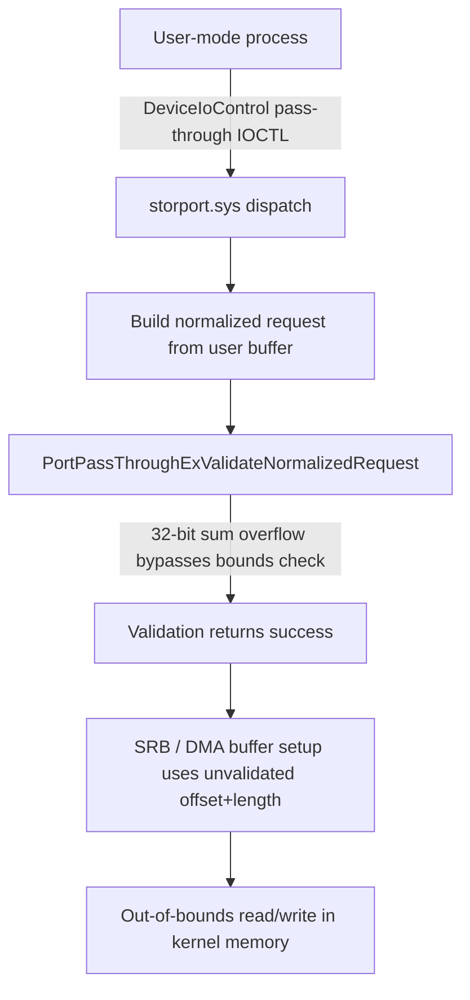

# CVE-2026-65814

**CVE:** CVE-2026-65814  
**Title:** Microsoft Windows Storage Port Driver Elevation of Privilege Vulnerability  
**Source:** [https://msrc.microsoft.com/update-guide/vulnerability/CVE-2026-65814](https://msrc.microsoft.com/update-guide/vulnerability/CVE-2026-65814)  
**Component(s):** storport.sys  
**Patched Date:** 2026-08-11T07:00:00  
**CWE:** Heap-based buffer overflow in Windows Storage Port Driver allows an authorized attacker to elevate privileges locally.  

Download Patched & Vulnerable Components:

```bash
# storport.sys
wget https://msdl.microsoft.com/download/symbols/storport.sys/6520329027A000/storport.sys -O storport.sys.10.0.26100.8972 # vulnerable
wget https://msdl.microsoft.com/download/symbols/storport.sys/0CC6C6AE27A000/storport.sys -O storport.sys.10.0.26100.9168 # patched
```

## Version Tracking Analysis

**Command:**

```
python ghidra_scripts\ghidra_vt_wrapper.py --old-binary ./reports/2026-Aug/CVE-2026-65814/storport.sys.10.0.26100.8972 --new-binary ./reports/2026-Aug/CVE-2026-65814/storport.sys.10.0.26100.9168 --project-dir ./reports/2026-Aug/CVE-2026-65814/ghidra_project --project-name storport.sys_CVE-2026-65814 --ghidra-dir C:\Tools\ghidra_11.4.2_PUBLIC_20250826\ghidra_11.4.2_PUBLIC --output-dir ./reports/2026-Aug/CVE-2026-65814/ghidra_project/vt_results --max-memory 16g
```

Patched Functions: 1 | New Functions: 8 | Removed Functions: 6 | Total Matches: 28386 | Accepted Matches: 25777

### Patched Functions

| Function Name | Source Address | Dest Address | Similarity | Confidence |
| --- | --- | --- | --- | --- |
| `PortPassThroughExValidateNormalizedRequest` | `1401b75d8` | `1401b75d8` | 0.508 | 10.0 |

### New Functions

| Function Name | Address |
| --- | --- |
| `Feature_3273633081__private_IsEnabledDeviceUsageNoInline` | `14013ecc4` |
| `Feature_3273633081__private_IsEnabledFallback` | `14013ecfc` |
| `_guard_dispatch_icall` | `140147400` |
| `FUN_14014c390` | `14014c390` |
| `FUN_14014da14` | `14014da14` |
| `FUN_14014e628` | `14014e628` |
| `ScsiPortMoveMemory` | `14027a000` |
| `ScsiPortNotification` | `14027a008` |

### Removed Functions

| Function Name | Address |
| --- | --- |
| `_guard_dispatch_icall` | `1401473a0` |
| `FUN_14014c350` | `14014c350` |
| `FUN_14014d9d4` | `14014d9d4` |
| `FUN_14014e5e8` | `14014e5e8` |
| `ScsiPortMoveMemory` | `14027a000` |
| `ScsiPortNotification` | `14027a008` |

---

# AI Technical Analysis

## Vulnerability Identification

**Core Vulnerable Function(s):**
- `PortPassThroughExValidateNormalizedRequest()` - performs bounds
  validation on offset/length fields of a normalized SCSI
  pass-through request using 32-bit arithmetic that can overflow,
  allowing an out-of-range request to be accepted as valid.

**Supporting Changes:**
- `Feature_3273633081__private_IsEnabledDeviceUsageNoInline()` -
  feature-flag gate added by the patch to select between the
  legacy 32-bit validation path and a new 64-bit
  overflow-safe validation path.

**Unrelated Changes:**
- `ScsiPortMoveMemory()` - a forwarder stub to
  `StorPortMoveMemory`; contains no executable logic and is not
  security-relevant.
- `ScsiPortNotification()` - a forwarder stub to
  `StorPortNotification`; contains no executable logic and is not
  security-relevant.

---

## Root Cause Analysis

The vulnerability is a classic unsigned/signed integer overflow
in bounds-checking arithmetic. The function computes the sum of
two attacker-influenced 32-bit fields taken from the caller's
pass-through request (`param_1 + 0x18` and `param_1 + 0xc`) and
uses that sum directly as a threshold in a subsequent
less-than comparison, without first verifying that the addition
did not wrap. Because both operands are full-width 32-bit
values under caller control, their sum can exceed `0xffffffff`
and silently wrap to a small value, violating the implicit
invariant that "sum of offset and length is always
representable in 32 bits."

```c
uVar8 = *(int *)(param_1 + 0x18) + *(int *)(param_1 + 0xc);
if (*(byte *)(param_1 + 0x11) != 0) {
  uVar4 = *(uint *)(param_1 + 0x1c);
  if (uVar4 < uVar8) {
    return 0xc000000d;
  }
  uVar8 = uVar4 + *(byte *)(param_1 + 0x11);
  if (uVar2 < uVar8) {
    return 0xc000000d;
  }
  if (uVar3 < uVar8) {
    return 0xc000000d;
  }
  if (uVar8 < uVar4) {
    return 0xc000000d;
  }
}
```

`uVar8` holds the wrapped sum of the two 32-bit fields. It is
then compared against `uVar4` (field `0x1c`) with
`uVar4 < uVar8`; if the wrap made `uVar8` small, this check
passes even though the true, unwrapped sum is far larger than
`uVar4`. `uVar8` is then reused to add a single byte
(`param_1 + 0x11`, max 255) and checked against `uVar2` and
`uVar3`, which are the request's `InputBufferLength` and
`OutputBufferLength` pulled from the IRP stack location at
`param_2 + 0xb8`. The final check `uVar8 < uVar4` only catches
overflow from the byte addition, not from the original 32+32
bit addition, leaving the primary overflow path completely
unguarded. Once this check is bypassed, the caller-supplied
offset/length pair is treated as valid even though it lies
outside the real buffer bounds.

---

## Execution and Trigger Flow

An attacker-controlled process reaches this code by issuing a
SCSI pass-through I/O control request (for example via
`DeviceIoControl` with a pass-through IOCTL) to a device object
owned by `storport.sys`. The driver's dispatch routine builds a
"normalized request" descriptor from the caller-supplied buffer,
populating the offset and length fields at `param_1 + 0xc`,
`param_1 + 0x18`, `param_1 + 0x11`, and `param_1 + 0x1c` directly
from attacker-controlled input. `PortPassThroughExValidateNormalizedRequest`
is then invoked to confirm the request's offsets and lengths are
consistent with the actual `InputBufferLength`/
`OutputBufferLength` reported by the IRP. By choosing values for
the two fields summed at the top of the function such that their
32-bit sum wraps past `0xffffffff`, the attacker forces the
subsequent `uVar4 < uVar8` comparison to evaluate as if the
combined offset were small, even though the real, unwrapped value
exceeds the buffer. The function then returns success, and the
caller proceeds to use the (actually out-of-bounds) offset/length
pair when building the SRB and moving data into or out of the
supplied buffer, resulting in an out-of-bounds read or write
within kernel memory.



---

## Patch Analysis

The patch introduces a feature-gated 64-bit validation path
alongside the legacy 32-bit path, selected at runtime by
`Feature_3273633081__private_IsEnabledDeviceUsageNoInline()`.

```c
iVar7 = Feature_3273633081__private_IsEnabledDeviceUsageNoInline();
if (iVar7 == 0) {
  uVar10 = (ulonglong)(*(uint *)(param_1 + 0x18) +
                       *(uint *)(param_1 + 0xc));
} else {
  uVar10 = uVar11;
  uVar11 = (ulonglong)*(uint *)(param_1 + 0xc) +
           (ulonglong)*(uint *)(param_1 + 0x18);
}
...
if (uVar8 < uVar11) {
  return 0xc000000d;
}
uVar11 = *(byte *)(param_1 + 0x11) + uVar8;
if (uVar11 < uVar8) {
  return 0xc000000d;
}
if (uVar13 < uVar11) {
  return 0xc000000d;
}
if (uVar12 < uVar11) {
  return 0xc000000d;
}
```

When the feature is enabled, both 32-bit operands are cast to
`ulonglong` before addition, so `uVar11` holds the true,
non-wrapping 64-bit sum. All subsequent comparisons
(`uVar8 < uVar11`, `uVar13 < uVar11`, `uVar12 < uVar11`) operate
in 64-bit space, so a sum that would have wrapped a 32-bit
register is instead represented exactly and correctly compared
against the real buffer sizes `uVar2`/`uVar3` (renamed `uVar12`/
`uVar13` in the patched variable layout) and the offset field
`uVar4`. The same widening treatment is applied identically to
every other branch in the function that previously performed
32-bit addition of two caller-controlled length/offset fields,
including the `cVar1 == 0`, `cVar1 == 1`, and `cVar1 == 3` cases
near the end of the function. This closes the overflow window
uniformly rather than patching a single instance. The fix is
effective because 64-bit arithmetic cannot overflow given inputs
bounded to 32 bits, eliminating the wraparound condition that
made the original less-than checks bypassable. Retaining the
legacy 32-bit path behind a feature flag suggests a staged
rollout, which means the vulnerability remains exploitable on
systems where the feature is not yet enabled. Once fully
deployed, the patch removes the attacker's ability to smuggle an
out-of-bounds offset/length pair past validation, preventing the
downstream out-of-bounds memory access in `storport.sys`.