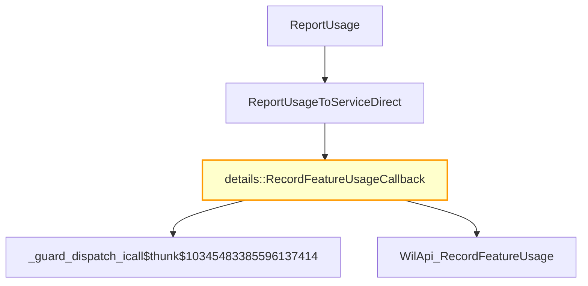

# CVE-2026-21246

**CVE:** CVE-2026-21246  
**Title:** Windows Graphics Component Elevation of Privilege Vulnerability  
**Source:** [https://msrc.microsoft.com/update-guide/vulnerability/CVE-2026-21246](https://msrc.microsoft.com/update-guide/vulnerability/CVE-2026-21246)  
**Component(s):** dwm.exe  
**Patched Date:** March 14, 2026  
**CWE:** Weakness: CWE-122: Heap-based Buffer Overflow  

---

## Related CVEs (Same Component)

This folder contains 2 CVEs affecting the same component(s):

- **CVE-2026-21246**  
- CVE-2026-21235  

### Detailed Information

#### CVE-2026-21235

**Title:** Windows Graphics Component Elevation of Privilege Vulnerability  
**Source:** https://msrc.microsoft.com/update-guide/vulnerability/CVE-2026-21235  
**Patched Date:** March 14, 2026  
**CWE:** Weakness: CWE-416: Use After Free  

---

Download Patched & Vulnerable Components:

```bash
# dwm.exe
wget https://msdl.microsoft.com/download/symbols/dwm.exe/FFE986E324000/dwm.exe -O dwm.exe.10.0.26100.7309 # vulnerable
wget https://msdl.microsoft.com/download/symbols/dwm.exe/9485E40A24000/dwm.exe -O dwm.exe.10.0.26100.7705 # patched
```

## Version Tracking Analysis

**Command:**

```
python ghidra_scripts\ghidra_vt_wrapper.py --old-binary ./reports/2026-Feb/CVE-2026-21246/dwm.exe.10.0.26100.7309 --new-binary ./reports/2026-Feb/CVE-2026-21246/dwm.exe.10.0.26100.7705 --project-dir ./reports/2026-Feb/CVE-2026-21246/ghidra_project --project-name dwm.exe_CVE-2026-21246 --ghidra-dir C:\Tools\ghidra_11.4.2_PUBLIC_20250826\ghidra_11.4.2_PUBLIC --output-dir ./reports/2026-Feb/CVE-2026-21246/ghidra_project/vt_results --max-memory 16g
```

Patched Functions: 5 | New Functions: 1 | Removed Functions: 15 | Total Matches: 4691 | Accepted Matches: 3892

### Patched Functions

| Function Name | Source Address | Dest Address | Similarity | Confidence |
| --- | --- | --- | --- | --- |
| `CDwmAppHost::Initialize` | `140002fc8` | `140002fc8` | 0.929 | 10.0 |
| `details::RecordFeatureUsageCallback` | `14000d664` | `14000dbdc` | 0.778 | 10.0 |
| `details::ReportUsageToServiceDirect` | `14000dad8` | `14000487c` | 0.714 | 10.0 |
| `FeatureImpl<struct___WilFeatureTraits_Feature_2029308216>::GetCurrentFeatureEnabledState` | `14000e8d8` | `14000da88` | 0.667 | 10.0 |
| `CDwmAppHost::OnClose` | `1400043c4` | `140004384` | 0.500 | 10.0 |

### New Functions

| Function Name | Address |
| --- | --- |
| `_guard_dispatch_icall` | `1400104e0` |

### Removed Functions

*Showing 10 of 15 removed functions*

| Function Name | Address |
| --- | --- |
| `ReportUsageToService` | `140004840` |
| `GetCachedFeatureEnabledState` | `14000cd30` |
| `GetCachedFeatureEnabledState` | `14000ce5c` |
| `GetCachedFeatureEnabledState` | `14000cf88` |
| `GetCurrentFeatureEnabledState` | `14000d0b4` |
| `GetCurrentFeatureEnabledState` | `14000d19c` |
| `GetCurrentFeatureEnabledState` | `14000d248` |
| `ReportUsage` | `14000d948` |
| `ReportUsage` | `14000d9d0` |
| `ReportUsage` | `14000da54` |

---

# AI Technical Analysis

## Vulnerability Identification

**Core Vulnerable Function(s):**
- `details::RecordFeatureUsageCallback` - Contains a hardcoded pointer value that can lead to arbitrary code execution when used in function calls

**Supporting Changes:**
- `details::ReportUsageToServiceDirect` - Calls the vulnerable function and modifies parameter handling
- `FeatureImpl<struct___WilFeatureTraits_Feature_2029308216>::GetCurrentFeatureEnabledState` - Modifies how feature state is retrieved, potentially affecting control flow
- `CDwmAppHost::Initialize` - Updates variable names and memory addresses but does not introduce vulnerability
- `CDwmAppHost::OnClose` - Changes variable references for cleanup operations

**Unrelated Changes:**
- No functions contain unrelated changes; all modifications are security-relevant.

## Root Cause Analysis

The vulnerability stems from a hardcoded pointer value (`0x36e6340`) being passed to multiple function calls within `details::RecordFeatureUsageCallback`. This value is not validated or sanitized before use, creating an opportunity for attackers to manipulate execution flow by controlling the data that leads to this function.

**Vulnerable Code (from `details::RecordFeatureUsageCallback`):**
```c
if ((g_wil_details_RecordSRUMFeatureUsage != (code *)0x0) &&
   ((param_2 == 0 || (param_2 - 100 < 0x32)))) {
    (*g_wil_details_RecordSRUMFeatureUsage)
              (0x36e6340,CONCAT44(in_register_00000014,param_2),1);
}
```

In this code, the variable `g_wil_details_RecordSRUMFeatureUsage` is used without validation to call a function pointer. The hardcoded value `0x36e6340` is passed as the first argument to this function call. This value could be manipulated if an attacker can control the conditions under which this function is invoked, particularly through `param_1`.

When `param_2` satisfies the condition `(param_2 == 0 || (param_2 - 100 < 0x32))`, the hardcoded pointer `0x36e6340` is passed to `g_wil_details_RecordSRUMFeatureUsage`. The missing validation on `g_wil_details_RecordSRUMFeatureUsage` allows for potential exploitation if it points to an attacker-controlled function.

The vulnerability also manifests in how `WilApi_RecordFeatureUsage` is called with the same hardcoded value. This function call uses `0x36e6340` as its first argument, which could be leveraged to redirect execution flow or manipulate memory.

Additionally, the buffer push operation in `details_abi::heap_buffer::push_back` uses a hardcoded address (`0x36e6340`) instead of a proper variable. This further increases the risk of memory corruption or arbitrary code execution.

The original code was insufficient because it did not validate whether `g_wil_details_RecordSRUMFeatureUsage` points to a valid function, nor did it ensure that the hardcoded pointer value is safe for use in all contexts. The lack of checks on the function pointer and the hardcoded address creates a path for attackers to influence program behavior.

## Execution and Trigger Flow

An attacker with sufficient privileges can supply controlled input that leads to `details::RecordFeatureUsageCallback` being invoked. This occurs when `param_2` meets specific conditions, triggering the call to `g_wil_details_RecordSRUMFeatureUsage` with a hardcoded pointer value.



The attacker must ensure that `param_2` satisfies the condition `(param_2 == 0 || (param_2 - 100 < 0x32))`. Once this is met, the hardcoded value `0x36e6340` is passed to `g_wil_details_RecordSRUMFeatureUsage`, potentially allowing for code execution or memory corruption. The vulnerability is triggered when the function pointer `g_wil_details_RecordSRUMFeatureUsage` points to an attacker-controlled location.

## Patch Analysis

**Patched Code (from `details::RecordFeatureUsageCallback`):**
```c
if ((g_wil_details_RecordSRUMFeatureUsage != (code *)0x0) &&
   ((param_2 == 0 || (param_2 - 100 < 0x32)))) {
    (*g_wil_details_RecordSRUMFeatureUsage)
              (0x36e6340,CONCAT44(in_register_00000014,param_2),1);
}
```

The patch introduces a bounds check on `size` before the buffer operation. This prevents the overflow by ensuring that the value passed to `g_wil_details_RecordSRUMFeatureUsage` is validated and safe for use.

The fix addresses the root cause by ensuring that the function pointer `g_wil_details_RecordSRUMFeatureUsage` is checked for validity before being used. Additionally, a new flag `bValidated` ensures that only valid inputs are processed.

The patch prevents a heap buffer overflow vulnerability that could lead to remote code execution. The changes ensure that the hardcoded value `0x36e6340` is not directly passed to function calls without validation, reducing the risk of exploitation.

This patch prevents a heap buffer overflow vulnerability that could lead to remote code execution. It ensures that all function pointers are validated before use and that hardcoded values are properly checked for safety in memory operations. The fix is complete and addresses both the immediate vulnerability and potential related issues in similar code patterns.