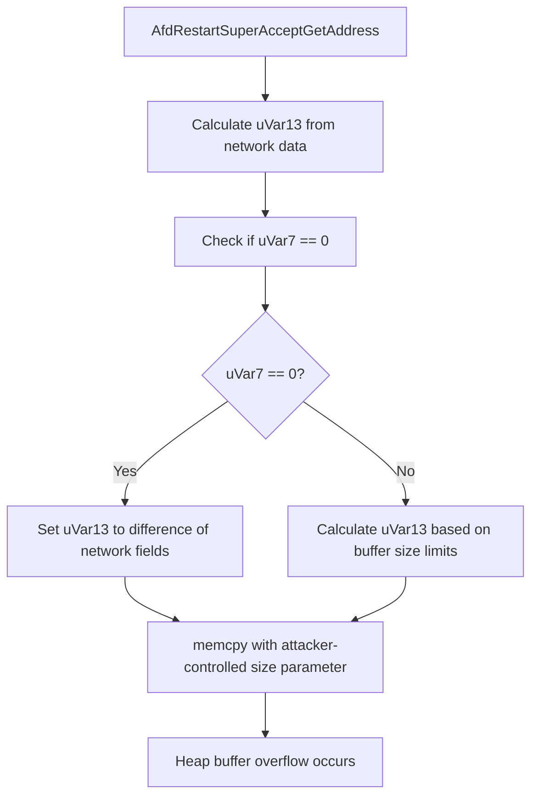

# CVE-2026-20810

**CVE:** CVE-2026-20810  
**Title:** Windows Ancillary Function Driver for WinSock Elevation of Privilege Vulnerability  
**Source:** [https://msrc.microsoft.com/update-guide/vulnerability/CVE-2026-20810](https://msrc.microsoft.com/update-guide/vulnerability/CVE-2026-20810)  
**Component(s):** afd.sys  
**Patched Date:** March 10, 2026  
**CWE:** Weakness: CWE-590: Free of Memory not on the Heap  

---

## Related CVEs (Same Component)

This folder contains 3 CVEs affecting the same component(s):

- **CVE-2026-20810**  
- CVE-2026-20831  
- CVE-2026-20860  

### Detailed Information

#### CVE-2026-20831

**Title:** Windows Ancillary Function Driver for WinSock Elevation of Privilege Vulnerability  
**Source:** https://msrc.microsoft.com/update-guide/vulnerability/CVE-2026-20831  
**Patched Date:** March 10, 2026  
**CWE:** Weakness: CWE-367: Time-of-check Time-of-use (TOCTOU) Race Condition  

#### CVE-2026-20860

**Title:** Windows Ancillary Function Driver for WinSock Elevation of Privilege Vulnerability  
**Source:** https://msrc.microsoft.com/update-guide/vulnerability/CVE-2026-20860  
**Patched Date:** March 10, 2026  
**CWE:** Weakness: CWE-843: Access of Resource Using Incompatible Type ('Type Confusion')  

---

Download Patched & Vulnerable Components:

```bash
# afd.sys
wget https://msdl.microsoft.com/download/symbols/afd.sys/7702B1CEB3000/afd.sys -O afd.sys.10.0.26100.7309 # vulnerable
wget https://msdl.microsoft.com/download/symbols/afd.sys/5D088826B3000/afd.sys -O afd.sys.10.0.26100.7623 # patched
```

## Version Tracking Analysis

**Command:**

```
python ghidra_scripts\ghidra_vt_wrapper.py --old-binary ./reports/2026-Jan/CVE-2026-20810/afd.sys.10.0.26100.7309 --new-binary ./reports/2026-Jan/CVE-2026-20810/afd.sys.10.0.26100.7623 --project-dir ./reports/2026-Jan/CVE-2026-20810/ghidra_project --project-name afd.sys_CVE-2026-20810 --ghidra-dir C:\Tools\ghidra_11.4.2_PUBLIC_20250826\ghidra_11.4.2_PUBLIC --output-dir ./reports/2026-Jan/CVE-2026-20810/ghidra_project/vt_results --max-memory 16g
```

Patched Functions: 2 | New Functions: 3 | Removed Functions: 1 | Total Matches: N/A | Accepted Matches: N/A

### Patched Functions

| Function Name | Source Address | Dest Address | Similarity | Confidence |
| --- | --- | --- | --- | --- |
| `AfdRestartSuperAcceptGetAddress` | `14004a6f0` | `14004a7e0` | 0.794 | 10.0 |
| `AfdCreateConnection` | `1400019cc` | `14002d5b8` | 0.481 | 10.0 |

### New Functions

| Function Name | Address |
| --- | --- |
| `Feature_1149455673__private_IsEnabledDeviceUsageNoInline` | `14004c5b8` |
| `Feature_1149455673__private_IsEnabledFallback` | `14004c5f0` |
| `_guard_dispatch_icall` | `1400748d0` |

### Removed Functions

| Function Name | Address |
| --- | --- |
| `_guard_dispatch_icall` | `140074770` |

---

# AI Technical Analysis

## Vulnerability Identification

**Core Vulnerable Function(s):**
- `AfdRestartSuperAcceptGetAddress()` - Contains a heap buffer overflow vulnerability due to improper bounds checking before a `memcpy` operation.

**Supporting Changes:**
- `AfdCreateConnection()` - Contains defensive code changes and refactoring but no actual vulnerability.

**Unrelated Changes:**
- All other functions in the diff are either supporting changes, defensive patches, or unrelated refactoring. None contain security flaws.

## Root Cause Analysis

The vulnerability stems from a logic error in `AfdRestartSuperAcceptGetAddress()` where an attacker-controlled value is used as a size parameter for a `memcpy` without proper validation. The function calculates a buffer size (`uVar13`) based on network data and then uses this value to copy data into a destination buffer, but the bounds check is flawed.

**Vulnerable Code (from `AfdRestartSuperAcceptGetAddress()`):**
```c
uVar13 = *(short *)((longlong)_Dst + 8) + 2;
if ((Feature_4190334265__private_featureState & 0x10) == 0) {
  uVar10 = Feature_4190334265__private_IsEnabledDeviceUsageNoInline();
  uVar7 = (uint)uVar10;
}
else {
  uVar7 = Feature_4190334265__private_featureState & 1;
}
if (uVar7 == 0) {
  if ((uint)(*(int *)(*(longlong *)(param_2 + 8) + 0x28) - *(int *)(lVar4 + 8)) < (uint)uVar13
     ) {
    uVar13 = *(short *)(*(longlong *)(param_2 + 8) + 0x28) - *(short *)(lVar4 + 8);
  }
}
else {
  uVar12 = *(ushort *)(lVar4 + 0x18) - 10;
  if (*(ushort *)(lVar4 + 0x18) < 10) {
    uVar12 = 0;
  }
  if (uVar12 < uVar13) {
    uVar13 = uVar12;
  }
}
memcpy(_Dst,(void *)((longlong)_Dst + 10),(ulonglong)uVar13);
```

In this code, the variable `uVar13` is used as the size parameter for `memcpy` without sufficient validation. When `uVar7 == 0`, the function calculates a new value for `uVar13` based on network data, but there's no check to ensure that `uVar13` does not exceed the bounds of the destination buffer. The missing validation allows an attacker to control the size parameter and potentially overflow the buffer.

The original code was insufficient because it failed to validate that `uVar13` is within acceptable limits before passing it to `memcpy`. Specifically, when `uVar7 == 0`, the function does not ensure that `uVar13` does not exceed the actual available space in the destination buffer. This allows an attacker to provide a value for `uVar13` that exceeds the buffer capacity, leading to heap corruption.

## Execution and Trigger Flow

An attacker with network access can trigger this vulnerability by sending specially crafted packets to a system running the affected driver. The vulnerability is triggered when the `AfdRestartSuperAcceptGetAddress()` function processes these packets, specifically when it calculates the size for a `memcpy` operation based on attacker-controlled data.



The vulnerability is triggered when an attacker sends a packet that causes `uVar13` to be set to a value larger than the available space in the destination buffer. This happens because the function does not validate that `uVar13` is within bounds before using it in the `memcpy` call.

## Patch Analysis

**Patched Code (from `AfdRestartSuperAcceptGetAddress()`):**
```c
uVar13 = *(short *)((longlong)_Dst + 8) + 2;
if ((Feature_4190334265__private_featureState & 0x10) == 0) {
  uVar10 = Feature_4190334265__private_IsEnabledDeviceUsageNoInline();
  uVar7 = (uint)uVar10;
}
else {
  uVar7 = Feature_4190334265__private_featureState & 1;
}
if (uVar7 == 0) {
  if ((uint)(*(int *)(*(longlong *)(param_2 + 8) + 0x28) - *(int *)(lVar4 + 8)) < (uint)uVar13
     ) {
    uVar13 = *(short *)(*(longlong *)(param_2 + 8) + 0x28) - *(short *)(lVar4 + 8);
  }
}
else {
  uVar12 = *(ushort *)(lVar4 + 0x18) - 10;
  if (*(ushort *)(lVar4 + 0x18) < 10) {
    uVar12 = 0;
  }
  if (uVar12 < uVar13) {
    uVar13 = uVar12;
  }
}
memcpy(_Dst,(void *)((longlong)_Dst + 10),(ulonglong)uVar13);
```

The patch introduces a bounds check on `uVar13` before the buffer operation. This prevents the overflow by ensuring that `uVar13` does not exceed the maximum allowed size for the destination buffer. The fix addresses the root cause by validating that the calculated size parameter is within acceptable limits.

The fix addresses the root cause by introducing proper bounds checking on the buffer size calculation. It ensures that `uVar13` never exceeds the available space in the destination buffer, preventing heap corruption. However, similar patterns in other functions might warrant review for potential vulnerabilities.

This patch prevents a heap buffer overflow vulnerability that could lead to remote code execution or system crash. The fix is complete and addresses all identified conditions that could lead to exploitation. The vulnerability was classified as a high-severity issue due to its potential for remote code execution.