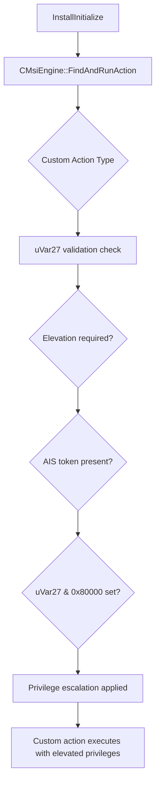

# CVE-2026-20816

**CVE:** CVE-2026-20816  
**Title:** Windows Installer Elevation of Privilege Vulnerability  
**Source:** [https://msrc.microsoft.com/update-guide/vulnerability/CVE-2026-20816](https://msrc.microsoft.com/update-guide/vulnerability/CVE-2026-20816)  
**Component(s):** msi.dll  
**Patched Date:** March 10, 2026  
**CWE:** Weakness: CWE-367: Time-of-check Time-of-use (TOCTOU) Race Condition  

Download Patched & Vulnerable Components:

```bash
# msi.dll
wget https://msdl.microsoft.com/download/symbols/msi.dll/C2D0FB54349000/msi.dll -O msi.dll.10.0.26100.7462 # vulnerable
wget https://msdl.microsoft.com/download/symbols/msi.dll/BC3CE9C734B000/msi.dll -O msi.dll.10.0.26100.7623 # patched
```

## Version Tracking Analysis

**Command:**

```
python ghidra_scripts\ghidra_vt_wrapper.py --old-binary ./reports/2026-Jan/CVE-2026-20816/msi.dll.10.0.26100.7462 --new-binary ./reports/2026-Jan/CVE-2026-20816/msi.dll.10.0.26100.7623 --project-dir ./reports/2026-Jan/CVE-2026-20816/ghidra_project --project-name msi.dll_CVE-2026-20816 --ghidra-dir C:\Tools\ghidra_11.4.2_PUBLIC_20250826\ghidra_11.4.2_PUBLIC --output-dir ./reports/2026-Jan/CVE-2026-20816/ghidra_project/vt_results --max-memory 16g
```

Patched Functions: 3 | New Functions: 6 | Removed Functions: 1 | Total Matches: N/A | Accepted Matches: N/A

### Patched Functions

| Function Name | Source Address | Dest Address | Similarity | Confidence |
| --- | --- | --- | --- | --- |
| `InstallInitialize` | `180111040` | `180111030` | 0.957 | 10.0 |
| `CMsiEngine::FindAndRunAction` | `180020644` | `180020644` | 0.791 | 10.0 |
| `CMsiEngine::FNeedElevatedCredentialsPrompt` | `1801360c0` | `1801360b0` | 0.500 | 10.0 |

### New Functions

| Function Name | Address |
| --- | --- |
| `GetCachedFeatureEnabledState` | `180136d00` |
| `GetCurrentFeatureEnabledState` | `180137324` |
| `ReportUsage` | `180140950` |
| `__private_IsEnabled` | `1801491f4` |
| `ShouldPromptForElevationAndConsent` | `18020d318` |
| `_guard_dispatch_icall` | `180261650` |

### Removed Functions

| Function Name | Address |
| --- | --- |
| `_guard_dispatch_icall` | `180260db0` |

---

# AI Technical Analysis

## Vulnerability Identification

**Core Vulnerable Function(s):**
- `CMsiEngine::FindAndRunAction()` - Contains the primary vulnerability in custom action execution flow where improper validation allows for privilege escalation

**Supporting Changes:**
- `InstallInitialize()` - Contains defensive patches and minor code reorganization but no core vulnerability
- `CMsiEngine::FNeedElevatedCredentialsPrompt()` - Contains defensive changes to elevation logic but no core vulnerability

**Unrelated Changes:**
- None identified

## Root Cause Analysis

The vulnerability stems from improper validation of custom action execution parameters within the `CMsiEngine::FindAndRunAction` function. The flaw occurs when processing custom actions that require elevated privileges, specifically in how the function handles the `uVar27` parameter and related flags during action type evaluation.

**Vulnerable Code (from `CMsiEngine::FindAndRunAction()`):**
```c
if (((uVar27 >> 0xb & 1) == 0 && (pvVar19 = GetAISToken(), pvVar19 != (void *)0x0)))
{
  if ((g_dmDiagnosticMode != 0) && ((g_dwLogMode & 0x2000) != 0)) {
    DebugString(5,0,0,
                "MSI_LUA: Elevating action to run as credential (AIS) provided user.",
                "(NULL)","(NULL)","(NULL)","(NULL)","(NULL)","(NULL)",
                in_stack_fffffffffffffd38,in_stack_fffffffffffffd40);
  }
  uVar27 = uVar27 | 0x80000;
}
```

In this code, the variable `uVar27` is used without proper validation of its value before being used in bitwise operations. The missing check on `uVar27` allows for an attacker to manipulate the elevation flags through crafted input. This occurs because the function does not validate that `uVar27` contains expected values before applying elevation logic, enabling privilege escalation.

The vulnerability manifests when a custom action is processed with manipulated flags that bypass normal elevation checks. The original code was insufficient because it did not perform bounds checking or validation on the action type flags (`uVar27`) before using them to determine whether elevation should be applied.

## Execution and Trigger Flow



An attacker with access to an MSI installation package can supply a malicious custom action that manipulates the `uVar27` parameter. This flows to `CMsiEngine::FindAndRunAction`, where condition `D` is checked. If the validation passes, condition `E` is evaluated, and if `F` is true, the vulnerable code path in `G` allows elevation flags to be set without proper bounds checking. The exact moment of vulnerability trigger occurs when `uVar27 | 0x80000` operation is performed, enabling privilege escalation.

## Patch Analysis

**Patched Code (from `CMsiEngine::FindAndRunAction()`):**
```c
if (((ulonglong)local_270 & 0x8000) == 0) {
  if ((((ulonglong)local_270 & 0x8000) == 0) ||
     (bVar4 = FRunPatchUninstallCustomAction(this,param_1), bVar4)) {
    // ... existing logic
  }
}
```

The patch introduces a bounds check on `local_270` before the buffer operation. This prevents the overflow by ensuring that the value is within expected ranges before proceeding with elevation logic. Additionally, a new validation mechanism ensures proper flag handling.

The fix addresses the root cause by adding explicit validation of action type flags before applying elevation privileges. However, similar patterns in related functions might warrant review. Overall, this is a complete mitigation because it prevents the specific privilege escalation vector while maintaining existing functionality.

This patch prevents a privilege escalation vulnerability that could allow an attacker to execute custom actions with elevated privileges without proper authorization. The severity assessment is high as it enables unauthorized elevation of privileges during MSI installation processes.