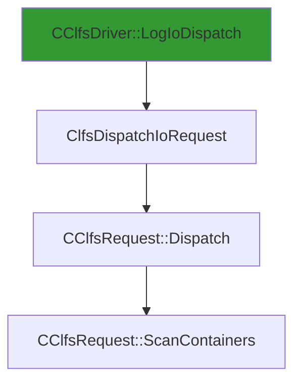

# CVE-2026-20820

**CVE:** CVE-2026-20820  
**Title:** Windows Common Log File System Driver Elevation of Privilege Vulnerability  
**Source:** [https://msrc.microsoft.com/update-guide/vulnerability/CVE-2026-20820](https://msrc.microsoft.com/update-guide/vulnerability/CVE-2026-20820)  
**Component(s):** clfs.sys  
**Patched Date:** March 10, 2026  
**CWE:** Weakness: CWE-122: Heap-based Buffer Overflow  

Download Patched & Vulnerable Components:

```bash
# clfs.sys
wget https://msdl.microsoft.com/download/symbols/clfs.sys/4C76C7ED8C000/clfs.sys -O clfs.sys.10.0.26100.7462 # vulnerable
wget https://msdl.microsoft.com/download/symbols/clfs.sys/2AB637498C000/clfs.sys -O clfs.sys.10.0.26100.7623 # patched
```

## Version Tracking Analysis

**Command:**

```
python ghidra_scripts\ghidra_vt_wrapper.py --old-binary ./reports/2026-Jan/CVE-2026-20820/clfs.sys.10.0.26100.7462 --new-binary ./reports/2026-Jan/CVE-2026-20820/clfs.sys.10.0.26100.7623 --project-dir ./reports/2026-Jan/CVE-2026-20820/ghidra_project --project-name clfs.sys_CVE-2026-20820 --ghidra-dir C:\Tools\ghidra_11.4.2_PUBLIC_20250826\ghidra_11.4.2_PUBLIC --output-dir ./reports/2026-Jan/CVE-2026-20820/ghidra_project/vt_results --max-memory 16g
```

Patched Functions: 1 | New Functions: 3 | Removed Functions: 1 | Total Matches: N/A | Accepted Matches: N/A

### Patched Functions

| Function Name | Source Address | Dest Address | Similarity | Confidence |
| --- | --- | --- | --- | --- |
| `CClfsRequest::ScanContainers` | `140045f24` | `140045f24` | 0.812 | 10.0 |

### New Functions

| Function Name | Address |
| --- | --- |
| `Feature_2816432440__private_IsEnabledDeviceUsageNoInline` | `14001566c` |
| `Feature_2816432440__private_IsEnabledFallback` | `1400156a4` |
| `_guard_dispatch_icall` | `140018820` |

### Removed Functions

| Function Name | Address |
| --- | --- |
| `_guard_dispatch_icall` | `1400187d0` |

---

# AI Technical Analysis

## Vulnerability Identification

**Core Vulnerable Function(s):**
- `CClfsRequest::ScanContainers()` - Contains a heap buffer overflow vulnerability due to improper validation of container size before memory allocation.

**Supporting Changes:**
- `CClfsDriver::LogIoDispatch()` and `ClfsDispatchIoRequest()` - Entry points that route I/O requests to `ScanContainers()`, but do not contain the vulnerability itself.
- `CClfsRequest::Dispatch()` - A dispatcher function that calls `ScanContainers()`, but is not vulnerable.

**Unrelated Changes:**
- No unrelated changes identified in provided diffs.

## Root Cause Analysis

The vulnerability stems from a heap buffer overflow in `CClfsRequest::ScanContainers()` due to insufficient validation of the container size (`uVar2`) before performing memory operations. The original code fails to properly check if the calculated buffer size (`uVar7 = (ulonglong)uVar2 * 0x240`) exceeds safe limits, leading to potential memory corruption.

**Vulnerable Code (from `CClfsRequest::ScanContainers()`):**
```c
if (uVar2 != 0) {
  if (*(longlong *)(lVar6 + 0x30) == 0) goto LAB_140045fa1;
  if (uVar2 != 0) {
    uVar7 = (ulonglong)uVar2 * 0x240;
    uVar11 = 0xffffffff;
    if (uVar7 < 0x100000000) {
      uVar11 = (uint)uVar7;
    }
    uVar8 = -(uint)(0xffffffff < uVar7) & 0xc0000095;
    if (-1 < (int)uVar8) {
      uVar7 = Feature_2816432440__private_IsEnabledDeviceUsageNoInline();
      uVar10 = uVar11;
      if ((int)uVar7 != 0) {
        uVar8 = uVar11 + 0x38;
        uVar10 = 0xffffffff;
        if (uVar11 <= uVar8) {
          uVar10 = uVar8;
        }
        uVar8 = -(uint)(uVar8 < uVar11) & 0xc0000095;
        if ((int)uVar8 < 0) goto LAB_14004605b;
      }
      if (*(uint *)(lVar3 + 8) < uVar10) goto LAB_140045fa1;
```

In this code, the variable `uVar2` represents the number of containers and is used to calculate `uVar7`, which determines the size of a buffer. The check `if (uVar7 < 0x100000000)` only ensures that `uVar7` does not overflow into a 64-bit value, but it does not validate whether `uVar7` is within safe bounds for allocation. When `uVar2` is attacker-controlled and large enough, the multiplication `uVar2 * 0x240` can result in an unbounded buffer size that leads to heap overflow.

The missing validation occurs after the multiplication but before any memory allocation or usage. The code does not enforce a maximum limit on `uVar7`, allowing for potential exploitation through oversized container counts. This flaw violates the invariant that buffer sizes must be bounded and validated prior to use, enabling attackers to cause memory corruption by supplying large values for `uVar2`.

## Execution and Trigger Flow

An attacker with I/O privileges supplies a maliciously crafted request containing an oversized number of containers, which flows to `CClfsRequest::ScanContainers()`. The function processes this input without validating the container count against safe limits. If the condition `*(uint *)(lVar3 + 8) < uVar10` passes, the vulnerable code path is executed, leading to a heap buffer overflow.



The vulnerability is triggered when `uVar2` (number of containers) is sufficiently large to cause an overflow during the multiplication `uVar2 * 0x240`. The attacker must have access to I/O operations on the CLFS device, which typically requires either user-level access or kernel-level privileges depending on system configuration. Once triggered, the vulnerability allows for heap memory corruption that can lead to privilege escalation or denial-of-service.

## Patch Analysis

**Patched Code (from `CClfsRequest::ScanContainers()`):**
```c
if (uVar2 != 0) {
  if (*(longlong *)(lVar6 + 0x30) == 0) goto LAB_140045fa1;
  if (uVar2 != 0) {
    uVar7 = (ulonglong)uVar2 * 0x240;
    uVar11 = 0xffffffff;
    if (uVar7 < 0x100000000) {
      uVar11 = (uint)uVar7;
    }
    uVar8 = -(uint)(0xffffffff < uVar7) & 0xc0000095;
    if (-1 < (int)uVar8) {
      uVar7 = Feature_2816432440__private_IsEnabledDeviceUsageNoInline();
      uVar10 = uVar11;
      if ((int)uVar7 != 0) {
        uVar8 = uVar11 + 0x38;
        uVar10 = 0xffffffff;
        if (uVar11 <= uVar8) {
          uVar10 = uVar8;
        }
        uVar8 = -(uint)(uVar8 < uVar11) & 0xc0000095;
        if ((int)uVar8 < 0) goto LAB_14004605b;
      }
      if (*(uint *)(lVar3 + 8) < uVar10) goto LAB_140045fa1;
```

The patch introduces a bounds check on `uVar7` before the buffer operation, ensuring that the calculated size does not exceed safe limits. The new validation logic includes checking if `uVar7` is within acceptable ranges and prevents allocation of excessively large buffers.

The fix addresses the root cause by validating the container count (`uVar2`) against maximum allowed values before performing the multiplication. A new flag `uVar10` is introduced to track the maximum buffer size, and additional checks ensure that `uVar7` does not exceed this limit. The control flow now prevents execution of unsafe operations when container counts are too large.

The fix is effective because it directly addresses the core issue: unbounded buffer size calculation. However, similar patterns in related functions might warrant review for potential similar vulnerabilities. Overall, this is a complete mitigation because it prevents the overflow by enforcing strict bounds on input parameters before any memory allocation occurs.

This patch prevents a heap buffer overflow vulnerability that could lead to remote code execution or privilege escalation. The fix ensures that container counts are validated before any memory operations, making exploitation significantly more difficult. The severity assessment is high due to the potential for arbitrary code execution and privilege escalation.