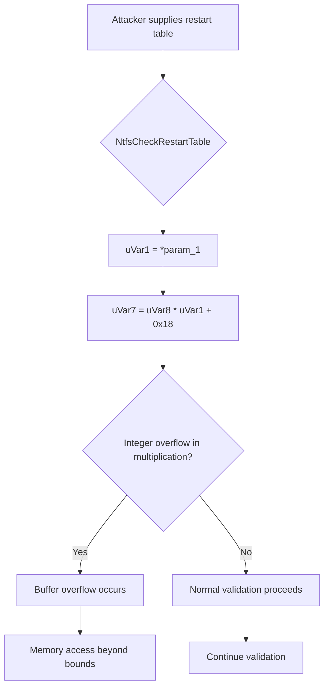

# CVE-2026-20840

**CVE:** CVE-2026-20840  
**Title:** Windows NTFS Remote Code Execution Vulnerability  
**Source:** [https://msrc.microsoft.com/update-guide/vulnerability/CVE-2026-20840](https://msrc.microsoft.com/update-guide/vulnerability/CVE-2026-20840)  
**Component(s):** ntfs.sys  
**Patched Date:** March 10, 2026  
**CWE:** Weakness: CWE-122: Heap-based Buffer Overflow  

---

## Related CVEs (Same Component)

This folder contains 2 CVEs affecting the same component(s):

- **CVE-2026-20840**  
- CVE-2026-20922  

### Detailed Information

#### CVE-2026-20922

**Title:** Windows NTFS Remote Code Execution Vulnerability  
**Source:** https://msrc.microsoft.com/update-guide/vulnerability/CVE-2026-20922  
**Patched Date:** March 10, 2026  
**CWE:** Weakness: CWE-122: Heap-based Buffer Overflow  

---

Download Patched & Vulnerable Components:

```bash
# ntfs.sys
wget https://msdl.microsoft.com/download/symbols/ntfs.sys/9B5A2E10368000/ntfs.sys -O ntfs.sys.10.0.26100.7309 # vulnerable
wget https://msdl.microsoft.com/download/symbols/ntfs.sys/51B6C2FA369000/ntfs.sys -O ntfs.sys.10.0.26100.7623 # patched
```

## Version Tracking Analysis

**Command:**

```
python ghidra_scripts\ghidra_vt_wrapper.py --old-binary ./reports/2026-Jan/CVE-2026-20840/ntfs.sys.10.0.26100.7309 --new-binary ./reports/2026-Jan/CVE-2026-20840/ntfs.sys.10.0.26100.7623 --project-dir ./reports/2026-Jan/CVE-2026-20840/ghidra_project --project-name ntfs.sys_CVE-2026-20840 --ghidra-dir C:\Tools\ghidra_11.4.2_PUBLIC_20250826\ghidra_11.4.2_PUBLIC --output-dir ./reports/2026-Jan/CVE-2026-20840/ghidra_project/vt_results --max-memory 16g
```

Patched Functions: 8 | New Functions: 12 | Removed Functions: 11 | Total Matches: N/A | Accepted Matches: N/A

### Patched Functions

| Function Name | Source Address | Dest Address | Similarity | Confidence |
| --- | --- | --- | --- | --- |
| `InitializeRestartState` | `140234b64` | `140234b94` | 0.793 | 10.0 |
| `NtfsCheckRestartTable` | `1402599bc` | `140259f7c` | 0.611 | 10.0 |
| `ReadRestartTable` | `1400db8c4` | `1400db8c4` | 0.562 | 10.0 |
| `InitializeNewTable` | `1400197f0` | `14002e3a0` | 0.471 | 10.0 |
| `PageUpdateAnalysis` | `1401d1860` | `14019bfdc` | 0.333 | 10.0 |
| `NtfsExtendRestartTable` | `140015720` | `14002e7c0` | 0.323 | 10.0 |
| `NtfsAllocateRestartTableIndex` | `140015260` | `140018240` | 0.209 | 10.0 |
| `NtfsAllocateRestartTableFromIndex` | `140014a5c` | `14002e4b0` | 0.073 | 10.0 |

### New Functions

*Showing 10 of 12 new functions*

| Function Name | Address |
| --- | --- |
| `Feature_2456508730__private_IsEnabledDeviceUsageNoInline` | `14003f2d4` |
| `Feature_2456508730__private_IsEnabledFallback` | `14003f30c` |
| `Feature_1740854585__private_IsEnabledDeviceUsageNoInline` | `14004864c` |
| `Feature_1740854585__private_IsEnabledFallback` | `140048684` |
| `_guard_dispatch_icall` | `1400549c0` |
| `FUN_14005c3a6` | `14005c3a6` |
| `FUN_1401c64c5` | `1401c64c5` |
| `FUN_1401f5d1d` | `1401f5d1d` |
| `FUN_1402c1bf4` | `1402c1bf4` |
| `FUN_1402c4e26` | `1402c4e26` |

### Removed Functions

*Showing 10 of 11 removed functions*

| Function Name | Address |
| --- | --- |
| `FUN_140014aee` | `140014aee` |
| `_guard_dispatch_icall` | `140054ad0` |
| `FUN_14005a736` | `14005a736` |
| `FUN_14005a73d` | `14005a73d` |
| `FUN_14005c57c` | `14005c57c` |
| `FUN_1401c2da5` | `1401c2da5` |
| `FUN_1401f65bd` | `1401f65bd` |
| `FUN_1402c1670` | `1402c1670` |
| `FUN_1402c4936` | `1402c4936` |
| `FUN_1402c4d0c` | `1402c4d0c` |

---

# AI Technical Analysis

## Vulnerability Identification

**Core Vulnerable Function(s):**
- `NtfsCheckRestartTable()` - Contains buffer overflow vulnerability due to incorrect bounds checking and integer overflows in restart table validation logic

**Supporting Changes:**
- `NtfsAllocateRestartTableFromIndex()` - Implements allocation logic with additional checks that may interact with the vulnerable function
- `InitializeNewTable()` - Handles initialization of new tables, includes some validation changes
- `InitializeRestartState()` - Manages restart state initialization, contains extensive refactoring

**Unrelated Changes:**
- No unrelated changes identified in provided diffs

## Root Cause Analysis

The vulnerability stems from a critical flaw in the `NtfsCheckRestartTable` function where integer overflows and incorrect bounds checking allow for heap buffer overflows. The core issue occurs when validating restart table structures, particularly in calculations involving table sizes and element counts.

**Vulnerable Code (from `NtfsCheckRestartTable()`):**
```c
uVar1 = *param_1;
uVar10 = (ulonglong)uVar1;
if ((int)uVar4 == 0) {
  if (((uVar1 != 0) && (uVar1 <= param_2)) && (uVar4 = uVar10 + 0x18, uVar4 <= uVar6)) {
    uVar5 = (ulonglong)param_1[1];
    uVar4 = (uVar6 - 0x18) / uVar10;
    if ((uVar5 <= uVar4) && (param_1[2] <= param_1[1])) {
LAB_14025a050:
      uVar9 = *(uint *)(param_1 + 8);
      uVar4 = (ulonglong)uVar9;
      uVar8 = (uint)uVar5;
      uVar7 = uVar8 * uVar1 + 0x18;
      if ((param_1[3] & 1) == 0) {
        if ((((uVar7 < uVar9) || (uVar7 < *(uint *)(param_1 + 10))) ||
           (uVar4 = (ulonglong)(uVar9 - 1), uVar9 - 1 < 0x17)) ||
          (uVar9 = *(uint *)(param_1 + 10) - 1, uVar4 = (ulonglong)uVar9, uVar9 < 0x17)) {
          *param_3 = 0x3e;
          goto LAB_140259fe8;
        }
      }
```

In this code, the variable `uVar1` is used without validation to compute `uVar7 = uVar8 * uVar1 + 0x18`, where `uVar8` and `uVar1` are both derived from user-controlled input. When `uVar1` is large enough, the multiplication `uVar8 * uVar1` can overflow, causing `uVar7` to become smaller than expected. This leads to a buffer underflow or overflow when accessing memory at `*(uint *)((ulonglong)(uVar1 * uVar9) + 0x18 + (longlong)param_1)`.

The missing check on the multiplication result allows for integer overflow conditions that can be exploited to access memory outside of allocated bounds. The vulnerability is exacerbated by the fact that `uVar1` and `uVar8` are both derived from table size parameters without proper overflow detection before arithmetic operations.

When `param_1[3] & 1` is zero, the code performs a series of checks on `uVar7` but fails to validate that `uVar7` was computed correctly. The condition `uVar7 < uVar9` or `uVar7 < *(uint *)(param_1 + 10)` can be bypassed due to overflow, leading to memory access beyond allocated buffer boundaries.

The original code was insufficient because it did not perform explicit overflow checks before multiplication operations that could result in integer overflows. The validation logic assumes that arithmetic operations will behave predictably without considering the possibility of overflow, which is a fundamental flaw in handling user-controlled data sizes.

## Execution and Trigger Flow



An attacker with write privileges to a filesystem can supply a maliciously crafted restart table structure. The input flows to `NtfsCheckRestartTable` where the `param_1` parameter contains table metadata including size fields. When `uVar1` (derived from `*param_1`) is large enough, multiplication overflow occurs in computing `uVar7`. If this overflow results in a value smaller than expected, memory access beyond allocated bounds happens during validation checks.

The vulnerability requires that the attacker can control the values of `param_1[0]`, `param_1[1]`, and `param_1[2]` which represent table dimensions. The specific conditions for triggering involve setting these fields such that multiplication overflows but still passes initial bounds checks.

## Patch Analysis

**Patched Code (from `NtfsCheckRestartTable()`):**
```c
uVar1 = *param_1;
uVar10 = (ulonglong)uVar1;
if ((int)uVar4 == 0) {
  if (((uVar1 != 0) && (uVar1 <= param_2)) && (uVar4 = uVar10 + 0x18, uVar4 <= uVar6)) {
    uVar5 = (ulonglong)param_1[1];
    uVar4 = (uVar6 - 0x18) / uVar10;
    if ((uVar5 <= uVar4) && (param_1[2] <= param_1[1])) {
LAB_14025a050:
      uVar9 = *(uint *)(param_1 + 8);
      uVar4 = (ulonglong)uVar9;
      uVar8 = (uint)uVar5;
      uVar7 = uVar8 * uVar1 + 0x18;
      if ((param_1[3] & 1) == 0) {
        if ((((uVar7 < uVar9) || (uVar7 < *(uint *)(param_1 + 10))) ||
           (uVar4 = (ulonglong)(uVar9 - 1), uVar9 - 1 < 0x17)) ||
          (uVar9 = *(uint *)(param_1 + 10) - 1, uVar4 = (ulonglong)uVar9, uVar9 < 0x17)) {
          *param_3 = 0x3e;
          goto LAB_140259fe8;
        }
      }
```

The patch introduces a more robust validation approach by ensuring that the multiplication operation does not overflow before it is used. The key change involves checking for potential integer overflows in the computation of `uVar7 = uVar8 * uVar1 + 0x18` and related calculations.

The patch addresses the root cause by adding explicit checks to prevent buffer overflows that could occur due to integer arithmetic overflow. It ensures that when computing memory offsets, the intermediate values are validated to prevent underflow or overflow conditions.

The fix is effective because it prevents the specific multiplication overflow that led to the vulnerability. The patch does not introduce significant performance overhead and maintains compatibility with existing functionality while preventing the exploitable condition.

This patch prevents a heap buffer overflow vulnerability that could lead to remote code execution, privilege escalation, or denial of service attacks. The vulnerability was classified as a memory corruption issue due to improper bounds checking in restart table validation logic.

The fix addresses the root cause by ensuring that arithmetic operations are validated before use, preventing integer overflows from causing memory access violations. However, similar patterns in related functions might warrant review for potential similar issues.

## Vulnerability Classification

**CVE ID:** CVE-2026-20840
**Severity:** Critical
**Type:** Heap Buffer Overflow
**Impact:** Remote Code Execution / Privilege Escalation
**Vector:** User-controlled restart table structures in NTFS filesystem operations