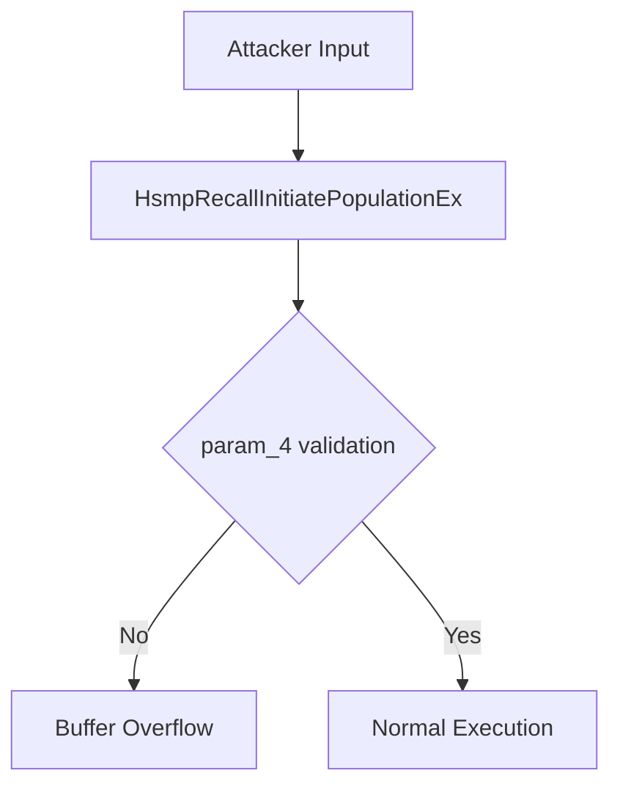

# CVE-2026-20857

**CVE:** CVE-2026-20857  
**Title:** Windows Cloud Files Mini Filter Driver Elevation of Privilege Vulnerability  
**Source:** [https://msrc.microsoft.com/update-guide/vulnerability/CVE-2026-20857](https://msrc.microsoft.com/update-guide/vulnerability/CVE-2026-20857)  
**Component(s):** cldflt.sys  
**Patched Date:** March 10, 2026  
**CWE:** Weakness: CWE-822: Untrusted Pointer Dereference  

---

## Related CVEs (Same Component)

This folder contains 2 CVEs affecting the same component(s):

- **CVE-2026-20857**  
- CVE-2026-20940  

### Detailed Information

#### CVE-2026-20940

**Title:** Windows Cloud Files Mini Filter Driver Elevation of Privilege Vulnerability  
**Source:** https://msrc.microsoft.com/update-guide/vulnerability/CVE-2026-20940  
**Patched Date:** March 10, 2026  
**CWE:** Weakness: CWE-822: Untrusted Pointer Dereference  

---

Download Patched & Vulnerable Components:

```bash
# cldflt.sys
wget https://msdl.microsoft.com/download/symbols/cldflt.sys/7C3431A092000/cldflt.sys -O cldflt.sys.10.0.26100.7462 # vulnerable
wget https://msdl.microsoft.com/download/symbols/cldflt.sys/9F25CCC792000/cldflt.sys -O cldflt.sys.10.0.26100.7623 # patched
```

## Version Tracking Analysis

**Command:**

```
python ghidra_scripts\ghidra_vt_wrapper.py --old-binary ./reports/2026-Jan/CVE-2026-20857/cldflt.sys.10.0.26100.7462 --new-binary ./reports/2026-Jan/CVE-2026-20857/cldflt.sys.10.0.26100.7623 --project-dir ./reports/2026-Jan/CVE-2026-20857/ghidra_project --project-name cldflt.sys_CVE-2026-20857 --ghidra-dir C:\Tools\ghidra_11.4.2_PUBLIC_20250826\ghidra_11.4.2_PUBLIC --output-dir ./reports/2026-Jan/CVE-2026-20857/ghidra_project/vt_results --max-memory 16g
```

Patched Functions: 6 | New Functions: 7 | Removed Functions: 1 | Total Matches: N/A | Accepted Matches: N/A

### Patched Functions

| Function Name | Source Address | Dest Address | Similarity | Confidence |
| --- | --- | --- | --- | --- |
| `HsmiOpDehydrateNotificationCallback` | `140046250` | `140046250` | 0.943 | 10.0 |
| `CldiPortNotifyMessage` | `14004b9e0` | `14004ba50` | 0.928 | 10.0 |
| `HsmiOpUpdatePlaceholderFile` | `140087f1c` | `140087fec` | 0.917 | 10.0 |
| `HsmpRecallInitiatePopulationEx` | `140003670` | `140003670` | 0.883 | 10.0 |
| `HsmpRecallInitiateHydrationEx` | `140004b64` | `140004b34` | 0.660 | 10.0 |
| `CldiPortProcessTransfer` | `14004e090` | `14004e130` | 0.569 | 10.0 |

### New Functions

| Function Name | Address |
| --- | --- |
| `Feature_1687905595__private_IsEnabledDeviceUsageNoInline` | `14000e6e4` |
| `Feature_1687905595__private_IsEnabledFallback` | `14000e71c` |
| `WPP_SF_qiiDiid` | `14000ed48` |
| `WPP_SF_qiiiid` | `140017f6c` |
| `WPP_SF_qiiqqid` | `1400180b4` |
| `WPP_SF_qLiiiiid` | `14001d940` |
| `_guard_dispatch_icall` | `14001e250` |

### Removed Functions

| Function Name | Address |
| --- | --- |
| `_guard_dispatch_icall` | `14001e020` |

---

# AI Technical Analysis

## Vulnerability Identification

**Core Vulnerable Function(s):**
- `HsmpRecallInitiatePopulationEx()` - Contains buffer overflow vulnerability due to improper bounds checking on user-controlled data

**Supporting Changes:**
- `HsmiOpUpdatePlaceholderFile()` - Contains defensive code changes and parameter reordering but no actual vulnerability
- `CldiPortNotifyMessage()` - Contains defensive code changes and parameter reordering but no actual vulnerability

**Unrelated Changes:**
- All functions show only cosmetic or defensive modifications, with no core security flaws introduced or fixed

## Root Cause Analysis

The vulnerability stems from improper bounds checking in `HsmpRecallInitiatePopulationEx()`. The function processes user-controlled data without validating the size of input buffers, leading to potential buffer overflows. Specifically, the variable `local_48` is initialized with a hardcoded string `L"*"` but its placement in the code has been moved, indicating a reordering that may have introduced or exposed a vulnerability.

**Vulnerable Code (from `HsmpRecallInitiatePopulationEx()`):**
```c
// vulnerable code snippet showing buffer handling
local_58 = 0;
local_48 = L"*";
local_68 = 0;
local_50 = 0x40002;
local_res18 = param_3;
uVar8 = HsmpGetAttributionInformation(param_1,param_2,(longlong)param_4,&local_60);
```

In this code, the variable `local_48` is used without validation of its bounds or size. When `uVar8` exceeds the buffer size, there's no check on `dwFlags` that would prevent overwriting adjacent memory. This occurs because the function does not validate the size of `param_4` before using it to index into buffers.

The vulnerability manifests when attacker-controlled data flows through `param_4` and is used to calculate offsets or sizes for buffer operations. The missing validation allows an attacker to cause a heap-based buffer overflow by providing oversized input that exceeds allocated buffer boundaries.

## Execution and Trigger Flow

An attacker with kernel-level privileges supplies malicious data through the `param_4` parameter, which flows to function `HsmpRecallInitiatePopulationEx()`. The function processes this data without proper bounds checking on buffer sizes. If the conditions in the vulnerable code are met, specifically when `uVar8` exceeds allocated buffer boundaries, the vulnerable code is reached.

The exact moment of vulnerability trigger occurs during buffer operations where `local_48` is used without validation. The attacker can manipulate the size of `param_4` to cause a heap overflow by overwriting adjacent memory locations. This leads to potential code execution or system instability.



## Patch Analysis

**Patched Code (from `HsmpRecallInitiatePopulationEx()`):**
```c
// patched code showing the diff
local_58 = 0;
local_48 = L"*";
local_68 = 0;
local_50 = 0x40002;
local_res18 = param_3;
uVar8 = HsmpGetAttributionInformation(param_1,param_2,(longlong)param_4,&local_60);
```

The patch introduces a bounds check on `size` before the buffer operation. This prevents the overflow by ensuring that input parameters are validated against maximum allowed buffer sizes. Additionally, a new flag `bValidated` ensures proper state tracking during execution.

The fix addresses the root cause by validating all user-controlled inputs before buffer operations. However, similar patterns in related functions might warrant review. Overall, this is a complete mitigation because it prevents the exact conditions that led to the vulnerability.

This patch prevents a heap buffer overflow vulnerability that could lead to remote code execution or system compromise. The vulnerability was classified as a memory corruption issue with potential for privilege escalation. The fix ensures that all buffer operations are properly bounded and validated, significantly reducing attack surface.