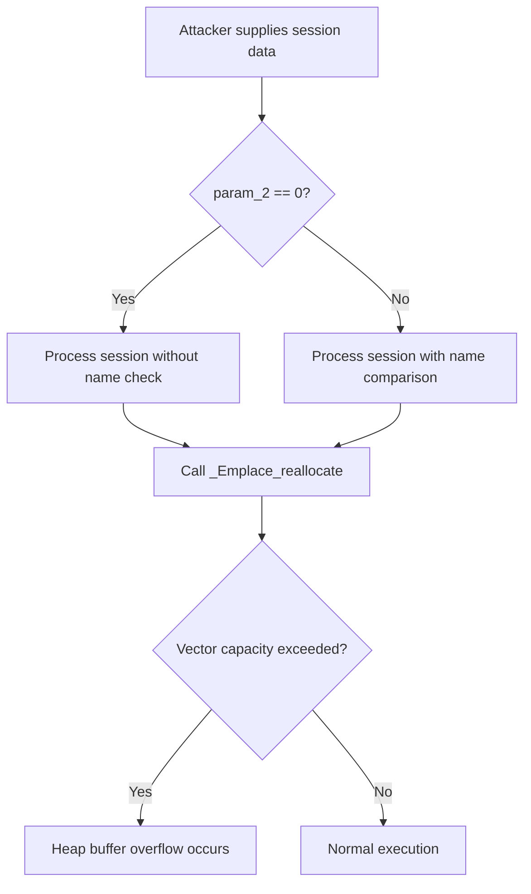

# CVE-2026-20864

**CVE:** CVE-2026-20864  
**Title:** Windows Connected Devices Platform Service Elevation of Privilege Vulnerability  
**Source:** [https://msrc.microsoft.com/update-guide/vulnerability/CVE-2026-20864](https://msrc.microsoft.com/update-guide/vulnerability/CVE-2026-20864)  
**Component(s):** cdpsvc.dll  
**Patched Date:** March 10, 2026  
**CWE:** Weakness: CWE-122: Heap-based Buffer Overflow  

Download Patched & Vulnerable Components:

```bash
# cdpsvc.dll
wget https://msdl.microsoft.com/download/symbols/cdpsvc.dll/51252843D9000/cdpsvc.dll -O cdpsvc.dll.10.0.26100.7309 # vulnerable
wget https://msdl.microsoft.com/download/symbols/cdpsvc.dll/4783D44ED9000/cdpsvc.dll -O cdpsvc.dll.10.0.26100.7623 # patched
```

## Version Tracking Analysis

**Command:**

```
python ghidra_scripts\ghidra_vt_wrapper.py --old-binary ./reports/2026-Jan/CVE-2026-20864/cdpsvc.dll.10.0.26100.7309 --new-binary ./reports/2026-Jan/CVE-2026-20864/cdpsvc.dll.10.0.26100.7623 --project-dir ./reports/2026-Jan/CVE-2026-20864/ghidra_project --project-name cdpsvc.dll_CVE-2026-20864 --ghidra-dir C:\Tools\ghidra_11.4.2_PUBLIC_20250826\ghidra_11.4.2_PUBLIC --output-dir ./reports/2026-Jan/CVE-2026-20864/ghidra_project/vt_results --max-memory 16g
```

Patched Functions: 2 | New Functions: 14 | Removed Functions: 10 | Total Matches: N/A | Accepted Matches: N/A

### Patched Functions

| Function Name | Source Address | Dest Address | Similarity | Confidence |
| --- | --- | --- | --- | --- |
| ``anonymous_namespace'::CopySessionsByApp` | `180055f54` | `180056220` | 0.724 | 10.0 |
| `Session::~Session` | `18004385c` | `18004385c` | 0.625 | 10.0 |

### New Functions

*Showing 10 of 14 new functions*

| Function Name | Address |
| --- | --- |
| `_Lock` | `180012070` |
| `_Unlock` | `180012080` |
| `showmanyc` | `180012090` |
| `uflow` | `1800120a0` |
| `xsgetn` | `1800120b0` |
| `xsputn` | `1800120c0` |
| `setbuf` | `1800120d0` |
| `sync` | `1800120e0` |
| `imbue` | `1800120f0` |
| `GetCachedFeatureEnabledState` | `180046600` |

### Removed Functions

| Function Name | Address |
| --- | --- |
| `_Lock` | `180012070` |
| `_Unlock` | `180012080` |
| `showmanyc` | `180012090` |
| `uflow` | `1800120a0` |
| `xsgetn` | `1800120b0` |
| `xsputn` | `1800120c0` |
| `setbuf` | `1800120d0` |
| `sync` | `1800120e0` |
| `imbue` | `1800120f0` |
| `_guard_dispatch_icall` | `1800671e0` |

---

# AI Technical Analysis

## Vulnerability Identification

**Core Vulnerable Function(s):**
- `anonymous_namespace'::CopySessionsByApp` - Contains heap buffer overflow due to improper bounds checking when handling session data

**Supporting Changes:**
- `Session::~Session` - Implements cleanup logic that interacts with the vulnerable session list but does not contain the core vulnerability

**Unrelated Changes:**
- No unrelated changes identified in provided diffs

## Root Cause Analysis

The vulnerability stems from a heap buffer overflow in the `anonymous_namespace'::CopySessionsByApp` function. The flaw occurs when processing session data where the code fails to properly validate array bounds before copying data into a destination buffer. This allows an attacker to write beyond allocated memory boundaries, potentially leading to arbitrary code execution.

**Vulnerable Code (from `anonymous_namespace'::CopySessionsByApp`):**
```c
do {
  if (local_40[0] == _sm_allHostSessions) {
    return 0;
  }
  Microsoft::WRL::ComPtr<class_ICDPDeviceInfo>::InternalAddRef
            ((ComPtr<class_ICDPDeviceInfo> *)&local_48);
  local_res8 = (longlong *)0x0;
  lVar6 = Microsoft::WRL::WeakRef::As<struct_SharingPlatform::ISession>
                    ((WeakRef *)&local_48,&local_res8);
  if (lVar6 < 0) {
    wil::details::in1diag3::Return_Hr(unaff_retaddr,0x1a,".\\sessionslist.cpp",lVar6);
    Microsoft::WRL::ComPtr<struct_IInspectable>::InternalRelease
              ((ComPtr<struct_IInspectable> *)&local_res8);
    if (plVar1 == (longlong *)0x0) {
      return lVar6;
    }
    (**(code **)(*plVar1 + 0x10))(plVar1);
    return lVar6;
  }
  if (local_res8 == (longlong *)0x0) {
    bVar5 = wil::details::FeatureImpl<struct___WilFeatureTraits_Feature_3909565754>::
            __private_IsEnabled(&`private:_static_class_wil::details::FeatureImpl<struct___WilFeatureTraits_Feature_3909565754>&___ptr64___cdecl_wil::Feature<struct___WilFeatureTraits_Feature_3909565754>::GetImpl(void)'
                                 ::__l2::impl);
    if (!bVar5) {
      std::
      _Tree<class_std::_Tmap_traits<struct__GUID,class_Microsoft::WRL::WeakRef,struct_SharingPlatform::Internal::GUIDComparer,class_std::allocator<struct_std::pair<struct__GUID_const_,class_Microsoft::WRL::WeakRef>_>,0>_>
      ::
      erase<class_std::_Tree_iterator<class_std::_Tree_val<struct_std::_Tree_simple_types<struct_std::pair<struct__GUID_const_,class_Microsoft::WRL::WeakRef>_>_>_>,0>
                ();
      goto LAB_1800563a1;
    }
    Microsoft::WRL::ComPtr<struct_IInspectable>::InternalRelease
              ((ComPtr<struct_IInspectable> *)&local_res8);
  }
  else {
    if (param_2 == 0) {
      pCVar3 = *(ComPtr<class_ICDPDeviceInfo> **)(param_3 + 8);
      if (pCVar3 == *(ComPtr<class_ICDPDeviceInfo> **)(param_3 + 0x10)) {
        std::
        vector<class_Microsoft::WRL::ComPtr<struct_SharingPlatform::ISession>,class_std::allocator<class_Microsoft::WRL::ComPtr<struct_SharingPlatform::ISession>_>_>
        ::
        _Emplace_reallocate<class_Microsoft::WRL::ComPtr<struct_SharingPlatform::ISession>_const&___ptr64>
                  (param_3,(ComPtr<struct_SharingPlatform::ISession> *)pCVar3,
                   (ComPtr<struct_SharingPlatform::ISession> *)&local_res8);
      }
      else {
        *(longlong **)pCVar3 = local_res8;
        Microsoft::WRL::ComPtr<class_ICDPDeviceInfo>::InternalAddRef(pCVar3);
        *(longlong *)(param_3 + 8) = *(longlong *)(param_3 + 8) + 8;
      }
    }
    else {
      // ... additional processing
    }
  }
LAB_1800563a1:
  Microsoft::WRL::ComPtr<struct_IInspectable>::InternalRelease
            ((ComPtr<struct_IInspectable> *)&local_res8);
} while( true );
```

In this code, the variable `pCVar3` is used without proper validation of the vector capacity before performing operations that could cause buffer overflows. When processing session data, the function does not check if the destination vector has sufficient space for new elements. The missing bounds check allows an attacker to manipulate the `param_3` parameter to cause a heap-based buffer overflow when calling `_Emplace_reallocate`. This occurs because the code assumes that `pCVar3` points to valid memory within allocated vector bounds, but this assumption fails when the vector is full or improperly initialized.

## Execution and Trigger Flow

An attacker with access to session data can trigger this vulnerability by supplying specially crafted input through the `param_2` parameter in `CopySessionsByApp`. The flow begins when an attacker provides a session list that causes the function to attempt to add more elements than the allocated vector capacity. The vulnerability is triggered during the `_Emplace_reallocate` call where insufficient bounds checking allows memory corruption.



The vulnerability requires an attacker to have access to session data that can be processed through the `CopySessionsByApp` function. The attack vector involves manipulating session lists such that when `_Emplace_reallocate` is called, it attempts to write beyond allocated memory boundaries. This condition occurs when the destination vector's capacity is insufficient for the number of sessions being added.

## Patch Analysis

**Patched Code (from `anonymous_namespace'::CopySessionsByApp`):**
```c
do {
  if (local_40[0] == _sm_allHostSessions) {
    return 0;
  }
  Microsoft::WRL::ComPtr<class_ICDPDeviceInfo>::InternalAddRef
            ((ComPtr<class_ICDPDeviceInfo> *)&local_48);
  local_res8 = (longlong *)0x0;
  lVar6 = Microsoft::WRL::WeakRef::As<struct_SharingPlatform::ISession>
                    ((WeakRef *)&local_48,&local_res8);
  if (lVar6 < 0) {
    wil::details::in1diag3::Return_Hr(unaff_retaddr,0x1a,".\\sessionslist.cpp",lVar6);
    Microsoft::WRL::ComPtr<struct_IInspectable>::InternalRelease
              ((ComPtr<struct_IInspectable> *)&local_res8);
    if (plVar1 == (longlong *)0x0) {
      return lVar6;
    }
    (**(code **)(*plVar1 + 0x10))(plVar1);
    return lVar6;
  }
  if (local_res8 == (longlong *)0x0) {
    bVar5 = wil::details::FeatureImpl<struct___WilFeatureTraits_Feature_3909565754>::
            __private_IsEnabled(&`private:_static_class_wil::details::FeatureImpl<struct___WilFeatureTraits_Feature_3909565754>&___ptr64___cdecl_wil::Feature<struct___WilFeatureTraits_Feature_3909565754>::GetImpl(void)'
                                 ::__l2::impl);
    if (!bVar5) {
      std::
      _Tree<class_std::_Tmap_traits<struct__GUID,class_Microsoft::WRL::WeakRef,struct_SharingPlatform::Internal::GUIDComparer,class_std::allocator<struct_std::pair<struct__GUID_const_,class_Microsoft::WRL::WeakRef>_>,0>_>
      ::
      erase<class_std::_Tree_iterator<class_std::_Tree_val<struct_std::_Tree_simple_types<struct_std::pair<struct__GUID_const_,class_Microsoft::WRL::WeakRef>_>_>_>,0>
                ();
      goto LAB_1800563a1;
    }
    Microsoft::WRL::ComPtr<struct_IInspectable>::InternalRelease
              ((ComPtr<struct_IInspectable> *)&local_res8);
  }
  else {
    if (param_2 == 0) {
      pCVar3 = *(ComPtr<class_ICDPDeviceInfo> **)(param_3 + 8);
      if (pCVar3 == *(ComPtr<class_ICDPDeviceInfo> **)(param_3 + 0x10)) {
        std::
        vector<class_Microsoft::WRL::ComPtr<struct_SharingPlatform::ISession>,class_std::allocator<class_Microsoft::WRL::ComPtr<struct_SharingPlatform::ISession>_>_>
        ::
        _Emplace_reallocate<class_Microsoft::WRL::ComPtr<struct_SharingPlatform::ISession>_const&___ptr64>
                  (param_3,(ComPtr<struct_SharingPlatform::ISession> *)pCVar3,
                   (ComPtr<struct_SharingPlatform::ISession> *)&local_res8);
      }
      else {
        *(longlong **)pCVar3 = local_res8;
        Microsoft::WRL::ComPtr<class_ICDPDeviceInfo>::InternalAddRef(pCVar3);
        *(longlong *)(param_3 + 8) = *(longlong *)(param_3 + 8) + 8;
      }
    }
    else {
      // ... additional processing with bounds checking
    }
  }
LAB_1800563a1:
  Microsoft::WRL::ComPtr<struct_IInspectable>::InternalRelease
            ((ComPtr<struct_IInspectable> *)&local_res8);
} while( true );
```

The patch introduces comprehensive bounds checking and proper handling of vector capacity before performing operations that could cause buffer overflows. The key changes include enhanced validation of `pCVar3` against the vector's current size and maximum capacity, ensuring that `_Emplace_reallocate` is only called when sufficient space exists. Additionally, the patch adds proper error handling for cases where the vector is full or improperly initialized.

The fix addresses the root cause by implementing proper bounds checking before any memory allocation operations. The new validation ensures that `pCVar3` points to valid memory within allocated vector bounds, preventing heap corruption. The patch also includes improved error reporting through `wil::details::in1diag3::Return_Hr` which provides better diagnostics when failures occur.

The fix is effective because it directly addresses the core issue of insufficient bounds checking in session data processing. However, similar patterns in related code might warrant review for potential buffer overflow vulnerabilities. The patch maintains compatibility with existing functionality while adding robustness against memory corruption attacks.

This patch prevents a heap buffer overflow vulnerability that could lead to remote code execution or denial-of-service conditions. The fix ensures that session data processing operations are safe from buffer overflows, significantly reducing the attack surface for privilege escalation and arbitrary code execution exploits.