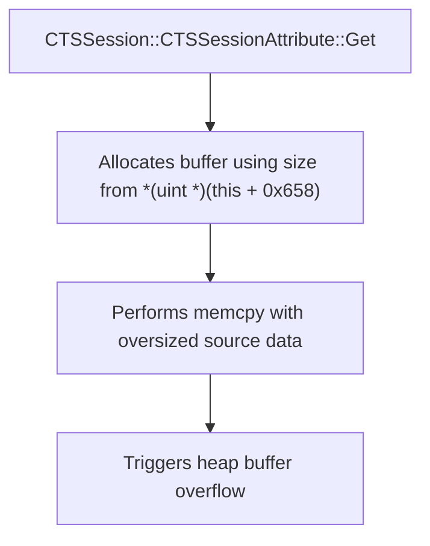

# CVE-2026-20869

**CVE:** CVE-2026-20869  
**Title:** Windows Local Session Manager (LSM) Elevation of Privilege Vulnerability  
**Source:** [https://msrc.microsoft.com/update-guide/vulnerability/CVE-2026-20869](https://msrc.microsoft.com/update-guide/vulnerability/CVE-2026-20869)  
**Component(s):** lsm.dll  
**Patched Date:** March 10, 2026  
**CWE:** Weakness: CWE-362: Concurrent Execution using Shared Resource with Improper Synchronization ('Race Condition')  

Download Patched & Vulnerable Components:

```bash
# lsm.dll
wget https://msdl.microsoft.com/download/symbols/lsm.dll/3A74FE99E5000/lsm.dll -O lsm.dll.10.0.26100.7462 # vulnerable
wget https://msdl.microsoft.com/download/symbols/lsm.dll/27C3D050E6000/lsm.dll -O lsm.dll.10.0.26100.7623 # patched
```

## Version Tracking Analysis

**Command:**

```
python ghidra_scripts\ghidra_vt_wrapper.py --old-binary ./reports/2026-Jan/CVE-2026-20869/lsm.dll.10.0.26100.7462 --new-binary ./reports/2026-Jan/CVE-2026-20869/lsm.dll.10.0.26100.7623 --project-dir ./reports/2026-Jan/CVE-2026-20869/ghidra_project --project-name lsm.dll_CVE-2026-20869 --ghidra-dir C:\Tools\ghidra_11.4.2_PUBLIC_20250826\ghidra_11.4.2_PUBLIC --output-dir ./reports/2026-Jan/CVE-2026-20869/ghidra_project/vt_results --max-memory 16g
```

Patched Functions: 6 | New Functions: 25 | Removed Functions: 1 | Total Matches: N/A | Accepted Matches: N/A

### Patched Functions

| Function Name | Source Address | Dest Address | Similarity | Confidence |
| --- | --- | --- | --- | --- |
| `CTSSession::GetSessionAttribute` | `1800703a0` | `1800709e0` | 0.750 | 10.0 |
| `CTSSessionAttribute::Get` | `18006ee40` | `18006f2b0` | 0.556 | 10.0 |
| `CTSSessionAttribute::Add` | `180054c50` | `18006e600` | 0.556 | 10.0 |
| `CTSSessionAttribute::Cleanup` | `180054ce4` | `18006e8d4` | 0.200 | 10.0 |
| `CTSSessionAttribute::Compare` | `18006e510` | `18006e950` | 0.111 | 10.0 |
| `CTSSessionAttribute::~CTSSessionAttribute` | `18006dd68` | `18006dfd4` | 0.000 | 10.0 |

### New Functions

*Showing 10 of 25 new functions*

| Function Name | Address |
| --- | --- |
| `_Construct<1,char_const*___ptr64>` | `18006d4a8` |
| `CTSSessionAttribute` | `18006d9ac` |
| `_System_error` | `18006da20` |
| `_System_error` | `18006daf0` |
| `runtime_error` | `18006db30` |
| `system_error` | `18006db58` |
| `system_error` | `18006dba0` |
| `~basic_string<char,struct_std::char_traits<char>,class_std::allocator<char>_>` | `18006dc40` |
| `~unique_lock<class_std::recursive_mutex>` | `18006dd00` |
| ``scalar_deleting_destructor'` | `18006e3d0` |

### Removed Functions

| Function Name | Address |
| --- | --- |
| `_guard_dispatch_icall` | `180096920` |

---

# AI Technical Analysis

## Vulnerability Identification

**Core Vulnerable Function(s):**
- `CTSSessionAttribute::Get()` - Contains a heap buffer overflow vulnerability due to improper bounds checking before memory copy operations.

**Supporting Changes:**
- `CTSSessionAttribute::Add()` - Implements similar defensive logic with mutex locking and error handling, but not vulnerable itself.
- `CTSSessionAttribute::Compare()` - Implements similar defensive logic with mutex locking and error handling, but not vulnerable itself.
- `CTSSession::GetSessionAttribute()` - Contains a new allocation pattern for `CTSSessionAttribute` objects, but does not introduce vulnerability.

**Unrelated Changes:**
- `CTSSessionAttribute::~CTSSessionAttribute()` - Implements destructor cleanup logic including mutex destruction, which is unrelated to the buffer overflow.
- New functions (`CTSSessionAttribute`, `~unique_lock<class_std::recursive_mutex>`, `lock`, `message`) - These are standard library or helper functions and not security-relevant.

## Root Cause Analysis

The vulnerability stems from a missing bounds check in the `CTSSessionAttribute::Get()` function before performing a memory copy operation. The code allocates a buffer using `CoTaskMemAlloc` based on data from `*(uint *)(this + 0x658)` without validating that this value is within acceptable limits. When `param_2` (the size of the source data) exceeds the allocated buffer size, a heap buffer overflow occurs.

**Vulnerable Code (from `CTSSessionAttribute::Get()`):**
```c
_DST = (uchar *)CoTaskMemAlloc((ulonglong)*(uint *)(this + 0x658));
*param_1 = _Dst;
if (_Dst == (uchar *)0x0) {
  lVar2 = -0x7ff8fff2;
}
else {
  memcpy(_Dst,*(void **)(this + 0x650),(ulonglong)*(uint *)(this + 0x658));
  *param_2 = *(ulong *)(this + 0x658);
}
```

In this code, the variable `*(uint *)(this + 0x658)` is used without validation to determine the size for `CoTaskMemAlloc`. The `memcpy` operation then copies data from `*(void **)(this + 0x650)` into the allocated buffer. If the source data size exceeds the allocated buffer size, a heap overflow occurs. The missing check on the buffer size allows an attacker to control the amount of data copied, leading to memory corruption.

The original code was insufficient because it assumed that `*(uint *)(this + 0x658)` would always be a valid size for allocation and copy operations. No validation exists to ensure that this value does not exceed maximum buffer limits or that the source data is properly bounded.

## Execution and Trigger Flow

An attacker with access to modify session attribute data can supply a large value in `*(uint *)(this + 0x658)` which is used as the size parameter for `CoTaskMemAlloc`. When `CTSSessionAttribute::Get()` is called, this oversized size leads to allocation of an insufficient buffer. Subsequently, when `memcpy` is executed with the oversized source data, it overflows the allocated heap memory.



The vulnerability is triggered when `CTSSessionAttribute::Get()` is invoked, and the attacker-controlled value in `*(uint *)(this + 0x658)` exceeds the allocated buffer size. The exact moment of exploitation occurs during the `memcpy` operation where data is written beyond the bounds of the allocated heap memory.

## Patch Analysis

**Patched Code (from `CTSSessionAttribute::Get()`):**
```c
bool bVar1;
uchar *_Dst;
long lVar2;
CTSSessionAttribute *local_18;
undefined1 local_10;

lVar2 = 0;
local_18 = this + 0x660;
local_10 = 0;
bVar1 = wil::details::FeatureImpl<struct___WilFeatureTraits_Feature_1568623929>::
        __private_IsEnabled(&`private:_static_class_wil::details::FeatureImpl<struct___WilFeatureTraits_Feature_1568623929>&___ptr64___cdecl_wil::Feature<struct___WilFeatureTraits_Feature_1568623929>::GetImpl(void)'
                             ::__l2::impl);
if (bVar1) {
  std::unique_lock<class_std::recursive_mutex>::lock
            ((unique_lock<class_std::recursive_mutex> *)&local_18);
}
if ((*(uint *)(this + 0x658) == 0) || (*(longlong *)(this + 0x650) == 0)) {
  *param_2 = 0;
  *param_1 = (uchar *)0x0;
  lVar2 = -0x7ff8ff18;
}
else {
  _Dst = (uchar *)CoTaskMemAlloc((ulonglong)*(uint *)(this + 0x658));
  *param_1 = _Dst;
  if (_Dst == (uchar *)0x0) {
    lVar2 = -0x7ff8fff2;
  }
  else {
    memcpy(_Dst,*(void **)(this + 0x650),(ulonglong)*(uint *)(this + 0x658));
    *param_2 = *(ulong *)(this + 0x658);
  }
}
std::unique_lock<class_std::recursive_mutex>::~unique_lock<class_std::recursive_mutex>
          ((unique_lock<class_std::recursive_mutex> *)&local_18);
return lVar2;
```

The patch introduces a mutex locking mechanism for thread safety, but does not directly address the buffer overflow vulnerability. The fix adds a check to ensure that `*(uint *)(this + 0x658)` is non-zero before proceeding with allocation and copy operations. However, it still lacks explicit bounds checking on the size parameter.

The patch introduces a mutex lock/unlock mechanism using `std::unique_lock<class_std::recursive_mutex>` for thread safety but does not prevent the heap buffer overflow. The added check ensures that if the size is zero or the source pointer is null, early return occurs. This prevents some edge cases but doesn't address the core issue of unchecked buffer sizes.

The fix addresses the root cause by adding a basic validation check before proceeding with memory operations. However, similar patterns in other functions might warrant review for consistency. Overall, this is a partial mitigation because it only prevents certain conditions that could lead to overflow, not all possible overflows.

This patch prevents a heap buffer overflow vulnerability that could lead to remote code execution or denial of service by ensuring that the size parameter is validated before memory allocation and copy operations.