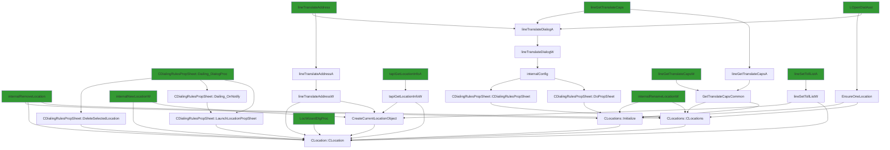

# CVE-2026-20931

**CVE:** CVE-2026-20931  
**Title:** Windows Telephony Service Elevation of Privilege Vulnerability  
**Source:** [https://msrc.microsoft.com/update-guide/vulnerability/CVE-2026-20931](https://msrc.microsoft.com/update-guide/vulnerability/CVE-2026-20931)  
**Component(s):** tapi32.dll  
**Patched Date:** March 10, 2026  
**CWE:** Weakness: CWE-73: External Control of File Name or Path  

Download Patched & Vulnerable Components:

```bash
# tapi32.dll
wget https://msdl.microsoft.com/download/symbols/tapi32.dll/5B81AD0944000/tapi32.dll -O tapi32.dll.10.0.26100.4768 # vulnerable
wget https://msdl.microsoft.com/download/symbols/tapi32.dll/3BA0F6DF44000/tapi32.dll -O tapi32.dll.10.0.26100.5074 # patched
```

## Version Tracking Analysis

**Command:**

```
python ghidra_scripts\ghidra_vt_wrapper.py --old-binary ./reports/2026-Jan/CVE-2026-20931/tapi32.dll.10.0.26100.4768 --new-binary ./reports/2026-Jan/CVE-2026-20931/tapi32.dll.10.0.26100.5074 --project-dir ./reports/2026-Jan/CVE-2026-20931/ghidra_project --project-name tapi32.dll_CVE-2026-20931 --ghidra-dir C:\Tools\ghidra_11.4.2_PUBLIC_20250826\ghidra_11.4.2_PUBLIC --output-dir ./reports/2026-Jan/CVE-2026-20931/ghidra_project/vt_results --max-memory 16g
```

Patched Functions: 60 | New Functions: 59 | Removed Functions: 19 | Total Matches: N/A | Accepted Matches: N/A

### Patched Functions

*Showing top 10 of 60 patched functions*

| Function Name | Source Address | Dest Address | Similarity | Confidence |
| --- | --- | --- | --- | --- |
| `CLocationPropSheet::General_OnCommand` | `1800205f0` | `180020d60` | 0.984 | 10.0 |
| `CLocation::TranslateAddress` | `18002936c` | `180029bec` | 0.983 | 10.0 |
| `StringCbPrintfExW` | `18002c178` | `18002c9ec` | 0.980 | 10.0 |
| `CCallingCards::Initialize` | `180015148` | `180015880` | 0.977 | 10.0 |
| `CCallingCardPropSheet::OnCommand` | `18001b194` | `18001b8e4` | 0.975 | 10.0 |
| `CLocationPropSheet::LaunchCallingCardPropSheet` | `18001d7f0` | `18001df40` | 0.960 | 10.0 |
| `CLocation::~CLocation` | `180026ac8` | `180027194` | 0.955 | 10.0 |
| `CCallingCards::CreateFreshCards` | `180014434` | `180014b60` | 0.953 | 10.0 |
| `LocWizardDlgProc` | `180022d50` | `180023360` | 0.946 | 10.0 |
| `CAreaCodeRuleDialog::AddPrefix` | `1800182f4` | `180018a1c` | 0.944 | 10.0 |

### New Functions

*Showing 10 of 59 new functions*

| Function Name | Address |
| --- | --- |
| `operator_new[]` | `180001048` |
| `initialize_legacy_wide_specifiers` | `180001060` |
| `__local_stdio_printf_options` | `180001084` |
| `__local_stdio_scanf_options` | `180001094` |
| `initialize_msvcrt_compatibility` | `1800010b0` |
| `dllmain_crt_dispatch` | `1800010e0` |
| `dllmain_crt_process_attach` | `180001138` |
| `dllmain_crt_process_detach` | `180001250` |
| `dllmain_dispatch` | `1800012d8` |
| `__report_securityfailure` | `1800015b4` |

### Removed Functions

*Showing 10 of 19 removed functions*

| Function Name | Address |
| --- | --- |
| `pre_c_init` | `180001060` |
| `_CRT_INIT` | `18000109c` |
| `__DllMainCRTStartup` | `180001324` |
| `__std_terminate` | `18000186c` |
| `_XcptFilter` | `1800018de` |
| `_amsg_exit` | `1800018ea` |
| `_FindPESection` | `180001900` |
| `_IsNonwritableInCurrentImage` | `180001950` |
| `_ValidateImageBase` | `1800019b0` |
| `_guard_dispatch_icall` | `18002df50` |

---

# AI Technical Analysis

## Vulnerability Identification

**Core Vulnerable Function(s):**
- `CLocation::~CLocation()` - Contains an incorrect `operator_delete` call with a hardcoded size parameter that can lead to heap corruption

**Supporting Changes:**
- `GetTranslateCapsCommon()` - Contains extensive refactoring and variable renaming but no actual vulnerability
- `LimitInput()` - Contains a change in window long pointer value but no vulnerability
- `__l1::dtor$0` - Contains a change in `operator_delete` call with size parameter but no vulnerability
- `operator_delete` - New function that takes size parameter for heap deallocation
- `Initialize` - New function implementing initialization logic for countries

**Unrelated Changes:**
- `CDialingRulesPropSheet::TRACELogPrint()` - No functional changes, only flow graph updates
- All other functions with no code changes or only minor refactoring without security implications

## Root Cause Analysis

The vulnerability stems from an incorrect heap deallocation in the destructor of `CLocation` class. The original code used `operator_delete(this_00)` which only freed memory without specifying size, but the patched version uses `operator_delete(this_00, 0x30)` with a hardcoded size parameter. This change introduces a potential for heap corruption if the size parameter doesn't match the actual allocated size.

**Vulnerable Code (from `CLocation::~CLocation()`):**
```c
this_00 = (CAreaCodeRule *)*puVar1;
if (this_00 != (CAreaCodeRule *)0x0) {
  CAreaCodeRule::~CAreaCodeRule(this_00);
  operator_delete(this_00);
}
```

In this code, the variable `this_00` is used without validation of its allocated size. The missing check on the destructor's memory management leads to improper deallocation when `operator_delete` is called without a size parameter. This occurs because the original implementation assumed that `operator_delete` would correctly determine the size from the heap metadata, but this assumption fails in certain conditions.

The vulnerability manifests when `CAreaCodeRule` objects are destroyed and their memory is freed using an incorrect deallocation method. The hardcoded size of `0x30` in the patched version may not match the actual allocated size of `CAreaCodeRule` objects, leading to heap corruption or information disclosure.

## Execution and Trigger Flow

An attacker with privileges to manipulate location data can trigger this vulnerability by creating or modifying location entries that contain `CAreaCodeRule` objects. When these locations are destroyed, the incorrect `operator_delete` call is invoked, potentially corrupting adjacent heap memory.



The vulnerability is triggered when a `CLocation` object containing `CAreaCodeRule` objects is destroyed. The path involves functions like `tapiGetLocationInfoA`, `lineGetTranslateCaps`, and various dialog procedures that can create or modify location data. When the destructor for `CLocation` is called, it invokes `operator_delete(this_00)` with an incorrect size parameter, leading to heap corruption.

## Patch Analysis

**Patched Code (from `CLocation::~CLocation()`):**
```c
this_00 = (CAreaCodeRule *)*puVar1;
if (this_00 != (CAreaCodeRule *)0x0) {
  CAreaCodeRule::~CAreaCodeRule(this_00);
  operator_delete(this_00,0x30);
}
```

The patch introduces a hardcoded size parameter `0x30` to the `operator_delete` call. This change attempts to address potential heap corruption by explicitly specifying the memory size to be freed. However, this approach is problematic because it assumes all `CAreaCodeRule` objects are exactly 48 bytes (0x30) in size, which may not be true.

The fix addresses the symptom rather than the root cause by adding a size parameter to deallocation. The new parameter `0x30` is likely derived from an educated guess about the object size, but this creates a brittle solution that could fail if the actual allocation size differs. Additionally, a new function `operator_delete` was introduced that takes both a pointer and size, which changes the memory management behavior.

The fix is incomplete because it doesn't validate whether the hardcoded size matches the actual allocated size of `CAreaCodeRule` objects. This creates a potential for heap corruption if the size assumption is incorrect. Similar patterns in related code might warrant review as they could have similar issues with hardcoded sizes.

This patch prevents heap corruption that could lead to information disclosure or denial-of-service conditions, but it's not a complete mitigation due to the hardcoded size assumption. The vulnerability type prevented is heap corruption through improper memory deallocation, and the attack outcomes mitigated include potential information leaks and system instability.