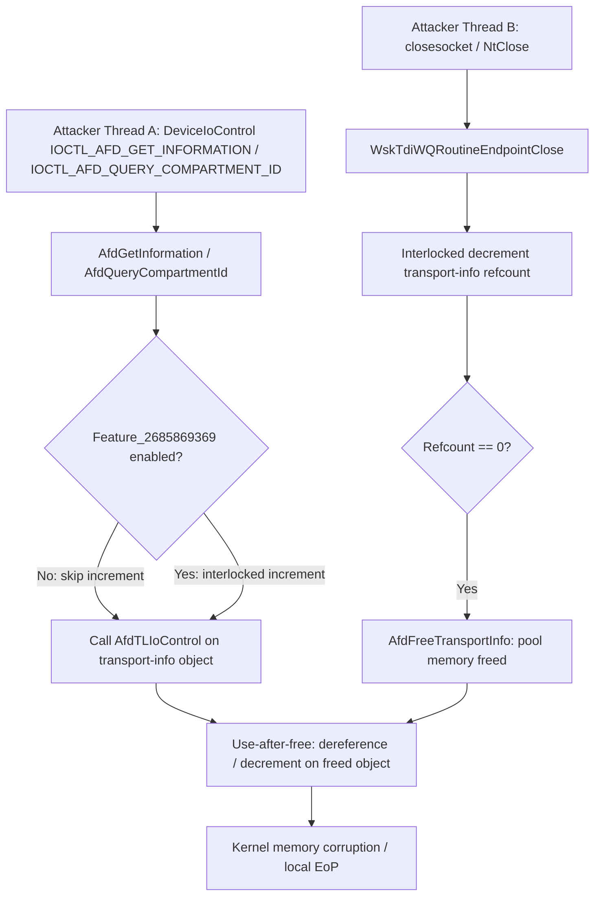

# CVE-2026-34346

**CVE:** CVE-2026-34346  
**Title:** Windows Ancillary Function Driver for WinSock Information Disclosure Vulnerability  
**Source:** [https://msrc.microsoft.com/update-guide/vulnerability/CVE-2026-34346](https://msrc.microsoft.com/update-guide/vulnerability/CVE-2026-34346)  
**Component(s):** afd.sys  
**Patched Date:** 2026-07-14T07:00:00  
**CWE:** Cleartext transmission of sensitive information in Windows Ancillary Function Driver for WinSock allows an authorized attacker to disclose information locally.  

---

## Related CVEs (Same Component)

This report covers 4 CVEs affecting the same component(s):

- **CVE-2026-34346**  
- CVE-2026-50312  
- CVE-2026-50462  
- CVE-2026-57093  

### Detailed Information

#### CVE-2026-50312

**Title:** Windows Ancillary Function Driver for WinSock Elevation of Privilege Vulnerability  
**Source:** [https://msrc.microsoft.com/update-guide/vulnerability/CVE-2026-50312](https://msrc.microsoft.com/update-guide/vulnerability/CVE-2026-50312)  
**Patched Date:** 2026-07-14T07:00:00  
**CWE:** Use after free in Windows Ancillary Function Driver for WinSock allows an authorized attacker to elevate privileges locally.  

#### CVE-2026-50462

**Title:** Windows Ancillary Function Driver for WinSock Elevation of Privilege Vulnerability  
**Source:** [https://msrc.microsoft.com/update-guide/vulnerability/CVE-2026-50462](https://msrc.microsoft.com/update-guide/vulnerability/CVE-2026-50462)  
**Patched Date:** 2026-07-14T07:00:00  
**CWE:** External control of file name or path in Windows Ancillary Function Driver for WinSock allows an authorized attacker to elevate privileges locally.  

#### CVE-2026-57093

**Title:** Windows Ancillary Function Driver for WinSock Elevation of Privilege Vulnerability  
**Source:** [https://msrc.microsoft.com/update-guide/vulnerability/CVE-2026-57093](https://msrc.microsoft.com/update-guide/vulnerability/CVE-2026-57093)  
**Patched Date:** 2026-07-14T07:00:00  
**CWE:** Use after free in Windows Ancillary Function Driver for WinSock allows an authorized attacker to elevate privileges locally.  

---

Download Patched & Vulnerable Components:

```bash
# afd.sys
wget https://msdl.microsoft.com/download/symbols/afd.sys/3AD6C44EB2000/afd.sys -O afd.sys.10.0.26100.8737 # vulnerable
wget https://msdl.microsoft.com/download/symbols/afd.sys/9576AC20B4000/afd.sys -O afd.sys.10.0.26100.8875 # patched
```

## Version Tracking Analysis

**Command:**

```
python ghidra_scripts\ghidra_vt_wrapper.py --old-binary ./reports/2026-Jul/CVE-2026-34346/afd.sys.10.0.26100.8737 --new-binary ./reports/2026-Jul/CVE-2026-34346/afd.sys.10.0.26100.8875 --project-dir ./reports/2026-Jul/CVE-2026-34346/ghidra_project --project-name afd.sys_CVE-2026-34346 --ghidra-dir C:\Tools\ghidra_11.4.2_PUBLIC_20250826\ghidra_11.4.2_PUBLIC --output-dir ./reports/2026-Jul/CVE-2026-34346/ghidra_project/vt_results --max-memory 16g
```

Patched Functions: 37 | New Functions: 23 | Removed Functions: 3 | Total Matches: 18189 | Accepted Matches: 7947

### Patched Functions

*Showing top 10 of 37 patched functions*

| Function Name | Source Address | Dest Address | Similarity | Confidence |
| --- | --- | --- | --- | --- |
| `AfdConnect` | `14002dda0` | `14002d440` | 0.958 | 10.0 |
| `AfdBind` | `14002a2e0` | `140028b30` | 0.957 | 10.0 |
| `AfdCleanupCore` | `140016630` | `140014300` | 0.916 | 10.0 |
| `AfdGetInformation` | `1400397d0` | `140039550` | 0.911 | 10.0 |
| `AfdSocketTransferEnd` | `1400303b0` | `14002fb00` | 0.900 | 10.0 |
| `AfdSocketTransferBegin` | `14002ffe0` | `14002f700` | 0.900 | 10.0 |
| `DriverEntry` | `14004f70c` | `140050060` | 0.899 | 10.0 |
| `AfdUnBindSocket` | `14004b390` | `14004c2f0` | 0.894 | 10.0 |
| `AfdSuperConnect` | `14002f390` | `14002ea70` | 0.891 | 10.0 |
| `AfdTLInspectEventHandler` | `140038ad0` | `1400387c0` | 0.868 | 10.0 |

### New Functions

*Showing 10 of 23 new functions*

| Function Name | Address |
| --- | --- |
| `AfdGetGroup` | `14001d274` |
| `AfdDereferenceTransport` | `14004c1f0` |
| `AfdPerformSecurityCheck` | `14004e03c` |
| `Feature_3021442362__private_IsEnabledDeviceUsageNoInline` | `14004e208` |
| `Feature_3021442362__private_IsEnabledFallback` | `14004e240` |
| `AfdReadTdiValidationLevel` | `14004fa44` |
| `AfdIsWellKnownProviderDeviceName` | `140052c64` |
| `AfdQueryProviderInfoEx` | `1400530c0` |
| `Feature_2881466680__private_IsEnabledDeviceUsageNoInline` | `1400546e8` |
| `Feature_2881466680__private_IsEnabledFallback` | `140054720` |

### Removed Functions

| Function Name | Address |
| --- | --- |
| `AfdInsertNewEndpointInList` | `14000b370` |
| `AfdReuseEndpoint` | `14000b5e0` |
| `_guard_dispatch_icall` | `140075600` |

---

# AI Technical Analysis

## Vulnerability Identification

**Core Vulnerable Function(s):**
- `AfdGetInformation()` - calls into the underlying transport
  driver via `AfdTLIoControl()` while holding a reference on the
  associated transport-info object only if an internal feature
  flag is enabled; when disabled, the call proceeds with no
  reference held.
- `AfdQueryCompartmentId()` - contains the identical
  feature-flag-gated reference pattern around the same
  `AfdTLIoControl()` call, with the same missing-reference
  condition when the flag evaluates false.

**Supporting Changes:**
- `WskTdiWQRoutineEndpointClose()` - endpoint teardown path that
  ultimately drops the transport-info object's refcount to zero
  and frees it via `AfdFreeTransportInfo()`; now routes through
  the new `AfdDereferenceTransport()` helper for consistency.
- `AfdDereferenceTransport()` (new) - extracted helper that
  performs the interlocked decrement-and-free sequence uniformly,
  used by the close path and available for future reuse.

**Unrelated Changes:**
- `AfdInitializeData()` - initializes new global validation-level
  variables (`AfdTdiUnknownProviderValidationLevel`,
  `AfdTdiWellKnownProviderValidationLevel`) for an unrelated TDI
  provider-trust hardening feature.
- `AfdTLInspectEventHandler()` - structural offset shifts caused
  by an unrelated feature-flagged field addition to the connection
  object; no change to locking or reference-counting logic.
- `AfdGetGroup()`, `AfdPerformSecurityCheck()`,
  `AfdReadTdiValidationLevel()`,
  `AfdIsWellKnownProviderDeviceName()` (new) - unrelated
  infrastructure for group allocation and TDI provider validation,
  not exercised by the affected code paths.

---

## Root Cause Analysis

The flaw is a use-after-free caused by a reference count that
protects a shared kernel object being taken conditionally instead
of unconditionally. `AfdGetInformation()` and
`AfdQueryCompartmentId()` both call `AfdTLIoControl()`, a function
that dispatches into the underlying TDI transport driver and can
block, reschedule, or complete asynchronously. Before doing so,
the code is expected to pin the transport-info object so a
concurrent close cannot free it out from under the in-flight call.
Instead, the pre-patch code gated that pin behind
`Feature_2685869369__private_featureState`: only when the feature
bit evaluated to non-zero was the interlocked increment performed.

```c
if ((Feature_2685869369__private_featureState & 0x10) == 0) {
  uVar9 = Feature_2685869369__private_IsEnabledDeviceUsageNoInline();
  uVar6 = (uint)uVar9;
}
else {
  uVar6 = Feature_2685869369__private_featureState & 1;
}
if (uVar6 != 0) {
  LOCK();
  *(longlong *)(param_1 + 0x84) = *(longlong *)(param_1 + 0x84) + 1;
  UNLOCK();
}
iVar7 = AfdTLIoControl(*(undefined **)(*(longlong *)(param_1 + 0xc) + 8),
                       *(undefined8 *)(param_1 + 8),local_58,(longlong)param_1);
/* ... same conditional decrement afterward ... */
```

When `uVar6` is zero, the entire call to `AfdTLIoControl()`
executes with no reference held on `param_1`'s transport-info
block (fields at offsets `0xc`/`8`). A second thread that closes
the same endpoint drives `WskTdiWQRoutineEndpointClose()`, whose
own interlocked decrement on the transport-info's independent
refcount (offset `0x10`) can reach zero and invoke
`AfdFreeTransportInfo()`, releasing the pool allocation while the
first thread's `AfdTLIoControl()` call is still dereferencing it.
The same exact pattern, with the same feature check and offsets,
is duplicated verbatim in `AfdQueryCompartmentId()`, confirming
this is one systemic defect rather than an isolated typo.

---

## Execution and Trigger Flow

An attacker opens a handle to `\Device\Afd` and creates a socket
endpoint, then issues `NtDeviceIoControlFile()` with
`IOCTL_AFD_GET_INFORMATION` (reaching `AfdGetInformation()`) or
`IOCTL_AFD_QUERY_COMPARTMENT_ID` (reaching
`AfdQueryCompartmentId()`) from one thread. On builds where the
`Feature_2685869369` flag resolves to disabled, this thread enters
the `AfdTLIoControl()` call region without incrementing the
transport-info reference count at offset `0x84`. Concurrently, a
second thread on the same process closes the socket handle
(`closesocket()`/`NtClose()`), which unwinds through AFD's endpoint
cleanup path into `WskTdiWQRoutineEndpointClose()`. That routine
decrements the transport-info object's own refcount and, once it
reaches zero, calls `AfdFreeTransportInfo()`, returning the
underlying pool memory to the kernel pool allocator. If this
happens while the first thread's `AfdTLIoControl()` call is still
executing or about to execute its post-call decrement, the first
thread dereferences and writes to freed pool memory. A
well-timed spray can reclaim the freed block with attacker-
controlled data, turning the stale pointer dereference/decrement
into a controlled kernel memory corruption primitive usable for
local privilege escalation.



---

## Patch Analysis

```diff
-    if ((Feature_2685869369__private_featureState & 0x10) == 0) {
-      uVar9 = Feature_2685869369__private_IsEnabledDeviceUsageNoInline();
-      uVar6 = (uint)uVar9;
-    }
-    else {
-      uVar6 = Feature_2685869369__private_featureState & 1;
-    }
-    if (uVar6 != 0) {
-      LOCK();
-      *(longlong *)(param_1 + 0x84) = *(longlong *)(param_1 + 0x84) + 1;
-      UNLOCK();
-    }
+    LOCK();
+    *(longlong *)(param_1 + 0x84) = *(longlong *)(param_1 + 0x84) + 1;
+    UNLOCK();
     iVar7 = AfdTLIoControl(*(undefined **)(*(longlong *)(param_1 + 0xc) + 8),
                            *(undefined8 *)(param_1 + 8),local_58,(longlong)param_1);
-    if ((Feature_2685869369__private_featureState & 0x10) == 0) {
-      uVar9 = Feature_2685869369__private_IsEnabledDeviceUsageNoInline();
-      uVar6 = (uint)uVar9;
-    }
-    else {
-      uVar6 = Feature_2685869369__private_featureState & 1;
-    }
-    if (uVar6 != 0) {
-      LOCK();
-      *(longlong *)(param_1 + 0x84) = *(longlong *)(param_1 + 0x84) + -1;
-      UNLOCK();
-    }
+    LOCK();
+    *(longlong *)(param_1 + 0x84) = *(longlong *)(param_1 + 0x84) + -1;
+    UNLOCK();
```

The patch deletes the feature-flag check entirely and makes the
interlocked increment and decrement around `AfdTLIoControl()`
unconditional in both `AfdGetInformation()` and
`AfdQueryCompartmentId()`. This guarantees a reference on the
transport-info object is held for the full duration of the call
into the transport driver, regardless of the state of
`Feature_2685869369__private_featureState`. Because the release
path in `WskTdiWQRoutineEndpointClose()` only frees the object
once its refcount drops to zero, the additional reference taken
here now reliably delays that free until after `AfdTLIoControl()`
returns and the decrement executes, closing the race window. The
change is a minimal, surgical removal of a conditional rather than
a redesign, which limits regression risk while directly addressing
the root cause. The parallel introduction of
`AfdDereferenceTransport()` as a shared decrement/free helper
further reduces the chance of the same conditional gating being
reintroduced inconsistently at another call site. Effectiveness is
high: since the increment/decrement is now unconditional, the
protection no longer depends on flighting state, telemetry, or
registry-configured feature rollout, all of which were previously
attacker-observable or influenceable conditions gating whether the
system was vulnerable. The security impact is the elimination of a
locally triggerable use-after-free in `afd.sys` reachable via
standard, unprivileged AFD IOCTLs, removing a viable kernel
privilege-escalation primitive.